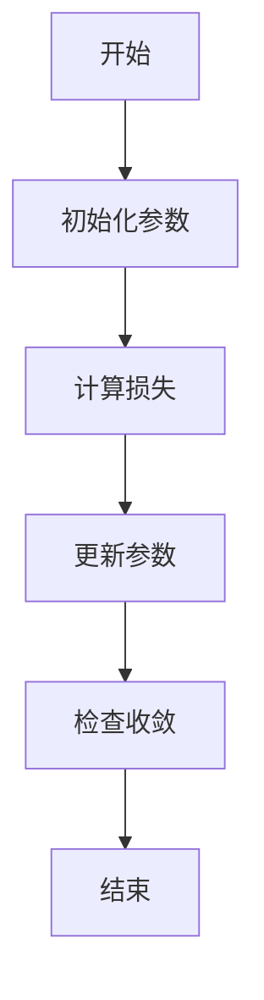
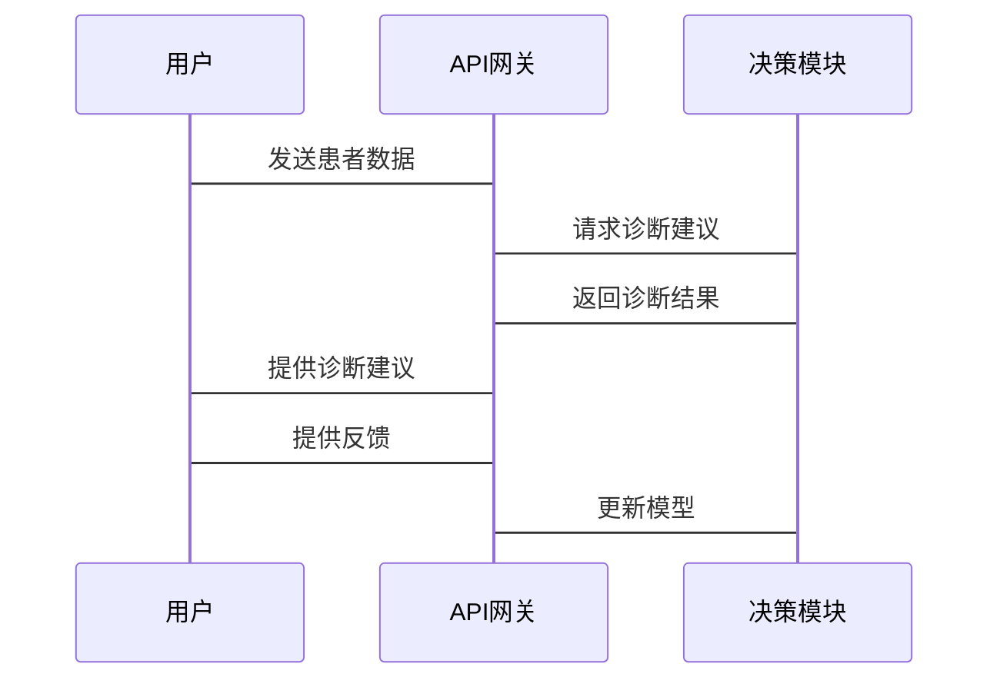

                 


# AI Agent的价值对齐：在LLM中植入人类价值观

## 关键词
AI Agent, 价值对齐, 大语言模型, 人类价值观, 伦理框架, 奖励建模

## 摘要
在AI Agent与人类互动日益频繁的今天，确保AI系统能够理解和对齐人类价值观至关重要。本文探讨如何在大语言模型中植入人类价值观，涵盖背景、核心概念、算法原理、系统架构和项目实战，提供详实的技术解析和案例分析。

---

## 目录

1. [背景介绍](#背景介绍)
2. [核心概念与联系](#核心概念与联系)
3. [价值对齐的算法原理](#价值对齐的算法原理)
4. [系统分析与架构设计](#系统分析与架构设计)
5. [项目实战](#项目实战)
6. [最佳实践与总结](#最佳实践与总结)

---

## 正文

### 1. 背景介绍

#### 1.1 问题背景
随着AI技术的快速发展，AI Agent在各个领域得到广泛应用。然而，AI系统在决策过程中可能出现与人类价值观冲突的情况，导致负面后果。价值对齐旨在解决这一问题，确保AI行为符合人类伦理和偏好。

#### 1.2 问题描述
AI Agent需要理解并遵循人类价值观，但人类价值观复杂多样，受文化、个人经历等因素影响。如何在LLM中有效植入这些价值观，是当前研究的重点和难点。

#### 1.3 解决方法
通过构建伦理框架、偏好建模和实时反馈机制，逐步实现AI对人类价值观的理解和对齐。

### 2. 核心概念与联系

#### 2.1 核心概念原理
人类价值观是主观的，需转化为可计算形式。这涉及伦理框架的构建和偏好建模，将人类决策转化为数学模型。

#### 2.2 概念属性特征对比
| 对比维度 | 伦理框架 | 偏好建模 | 反馈机制 |
|----------|----------|----------|----------|
| 适用范围 | 全局性    | 局部性    | 实时性    |
| 复杂度    | 高       | 中       | 低       |
| 可调整性  | 低       | 高       | 高       |

#### 2.3 ER实体关系图
```mermaid
er
  actor: 用户
  agent: AI Agent
  value: 人类价值观
  action: 决策行为
  constraint: 约束条件
  relation: 属性关系
```

### 3. 价值对齐的算法原理

#### 3.1 概率论基础
使用贝叶斯定理评估不同决策的后验概率，构建似然函数和先验概率，优化目标函数。

#### 3.2 优化理论
定义损失函数，如均方误差：
$$L = \sum_{i=1}^{n} (y_i - \hat{y}_i)^2$$
通过梯度下降更新参数。

#### 3.3 对齐算法流程图


### 4. 系统分析与架构设计

#### 4.1 问题场景
AI Agent需在医疗领域辅助诊断，确保其决策符合医疗伦理和患者偏好。

#### 4.2 系统功能设计
- 数据收集模块：收集用户反馈和医疗案例。
- 伦理框架模块：定义医疗伦理准则。
- 决策模块：基于模型生成诊断建议。

#### 4.3 系统架构图


#### 4.4 接口设计
- 数据接口：接收患者数据和反馈。
- 决策接口：返回诊断建议。

#### 4.5 交互流程图


### 5. 项目实战

#### 5.1 环境安装
安装必要的库：
```bash
pip install numpy torch transformers
```

#### 5.2 核心代码实现
定义损失函数和优化器：
```python
import torch
criterion = torch.nn.MSELoss()
optimizer = torch.optim.Adam(model.parameters(), lr=0.001)
```

训练模型：
```python
for epoch in range(num_epochs):
    for inputs, labels in dataloader:
        outputs = model(inputs)
        loss = criterion(outputs, labels)
        optimizer.zero_grad()
        loss.backward()
        optimizer.step()
```

#### 5.3 代码解读
训练过程通过最小化损失函数，使模型预测接近真实值，逐步对齐人类价值观。

#### 5.4 案例分析
在医疗诊断中，AI Agent基于伦理框架提供符合患者利益的诊断建议，动态调整以应对新情况。

### 6. 最佳实践与总结

#### 6.1 最佳实践
- 定期更新伦理框架，适应社会变化。
- 使用多样化的数据，提高模型鲁棒性。

#### 6.2 小结
价值对齐是AI技术的重要方向，需结合伦理学和计算机科学，确保AI行为符合人类价值观。

#### 6.3 注意事项
- 避免过于僵化的框架，保持灵活性。
- 处理价值观冲突时，确保透明和可解释性。

#### 6.4 拓展阅读
推荐相关书籍和论文，深入探讨AI伦理和对齐技术。

---

### 结语
在LLM中植入人类价值观是构建可靠AI系统的关键。通过本文的系统分析和实战案例，希望能为AI Agent的研究和应用提供有价值的参考。

