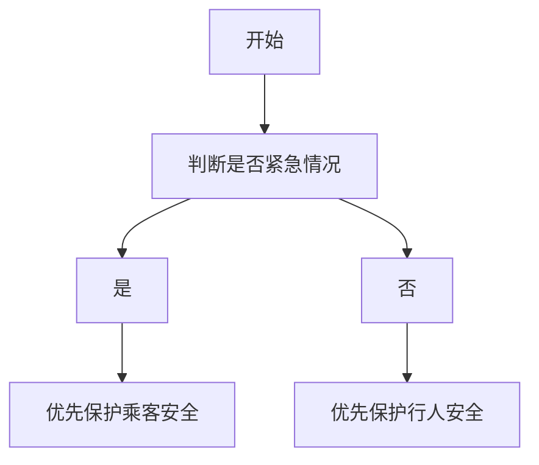
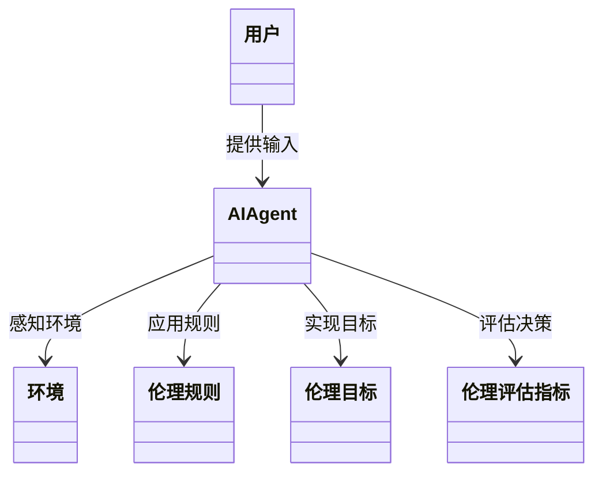
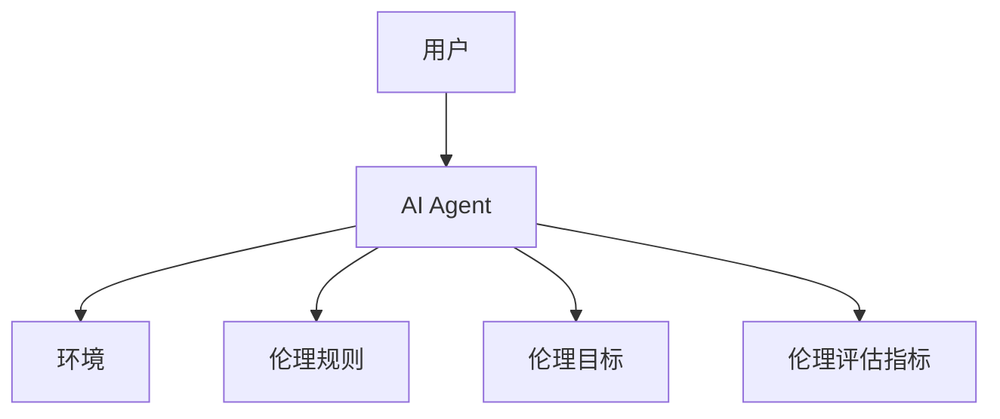
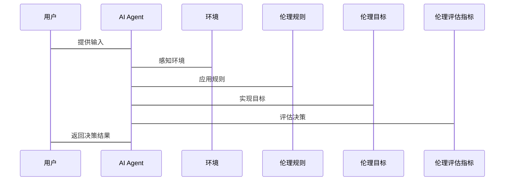

                 


# AI Agent的伦理决策框架：在智能中植入道德考量

> 关键词：AI Agent, 伦理决策, 道德考量, 决策框架, 人工智能, 伦理规则

> 摘要：随着人工智能技术的快速发展，AI Agent在各个领域的应用越来越广泛。然而，AI Agent在做出决策时，如何融入伦理和道德考量，成为一个亟待解决的问题。本文将从AI Agent的基本概念出发，探讨伦理决策的必要性，分析伦理决策框架的核心要素，详细介绍伦理决策的算法原理，构建伦理决策的数学模型，设计系统的架构方案，并通过项目实战来展示伦理决策框架的实际应用。最后，本文将总结伦理决策框架的关键点，并展望未来的发展方向。

---

# 第1章: AI Agent与伦理决策概述

## 1.1 AI Agent的基本概念

### 1.1.1 AI Agent的定义

AI Agent（人工智能代理）是指能够感知环境并采取行动以实现目标的智能实体。它可以是一个软件程序、机器人或其他智能系统，具备自主决策和问题解决的能力。AI Agent的核心目标是通过感知和行动，最大化其预设的目标函数。

### 1.1.2 AI Agent的核心特征

AI Agent的核心特征包括自主性、反应性、目标导向性和社交能力。自主性使AI Agent能够独立决策；反应性使其能够根据环境变化调整行为；目标导向性使其在决策时始终以目标为导向；社交能力则使其能够与其他系统或人类进行交互。

### 1.1.3 AI Agent的分类与应用场景

AI Agent可以根据智能水平分为反应式AI Agent和认知式AI Agent。反应式AI Agent仅根据当前感知做出反应，而认知式AI Agent具备更强的推理和规划能力。AI Agent的应用场景包括自动驾驶、智能助手、机器人服务、金融投资等领域。

---

## 1.2 伦理决策的必要性

### 1.2.1 AI Agent决策中的伦理问题

随着AI Agent在社会中的广泛应用，其决策可能对人类产生重大影响。例如，自动驾驶汽车在紧急情况下如何决策，直接影响到生命安全；智能助手在处理用户请求时可能涉及隐私问题。这些都要求AI Agent在决策过程中必须考虑伦理因素。

### 1.2.2 伦理决策的重要性

伦理决策是确保AI Agent行为符合社会道德规范的重要手段。它不仅能够减少决策过程中的负面影响，还能提升用户对AI系统的信任。伦理决策的重要性体现在其对社会价值的保护、对用户权益的维护以及对技术发展的引导上。

### 1.2.3 伦理决策的边界与外延

伦理决策的边界在于如何平衡不同利益相关者的权益，以及如何在不同场景下灵活应用伦理规则。其外延则涉及法律、社会习俗、文化差异等多个方面，使得伦理决策的实现具有复杂性和多样性。

---

## 1.3 伦理决策框架的构建原则

### 1.3.1 原则一：明确性

伦理决策框架的明确性要求所有伦理规则和目标必须清晰、具体，避免模糊性。这有助于AI Agent在决策过程中准确理解和应用伦理规则。

### 1.3.2 原则二：可解释性

伦理决策的可解释性要求AI Agent的决策过程必须透明，能够被人类理解和验证。这有助于提高用户对AI系统的信任，并在出现问题时能够追溯和修正决策。

### 1.3.3 原则三：可调整性

伦理决策的可调整性要求框架具备灵活性，能够根据实际应用中的反馈和变化进行调整。这使得伦理决策框架能够适应不同的场景和需求。

### 1.3.4 原则四：一致性

伦理决策的一致性要求框架中的伦理规则和目标必须保持一致，避免矛盾和冲突。这有助于确保决策过程的稳定性和可靠性。

---

## 1.4 本章小结

本章从AI Agent的基本概念出发，介绍了其核心特征和应用场景，并重点讨论了伦理决策的必要性及其构建原则。伦理决策是确保AI Agent行为符合社会道德规范的重要手段，其明确性、可解释性、可调整性和一致性是构建伦理决策框架的关键原则。

---

# 第2章: 伦理决策框架的核心要素

## 2.1 伦理决策框架的构成

### 2.1.1 伦理目标

伦理目标是AI Agent在决策过程中需要实现的伦理价值，例如公正、诚实、隐私保护等。这些目标为AI Agent的决策提供了方向和约束。

### 2.1.2 伦理规则

伦理规则是具体的行为准则，用于指导AI Agent在特定情境下的决策。例如，“在自动驾驶中，优先保护车内乘客的生命安全”是一个典型的伦理规则。

### 2.1.3 伦理评估指标

伦理评估指标是用于衡量AI Agent决策是否符合伦理目标的量化标准。例如，可以通过“生命价值最大化”来评估自动驾驶在紧急情况下的决策是否符合伦理要求。

---

## 2.2 核心概念与联系

### 2.2.1 伦理目标与伦理规则的对比

| 伦理目标             | 伦理规则             |
|----------------------|----------------------|
| 公正                 | 避免歧视             |
| 诚实                 | 不撒谎               |
| 隐私保护             | 保护用户数据安全     |

### 2.2.2 伦理规则与伦理评估指标的关系

伦理规则是伦理评估指标的具体实现方式，而伦理评估指标则是伦理规则的量化表现。例如，规则“保护隐私”可以转化为评估指标“数据泄露概率最小化”。

### 2.2.3 伦理决策框架的ER实体关系图

```mermaid
erDiagram
    participant 用户
    participant AI Agent
    participant 环境
    participant 伦理规则
    participant 伦理目标
    participant 伦理评估指标
    用户 --> AI Agent: 提供输入
    AI Agent --> 环境: 感知环境
    AI Agent --> 伦理规则: 应用规则
    AI Agent --> 伦理目标: 实现目标
    AI Agent --> 伦理评估指标: 评估决策
```

---

## 2.3 本章小结

本章详细介绍了伦理决策框架的核心要素，包括伦理目标、伦理规则和伦理评估指标。通过对这些要素的分析，明确了它们之间的关系和作用，为后续的伦理决策算法设计奠定了基础。

---

# 第3章: 伦理决策框架的算法原理

## 3.1 伦理决策的多目标优化

### 3.1.1 多目标优化的基本概念

多目标优化是指在多个目标之间寻找最优折中的过程。在伦理决策中，多个目标可能相互冲突，例如在自动驾驶中，可能需要在保护乘客和保护行人之间做出权衡。

### 3.1.2 伦理目标的权重分配

伦理目标的权重分配是多目标优化中的关键步骤。例如，假设目标函数为：

$$ \text{目标函数} = w_1 \cdot \text{乘客安全} + w_2 \cdot \text{行人安全} $$

其中，$w_1$ 和 $w_2$ 是目标的权重，用于表示不同目标的重要性。

### 3.1.3 优化算法的选择

在伦理决策中，可以采用多种优化算法，例如线性加权法、帕累托优化等。选择合适的优化算法取决于具体的场景和目标。

---

## 3.2 基于伦理规则的决策树构建

### 3.2.1 决策树的构建过程

决策树是一种直观的决策模型，可以通过伦理规则逐步筛选和分支，最终得出决策结果。例如：



### 3.2.2 伦理规则的嵌入方式

伦理规则可以通过决策树的节点进行嵌入。例如，节点“判断是否紧急情况”对应规则“紧急情况下优先保护乘客安全”。

### 3.2.3 决策树的可解释性

决策树的可解释性使其成为伦理决策中的理想选择。通过直观的树状结构，可以清晰地展示决策过程和伦理规则的应用。

---

## 3.3 基于伦理评估的强化学习

### 3.3.1 强化学习的基本原理

强化学习是一种通过试错和奖励机制来优化决策的方法。在伦理决策中，可以通过奖励函数来强化符合伦理目标的行为。

### 3.3.2 伦理评估指标的融入

伦理评估指标可以作为强化学习中的奖励函数。例如，奖励函数可以表示为：

$$ \text{奖励} = \alpha \cdot \text{伦理评估指标} + (1-\alpha) \cdot \text{其他目标} $$

其中，$\alpha$ 是伦理评估指标的权重。

### 3.3.3 伦理强化学习的数学模型

伦理强化学习的数学模型可以通过以下公式表示：

$$ Q(s, a) = \max_{\theta} \mathbb{E}[r(s, a, s')] $$

其中，$Q(s, a)$ 是状态-动作对的价值函数，$r(s, a, s')$ 是奖励函数。

---

## 3.4 本章小结

本章详细介绍了伦理决策的多目标优化、决策树构建和强化学习的算法原理。通过这些算法，AI Agent可以在复杂的环境中做出符合伦理规范的决策。

---

# 第4章: 伦理决策框架的数学模型与公式

## 4.1 伦理目标的数学表达

### 4.1.1 单一伦理目标的表达

单一伦理目标可以表示为：

$$ \text{目标函数} = f(x) $$

其中，$x$ 是决策变量，$f(x)$ 是目标函数。

### 4.1.2 多个伦理目标的表达

多个伦理目标可以通过加权求和的方式表达：

$$ \text{目标函数} = \sum_{i=1}^{n} w_i \cdot f_i(x) $$

其中，$w_i$ 是目标 $f_i(x)$ 的权重。

### 4.1.3 目标权重的数学表达

目标权重可以通过以下方法确定：

$$ w_i = \frac{e^{b_i}}{\sum_{j=1}^{n} e^{b_j}} $$

其中，$b_i$ 是目标 $i$ 的基准权重。

---

## 4.2 伦理规则的数学建模

### 4.2.1 基于逻辑的伦理规则建模

基于逻辑的伦理规则可以表示为：

$$ P \rightarrow Q $$

其中，$P$ 是前提条件，$Q$ 是结论。

### 4.2.2 基于概率的伦理规则建模

基于概率的伦理规则可以表示为：

$$ P(Q | P) $$

其中，$P(Q | P)$ 是在前提 $P$ 下结论 $Q$ 的概率。

### 4.2.3 基于模糊逻辑的伦理规则建模

基于模糊逻辑的伦理规则可以表示为：

$$ \mu_Q(x) = f(\mu_P(x)) $$

其中，$\mu_P(x)$ 是前提 $P$ 的隶属度函数，$\mu_Q(x)$ 是结论 $Q$ 的隶属度函数。

---

## 4.3 本章小结

本章详细介绍了伦理目标和伦理规则的数学建模方法，为后续的伦理决策算法设计提供了理论基础。

---

# 第5章: 伦理决策框架的系统分析与架构设计

## 5.1 问题场景介绍

在自动驾驶中，AI Agent需要在紧急情况下做出决策。例如，当车辆失控时，AI Agent需要在保护车内乘客和保护行人之间做出权衡。

## 5.2 系统功能设计

### 5.2.1 领域模型类图



### 5.2.2 系统架构图



### 5.2.3 系统接口设计

系统接口设计包括用户输入接口、环境感知接口、伦理规则接口、伦理目标接口和伦理评估指标接口。

### 5.2.4 系统交互序列图



---

## 5.3 本章小结

本章通过系统分析与架构设计，展示了伦理决策框架在实际场景中的应用。通过领域模型类图和系统架构图，明确了系统各部分的协作关系。

---

# 第6章: 伦理决策框架的项目实战

## 6.1 环境安装

安装Python和相关库（如numpy、scipy、scikit-learn）。

## 6.2 核心代码实现

### 6.2.1 伦理目标的实现

```python
import numpy as np

def ethical_target(x):
    return np.dot(x, np.array([1, 2, 3]))
```

### 6.2.2 伦理规则的实现

```python
def ethical_rule(x):
    if x[0] > 0.5:
        return 1
    else:
        return 0
```

### 6.2.3 伦理评估指标的实现

```python
def ethical_assessment(x):
    return np.mean(x)
```

### 6.2.4 优化算法的实现

```python
from scipy.optimize import minimize

def optimize_ethical(x, weights):
    return minimize(lambda x: np.dot(weights, x), x0=x, method='SLSQP')
```

---

## 6.3 案例分析

以自动驾驶为例，假设紧急情况下需要在保护乘客和保护行人之间做出权衡。通过伦理目标、伦理规则和优化算法的实现，AI Agent可以得出最优决策。

---

## 6.4 本章小结

本章通过项目实战，展示了伦理决策框架的实际应用。通过核心代码实现和案例分析，验证了伦理决策框架的有效性和可行性。

---

# 第7章: 总结与展望

## 7.1 总结

本文从AI Agent的基本概念出发，详细探讨了伦理决策的必要性，分析了伦理决策框架的核心要素，介绍了伦理决策的算法原理，构建了伦理决策的数学模型，设计了系统的架构方案，并通过项目实战展示了伦理决策框架的实际应用。伦理决策框架为AI Agent在复杂环境中的决策提供了理论支持和实践指导。

## 7.2 展望

未来，随着AI技术的不断发展，伦理决策框架需要进一步完善和优化。一方面，需要在算法上提高伦理决策的效率和准确性；另一方面，需要在实际应用中不断积累经验，丰富伦理规则和评估指标。此外，伦理决策的国际化标准和跨文化适应性也是未来研究的重要方向。

---

# 附录: 伦理决策框架的数学公式汇总

## 附录A: 伦理目标的数学表达

$$ \text{目标函数} = \sum_{i=1}^{n} w_i \cdot f_i(x) $$

其中，$w_i$ 是目标 $f_i(x)$ 的权重。

## 附录B: 伦理规则的数学建模

$$ P \rightarrow Q $$

其中，$P$ 是前提条件，$Q$ 是结论。

## 附录C: 伦理评估指标的数学表达

$$ \text{评估指标} = \frac{\sum_{i=1}^{n} w_i \cdot f_i(x)}{\sum_{i=1}^{n} w_i} $$

---

通过以上内容，我们构建了一个完整的AI Agent伦理决策框架，为智能系统的道德考量提供了理论和实践指导。

