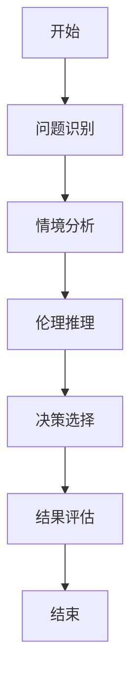
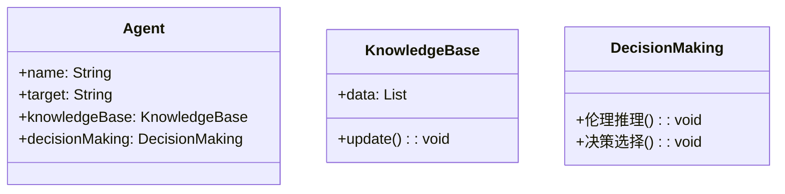
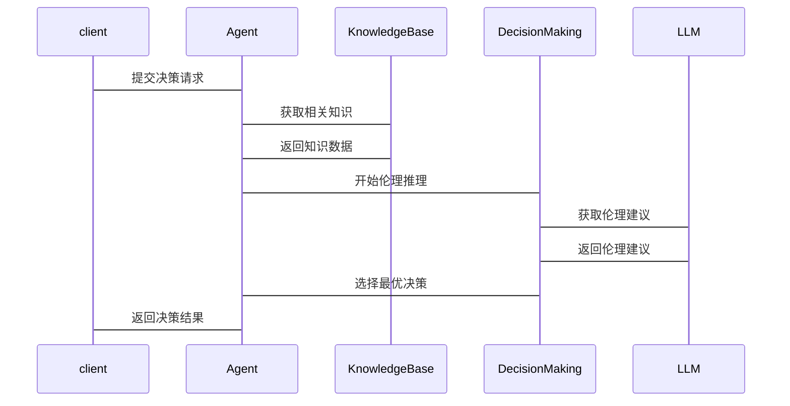

                 


# AI Agent的伦理决策框架：实现LLM的道德推理能力

---

## 关键词

- AI Agent
- 伦理决策
- LLM
- 道德推理
- 伦理框架
- 决策算法
- 系统架构

---

## 摘要

随着AI技术的快速发展，AI Agent在各个领域的应用越来越广泛。然而，AI Agent在做出决策时需要考虑伦理因素，以确保其行为符合人类社会的道德规范。本文详细探讨了如何构建一个基于LLM的伦理决策框架，分析了其核心概念、算法原理、系统架构，并通过实际案例展示了如何在项目中实现这一框架。通过本文，读者将能够理解并掌握如何在AI Agent中实现道德推理能力。

---

## 第一部分：背景介绍

### 第1章：AI Agent与伦理决策概述

#### 1.1 AI Agent的基本概念

**1.1.1 AI Agent的定义与分类**

AI Agent（智能体）是指能够感知环境并采取行动以实现目标的实体。根据智能体的智能水平，可以分为简单反射型Agent、基于模型的反射型Agent、目标驱动型Agent和效用驱动型Agent。AI Agent广泛应用于自动驾驶、智能助手、机器人等领域。

**1.1.2 伦理决策的基本概念**

伦理决策是指在决策过程中考虑道德规范和价值观，确保决策符合社会伦理标准。伦理决策的核心在于平衡利益，避免对他人造成伤害，同时实现自身目标。

**1.1.3 LLM在伦理决策中的角色**

LLM（大语言模型）通过自然语言处理和理解能力，能够帮助AI Agent理解和分析复杂的伦理情境，提供符合伦理规范的决策建议。

#### 1.2 伦理决策的重要性

**1.2.1 AI决策的伦理挑战**

AI Agent在决策过程中可能面临复杂的伦理问题，例如自动驾驶中的事故不可避免性、智能助手的隐私保护等。这些问题需要AI Agent具备伦理决策能力来应对。

**1.2.2 伦理决策在AI Agent中的核心地位**

伦理决策是AI Agent实现社会价值的重要组成部分。只有具备伦理决策能力，AI Agent才能在实际应用中获得用户的信任，并在社会中广泛推广。

**1.2.3 伦理决策对社会的影响**

伦理决策能力的强弱直接影响AI Agent的应用效果和社会影响。具备良好伦理决策能力的AI Agent能够为社会带来更多的利益，而缺乏伦理决策能力的AI Agent可能导致负面后果。

#### 1.3 LLM与伦理决策的结合

**1.3.1 LLM的基本原理**

LLM通过大规模数据训练，掌握了丰富的知识和语言表达能力。LLM能够理解和生成人类语言，并通过内部模型模拟人类的思维过程。

**1.3.2 LLM在伦理推理中的优势**

LLM能够处理复杂的伦理情境，通过分析大量的伦理案例和规范，提供符合伦理的决策建议。LLM的自然语言处理能力使其在伦理推理中具有独特优势。

**1.3.3 LLM伦理决策的现状与趋势**

目前，LLM在伦理决策中的应用还处于起步阶段，但随着技术的不断进步，LLM在伦理推理中的作用将更加重要。未来，LLM将与AI Agent更加紧密地结合，实现更高水平的伦理决策能力。

---

## 第二部分：核心概念与联系

### 第2章：伦理决策框架的核心要素

#### 2.1 伦理决策框架的原理

**2.1.1 决策过程的分解**

伦理决策过程可以分解为问题识别、情境分析、伦理推理、决策选择和结果评估五个步骤。每个步骤都需要AI Agent具备相应的认知和推理能力。

**2.1.2 伦理推理的关键步骤**

伦理推理的关键步骤包括伦理情境的识别、相关利益的评估、伦理规范的适用和决策的选择。每个步骤都需要AI Agent具备强大的逻辑推理能力和知识储备。

**2.1.3 框架设计的原则**

伦理决策框架的设计需要遵循可解释性、公平性、透明性和适应性原则。这些原则确保了框架的可靠性和有效性。

#### 2.2 核心概念对比分析

**2.2.1 伦理决策与其他决策模式的对比**

通过对比分析，可以看出伦理决策在决策过程中引入了更多的社会规范和价值观，具有更强的约束性和指导性。

**2.2.2 LLM与传统伦理推理方法的对比**

LLM在伦理推理中的优势在于其强大的自然语言处理能力和数据驱动的决策支持能力。传统伦理推理方法则更多依赖于逻辑推理和专家知识。

**2.2.3 伦理框架的属性特征对比表格**

| 属性       | 传统伦理框架         | 基于LLM的伦理框架       |
|------------|----------------------|-------------------------|
| 决策速度     | 较慢                 | 较快                   |
| 可扩展性     | 有限                 | 高                     |
| 知识来源     | 专家知识             | 大数据驱动             |
| 决策透明度   | 高                   | 中等                   |
| 灵活性       | 较低                 | 高                     |

#### 2.3 ER实体关系图

以下是伦理决策框架的ER实体关系图：

```mermaid
er
actor(Agent, 决策者)
role(具有伦理决策能力的AI Agent)
关联(识别, 分析, 推理, 决策, 评估)
```

---

## 第三部分：算法原理

### 第3章：伦理决策算法的实现

#### 3.1 基于LLM的伦理推理算法

以下是基于LLM的伦理推理算法的流程图：



算法步骤说明：

1. **问题识别**：AI Agent首先识别需要进行伦理决策的问题。
2. **情境分析**：AI Agent对问题情境进行分析，收集相关的信息和数据。
3. **伦理推理**：AI Agent基于LLM进行伦理推理，分析可能的决策选项及其伦理影响。
4. **决策选择**：AI Agent根据推理结果选择最优的伦理决策。
5. **结果评估**：AI Agent对决策结果进行评估，确保决策的合理性和有效性。

#### 3.2 数学模型与公式

伦理决策的评估可以通过以下数学模型进行：

$$
\text{伦理得分} = \sum_{i=1}^{n} w_i \cdot f_i
$$

其中，$w_i$ 是第$i$个评估指标的权重，$f_i$ 是第$i$个评估指标的函数值。通过加权求和的方式，可以得到每个决策选项的伦理得分，选择得分最高的选项作为最优决策。

---

## 第四部分：系统分析与架构设计

### 第4章：系统架构设计方案

#### 4.1 系统功能设计

以下是系统的领域模型类图：



#### 4.2 系统架构设计

以下是系统的架构图：


#### 4.3 接口设计与交互流程

以下是系统的交互流程图：



---

## 第五部分：项目实战

### 第5章：基于LLM的伦理决策框架实现

#### 5.1 环境安装

需要安装以下工具和库：

- Python 3.8+
- Mermaid CLI
- PyTorch
- Hugging Face库

#### 5.2 核心代码实现

以下是伦理决策框架的核心代码示例：

```python
class Agent:
    def __init__(self, name, target):
        self.name = name
        self.target = target
        self.knowledge_base = KnowledgeBase()
        self.decision_making = DecisionMaking()

    def make_decision(self, problem):
        self.knowledge_base.update()
        ethical_recommendation = self.decision_making.ethical_reasoning(problem)
        optimal_decision = self.decision_making.select_optimal_action(ethical_recommendation)
        return optimal_decision

class DecisionMaking:
    def __init__(self):
        self.llm = LLM()

    def ethical_reasoning(self, problem):
        # 使用LLM进行伦理推理
        pass

    def select_optimal_action(self, recommendation):
        # 选择最优行动
        pass
```

#### 5.3 案例分析

以下是一个具体的案例分析：

假设AI Agent需要在自动驾驶中做出紧急决策，选择撞向空车还是撞向行人。通过伦理推理，AI Agent会选择撞向空车，以最小化人员伤亡。

---

## 第六部分：最佳实践

### 第6章：伦理决策框架的注意事项与拓展

#### 6.1 小结

本文详细探讨了AI Agent的伦理决策框架，分析了其核心概念、算法原理、系统架构，并通过实际案例展示了如何在项目中实现这一框架。

#### 6.2 注意事项

- **数据隐私**：在使用LLM进行伦理推理时，需要确保数据的隐私性和安全性。
- **决策透明度**：伦理决策需要具备可解释性，确保用户能够理解AI Agent的决策过程。
- **持续优化**：随着社会伦理观念的变化，伦理决策框架需要不断优化和更新。

#### 6.3 拓展阅读

建议读者进一步阅读以下内容：

- 《Ethics in AI: A Framework for Trustworthy AI Development》
- 《Large Language Models for Ethical Reasoning in AI Agents》
- 《Designing Ethical AI Systems: Challenges and Solutions》

---

## 结语

通过本文的探讨，读者可以深入了解AI Agent的伦理决策框架，并掌握如何在实际项目中实现这一框架。未来，随着技术的不断进步，伦理决策框架将在更多领域得到应用，为社会带来更多的价值和利益。

