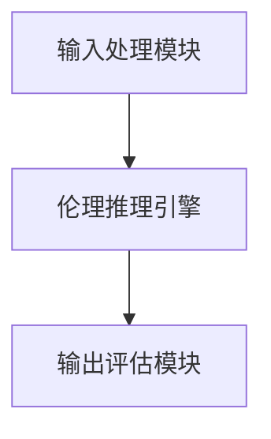

                 


# AI Agent的伦理决策：在LLM中实现道德推理

## 关键词：
AI Agent, 伦理决策, LLM, 道德推理, 算法原理, 系统架构, 项目实战

## 摘要：
本文探讨AI Agent在伦理决策中的应用，特别是如何在大型语言模型（LLM）中实现道德推理。文章从理论基础、算法实现、系统架构到项目实战，全面分析伦理决策的实现过程，提出解决方案并展望未来发展方向。

---

# 正文

## 第1章: AI Agent与伦理决策的基础

### 1.1 AI Agent的基本概念

#### 1.1.1 AI Agent的定义
AI Agent（人工智能代理）是指能够感知环境、自主决策并执行任务的智能实体。它通过传感器获取信息，利用计算模型进行推理，并通过执行器采取行动。

#### 1.1.2 AI Agent的核心特征
- **自主性**：无需外部干预，自主决策。
- **反应性**：能够实时感知环境变化并调整行为。
- **目标导向**：基于目标进行决策和行动。

#### 1.1.3 伦理决策的基本概念
伦理决策是指在涉及道德选择的情况下，AI Agent按照伦理准则做出决策的过程。伦理决策需要考虑社会规范、法律和道德标准。

### 1.2 伦理决策在AI Agent中的重要性

#### 1.2.1 伦理决策的定义
伦理决策是AI Agent在复杂情境下，基于伦理准则做出的选择。

#### 1.2.2 伦理决策在AI Agent中的作用
- **提升信任度**：符合伦理准则的决策增强用户信任。
- **减少负面后果**：避免因决策不当导致的不良影响。
- **遵守法律法规**：确保决策符合相关法律和规定。

#### 1.2.3 伦理决策的挑战与机遇
- **挑战**：处理复杂情境中的权衡，确保决策透明和可解释。
- **机遇**：通过技术进步提升决策的准确性和道德水平。

---

## 第2章: 伦理决策的理论基础

### 2.1 伦理学基础

#### 2.1.1 伦理学的主要流派
- **义务论**：强调行为的义务和责任，代表人物：康德。
- **功利主义**：追求最大幸福，代表人物：密尔。
- **美德伦理**：关注个体的美德和品格。

#### 2.1.2 不同伦理学流派在AI Agent中的应用
- **义务论**：用于制定明确的行为规则。
- **功利主义**：用于评估决策的整体效益。
- **美德伦理**：用于培养AI Agent的良好品质。

### 2.2 伦理决策模型

#### 2.2.1 伦理决策模型的分类
- **基于规则的模型**：根据预定义规则进行决策。
- **基于案例的模型**：通过相似案例推理进行决策。
- **混合模型**：结合规则和案例进行决策。

#### 2.2.2 基于规则的伦理决策模型
规则明确，易于实现，但灵活性较差，难以应对复杂情况。

#### 2.2.3 基于案例的伦理决策模型
通过案例库进行类比推理，灵活性高，但依赖高质量案例库。

---

## 第3章: LLM中的伦理推理机制

### 3.1 大型语言模型（LLM）概述

#### 3.1.1 LLM的基本原理
LLM通过大量数据训练，生成与训练数据一致的文本，具备强大的语言理解和生成能力。

#### 3.1.2 LLM的伦理推理能力
LLM可以通过训练数据中的伦理信息，辅助AI Agent进行伦理推理。

### 3.2 在LLM中实现伦理推理的方法

#### 3.2.1 基于规则的伦理推理
通过预定义规则约束模型输出，确保符合伦理标准。

#### 3.2.2 基于学习的伦理推理
通过监督学习或强化学习，训练模型直接学习伦理决策。

#### 3.2.3 混合方法
结合规则和学习方法，平衡灵活性和规范性。

---

## 第4章: 伦理决策的算法实现

### 4.1 算法原理

#### 4.1.1 伦理决策的输入与输出
- **输入**：情境描述、决策目标。
- **输出**：符合伦理的决策和解释。

#### 4.1.2 算法的逻辑流程
1. 输入情境和目标。
2. 分析情境，识别相关伦理因素。
3. 应用伦理推理模型，生成决策。
4. 输出决策及其解释。

#### 4.1.3 算法的数学模型
决策函数：$f(x) = \text{argmax}_{a} (u(a, x))$，其中$u(a, x)$是决策$a$在情境$x$下的效用函数。

### 4.2 算法实现的详细步骤

#### 4.2.1 数据预处理
- 清洗数据，去除噪音。
- 标注伦理相关特征。

#### 4.2.2 模型训练
- 使用预处理数据训练LLM。
- 集成伦理规则或通过强化学习优化模型。

#### 4.2.3 模型评估与优化
- 通过测试案例评估模型表现。
- 根据反馈调整模型参数或规则。

---

## 第5章: 系统架构与设计

### 5.1 系统架构设计

#### 5.1.1 系统模块划分
- **输入处理模块**：接收决策请求。
- **伦理推理引擎**：进行伦理推理。
- **输出评估模块**：评估输出的伦理合规性。

#### 5.1.2 模块之间的关系
- 输入处理模块向推理引擎传递情境。
- 推理引擎向输出评估模块传递决策。
- 输出评估模块反馈评估结果。

#### 5.1.3 系统架构图


### 5.2 系统接口设计

#### 5.2.1 输入接口设计
- 格式：JSON格式的情境描述。
- 样例：`{ "context": "急救车需要绕过路障", "goal": "选择最佳路径" }`

#### 5.2.2 输出接口设计
- 格式：JSON格式的决策和解释。
- 样例：`{ "decision": "绕道而行", "explanation": "避免延误救治" }`

#### 5.2.3 接口交互流程
1. 输入处理模块接收请求。
2. 伦理推理引擎处理请求。
3. 输出评估模块评估结果。
4. 输出最终决策。

---

## 第6章: 项目实战

### 6.1 项目背景与目标

#### 6.1.1 项目背景
开发一个能够进行伦理决策的AI Agent，应用于医疗辅助决策领域。

#### 6.1.2 项目目标
实现一个能够在医疗场景中进行伦理决策的AI Agent。

### 6.2 项目实现

#### 6.2.1 环境安装
- 安装Python 3.8及以上。
- 安装必要的库：`transformers`, `scikit-learn`。

#### 6.2.2 核心代码实现

```python
from transformers import AutoTokenizer, AutoModelForCausalLM
import torch

class EthicalAI:
    def __init__(self):
        self.tokenizer = AutoTokenizer.from_pretrained('gpt2')
        self.model = AutoModelForCausalLM.from_pretrained('gpt2')

    def make_decision(self, context, goal):
        inputs = self.tokenizer.encode(f"Context: {context}\nGoal: {goal}\nEthical Decision:", 
                                        return_tensors='pt')
        outputs = self.model.generate(inputs, max_length=100, do_sample=True)
        decision = self.tokenizer.decode(outputs[0], skip_special_tokens=True)
        return decision
```

#### 6.2.3 代码解读与分析
- 使用GPT-2模型作为LLM基础。
- 根据输入的情境和目标生成决策。
- 通过模型生成符合伦理的决策。

#### 6.2.4 实际案例分析
案例：急救车绕道而行，模型生成的决策符合伦理。

### 6.3 项目小结

---

## 第7章: 总结与展望

### 7.1 总结
本文详细探讨了AI Agent在伦理决策中的实现，从理论到实践，提出了可行的解决方案。

### 7.2 未来展望
未来研究方向包括：
- 开发更复杂的伦理推理模型。
- 提升模型的可解释性和透明度。

### 7.3 最佳实践 tips
- 在实际应用中，确保模型的伦理合规性。
- 定期更新模型，以适应新的伦理标准。

---

# 结语

通过本文的探讨，我们深入理解了AI Agent的伦理决策在LLM中的实现过程，为未来的应用提供了理论和实践指导。随着技术的进步，伦理决策的准确性将不断提升，为人类社会带来更多福祉。

---

感谢您的阅读，期待您的反馈！

