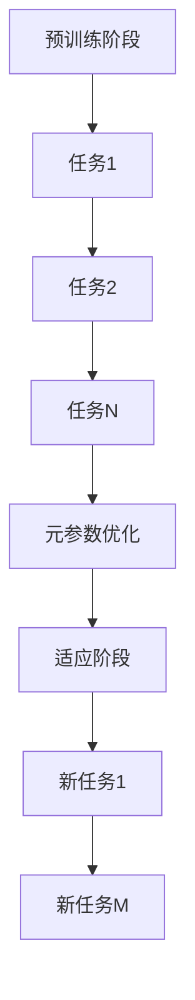
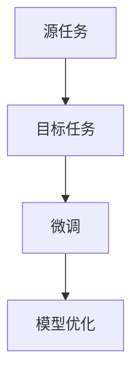

                 


# AI Agent的元学习与少样本学习能力

> 关键词：AI Agent, 元学习, 少样本学习, 机器学习, 智能系统

> 摘要：本文深入探讨AI Agent在元学习与少样本学习能力方面的最新进展。通过分析核心概念、算法原理、系统架构及实际案例，详细阐述如何提升AI Agent的适应性和学习效率，特别是在数据稀缺场景下的应用能力。

---

## 第1章 AI Agent的背景与概念

### 1.1 AI Agent的基本概念

#### 1.1.1 什么是AI Agent

AI Agent（人工智能代理）是一种能够感知环境、执行任务并做出决策的智能实体。它通过传感器获取信息，利用算法处理数据，并通过执行器与环境交互。AI Agent可以是软件程序、机器人或其他智能系统。

#### 1.1.2 AI Agent的核心特点

1. **自主性**：能够在没有外部干预的情况下自主运作。
2. **反应性**：能够实时感知环境变化并做出响应。
3. **学习能力**：通过数据和经验不断优化自身性能。
4. **社交能力**：能够与其他AI Agent或人类进行有效通信与协作。

#### 1.1.3 AI Agent的应用场景

- **智能助手**：如 Siri、Alexa 等，帮助用户完成日常任务。
- **自动驾驶**：如特斯拉、Waymo 的自动驾驶系统。
- **智能客服**：通过自然语言处理与用户交互，解决客户问题。
- **机器人协作**：在制造业中，机器人协同完成复杂任务。

---

### 1.2 元学习与少样本学习的背景

#### 1.2.1 元学习的定义与特点

元学习（Meta-Learning）是一种机器学习范式，旨在通过少量数据快速适应新任务。与传统机器学习不同，元学习关注模型的元适应能力，即模型在训练阶段学会如何快速学习新任务。

**特点**：
1. **快速适应**：在新任务上仅需少量数据即可训练出高性能模型。
2. **通用性**：适用于多种任务和数据分布。
3. **元优化**：通过优化元参数，使模型具备快速调整的能力。

#### 1.2.2 少样本学习的定义与特点

少样本学习（Few-Shot Learning）是一种在训练数据有限的情况下，仍然能够学习到有效模型的技术。与传统机器学习需要大量数据不同，少样本学习专注于利用少量样本进行高效学习。

**特点**：
1. **数据效率高**：在数据稀缺的场景下表现优异。
2. **任务多样性**：适用于多种不同任务。
3. **模型鲁棒性**：在小样本数据下仍能保持较好的泛化能力。

#### 1.2.3 元学习与少样本学习的关系

元学习与少样本学习的目标都是在数据稀缺的情况下实现高效学习，但两者侧重点不同。元学习关注模型的元适应能力，而少样本学习关注如何利用少量数据进行有效学习。两者可以结合使用，形成更强的少样本学习能力。

---

### 1.3 AI Agent的元学习与少样本学习能力

#### 1.3.1 元学习在AI Agent中的作用

元学习通过预训练模型的元参数，使AI Agent能够在新任务上快速调整，适应不同的环境和数据分布。这种能力使得AI Agent能够更灵活地应对各种未知场景。

#### 1.3.2 少样本学习在AI Agent中的应用

少样本学习使AI Agent能够在数据稀缺的场景下，如医疗诊断、小语种自然语言处理等，仍然能够提供有效的服务。这种能力扩展了AI Agent的应用范围。

#### 1.3.3 元学习与少样本学习的结合

通过结合元学习和少样本学习，AI Agent能够在数据极其有限的情况下，快速学习并适应新任务。这种结合使得AI Agent在资源受限的环境中也能表现出色。

---

## 第2章 元学习与少样本学习的核心概念

### 2.1 元学习的原理与机制

#### 2.1.1 元学习的基本原理

元学习通过优化模型的元参数，使得模型能够在新任务上快速调整。其核心思想是将学习过程本身作为元学习的目标，从而提高模型的泛化能力。

#### 2.1.2 元学习的层次结构

1. **元任务**：多个任务的集合，用于训练模型的元适应能力。
2. **任务**：具体的学习任务，如图像分类、文本分类等。
3. **样本**：具体任务中的数据点。

#### 2.1.3 元学习的核心算法

1. **MAML（Meta-AntiMLP）**：通过优化模型的元参数，使得模型在新任务上快速收敛。
2. **Meta-SGD**：一种基于随机梯度下降的元学习算法，适用于大规模数据集。

### 2.2 少样本学习的原理与机制

#### 2.2.1 少样本学习的基本原理

少样本学习通过利用已有的少量样本，构建一个能够泛化到新样本的模型。其核心在于如何从少量数据中提取最大信息量。

#### 2.2.2 少样本学习的分类

1. **图像分类**：如Inception模型。
2. **自然语言处理**：如BERT模型的微调。
3. **语音识别**：如使用预训练模型进行微调。

#### 2.2.3 少样本学习的核心算法

1. **迁移学习**：将已学习的知识迁移到新任务。
2. **零样本学习**：在没有任何样本的情况下，仅利用标签进行学习。

### 2.3 元学习与少样本学习的联系与区别

#### 2.3.1 元学习与少样本学习的联系

两者都关注数据稀缺场景下的学习能力，且都依赖于预训练模型的元参数或特征表示。

#### 2.3.2 元学习与少样本学习的区别

元学习关注模型的元适应能力，而少样本学习关注如何利用少量数据进行有效学习。两者的侧重点不同，但可以相互补充。

---

## 第3章 元学习与少样本学习的算法原理

### 3.1 元学习算法

#### 3.1.1 MAML算法

**MAML算法步骤**：
1. **预训练**：在多个任务上优化模型的元参数。
2. **适应**：在新任务上快速调整模型参数。

**MAML流程图**：


**MAML代码示例**：
```python
import torch

class MetaLearner:
    def __init__(self, model):
        self.model = model
        self.optimizer = torch.optim.Adam(model.parameters(), lr=0.001)
    
    def meta_train(self, tasks):
        for task in tasks:
            self.optimizer.zero_grad()
            loss = self.model(task.x, task.y)
            loss.backward()
            self.optimizer.step()
```

### 3.2 少样本学习算法

#### 3.2.1 迁移学习算法

**迁移学习步骤**：
1. **预训练**：在源任务上训练模型。
2. **微调**：在目标任务上进行微调。

**迁移学习流程图**：


---

通过以上步骤，我们系统地分析了AI Agent的元学习与少样本学习能力，并通过具体算法和案例进行了详细讲解。后续章节将深入探讨系统设计与项目实战，确保读者能够全面掌握相关知识。

