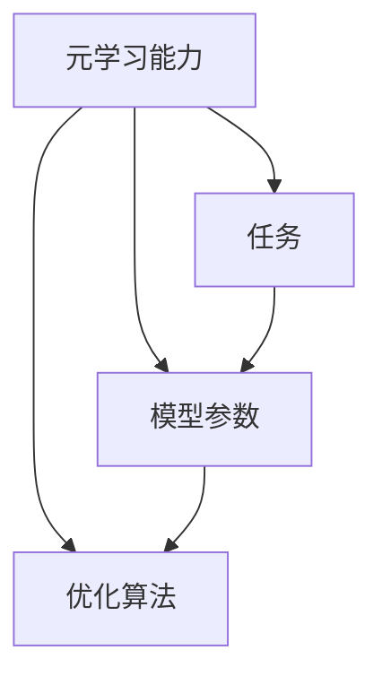
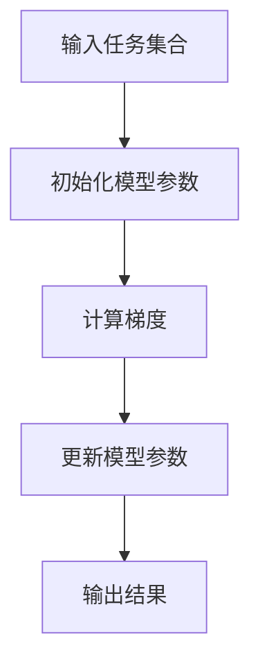
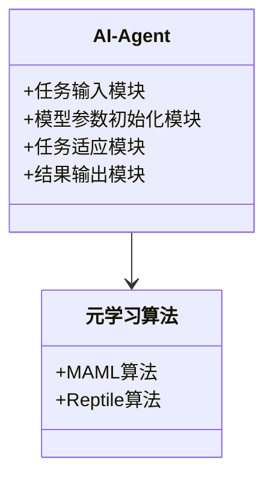

                 


# AI Agent的元学习能力：快速适应新任务的LLM框架

> 关键词：AI Agent，元学习，快速适应，LLM框架，大语言模型，MAML算法

> 摘要：本文深入探讨了AI Agent的元学习能力，分析了其在快速适应新任务中的核心作用。通过介绍元学习的基本概念、算法原理、系统架构以及项目实战，详细解析了如何构建具备元学习能力的LLM框架，帮助AI Agent在实际应用中实现快速任务适应。

---

## 第一部分：AI Agent的元学习能力概述

### 第1章：AI Agent与元学习能力

#### 1.1 AI Agent的基本概念
- **AI Agent的定义**：AI Agent是一种智能体，能够感知环境并采取行动以实现目标。它可以在复杂环境中自主决策，执行任务。
- **AI Agent的分类**：
  - 简单反射型Agent：基于规则直接行动。
  - 目标驱动型Agent：基于目标选择最优行动。
  - 学习驱动型Agent：通过学习提升任务执行能力。
- **AI Agent的核心能力**：
  - 感知能力：感知环境状态。
  - 决策能力：基于感知做出决策。
  - 学习能力：通过经验或知识提升能力。

#### 1.2 元学习能力的核心概念
- **元学习的定义**：元学习是一种学习方法，允许模型快速适应新任务，而无需大量标注数据。
- **元学习的特点**：
  - 快速适应：在新任务上快速调整模型参数。
  - 鲜见数据：适用于数据稀疏或标注困难的任务。
  - 高效迁移：能够将已知任务的知识迁移到新任务。
- **元学习的实现方式**：
  - 参数化元学习：调整模型参数以适应新任务。
  - 非参数化元学习：在模型之外引入新的参数或模块。

#### 1.3 元学习能力的重要性
- **在AI Agent中的作用**：
  - 提高任务适应性：使AI Agent能够快速应对新任务。
  - 减少数据依赖：在数据不足的情况下仍能执行任务。
  - 增强泛化能力：提升模型在不同任务上的表现。
- **应用场景**：
  - 个性化推荐：根据用户行为快速调整推荐策略。
  - 自然语言处理：在不同语言或领域间快速切换。
  - 动态环境适应：在不断变化的环境中保持高效运作。

---

### 第2章：元学习能力的核心概念与联系

#### 2.1 元学习能力的核心原理
- **元学习的模型参数初始化**：元学习通过初始化模型参数，使得模型在新任务上只需少量调整即可达到良好效果。
- **元学习的任务适应策略**：通过梯度下降等优化算法，快速调整模型参数以适应新任务。
- **元学习的优化算法**：常用的元学习优化算法包括MAML（Meta Algorithm for Meta-Learning）和Reptile等。

#### 2.2 元学习能力的核心概念对比
- **元学习与迁移学习**：
  - 迁移学习：将一个领域学到的知识应用到另一个领域。
  - 元学习：通过在多个任务上学习，快速适应新任务。
- **元学习与自适应学习**：
  - 自适应学习：动态调整模型以适应变化的环境。
  - 元学习：通过预学习阶段，使模型具备快速适应的能力。
- **元学习与强化学习**：
  - 强化学习：通过试错机制学习最优策略。
  - 元学习：通过元优化算法，使强化学习更快收敛。

#### 2.3 元学习能力的ER实体关系图


---

### 第3章：元学习能力的算法原理

#### 3.1 元学习算法的基本原理
- **输入输出**：元学习算法的输入包括多个训练任务，输出是模型在新任务上的性能。
- **核心步骤**：
  1. 初始化模型参数。
  2. 在多个任务上进行训练，优化模型参数。
  3. 在新任务上进行微调，快速适应任务。
- **数学模型**：
  $$ \text{元学习的目标是最小化} \sum_{i=1}^{N} \mathcal{L}_i(\theta), $$
  其中，$\theta$是模型参数，$\mathcal{L}_i$是第$i$个任务的损失函数。

#### 3.2 基于MAML的元学习算法
- **MAML算法的流程图**

- **数学模型**：
  $$ \theta_{\text{new}} = \theta - \eta \nabla_{\theta} \mathcal{L}_i(\theta), $$
  其中，$\eta$是学习率，$\nabla_{\theta} \mathcal{L}_i(\theta)$是损失函数关于$\theta$的梯度。

---

## 第二部分：元学习能力在LLM框架中的应用

### 第4章：系统架构与功能设计

#### 4.1 系统功能设计
- **任务输入模块**：接收新任务并解析任务需求。
- **模型参数初始化模块**：初始化模型参数并进行元学习训练。
- **任务适应模块**：根据新任务调整模型参数。
- **结果输出模块**：输出模型在新任务上的结果。

#### 4.2 系统架构设计
- **类图设计**：


#### 4.3 系统交互设计
- **交互流程**：
  1. AI Agent接收新任务。
  2. 元学习算法初始化模型参数。
  3. 任务适应模块根据新任务调整参数。
  4. 输出模块返回结果。

---

### 第5章：项目实战与案例分析

#### 5.1 环境安装与配置
- **安装依赖**：
  ```bash
  pip install torch numpy matplotlib
  ```
- **运行环境**：Python 3.8以上版本，PyTorch 1.9以上版本。

#### 5.2 核心代码实现
```python
import torch
import torch.nn as nn
import torch.optim as optim

class MetaLearningAgent:
    def __init__(self, model, optimizer):
        self.model = model
        self.optimizer = optimizer

    def meta_learn(self, tasks):
        for task in tasks:
            # 计算梯度
            loss = self.model(task)
            loss.backward()
            # 更新模型参数
            self.optimizer.step()

    def adapt_to_task(self, new_task):
        # 微调模型
        self.meta_learn([new_task])
        return self.model.predict(new_task)
```

#### 5.3 案例分析
- **案例背景**：在自然语言处理任务中，快速适应不同语言或领域。
- **案例实现**：
  ```python
  # 初始化模型
  model = MetaLearningAgent(...)
  # 元学习训练
  model.meta_learn(train_tasks)
  # 适应新任务
  result = model.adapt_to_task(new_task)
  ```

---

### 第6章：最佳实践与注意事项

#### 6.1 总结
- 元学习能力是AI Agent快速适应新任务的关键。
- MAML算法在元学习中表现优异，值得深入研究。
- 系统架构设计需考虑任务输入、模型调整和结果输出的模块化。

#### 6.2 注意事项
- **数据质量**：确保训练数据的质量和多样性。
- **任务相似性**：新任务应与训练任务有一定相似性。
- **模型复杂度**：避免模型过于复杂导致过拟合。

#### 6.3 未来展望
- **算法优化**：探索更高效的元学习算法。
- **多模态应用**：将元学习应用于图像、文本等多种模态。
- **实时适应**：研究实时环境中的动态适应方法。

---

通过以上内容，我们详细探讨了AI Agent的元学习能力，从理论到实践，从算法到系统设计，为构建具备快速适应能力的LLM框架提供了全面的指导和实践方案。

