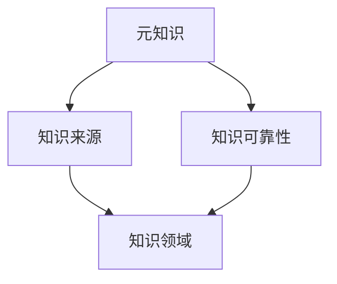
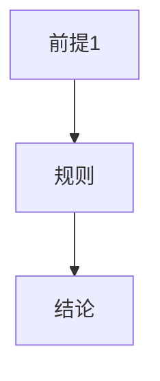
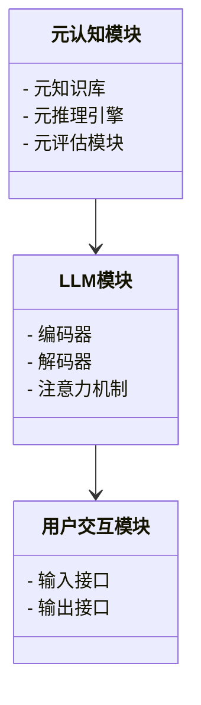

                 


# AI Agent的元认知能力：增强LLM的自我评估与调整

> 关键词：AI Agent，元认知能力，大语言模型，LLM，自我评估，调整优化，人机交互

> 摘要：AI Agent的元认知能力是指其对自身知识、推理过程和决策结果的认知与评估能力。通过增强大语言模型（LLM）的元认知能力，可以实现自我评估与调整，从而提高LLM的准确性和可靠性。本文将从元认知能力的核心概念、算法原理、系统架构设计、项目实战等多个方面详细探讨如何增强LLM的元认知能力，实现自我评估与调整。

---

## 第1章 AI Agent与元认知能力

### 1.1 AI Agent的基本概念

#### 1.1.1 AI Agent的定义与分类
AI Agent（人工智能代理）是指能够感知环境、自主决策并执行任务的智能实体。根据功能和应用场景的不同，AI Agent可以分为以下几类：
- **简单反射型代理**：基于预定义规则执行任务，适用于简单任务。
- **基于模型的反射型代理**：通过内部模型理解和决策，适用于复杂任务。
- **目标驱动型代理**：以目标为导向，主动规划和执行任务。
- **效用驱动型代理**：通过最大化效用函数来优化决策。

#### 1.1.2 元认知能力的定义与特点
元认知能力是指AI Agent对自身知识、推理过程和决策结果的认知与评估能力。其特点包括：
- **自我监控**：能够监控自身的知识状态和推理过程。
- **自我评估**：能够评估自身的行为结果，并判断是否达到预期目标。
- **自我调整**：能够根据评估结果调整自身的知识或行为策略。

#### 1.1.3 元认知能力在AI Agent中的作用
元认知能力是AI Agent实现智能决策的核心能力之一。通过元认知能力，AI Agent能够：
- **优化决策过程**：通过自我评估和调整，提高决策的准确性和可靠性。
- **增强适应性**：在动态环境中，快速调整知识和行为策略，以适应变化。
- **提升用户体验**：通过自我监控和评估，提供更精准和个性化的服务。

---

### 1.2 LLM的基本原理与局限性

#### 1.2.1 大语言模型的定义与核心原理
大语言模型（LLM，Large Language Model）是一种基于深度学习的自然语言处理模型，通过大量文本数据的训练，能够理解和生成人类语言。其核心原理包括：
- **编码器-解码器架构**：编码器将输入文本转换为向量表示，解码器根据向量生成输出文本。
- **自注意力机制**：通过自注意力机制，模型能够捕捉文本中的长程依赖关系。
- **参数化表示**：通过大量参数的优化，模型能够学习语言的复杂模式。

#### 1.2.2 LLM的局限性与挑战
尽管LLM在自然语言处理任务中表现出色，但其仍存在以下局限性：
- **知识覆盖范围有限**：模型的知识主要基于训练数据，可能无法涵盖所有领域。
- **推理能力不足**：模型的推理能力依赖于训练数据中的模式，缺乏逻辑推理能力。
- **结果不可解释**：模型的决策过程复杂，难以解释其输出结果。

#### 1.2.3 元认知能力如何弥补LLM的不足
通过增强LLM的元认知能力，可以弥补其局限性。具体包括：
- **知识监控**：通过元认知能力，模型能够监控自身知识的准确性。
- **推理评估**：通过元推理能力，模型能够评估其推理过程的合理性。
- **结果反馈**：通过元评估能力，模型能够根据输出结果的反馈进行调整。

---

## 第2章 元认知能力的核心概念

### 2.1 元知识与元推理

#### 2.1.1 元知识的定义与特征
元知识是指关于知识的知识，包括知识的来源、可靠性、适用范围等。其特征包括：
- **隐含性**：元知识通常是隐含的，需要通过推理和分析获得。
- **动态性**：元知识会随着环境和任务的变化而变化。
- **关联性**：元知识与具体任务密切相关，能够为任务提供支持。

#### 2.1.2 元推理的机制与应用
元推理是指基于元知识进行的推理过程，其机制包括：
- **元规则推理**：基于元规则进行推理，例如“如果知识来源可靠，则知识是正确的”。
- **元案例推理**：通过分析类似案例的元知识进行推理。
- **元逻辑推理**：通过逻辑推理方法，如逻辑演算、模态逻辑等，进行推理。

#### 2.1.3 元知识与元推理的关系
元知识是元推理的基础，元推理是元知识应用的手段。通过元推理，可以利用元知识进行决策和调整。

---

### 2.2 元监控与元评估

#### 2.2.1 元监控的定义与功能
元监控是指对AI Agent的知识状态、推理过程和行为结果进行实时监控。其功能包括：
- **状态监控**：监控AI Agent的知识状态和推理过程。
- **异常检测**：检测推理过程中的异常情况。
- **反馈收集**：收集用户反馈，用于后续调整。

#### 2.2.2 元评估的方法与指标
元评估是指对AI Agent的行为结果进行评估。常用方法包括：
- **基于置信度的评估**：通过置信度计算，评估结果的可靠性。
- **基于误差分析的评估**：通过分析错误案例，评估模型的局限性。
- **基于用户反馈的评估**：通过用户反馈，评估结果的满意度。

#### 2.2.3 元监控与元评估的实现方式
元监控和元评估可以通过以下方式实现：
- **日志记录**：记录AI Agent的行为日志，用于后续分析。
- **在线评估**：实时监控推理过程，动态评估结果。
- **离线评估**：定期分析行为日志，评估模型性能。

---

## 第3章 元认知能力的数学模型与算法

### 3.1 元知识表示模型

#### 3.1.1 基于图的元知识表示
基于图的元知识表示是一种通过图结构表示知识的方法。例如，可以通过节点表示知识，边表示知识之间的关系。



#### 3.1.2 元知识表示的向量空间模型
向量空间模型是一种常用的元知识表示方法，通过向量的维度表示知识的属性。

### 3.2 元推理算法

#### 3.2.1 基于规则的元推理
基于规则的元推理是一种通过预定义规则进行推理的方法。



#### 3.2.2 基于神经网络的元推理
基于神经网络的元推理是一种通过深度学习模型进行推理的方法。

---

## 第4章 增强LLM的元认知能力

### 4.1 LLM的内部状态监控

#### 4.1.1 LLM内部状态的定义与表示
内部状态是指LLM在推理过程中的知识状态和推理过程。可以通过向量表示或其他形式表示。

### 4.2 LLM的输出评估

#### 4.2.1 输出评估的指标与方法
输出评估的指标包括准确率、召回率、F1值等。评估方法包括基于规则的评估、基于用户的评估等。

---

## 第5章 系统架构设计

### 5.1 系统架构概述

#### 5.1.1 系统架构的总体设计
系统架构设计包括元认知模块、LLM模块、用户交互模块等。



### 5.2 系统接口设计

#### 5.2.1 元认知模块的输入接口
元认知模块的输入接口包括知识输入、推理输入等。

#### 5.2.2 元认知模块的输出接口
元认知模块的输出接口包括知识状态、推理结果等。

---

## 第6章 项目实战

### 6.1 环境安装

#### 6.1.1 安装Python
```bash
python --version
pip install --upgrade pip
```

#### 6.1.2 安装相关库
```bash
pip install numpy
pip install matplotlib
pip install scikit-learn
```

---

## 第7章 总结与展望

### 7.1 总结
本文详细探讨了AI Agent的元认知能力如何增强LLM的自我评估与调整能力。通过元知识、元推理、元监控和元评估等核心概念的分析，结合算法原理和系统架构设计，提出了增强LLM元认知能力的具体方法。

### 7.2 展望
未来的研究方向包括：
- **更复杂的元知识表示方法**：探索更高效的元知识表示方法。
- **更智能的元推理算法**：开发更智能的元推理算法，提升元认知能力。
- **更高效的系统架构设计**：优化系统架构设计，提升元认知能力的实时性和准确性。

---

通过本文的探讨，我们相信AI Agent的元认知能力将在未来的自然语言处理领域发挥重要作用，为大语言模型的自我评估与调整提供有力支持。

