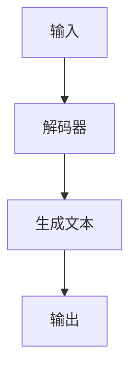
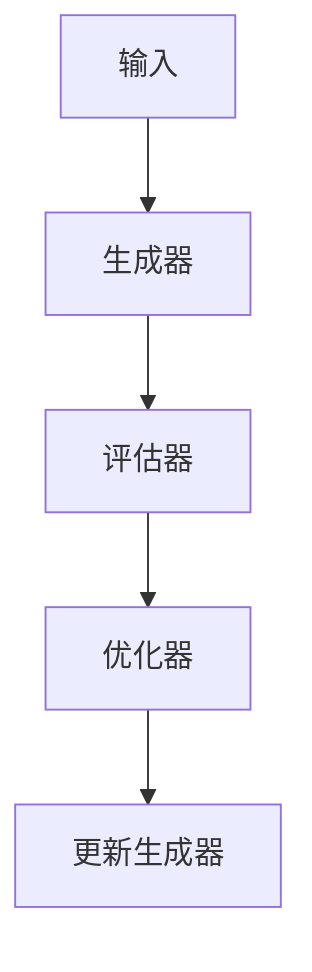
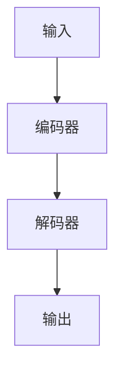
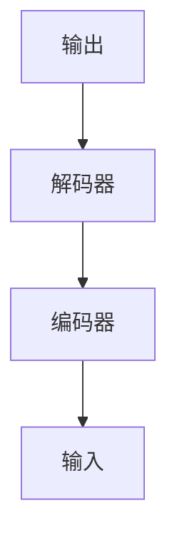
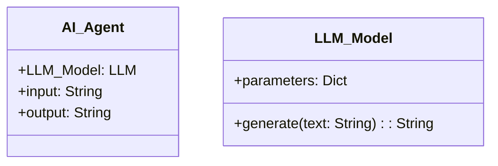
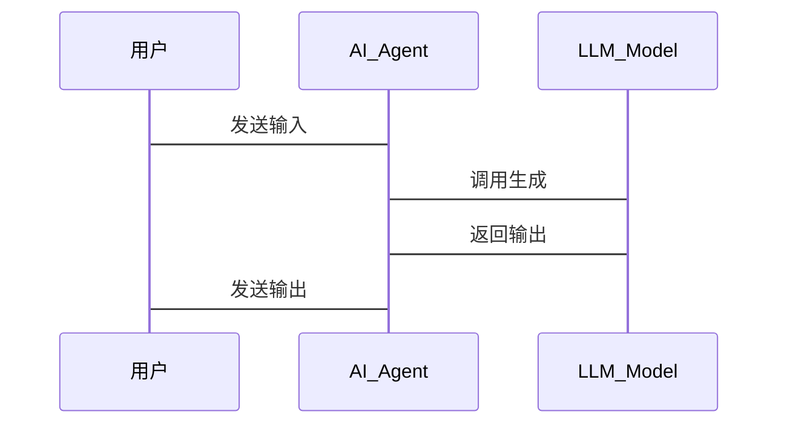

                 


# AI Agent的创造力：激发LLM的创新能力

---

## 关键词：
AI Agent、创造力、大语言模型、LLM、生成算法、强化学习、创造力评估

---

## 摘要：
本文探讨了AI Agent在激发大语言模型（LLM）创造力方面的潜力和实现方法。文章首先介绍了AI Agent和LLM的基本概念，分析了它们在创造力方面的优势与结合方式。接着，详细讲解了AI Agent创造力的核心算法，包括前向传播和优化算法，并通过Mermaid流程图和数学公式进行了深入剖析。随后，文章从系统架构的角度，设计了AI Agent创造力的实现方案，包括领域模型、架构图和接口设计。最后，通过实际项目案例，展示了如何在具体场景中激发LLM的创造力，并总结了最佳实践和注意事项。

---

# 第一部分: AI Agent的创造力背景与概念

---

## 第1章: AI Agent与创造力的概述

### 1.1 AI Agent的定义与特点

#### 1.1.1 AI Agent的基本概念
AI Agent（人工智能代理）是指能够感知环境、自主决策并执行任务的智能实体。它不同于传统程序，具有主动性、目标导向性和适应性。

#### 1.1.2 AI Agent的核心特点
- **自主性**：能够自主决策，无需外部干预。
- **反应性**：能够实时感知环境并做出反应。
- **目标导向性**：以特定目标为导向，优化行动路径。
- **学习能力**：能够通过经验改进自身性能。

#### 1.1.3 AI Agent与传统程序的区别
AI Agent具备以下特点，使其与传统程序不同：
- 能够感知环境。
- 具备自主决策能力。
- 能够学习和适应环境。

### 1.2 大语言模型（LLM）的创造力

#### 1.2.1 大语言模型的基本原理
LLM（Large Language Model）是基于深度学习的自然语言处理模型，能够理解并生成人类语言。其核心是通过大量数据训练，学习语言的模式和规律。

#### 1.2.2 LLM在创造力方面的优势
- **知识丰富性**：能够基于广泛的知识生成内容。
- **生成多样性**：能够生成多种不同的表达方式。
- **上下文理解**：能够理解上下文并进行推理。

#### 1.2.3 创造力的定义与评估标准
创造力是指产生新颖且有价值的想法或作品的能力。评估创造力的标准包括：
- **新颖性**：结果是否独特。
- **实用性**：结果是否具有实际价值。
- **连贯性**：结果是否逻辑一致。

### 1.3 AI Agent与LLM的结合

#### 1.3.1 AI Agent的多模态能力
AI Agent能够整合多种信息源，如文本、图像、语音等，从而具备多模态处理能力。

#### 1.3.2 LLM在AI Agent中的角色
LLM作为AI Agent的核心组件，负责生成文本内容、理解用户意图和提供创造性解决方案。

#### 1.3.3 AI Agent创造力的实现路径
通过结合LLM的生成能力和AI Agent的自主决策能力，AI Agent能够实现创造性任务。

### 1.4 本章小结
本章介绍了AI Agent和LLM的基本概念，并分析了它们在创造力方面的优势与结合方式，为后续内容奠定了基础。

---

# 第二部分: AI Agent创造力的核心概念与联系

---

## 第2章: AI Agent与LLM的核心概念

### 2.1 AI Agent的实体关系模型

#### 2.1.1 实体关系图（ER图）的构建
AI Agent与LLM之间的关系可以通过ER图来表示。以下是一个简单的ER图：

```mermaid
er
    actor: AI Agent
    model: LLM
    action: 调用LLM生成内容
    actor --> action
    action --> model
```

#### 2.1.2 AI Agent与LLM的交互关系
AI Agent通过调用LLM生成内容，LLM通过接收输入生成输出。

#### 2.1.3 实体关系图的Mermaid表示
如上图所示，AI Agent与LLM之间的关系通过ER图清晰地表示出来。

### 2.2 LLM的创造力评估模型

#### 2.2.1 创造力评估的维度
创造力评估可以从以下维度进行：
- **新颖性**：结果是否独特。
- **实用性**：结果是否具有实际价值。
- **连贯性**：结果是否逻辑一致。

#### 2.2.2 创造力评估的指标
- **多样性**：生成结果的多样性。
- **相关性**：生成结果与任务的相关性。
- **创新性**：生成结果的新颖性。

#### 2.2.3 评估模型的数学表示
创造力评估模型可以用以下公式表示：

$$创造力 = f(新颖性, 实用性, 连贯性)$$

其中，$f$ 是一个综合函数，具体形式可以根据任务需求定义。

### 2.3 AI Agent创造力的核心算法

#### 2.3.1 基于LLM的生成算法
生成算法是AI Agent创造力的核心。以下是一个生成算法的Mermaid流程图：



#### 2.3.2 创造力激发的优化算法
优化算法用于提升生成结果的创造力。以下是一个优化算法的Mermaid流程图：



#### 2.3.3 算法的数学模型
以下是一个生成算法的数学模型：

$$P(y|x) = \text{生成模型}$$

其中，$x$ 是输入，$y$ 是生成的输出。

---

# 第三部分: AI Agent创造力的算法原理

---

## 第3章: 大语言模型的创造力激发算法

### 3.1 LLM的前向传播过程

#### 3.1.1 输入处理
输入通过编码器转换为向量表示。

#### 3.1.2 解码过程
解码器根据编码器输出生成文本。

#### 3.1.3 输出生成
生成的文本通过解码器输出。

### 3.2 创造力激发的优化算法

#### 3.2.1 基于强化学习的优化
强化学习通过奖励机制优化生成结果。

#### 3.2.2 基于生成对抗网络的优化
生成对抗网络通过对抗训练提升生成质量。

#### 3.2.3 算法的数学模型
以下是一个强化学习的数学模型：

$$R = r(s, a)$$

其中，$s$ 是状态，$a$ 是动作，$r$ 是奖励。

### 3.3 算法的数学推导

#### 3.3.1 损失函数的定义
损失函数定义为：

$$L = -\sum_{i=1}^n y_i \log(p_i)$$

其中，$y_i$ 是真实标签，$p_i$ 是生成概率。

#### 3.3.2 梯度计算
通过反向传播计算梯度。

#### 3.3.3 参数更新
参数更新公式为：

$$\theta = \theta - \eta \frac{\partial L}{\partial \theta}$$

其中，$\eta$ 是学习率。

### 3.4 算法的Mermaid流程图

#### 3.4.1 前向传播流程图



#### 3.4.2 后向传播流程图



---

# 第四部分: 系统分析与架构设计方案

---

## 第4章: 系统架构设计

### 4.1 问题场景介绍
AI Agent需要在多种场景中激发LLM的创造力。

### 4.2 项目介绍
本项目旨在设计一个能够激发LLM创造力的AI Agent系统。

### 4.3 系统功能设计

#### 4.3.1 领域模型Mermaid类图
以下是一个简单的领域模型类图：



### 4.4 系统架构设计Mermaid架构图


### 4.5 系统接口设计
系统接口包括：
- 输入接口：接收用户输入。
- 输出接口：输出生成结果。
- API接口：供外部调用。

### 4.6 系统交互Mermaid序列图



---

# 第五部分: 项目实战

---

## 第5章: 项目实现

### 5.1 环境安装
安装必要的库和工具，例如：
- Python 3.8+
- PyTorch
- Transformers

### 5.2 系统核心实现源代码

```python
from transformers import pipeline

class AI_Agent:
    def __init__(self):
        self.llm = pipeline('text-generation')
    
    def generate(self, input_text):
        return self.llm(input_text)[0]['generated_text']

# 示例用法
agent = AI_Agent()
print(agent.generate("请写一首诗"))
```

### 5.3 代码应用解读与分析
上述代码定义了一个AI Agent类，使用Hugging Face的Transformers库中的文本生成管道。生成方法调用LLM生成文本。

### 5.4 实际案例分析
以下是一个生成诗歌的案例：

```python
print(agent.generate("请写一首诗"))  # 输出生成的诗歌
```

### 5.5 项目小结
本项目展示了如何通过AI Agent调用LLM生成创造性内容。

---

# 第六部分: 最佳实践

---

## 第6章: 小结与注意事项

### 6.1 小结
本文详细探讨了AI Agent激发LLM创造力的实现方法，包括算法原理、系统架构和项目实战。

### 6.2 注意事项
- 确保LLM模型的训练数据多样化。
- 定期更新模型参数以保持创造力。
- 注意模型的伦理问题，避免生成不适当内容。

### 6.3 拓展阅读
建议阅读相关领域的最新论文和技术博客，以获取更多灵感。

---

# 附录

---

## 附录A: Mermaid图示例

### A.1 实体关系图
```mermaid
er
    actor: AI Agent
    model: LLM
    action: 调用LLM生成内容
    actor --> action
    action --> model
```

### A.2 算法流程图


---

## 附录B: 代码示例

```python
from transformers import pipeline

class AI_Agent:
    def __init__(self):
        self.llm = pipeline('text-generation')
    
    def generate(self, input_text):
        return self.llm(input_text)[0]['generated_text']

# 示例用法
agent = AI_Agent()
print(agent.generate("请写一首诗"))
```

---

通过以上步骤，我们可以系统地实现一个能够激发LLM创造力的AI Agent，并在实际应用中不断优化其性能。

