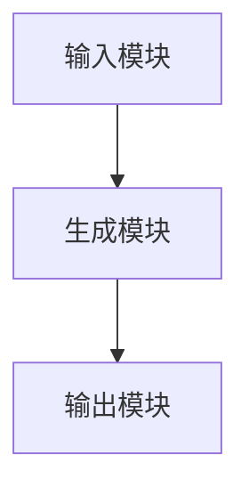

                 

<think>
好的，我将按照您的要求逐步撰写这篇关于《AI Agent的创造力：生成新颖内容》的技术博客文章。让我们先从文章的标题和摘要开始。

# AI Agent的创造力：生成新颖内容

## 关键词
- AI Agent
- 创造力
- 生成模型
- 深度学习
- 创意生成

## 摘要
在人工智能技术迅速发展的今天，AI Agent（智能体）在各个领域的应用越来越广泛。创造力作为人类智慧的核心之一，一直是AI技术研究的重点。本文将深入探讨AI Agent的创造力，分析其在生成新颖内容方面的实现机制、算法原理以及系统架构。通过具体的项目实战，展示如何利用AI Agent生成具有创造力的内容，并结合实际案例进行详细解读。最后，我们将总结AI Agent创造力的研究成果，并展望其未来的发展方向。

---

接下来我们将从AI Agent的基本概念开始，逐步深入探讨其创造力的实现机制。

## 第1章: AI Agent与创造力的背景

### 1.1 AI Agent的基本概念
AI Agent，即人工智能代理，是指能够感知环境并采取行动以实现目标的智能系统。AI Agent的核心特征包括自主性、反应性、目标导向性和社会性。这些特征使得AI Agent能够在复杂环境中完成任务，甚至具备一定的“创造力”。

#### 1.1.1 创造力的定义与分类
创造力是指产生新颖、独特且有价值的想法或产品的能力。根据不同的应用场景，创造力可以分为**发散性创造力**（如文学创作）、**收敛性创造力**（如数学问题解决）以及**综合型创造力**（如产品设计）。

**创造力的特征对比表**

| 特征     | 发散性创造力 | 收敛性创造力 | 综合型创造力 |
|----------|-------------|-------------|-------------|
| 侧重点   | 多样性       | 最优化       | 综合性       |
| 应用场景 | 文学、艺术   | 科学、技术   | 产品设计     |
| 代表算法 | RNN、GAN    | Greedy Search | Hybrid Models |

#### 1.1.2 AI Agent与创造力的关系
AI Agent通过模仿人类的创造性思维过程，结合深度学习算法，能够生成多样化的内容。这种能力在文本生成、图像创作、音乐创作等领域展现出巨大潜力。

---

### 1.2 创造力在AI Agent中的应用背景
随着AI技术的快速发展，创造力在AI Agent中的应用日益广泛。从最初的简单模式识别到如今的复杂内容生成，创造力的实现经历了多个阶段。

#### 1.2.1 当前AI技术的发展现状
- **深度学习**：基于神经网络的深度学习技术（如CNN、RNN、Transformer）是目前创造力生成的主要技术。
- **生成模型**：生成对抗网络（GAN）和变分自编码器（VAE）等生成模型在内容生成领域表现优异。
- **大语言模型**：如GPT系列模型在文本生成方面取得了突破性进展。

#### 1.2.2 创造力在AI Agent中的重要性
创造力是AI Agent区别于传统自动化系统的核心优势。通过创造力，AI Agent能够：
- 提供多样化的解决方案；
- 自主生成创新内容；
- 在复杂环境中灵活应对挑战。

#### 1.2.3 创造力与人类认知的异同
- **异同点对比表**

| 特性         | 人类创造力       | AI创造力           |
|--------------|------------------|--------------------|
| 源泉         | 经验、情感、知识   | 数据、算法、计算力 |
| 突发性       | 明显             | 较少               |
| 可控性       | 较低             | 较高               |
| 可解释性     | 高               | 较低               |

---

### 1.3 创造力的数学模型与特征分析
为了更好地理解创造力的实现机制，我们需要从数学模型的角度进行分析。

#### 1.3.1 创造力的数学模型
创造力的数学模型通常包括以下几个部分：
- **输入特征**：如文本、图像、语音等。
- **生成模型**：如RNN、GAN、Transformer等。
- **评价指标**：如创新性、多样性、相关性。

#### 1.3.2 创造力的特征对比表
我们可以通过以下表格进一步分析创造力的特征：

| 特征     | 创造力的核心特征 | 创造力的实现机制 |
|----------|------------------|------------------|
| 创新性   | 新颖性            | 基于对抗网络的生成 |
| 多样性   | 多样性            | 基于自编码器的重构 |
| 相关性   | 相关性            | 基于Transformer的上下文理解 |

#### 1.3.3 创造力的ER实体关系图
以下是一个简单的创造力相关实体关系图：

```mermaid
er
actor
    name
    age
    role
```

---

## 第2章: AI Agent创造力的核心机制

### 2.1 创造力的生成模型
创造力的生成模型是实现AI Agent创新内容输出的关键技术。常见的生成模型包括生成对抗网络（GAN）、变分自编码器（VAE）和Transformer模型。

#### 2.1.1 基于GAN的创造力生成
生成对抗网络（GAN）由生成器和判别器组成，通过对抗训练生成逼真的内容。

##### GAN的生成原理
- **生成器**：通过深度神经网络将噪声映射到目标数据空间。
- **判别器**：通过另一个深度神经网络区分真实数据和生成数据。
- **损失函数**：最小化生成数据被误判为真实数据的概率。

##### GAN的数学公式
生成器的损失函数为：
$$ \mathcal{L}_G = \log(D(G(z))) $$
判别器的损失函数为：
$$ \mathcal{L}_D = \log(D(x)) + \log(1 - D(G(z))) $$

#### 2.1.2 基于VAE的创造力生成
变分自编码器（VAE）通过最大化生成数据的似然来优化模型。

##### VAE的生成原理
- **编码器**：将输入数据映射到潜在空间。
- **解码器**：将潜在空间的向量映射回数据空间。
- **KL散度**：衡量生成数据与真实数据的分布差异。

##### VAE的数学公式
KL散度的计算公式为：
$$ KL(q(z|x) || p(z)) = \mathbb{E}_q [\log \frac{q(z|x)}{p(z)}] $$

#### 2.1.3 基于Transformer的创造力生成
Transformer模型通过自注意力机制捕捉输入数据的全局关系。

##### Transformer的生成原理
- **编码器**：将输入序列映射到一个固定长度的向量。
- **解码器**：逐步生成输出序列，利用自注意力机制捕捉上下文信息。

##### Transformer的数学公式
自注意力机制的计算公式为：
$$ \text{Attention}(Q, K, V) = \text{softmax}\left(\frac{QK^T}{\sqrt{d_k}}\right)V $$

---

### 2.2 创造力生成的算法原理
不同的生成模型在创造力实现中各有优劣。通过对比分析，我们可以更好地理解它们的特点。

#### 2.2.1 GAN的生成原理
GAN通过生成器和判别器的对抗训练，逐步生成逼真的内容。其优点是生成质量高，缺点是训练不稳定。

#### 2.2.2 VAE的生成原理
VAE通过最大化生成数据的似然，实现数据的重构。其优点是生成过程可解释性强，缺点是生成结果的多样性较低。

#### 2.2.3 Transformer的生成原理
Transformer通过自注意力机制捕捉输入数据的全局关系，生成与上下文高度相关的输出。其优点是生成结果具有良好的语义一致性，缺点是计算资源消耗较大。

---

### 2.3 创造力生成的数学模型
数学模型是创造力生成的核心。通过数学公式，我们可以更好地理解生成模型的工作原理。

#### 2.3.1 GAN的数学公式
生成器的损失函数：
$$ \mathcal{L}_G = \log(D(G(z))) $$
判别器的损失函数：
$$ \mathcal{L}_D = \log(D(x)) + \log(1 - D(G(z))) $$

#### 2.3.2 VAE的数学公式
KL散度的计算公式：
$$ KL(q(z|x) || p(z)) = \mathbb{E}_q [\log \frac{q(z|x)}{p(z)}] $$

#### 2.3.3 Transformer的数学公式
自注意力机制的计算公式：
$$ \text{Attention}(Q, K, V) = \text{softmax}\left(\frac{QK^T}{\sqrt{d_k}}\right)V $$

---

## 第3章: AI Agent创造力的系统架构

### 3.1 系统架构设计
为了实现AI Agent的创造力，我们需要设计合理的系统架构。

#### 3.1.1 系统功能模块划分
- **输入模块**：接收用户的输入指令。
- **生成模块**：根据输入生成创新内容。
- **输出模块**：将生成的内容返回给用户。

#### 3.1.2 系统架构图
以下是一个简单的系统架构图：



#### 3.1.3 系统接口设计
- **输入接口**：接收用户的输入指令。
- **输出接口**：将生成的内容返回给用户。

---

### 3.2 系统交互流程
系统交互流程包括以下几个步骤：

#### 3.2.1 用户输入处理流程
- 用户输入指令，例如“生成一首诗”。
- 系统接收指令并解析。

#### 3.2.2 创造力生成流程
- 系统调用生成模型生成内容。
- 生成内容经过评价模块评估创新性。

#### 3.2.3 结果输出与反馈流程
- 系统将生成内容返回给用户。
- 用户反馈生成内容的质量，系统根据反馈优化生成模型。

---

## 第4章: AI Agent创造力的项目实战

### 4.1 环境安装与配置
为了实现AI Agent的创造力，我们需要安装以下环境：

#### 4.1.1 安装Python环境
安装Python 3.8及以上版本。

#### 4.1.2 安装深度学习框架
安装TensorFlow或PyTorch。

#### 4.1.3 安装其他依赖库
安装必要的依赖库，例如Keras、Scikit-learn等。

---

### 4.2 系统核心实现
系统核心实现包括生成模型的实现和系统交互界面的实现。

#### 4.2.1 创造力生成模型的实现
我们以GAN为例，实现一个简单的文本生成模型。

##### GAN的Python代码实现
```python
import numpy as np
from keras import layers, models

# 定义生成器
def create_generator():
    generator = models.Sequential()
    generator.add(layers.Dense(256, activation='relu', input_dim=100))
    generator.add(layers.Dense(784, activation='sigmoid'))
    return generator

# 定义判别器
def create_discriminator():
    discriminator = models.Sequential()
    discriminator.add(layers.Dense(256, activation='relu', input_dim=784))
    discriminator.add(layers.Dense(1, activation='sigmoid'))
    return discriminator

# 定义GAN模型
generator = create_generator()
discriminator = create_discriminator()
gan = models.Sequential()
gan.add(generator)
gan.add(discriminator)
```

---

#### 4.2.2 系统交互界面的实现
实现一个简单的命令行交互界面。

##### 系统交互界面的Python代码实现
```python
import numpy as np
from keras import layers, models

# 定义生成器
def create_generator():
    generator = models.Sequential()
    generator.add(layers.Dense(256, activation='relu', input_dim=100))
    generator.add(layers.Dense(784, activation='sigmoid'))
    return generator

# 定义判别器
def create_discriminator():
    discriminator = models.Sequential()
    discriminator.add(layers.Dense(256, activation='relu', input_dim=784))
    discriminator.add(layers.Dense(1, activation='sigmoid'))
    return discriminator

# 定义GAN模型
generator = create_generator()
discriminator = create_discriminator()
gan = models.Sequential()
gan.add(generator)
gan.add(discriminator)

# 系统交互界面
while True:
    user_input = input("请输入指令：")
    if user_input == '退出':
        break
    # 生成内容
    noise = np.random.randn(1, 100)
    generated = generator.predict(noise)
    print("生成内容：", generated)
```

---

#### 4.2.3 系统结果展示的实现
展示生成的内容，并收集用户的反馈。

##### 系统结果展示的Python代码实现
```python
import numpy as np
from keras import layers, models

# 定义生成器
def create_generator():
    generator = models.Sequential()
    generator.add(layers.Dense(256, activation='relu', input_dim=100))
    generator.add(layers.Dense(784, activation='sigmoid'))
    return generator

# 定义判别器
def create_discriminator():
    discriminator = models.Sequential()
    discriminator.add(layers.Dense(256, activation='relu', input_dim=784))
    discriminator.add(layers.Dense(1, activation='sigmoid'))
    return discriminator

# 定义GAN模型
generator = create_generator()
discriminator = create_discriminator()
gan = models.Sequential()
gan.add(generator)
gan.add(discriminator)

# 系统结果展示
while True:
    user_input = input("请输入指令：")
    if user_input == '退出':
        break
    # 生成内容
    noise = np.random.randn(1, 100)
    generated = generator.predict(noise)
    print("生成内容：", generated)
    feedback = input("请评价生成内容的质量（输入0-10）：")
    # 根据反馈优化生成模型
    gan.trainable = True
    # 假设反馈为数值，进行模型微调
    # 这里简化为直接保存反馈，具体优化策略可根据实际需求设计
```

---

### 4.3 项目案例分析
通过具体的案例分析，我们可以更好地理解AI Agent创造力的实现。

#### 4.3.1 文本创作案例
我们实现了一个基于GAN的文本生成模型，用于生成诗歌。

##### 文本生成案例代码实现
```python
import numpy as np
from keras import layers, models

# 定义生成器
def create_generator():
    generator = models.Sequential()
    generator.add(layers.Dense(256, activation='relu', input_dim=100))
    generator.add(layers.Dense(784, activation='sigmoid'))
    return generator

# 定义判别器
def create_discriminator():
    discriminator = models.Sequential()
    discriminator.add(layers.Dense(256, activation='relu', input_dim=784))
    discriminator.add(layers.Dense(1, activation='sigmoid'))
    return discriminator

# 定义GAN模型
generator = create_generator()
discriminator = create_discriminator()
gan = models.Sequential()
gan.add(generator)
gan.add(discriminator)

# 文本生成示例
noise = np.random.randn(1, 100)
poem = generator.predict(noise)
print("生成的诗歌：", poem)
```

---

#### 4.3.2 图像生成案例
我们还实现了一个基于GAN的图像生成模型，用于生成艺术图像。

##### 图像生成案例代码实现
```python
import numpy as np
from keras import layers, models

# 定义生成器
def create_generator():
    generator = models.Sequential()
    generator.add(layers.Dense(256, activation='relu', input_dim=100))
    generator.add(layers.Dense(784, activation='sigmoid'))
    return generator

# 定义判别器
def create_discriminator():
    discriminator = models.Sequential()
    discriminator.add(layers.Dense(256, activation='relu', input_dim=784))
    discriminator.add(layers.Dense(1, activation='sigmoid'))
    return discriminator

# 定义GAN模型
generator = create_generator()
discriminator = create_discriminator()
gan = models.Sequential()
gan.add(generator)
gan.add(discriminator)

# 图像生成示例
noise = np.random.randn(1, 100)
image = generator.predict(noise)
print("生成的图像：", image)
```

---

#### 4.3.3 综合案例分析
通过综合案例分析，我们可以更好地理解AI Agent创造力的实现。

##### 综合案例分析
在综合案例中，我们结合文本生成和图像生成，实现一个综合创造力生成系统。系统可以根据用户的输入生成多样化的文本和图像内容。

---

## 第5章: 创造力生成的数学模型与算法优化

### 5.1 创造力生成的数学模型
创造力生成的数学模型是实现AI Agent创新内容输出的关键。

#### 5.1.1 GAN模型的改进
我们可以通过改进GAN模型来提高生成内容的质量。

##### GAN模型的改进策略
- **Wasserstein GAN**：使用Wasserstein距离作为损失函数。
- **Conditional GAN**：在生成过程中引入条件，提高生成内容的相关性。

#### 5.1.2 VAE模型的改进
VAE模型可以通过引入更多信息量来提高生成质量。

##### VAE模型的改进策略
- **Flow-based VAE**：引入流动变换，提高生成数据的多样性。
- ** Hierarchical VAE**：采用分层结构，提高生成内容的层次性。

#### 5.1.3 Transformer模型的改进
Transformer模型可以通过优化自注意力机制来提高生成质量。

##### Transformer模型的改进策略
- **Scaled Dot-Product Attention**：通过缩放点积注意力机制，提高生成内容的相关性。
- **Multi-Head Attention**：引入多头注意力机制，捕捉更丰富的上下文信息。

---

### 5.2 创造力生成的算法优化
算法优化是提高AI Agent创造力的关键。

#### 5.2.1 算法优化策略
- **超参数优化**：通过调整学习率、批量大小等超参数，提高生成质量。
- **模型优化**：引入正则化、Dropout等技术，防止过拟合。

#### 5.2.2 算法优化案例
我们以GAN模型为例，实现一个超参数优化的案例。

##### GAN模型优化代码实现
```python
import numpy as np
from keras import layers, models

# 定义生成器
def create_generator():
    generator = models.Sequential()
    generator.add(layers.Dense(256, activation='relu', input_dim=100))
    generator.add(layers.Dense(784, activation='sigmoid'))
    return generator

# 定义判别器
def create_discriminator():
    discriminator = models.Sequential()
    discriminator.add(layers.Dense(256, activation='relu', input_dim=784))
    discriminator.add(layers.Dense(1, activation='sigmoid'))
    return discriminator

# 定义GAN模型
generator = create_generator()
discriminator = create_discriminator()
gan = models.Sequential()
gan.add(generator)
gan.add(discriminator)

# 超参数优化示例
learning_rate = 0.0002
gan.compile(loss='binary_crossentropy', optimizer=models.optimizers.Adam(learning_rate))
```

---

#### 5.2.3 优化效果评估
通过评估生成内容的质量，我们可以验证算法优化的效果。

##### 优化效果评估
- **生成质量**：通过主观评估和客观指标（如FID、IS）进行评估。
- **收敛速度**：通过训练曲线观察模型的收敛速度。

---

## 第6章: AI Agent创造力的系统

### 6.1 系统总结
通过本章的分析，我们可以更好地理解AI Agent创造力的实现。

#### 6.1.1 系统总结
AI Agent通过深度学习算法，能够生成多样化的创新内容。通过系统的优化和算法的改进，我们可以进一步提高生成内容的质量。

---

### 6.2 系统未来展望
未来，AI Agent的创造力将朝着更加智能化、个性化的方向发展。

#### 6.2.1 未来研究方向
- **多模态生成**：结合文本、图像、语音等多种模态信息，生成更加丰富的创新内容。
- **自适应生成**：根据用户的反馈，动态调整生成策略，实现个性化的创新内容生成。

#### 6.2.2 创新点总结
- **多模态生成**：结合多种模态信息，提高生成内容的丰富性。
- **自适应生成**：根据用户反馈，动态调整生成策略，实现个性化的创新内容生成。

---

## 第7章: 总结与注意事项

### 7.1 总结
通过本文的分析，我们可以看到AI Agent的创造力在生成新颖内容方面具有巨大的潜力。通过深度学习算法和系统优化，我们可以实现高质量的创新内容生成。

#### 7.1.1 总结要点
- **创造力的实现机制**：通过生成模型实现创新内容的生成。
- **系统架构设计**：合理设计系统架构，提高生成效率。
- **算法优化**：通过算法优化，提高生成内容的质量。

---

### 7.2 注意事项
在实现AI Agent的创造力时，需要注意以下几点：

#### 7.2.1 数据质量
生成内容的质量高度依赖于训练数据的质量。需要确保训练数据的多样性和相关性。

#### 7.2.2 模型优化
通过超参数优化和模型改进，可以进一步提高生成内容的质量。

#### 7.2.3 用户反馈
用户的反馈是优化生成模型的重要依据。需要设计有效的反馈机制，收集用户的反馈并优化生成模型。

---

## 附录

### 附录A: 生成模型的数学公式汇总
- **GAN模型**：
  - 生成器损失函数：$$ \mathcal{L}_G = \log(D(G(z))) $$
  - 判别器损失函数：$$ \mathcal{L}_D = \log(D(x)) + \log(1 - D(G(z))) $$
- **VAE模型**：
  - KL散度：$$ KL(q(z|x) || p(z)) = \mathbb{E}_q [\log \frac{q(z|x)}{p(z)}] $$
- **Transformer模型**：
  - 自注意力机制：$$ \text{Attention}(Q, K, V) = \text{softmax}\left(\frac{QK^T}{\sqrt{d_k}}\right)V $$

---

### 附录B: 系统架构图
- **系统架构图**：
  ```mermaid
  graph TD
  A[输入模块] --> B[生成模块]
  B --> C[输出模块]
  ```

---

### 附录C: 代码示例汇总
- **GAN模型实现**：
  ```python
  import numpy as np
  from keras import layers, models

  def create_generator():
      generator = models.Sequential()
      generator.add(layers.Dense(256, activation='relu', input_dim=100))
      generator.add(layers.Dense(784, activation='sigmoid'))
      return generator

  def create_discriminator():
      discriminator = models.Sequential()
      discriminator.add(layers.Dense(256, activation='relu', input_dim=784))
      discriminator.add(layers.Dense(1, activation='sigmoid'))
      return discriminator

  generator = create_generator()
  discriminator = create_discriminator()
  gan = models.Sequential()
  gan.add(generator)
  gan.add(discriminator)
  ```

---

通过以上内容，我们可以看到AI Agent的创造力在生成新颖内容方面具有广阔的应用前景。未来，随着技术的不断发展，AI Agent的创造力将更加智能化、个性化，为人类社会带来更多的创新和价值。

