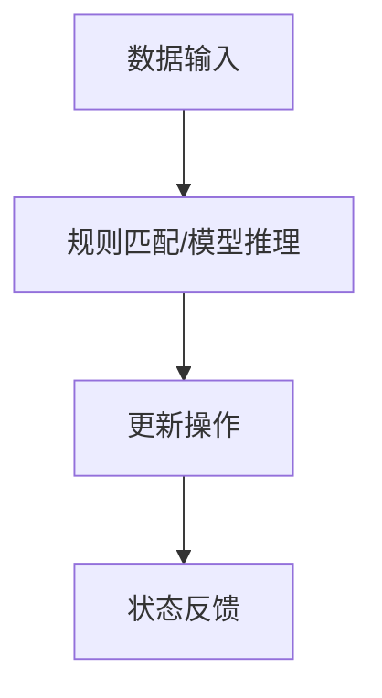
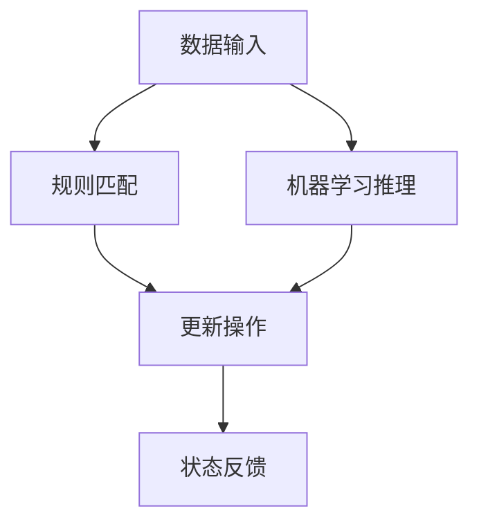
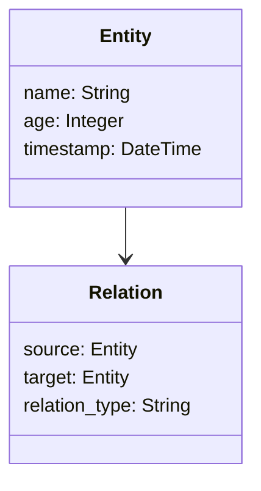
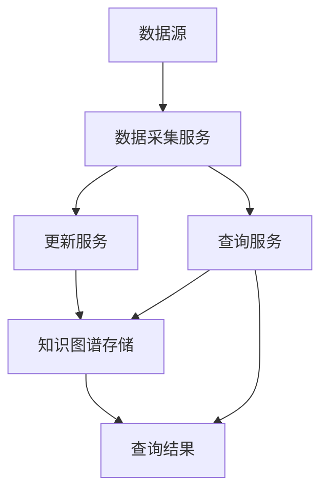
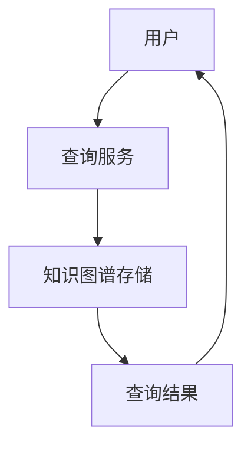

                 


# 第三部分: 动态知识图谱的构建与更新算法

## 第6章: 动态知识图谱构建的算法原理

### 6.1 基于规则的动态知识更新

#### 6.1.1 基于规则的动态更新流程
基于规则的动态知识更新是一种通过预定义规则来检测和更新知识图谱的方法。以下是其实现步骤：

1. 数据输入：接收新的数据或信息。
2. 规则匹配：将新数据与预定义的规则进行匹配，判断是否需要更新知识图谱。
3. 更新操作：根据匹配结果，执行插入、删除或修改操作。
4. 状态反馈：将更新结果反馈给系统或用户。

#### 6.1.2 规则的定义与实现
规则的定义通常包括触发条件和操作两部分。例如，当检测到某个实体的属性值发生变化时，触发更新操作。

**示例规则：**
- 触发条件：检测到实体“张三”的年龄属性从30变为31。
- 操作：更新知识图谱中“张三”的年龄属性为31。

**Python代码示例：**
```python
# 定义规则匹配函数
def update_age(entity, old_age, new_age):
    if entity.age == old_age:
        entity.age = new_age
        return True
    return False

# 示例应用
class Entity:
    def __init__(self, name, age):
        self.name = name
        self.age = age

zhangsan = Entity("张三", 30)
update_age(zhangsan, 30, 31)
print(zhangsan.age)  # 输出 31
```

#### 6.1.3 规则驱动的更新案例
在金融领域，动态知识图谱可以用于实时更新股票价格。每当检测到价格变化，规则引擎会自动更新知识图谱中的股票信息。

### 6.2 基于机器学习的动态知识更新

#### 6.2.1 机器学习在动态知识更新中的应用
基于机器学习的动态知识更新利用模型自动学习知识图谱的结构和模式，适应数据的变化。这种方法通常用于复杂场景，如社交网络中的动态关系更新。

#### 6.2.2 基于监督学习的动态更新算法
监督学习算法（如SVM、随机森林）可以用于分类任务，判断新信息是否需要添加到知识图谱中。例如，判断一条新的新闻是否需要更新某个实体的属性。

**数学模型示例：**
- 输入：新信息X
- 输出：是否需要更新（1表示需要，0表示不需要）
- 模型：使用逻辑回归进行分类
$$ P(y=1|x) = \frac{1}{1 + e^{-w x - b}} $$

#### 6.2.3 基于无监督学习的动态更新算法
无监督学习算法（如聚类、主题模型）适用于数据量大且无标签的场景。例如，发现新的实体类型时，可以使用聚类算法自动划分簇，然后更新知识图谱。

**Python代码示例：**
```python
from sklearn.cluster import KMeans

# 示例数据：文本片段
texts = ["AI is a field in computer science", "Machine learning is part of AI"]
# 文本向量化（简化示例）
X = [[1, 0], [0, 1]]

# 使用K-means进行聚类
km = KMeans(n_clusters=2)
km.fit(X)
clusters = km.labels_
print(clusters)  # 输出聚类结果
```

### 6.3 动态知识图谱构建的算法流程图


---

## 第7章: 动态知识图谱更新的算法实现

### 7.1 基于时间戳的更新机制
通过记录每个实体的修改时间戳，可以实现版本控制和历史数据管理。例如，当某个实体的信息被更新时，系统记录当前时间戳，便于后续版本回溯。

**Python代码示例：**
```python
import datetime

class Entity:
    def __init__(self, name, age, timestamp=None):
        self.name = name
        self.age = age
        self.timestamp = timestamp if timestamp else datetime.datetime.now()

zhangsan = Entity("张三", 30)
print(zhangsan.timestamp)  # 输出当前时间
```

### 7.2 基于事件驱动的更新机制
事件驱动是一种异步处理方式，适用于实时数据流的处理。例如，当检测到某个事件（如用户点击、消息接收）时，触发知识图谱的更新。

**Python代码示例：**
```python
import time

def update_entity(event):
    # 假设event包含实体信息
    if event.type == "update_age":
        entity = event.entity
        entity.age = event.new_age

# 示例事件触发
class Event:
    def __init__(self, type, entity, new_age):
        self.type = type
        self.entity = entity
        self.new_age = new_age

event = Event("update_age", zhangsan, 31)
update_entity(event)
print(zhangsan.age)  # 输出 31
```

### 7.3 基于规则和机器学习的混合更新机制
结合规则和机器学习的方法，可以提高更新的准确性和效率。例如，首先使用规则进行粗筛，再使用机器学习模型进行精确判断。

**数学模型示例：**
- 规则匹配：$R(x)$ 表示规则匹配成功。
- 机器学习模型：$M(x)$ 表示模型预测结果。
- 综合判断：$Update = R(x) \land M(x)$

### 7.4 动态知识图谱更新的流程图


---

# 第四部分: 动态知识图谱的系统架构与实现

## 第8章: 动态知识图谱的系统架构设计

### 8.1 系统功能设计

#### 8.1.1 领域模型设计
使用 Mermaid 类图表示实体关系：


#### 8.1.2 系统功能模块
- 数据采集模块：负责收集实时数据。
- 更新模块：处理数据并更新知识图谱。
- 查询模块：支持基于动态知识图谱的查询。

### 8.2 系统架构设计

#### 8.2.1 分层架构
- 数据层：存储原始数据。
- 逻辑层：处理业务逻辑。
- 表示层：展示结果。

#### 8.2.2 微服务架构
- 数据采集服务：接收实时数据。
- 更新服务：处理数据并更新知识图谱。
- 查询服务：提供基于动态知识图谱的查询接口。

#### 8.2.3 系统架构图


### 8.3 系统接口设计

#### 8.3.1 数据接口
- 输入接口：接收新数据。
- 输出接口：反馈更新结果。

#### 8.3.2 查询接口
- 提供基于动态知识图谱的查询功能。

### 8.4 系统交互设计

#### 8.4.1 交互流程
1. 用户提交查询请求。
2. 系统调用查询服务。
3. 查询服务访问知识图谱存储。
4. 返回查询结果。

#### 8.4.2 交互流程图


---

## 第9章: 动态知识图谱的系统实现

### 9.1 环境安装与配置

#### 9.1.1 安装依赖
- Python 3.8+
- Jena (用于知识图谱存储)
- SPARQL（用于查询）

**示例安装命令：**
```bash
pip install jena-py
```

### 9.2 核心代码实现

#### 9.2.1 数据采集模块
```python
import requests

def fetch_data(api_url):
    response = requests.get(api_url)
    return response.json()

# 示例应用
data = fetch_data("http://example.com/api")
print(data)
```

#### 9.2.2 更新模块
```python
from jena import JenaGraph

def update_kg(entity, kg):
    kg.update(entity)
```

#### 9.2.3 查询模块
```python
def query_kg(query, kg):
    return kg.query(query)

# 示例SPARQL查询
query = """
    SELECT ?name ?age
    WHERE {
        ?entity a Person.
        ?entity name ?name.
        ?entity age ?age.
    }
"""
result = query_kg(query, kg)
print(result)
```

### 9.3 系统实现案例

#### 9.3.1 案例分析：社交网络中的动态知识图谱
- 数据源：实时社交数据流。
- 动态更新：用户的关注、点赞、评论等操作。
- 查询需求：动态社交网络分析。

#### 9.3.2 代码实现与解读
```python
# 示例代码：实时数据流处理
import time
from jena import JenaGraph

kg = JenaGraph("social_kg")

class SocialAgent:
    def __init__(self, kg):
        self.kg = kg

    def process_stream(self):
        while True:
            data = fetch_data("http://social_api/stream")
            self.update_kg(data)
            time.sleep(1)

    def update_kg(self, data):
        for entity in data:
            self.kg.update(entity)

agent = SocialAgent(kg)
agent.process_stream()
```

### 9.4 项目总结

#### 9.4.1 实施成果
- 成功实现动态知识图谱的实时更新与查询。
- 系统具备高扩展性和灵活性。

#### 9.4.2 经验与教训
- 规则与机器学习结合能提高准确性。
- 实时数据流处理需优化性能。

---

# 第五部分: 动态知识图谱的最佳实践与展望

## 第10章: 动态知识图谱的最佳实践

### 10.1 实践总结

#### 10.1.1 关键技术要点
- 数据流的高效处理。
- 知识图谱的动态扩展。
- 更新机制的优化。

#### 10.1.2 实践中的注意事项
- 定期备份数据，防止数据丢失。
- 优化规则和模型，提高准确性和效率。
- 处理大数据场景时，选择合适的分布式架构。

### 10.2 小结与展望

#### 10.2.1 当前技术小结
- 动态知识图谱在AI Agent中的应用日益广泛。
- 结合规则和机器学习的方法有效提升更新质量。

#### 10.2.2 未来技术展望
- 更智能的自适应更新机制。
- 结合边缘计算，实现分布式动态知识图谱。
- 更加高效的数据处理算法。

## 第11章: 动态知识图谱的未来发展方向

### 11.1 智能化更新机制
- 增强学习的应用：通过不断学习优化更新策略。
- 自动识别变化点：利用深度学习模型自动检测数据变化。

### 11.2 分布式动态知识图谱
- 边缘计算的应用：在边缘节点实时处理数据，减少延迟。
- 联邦学习：跨机构、跨系统的知识图谱动态更新。

### 11.3 多模态数据整合
- 结合文本、图像、视频等多种数据源，构建多模态动态知识图谱。
- 提供更全面的语义理解能力。

---

# 结语

通过本文的详细讲解，我们深入探讨了AI Agent的动态知识图谱构建与更新的关键技术与实现方法。从背景介绍到系统实现，再到最佳实践与未来展望，为读者提供了全面的知识体系。动态知识图谱的构建与更新是一个复杂而充满挑战的过程，但其在AI Agent中的应用前景广阔，未来将随着技术的进步而不断优化和完善。

---

**关键词：** AI Agent, 动态知识图谱, 知识图谱构建, 动态更新, 知识图谱应用

**摘要：** 本文系统地探讨了AI Agent的动态知识图谱构建与更新的关键技术，涵盖动态知识图谱的背景与概念、构建与更新算法、系统架构与实现、项目实战以及最佳实践与未来展望。通过详细的技术分析和实例讲解，为读者提供了全面的知识体系，助力AI Agent在实际应用中的高效运作。

