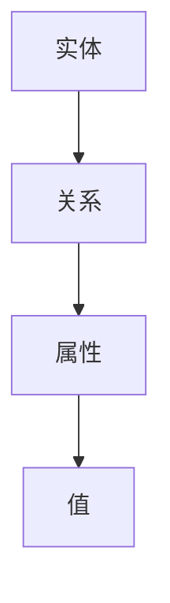
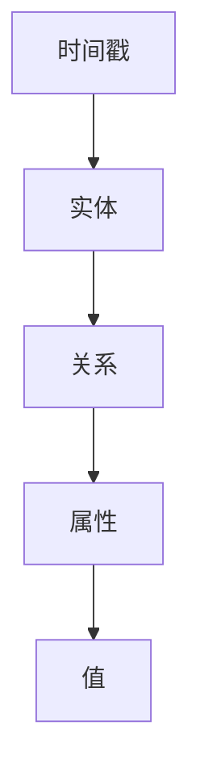
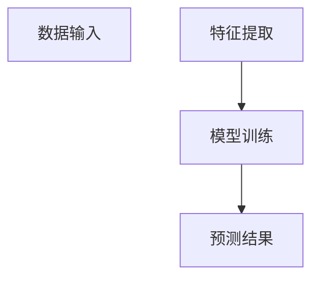
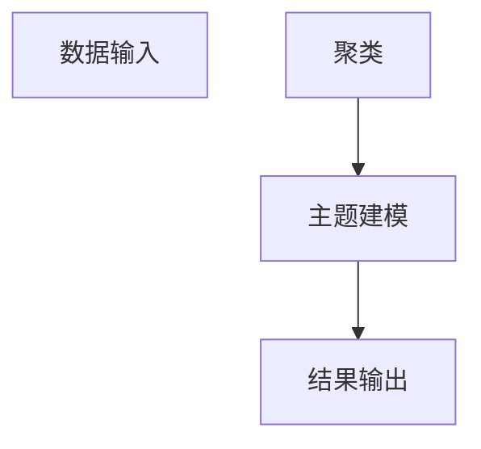
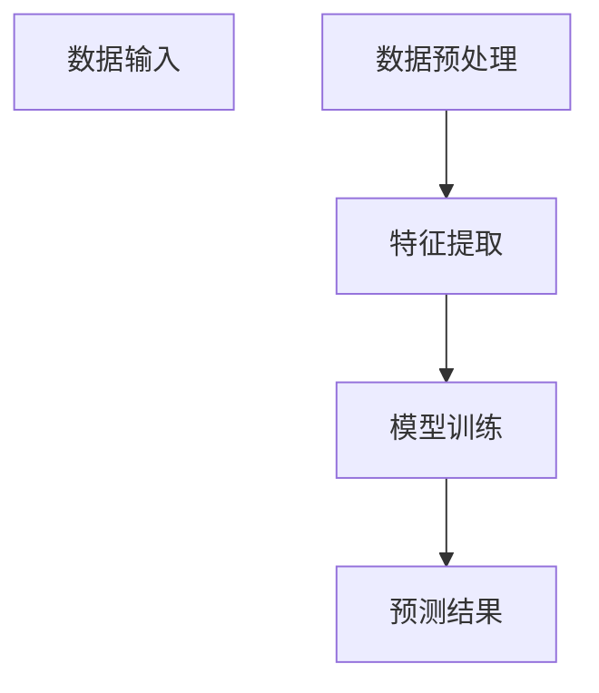
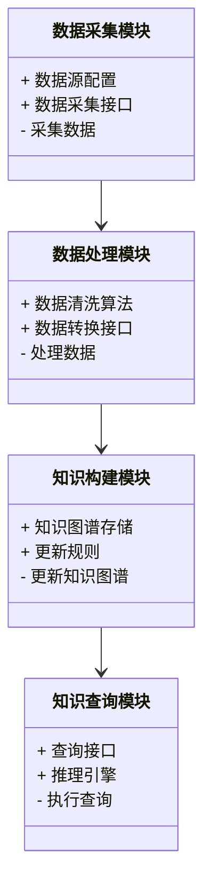
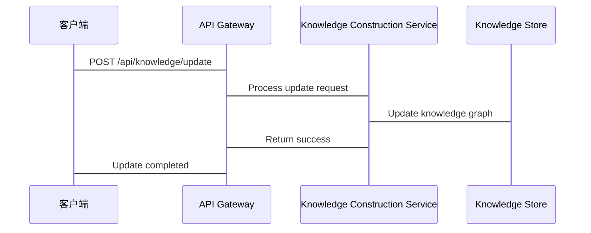

                 


# AI Agent的动态知识图谱构建与更新

> 关键词：AI Agent，知识图谱，动态知识图谱，构建算法，更新机制，系统架构

> 摘要：本文详细探讨了AI Agent的动态知识图谱构建与更新的核心概念、算法原理、系统架构以及项目实战。通过背景介绍、核心概念分析、算法流程图展示、系统架构设计、实际案例解析和最佳实践总结，为读者提供全面而深入的技术指导。

---

# 第一部分: AI Agent与动态知识图谱的背景与概念

## 第1章: 知识图谱概述

### 1.1 知识图谱的基本概念

#### 1.1.1 知识图谱的定义与特点
知识图谱是一种以图结构表示知识的语义网络，由实体和关系组成，具有语义丰富、结构化和可扩展的特点。

#### 1.1.2 知识图谱的构建方法
知识图谱的构建通常包括数据抽取、实体识别、关系抽取和知识融合等步骤。

#### 1.1.3 知识图谱的应用场景
知识图谱广泛应用于搜索引擎优化、问答系统、推荐系统和语义理解等领域。

### 1.2 动态知识图谱的定义与特点

#### 1.2.1 动态知识图谱的定义
动态知识图谱是一种能够实时更新和扩展的知识表示形式，能够反映现实世界中实体和关系的动态变化。

#### 1.2.2 动态知识图谱的核心特征
动态知识图谱具有实时性、动态性和自适应性，能够根据新数据不断更新和调整。

#### 1.2.3 动态知识图谱与传统知识图谱的区别
动态知识图谱强调实时更新和适应性，而传统知识图谱通常是静态的，更新频率较低。

## 第2章: AI Agent的基本原理

### 2.1 AI Agent的定义与分类

#### 2.1.1 AI Agent的定义
AI Agent是一种智能实体，能够感知环境、自主决策并执行任务。

#### 2.1.2 基于知识图谱的AI Agent
基于知识图谱的AI Agent能够利用结构化的知识进行推理和决策。

#### 2.1.3 AI Agent的分类与应用场景
AI Agent可以分为简单反射型、基于模型的反射型和目标驱动型，应用场景包括智能助手、推荐系统和自动驾驶等。

### 2.2 动态知识图谱在AI Agent中的作用

#### 2.2.1 AI Agent的知识需求
AI Agent需要实时更新的知识图谱来支持动态环境中的决策和推理。

#### 2.2.2 动态知识图谱对AI Agent的支持
动态知识图谱为AI Agent提供了动态更新的知识，增强了其适应性和智能性。

#### 2.2.3 动态知识图谱的更新机制
动态知识图谱通过订阅数据源、事件驱动和持续学习等方式进行实时更新。

## 第3章: 动态知识图谱构建的背景与意义

### 3.1 知识图谱的动态更新需求

#### 3.1.1 知识图谱的静态化问题
传统知识图谱通常是静态的，无法适应实时变化的数据。

#### 3.1.2 动态知识图谱的必要性
动态知识图谱能够实时捕捉和更新实体及关系的变化，满足AI Agent的需求。

#### 3.1.3 动态知识图谱的应用场景
动态知识图谱在金融、医疗和社交网络等领域具有重要应用。

### 3.2 动态知识图谱构建的技术挑战

#### 3.2.1 数据流的实时处理
动态知识图谱需要处理实时数据流，保证更新的及时性和准确性。

#### 3.2.2 知识图谱的动态扩展
动态知识图谱需要支持实体和关系的动态添加和删除。

#### 3.2.3 动态知识图谱的高效更新
动态知识图谱的更新需要高效算法，以减少计算开销和提高性能。

---

## 第4章: 动态知识图谱的核心概念与联系

### 4.1 核心概念的定义与属性对比

#### 4.1.1 实体与关系的定义
实体是知识图谱的基本单元，关系描述实体之间的关联。

#### 4.1.2 属性与值的定义
属性描述实体的特征，值是属性的具体表现。

#### 4.1.3 动态知识图谱的核心概念对比表

| 概念 | 定义 | 示例 |
|------|------|------|
| 实体 | 实体是知识图谱的基本单元，代表独立存在的事物。 | 例如，人、地点、组织等。 |
| 关系 | 关系描述实体之间的关联，可以是二元关系或多元关系。 | 例如，“人A是公司B的CEO”。 |
| 属性 | 属性描述实体的特征，可以是单值或多值属性。 | 例如，公司B的成立日期是1990年。 |
| 值 | 值是属性的具体表现，可以是文本、数字或其他数据类型。 | 例如，成立日期的值是“1990-01-01”。 |

### 4.2 实体关系的ER图设计

#### 4.2.1 实体关系的ER图设计



#### 4.2.2 动态知识图谱的ER图扩展



---

## 第5章: 动态知识图谱构建的算法原理

### 5.1 基于规则的动态知识更新

#### 5.1.1 基于规则的动态更新流程

1. 数据抽取：从数据源中提取实体、关系和属性。
2. 规则匹配：根据预定义的规则匹配数据，确定需要更新的部分。
3. 更新知识图谱：根据匹配结果更新知识图谱中的实体、关系或属性。

#### 5.1.2 规则的定义与实现

- **规则定义**：规则通常基于正则表达式、模式匹配或语义相似性。
- **规则实现**：规则可以使用SPARQL或其他查询语言来实现。

#### 5.1.3 规则驱动的更新案例

例如，当检测到某个公司高管职位变动时，更新知识图谱中的关系。

### 5.2 基于机器学习的动态知识更新

#### 5.2.1 机器学习在动态知识更新中的应用

- **监督学习**：使用标注数据训练模型，识别实体和关系。
- **无监督学习**：利用聚类和主题模型发现新的实体和关系。

#### 5.2.2 基于监督学习的动态更新算法



#### 5.2.3 基于无监督学习的动态更新算法



### 5.3 动态知识图谱构建的算法流程图



---

## 第6章: 动态知识图谱的系统架构设计

### 6.1 系统功能设计

#### 6.1.1 功能模块划分

- 数据采集模块：负责从多种数据源采集数据。
- 数据处理模块：对数据进行清洗、解析和转换。
- 知识构建模块：根据数据构建或更新知识图谱。
- 知识查询模块：支持基于知识图谱的查询和推理。

#### 6.1.2 领域模型Mermaid类图



### 6.2 系统架构设计

#### 6.2.1 系统架构Mermaid架构图


### 6.3 系统接口设计

#### 6.3.1 API接口定义

- `/api/knowledge/update`：用于更新知识图谱。
- `/api/knowledge/query`：用于查询知识图谱。

#### 6.3.2 接口交互流程



---

## 第7章: 动态知识图谱的项目实战

### 7.1 环境安装

- 安装必要的Python库，如networkx、rdflib和SPARQLWrapper。
- 安装Jupyter Notebook用于实验。

### 7.2 核心代码实现

#### 7.2.1 数据预处理代码

```python
import pandas as pd

# 读取CSV文件
df = pd.read_csv('data.csv')
```

#### 7.2.2 知识图谱构建代码

```python
from networkx import DiGraph

# 创建图
graph = DiGraph()
# 添加节点
graph.add_node('A', label='实体A')
graph.add_node('B', label='实体B')
# 添加边
graph.add_edge('A', 'B', label='关系')
```

### 7.3 案例分析与解读

例如，构建一个公司及其员工的知识图谱，展示公司与员工的关系。

### 7.4 项目总结

通过项目实战，我们掌握了动态知识图谱的构建和更新方法，并验证了其在实际应用中的可行性。

---

## 第8章: 动态知识图谱的最佳实践

### 8.1 小结

动态知识图谱的构建和更新是实现AI Agent智能化的关键技术。

### 8.2 注意事项

- 数据质量对知识图谱的准确性至关重要。
- 确保系统的实时性和高效性。
- 定期评估和优化知识图谱的质量。

### 8.3 拓展阅读

- 推荐阅读《知识图谱：概念、方法与应用》和《动态知识图谱的构建与管理》。

---

通过以上目录结构，读者可以系统地学习AI Agent的动态知识图谱构建与更新的相关知识，从理论到实践，逐步掌握核心技术。

