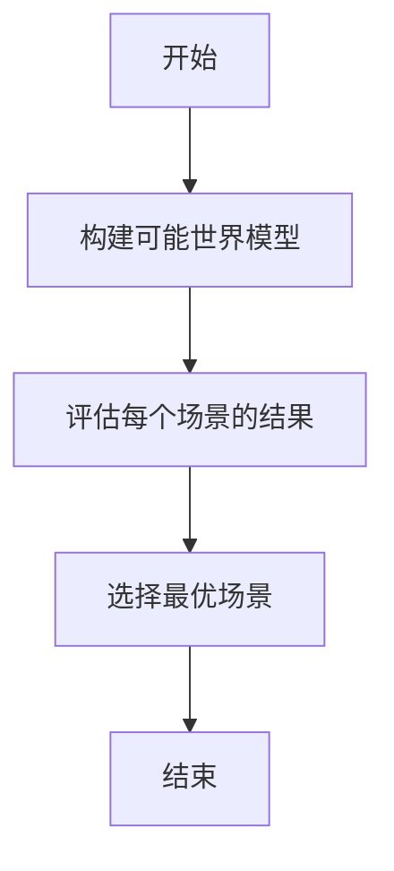
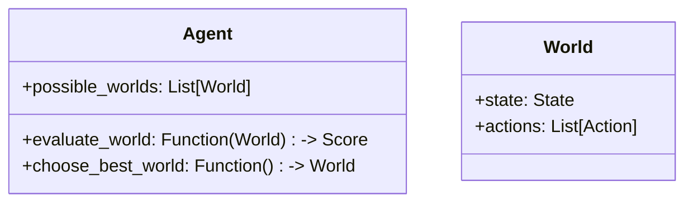
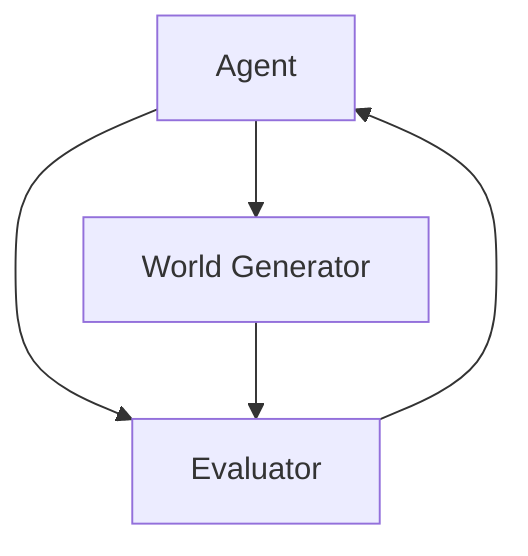

                 


# AI Agent的反事实推理：增强决策的前瞻性

> 关键词：AI Agent，反事实推理，因果推理，可能世界模型，决策优化，前瞻性决策

> 摘要：反事实推理是AI Agent领域中的一个重要概念，它允许AI考虑与事实相反的情况，从而做出更优的决策。本文将详细探讨反事实推理的理论基础、核心算法、数学模型以及在实际系统中的应用，通过案例分析和项目实战，帮助读者全面理解并掌握反事实推理在AI Agent决策优化中的应用。

---

## 第一部分: 反事实推理的基本概念

### 第1章: 反事实推理的定义与背景

#### 1.1 问题背景与定义

- **反事实推理**是指考虑与现实相反的情况，并评估这些假设情况下的结果。例如，“如果我今天没买股票，我现在会赚更多钱吗？”这种思考方式帮助我们在决策时考虑更多可能性。
- AI Agent需要在复杂环境中做出决策，而反事实推理能够帮助其预测不同选择的潜在结果，从而优化决策质量。

#### 1.2 AI Agent的基本概念

- **AI Agent**：能够感知环境并采取行动以实现目标的智能体。它可以分为简单反射式Agent、基于模型的规划Agent和基于效用的Agent等类型。
- **核心功能**：感知、推理、规划、学习和决策。

### 第2章: 反事实推理的理论基础

#### 2.1 可能世界模型

- **可能世界模型**：一种用于描述所有可能情况的理论框架，每个“世界”代表一种假设的情况。
- **应用**：在反事实推理中，可能世界模型用于构建不同的假设场景，分析每个场景下的结果。

#### 2.2 因果推理

- **因果推理**：研究变量之间的因果关系，了解一个变量如何影响另一个变量。
- **与反事实推理的区别**：因果推理关注变量间的因果关系，而反事实推理关注假设性的情景。

#### 2.3 逻辑推理

- **逻辑推理**：通过逻辑规则从已知事实推导出结论。
- **反事实推理的应用**：利用逻辑推理处理假设性的情景，推导出可能的结果。

---

## 第二部分: 反事实推理的核心概念与联系

### 第3章: 反事实推理的核心原理

#### 3.1 反事实推理的原理

- **步骤**：
  1. 构建可能世界模型，定义不同的假设场景。
  2. 分析每个场景下的结果。
  3. 选择最优的假设场景作为决策依据。

#### 3.2 可能世界模型与反事实推理的关系

- **构建方法**：通过定义变量和约束条件，生成多个可能的场景。
- **优缺点**：优点是能够全面考虑各种可能性，缺点是计算复杂度较高。

#### 3.3 因果推理与反事实推理的关系

- **区别**：因果推理关注变量间的因果关系，而反事实推理关注假设性的情景。
- **联系**：因果推理可以为反事实推理提供因果关系模型，帮助构建更合理的假设场景。

### 第4章: 反事实推理与因果推理的关系

#### 4.1 因果推理的基本原理

- **因果关系的定义**：一个变量对另一个变量的影响。
- **数学模型**：使用概率论和图论描述因果关系，如贝叶斯网络。

#### 4.2 反事实推理与因果推理的区别与联系

- **区别**：反事实推理关注假设性情景，因果推理关注变量间的因果关系。
- **联系**：因果推理可以为反事实推理提供因果关系模型，帮助构建更合理的假设场景。

---

## 第三部分: 反事实推理的算法原理

### 第5章: 反事实推理的算法框架

#### 5.1 算法步骤

1. 构建可能世界模型。
2. 评估每个场景下的结果。
3. 选择最优的假设场景。

#### 5.2 算法流程图



### 第6章: 反事实推理的数学模型

#### 6.1 概率论模型

- **贝叶斯定理**：
  $$ P(A|B) = \frac{P(B|A)P(A)}{P(B)} $$
- **应用**：计算每个假设场景发生的概率。

#### 6.2 因果图模型

- **因果图**：使用图论描述变量间的因果关系。
- **结构方程模型**：通过方程描述变量间的因果关系。

### 第7章: 反事实推理的Python实现

#### 7.1 核心代码实现

```python
def factual_reasoning(possible_worlds):
    best_world = None
    best_score = float('-inf')
    for world in possible_worlds:
        score = evaluate_world(world)
        if score > best_score:
            best_score = score
            best_world = world
    return best_world
```

#### 7.2 代码解读

- **possible_worlds**：可能的场景列表。
- **evaluate_world**：评估每个场景的函数。
- **best_world**：最优场景。

---

## 第四部分: 系统分析与架构设计

### 第8章: 反事实推理系统的架构设计

#### 8.1 项目介绍

- **目标**：构建一个基于反事实推理的AI Agent，优化决策过程。
- **功能需求**：包括场景构建、结果评估、决策优化等。

#### 8.2 系统功能设计



#### 8.3 系统架构设计



---

## 第五部分: 项目实战

### 第9章: 项目实战

#### 9.1 项目介绍

- **场景**：金融投资决策优化。
- **目标**：通过反事实推理，优化投资组合。

#### 9.2 核心代码实现

```python
def optimize_portfolio(assets, scenarios):
    best_portfolio = None
    best_return = float('-inf')
    for scenario in scenarios:
        portfolio = evaluate_scenario(scenario, assets)
        return_ = portfolio.return_
        if return_ > best_return:
            best_return = return_
            best_portfolio = portfolio
    return best_portfolio
```

#### 9.3 案例分析

- **结果**：反事实推理帮助优化投资组合，提高预期收益。
- **分析**：通过考虑不同经济情况下的投资效果，AI Agent能够做出更优的决策。

---

## 第六部分: 总结与展望

### 第10章: 总结

- **核心内容**：反事实推理在AI Agent中的应用，通过考虑假设场景优化决策。
- **重要性**：帮助AI Agent做出更优的决策，提升系统性能。

### 第11章: 展望

- **未来研究方向**：结合更复杂的情景模型和动态环境，提升反事实推理的效率和准确性。
- **应用拓展**：探索在更多领域中的应用，如自动驾驶和医疗诊断。

---

通过以上结构，我将逐步展开反事实推理在AI Agent中的应用，详细讲解理论和实际应用，帮助读者全面掌握这一技术。

