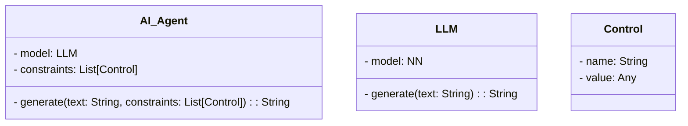
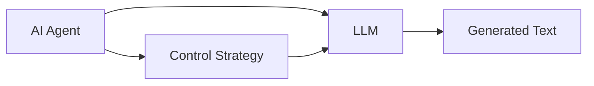

                 


# AI Agent的可控生成：精确控制LLM的输出

> 关键词：AI Agent，LLM，可控生成，强化学习，数学模型，系统架构

> 摘要：本文详细探讨了AI Agent在控制LLM输出中的应用，从核心概念、算法原理到系统架构，再到项目实战，全面解析如何精确控制大语言模型的输出，确保生成内容符合预期目标。

---

## 第一章：背景介绍

### 1.1 AI Agent的基本概念

#### 1.1.1 AI Agent的定义与分类
AI Agent（人工智能代理）是指能够感知环境并采取行动以实现特定目标的智能实体。根据功能和应用场景，AI Agent可以分为多种类型，如基于规则的代理、基于模型的代理、基于学习的代理等。

#### 1.1.2 LLM（大语言模型）的定义与特点
LLM（Large Language Model）是基于深度学习训练的自然语言处理模型，具有强大的文本生成和理解能力。其特点包括：大规模数据训练、多任务适应性、上下文理解能力等。

#### 1.1.3 AI Agent与LLM的关系
AI Agent通过调用和控制LLM的输出，实现特定任务的目标。LLM作为AI Agent的“大脑”，负责生成内容，而AI Agent则负责对生成过程进行控制和优化。

---

### 1.2 AI Agent可控生成的背景与问题背景

#### 1.2.1 当前AI Agent应用的现状
AI Agent在多个领域得到广泛应用，如智能助手、自动化写作、智能客服等。然而，生成内容的不可控性问题日益凸显，尤其是在需要精确控制输出的情况下。

#### 1.2.2 可控生成的重要性
可控生成是指通过特定策略或机制，确保生成内容符合预设的目标、约束和规范。在某些场景下，如法律文本生成、医疗建议等，可控生成至关重要。

#### 1.2.3 问题描述与解决目标
问题：如何在不损失生成能力的前提下，精确控制LLM的输出，使其满足特定任务的需求？  
解决目标：通过优化算法、调整模型结构或引入外部约束，实现对LLM生成过程的有效控制。

---

### 1.3 可控生成的边界与外延

#### 1.3.1 可控生成的边界条件
- 时间约束：生成内容的时间限制。
- 长度约束：生成文本的长度限制。
- 主题约束：生成内容的主题范围。
- 风格约束：生成文本的语气和风格。

#### 1.3.2 可控生成的外延应用
- 法律文本生成：确保符合法律规范。
- 医疗建议生成：确保准确性和安全性。
- 金融报告生成：确保数据准确和合规性。

---

### 1.4 核心概念结构与要素组成

#### 1.4.1 核心概念的结构化分析
- 输入：用户需求、上下文信息。
- 输出：经过控制的生成文本。
- 中间过程：模型生成、控制策略、反馈调整。

#### 1.4.2 核心要素的详细解析
- 用户需求：明确生成的目标和要求。
- 模型生成：LLM生成候选文本。
- 控制策略：根据需求调整生成内容。
- 反馈机制：根据结果优化策略。

---

## 第二章：AI Agent可控生成的核心原理

### 2.1 AI Agent可控生成的原理

#### 2.1.1 LLM的生成机制
LLM通过概率分布生成文本，每个词的概率由模型计算得出。生成过程可以看作是基于上下文的概率预测。

#### 2.1.2 可控生成的实现原理
通过引入外部约束（如温度参数、过滤机制）或内部策略（如强化学习），调整模型生成的概率分布，使其符合预期目标。

---

### 2.2 核心概念的属性特征对比

| 概念       | 属性               | 特征对比                     |
|------------|--------------------|-----------------------------|
| AI Agent   | 智能性             | 基于LLM的生成能力           |
| LLM        | 大规模训练         | 参数量大，训练复杂           |
| 可控生成   | 精确性             | 输出符合特定目标和约束       |

---

### 2.3 ER实体关系图架构

```mermaid
er
actor: AI Agent
model: LLM
control: 约束条件
output: 生成文本

actor -[发出指令]-> model
model -[生成文本]-> output
actor -[调整约束]-> control
control -[影响生成]-> model
```

---

## 第三章：可控生成算法的原理与实现

### 3.1 强化学习在可控生成中的应用

#### 3.1.1 强化学习的基本概念
强化学习是一种通过试错机制优化决策策略的方法。在生成任务中，可以通过奖励机制调整生成策略。

#### 3.1.2 在可控生成中的具体应用
- 通过奖励函数定义“好”的生成结果。
- 使用策略梯度方法优化生成策略。

---

### 3.2 使用Mermaid绘制的算法流程图

```mermaid
graph TD
A[开始] -> B[输入目标]
B -> C[生成候选文本]
C -> D[计算奖励]
D -> E[更新策略]
E -> F[结束]
```

---

### 3.3 算法实现的Python源代码

```python
import torch
import torch.nn as nn

class Generator(nn.Module):
    def __init__(self, ...):
        super(Generator, self).__init__()
        # 模型结构定义

    def forward(self, input):
        output = self.model(input)
        return output

# 强化学习奖励函数
def reward_function(output, target):
    # 定义奖励计算逻辑
    return reward

# 训练循环
optimizer = torch.optim.Adam(...)
for epoch in epochs:
    output = generator(input)
    reward = reward_function(output, target)
    loss = calculate_loss(output, reward)
    optimizer.zero_grad()
    loss.backward()
    optimizer.step()
```

---

## 第四章：数学模型与公式推导

### 4.1 基本数学模型

#### 4.1.1 概率分布模型
生成模型的概率分布可以用多项式分布表示：
$$ P(y|x) = \frac{e^{f(x,y)}}{\sum_{y'} e^{f(x,y')}} $$

#### 4.1.2 损失函数的定义
交叉熵损失函数：
$$ \mathcal{L} = -\sum_{y} P(y|x) \log P_{\text{pred}}(y|x) $$

---

### 4.2 公式推导

#### 4.2.1 生成概率的调整
通过引入温度参数$\tau$，调整生成概率：
$$ P_{\text{adjusted}}(y|x) = \frac{P(y|x)^{\tau}}{\sum_{y'} P(y'|x)^{\tau}} $$

#### 4.2.2 奖励函数的数学表达
基于生成文本和目标的相似度：
$$ R = \text{similarity}(y, y_{\text{target}}) $$

---

## 第五章：系统架构设计方案

### 5.1 问题场景介绍

#### 5.1.1 系统功能设计
- 文本生成模块
- 控制策略模块
- 反馈优化模块

#### 5.1.2 领域模型类图


---

### 5.2 系统架构设计

#### 5.2.1 系统架构图


---

## 第六章：项目实战

### 6.1 环境安装与配置

#### 6.1.1 安装依赖
- Python 3.8+
- PyTorch 1.9+
- transformers库

#### 6.1.2 环境配置
```bash
pip install torch transformers
```

---

### 6.2 核心实现源代码

```python
from transformers import AutoModelForCausalLM, AutoTokenizer

class ControlledGenerator:
    def __init__(self, model_name):
        self.model = AutoModelForCausalLM.from_pretrained(model_name)
        self.tokenizer = AutoTokenizer.from_pretrained(model_name)
    
    def generate(self, prompt, max_length=50, temperature=0.7):
        inputs = self.tokenizer.encode(prompt, return_tensors="pt")
        outputs = self.model.generate(inputs, max_length=max_length, temperature=temperature)
        return self.tokenizer.decode(outputs[0], skip_special_tokens=True)
```

---

## 第七章：总结与展望

### 7.1 总结

本文详细探讨了AI Agent如何精确控制LLM的输出，从理论到实践，系统地分析了实现方法和应用场景。通过强化学习、数学模型和系统架构的设计，确保生成内容符合预期目标。

---

### 7.2 展望与挑战

未来的研究方向包括更高效的控制策略、多模态生成能力以及更复杂的约束条件处理。同时，如何平衡生成的多样性和可控性仍是一个重要挑战。

---

### 7.3 最佳实践 tips

- 在实际应用中，根据具体需求选择合适的控制方法。
- 定期优化模型和控制策略，以适应新的任务需求。
- 注意模型的可解释性和透明性，确保生成过程的可控性和可追溯性。

---

## 附录

### 附录A：相关工具与库

- Hugging Face的Transformers库：https://huggingface.co/transformers
- Mermaid图表工具：https://mermaid-js.github.io/mermaid-graph-explorer/

---

### 附录B：参考文献

1. Brown, T. B., et al. "Language models at your fingertips." arXiv preprint arXiv:2005.14169 (2020).
2. Radford, A., et al. "Modeling language with deep neural networks." arXiv preprint arXiv:1801.06146 (2018).

---

以上为文章的详细大纲，根据实际需求，可以进一步扩展每个部分的具体内容。

