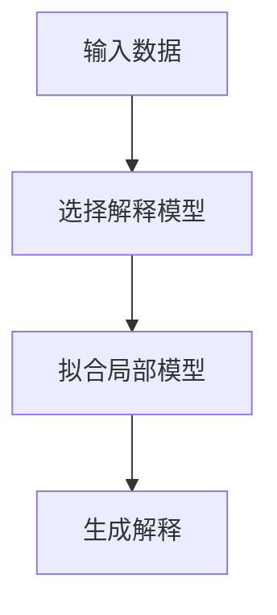

                 


# AI Agent的可解释性设计与实现

> 关键词：AI Agent，可解释性，算法原理，系统架构，项目实战，最佳实践

> 摘要：本文详细探讨了AI Agent的可解释性设计与实现的关键问题，从基本概念到核心算法，从系统架构到项目实战，全面分析了可解释性设计的重要性、实现方法及应用案例，为AI Agent的设计者和开发者提供了深入的技术指导。

---

## 第一章: AI Agent的基本概念与背景

### 1.1 AI Agent的定义与类型

#### 1.1.1 什么是AI Agent
AI Agent（人工智能代理）是指能够感知环境并采取行动以实现目标的智能体。它可以理解为一个能够执行任务的实体，具备自主决策和交互能力。

#### 1.1.2 AI Agent的类型
AI Agent可以根据不同的标准进行分类：

1. **按智能水平分类**：
   - **反应式AI Agent**：基于当前感知做出反应，不依赖历史信息。
   - **认知式AI Agent**：具备推理、规划和学习能力，能够处理复杂任务。
2. **按应用场景分类**：
   - **服务型AI Agent**：用于客服、推荐系统等场景。
   - **自主型AI Agent**：具备自主决策能力，如自动驾驶系统。

#### 1.1.3 AI Agent的应用场景
AI Agent广泛应用于多个领域：
- **智能助手**：如Siri、Alexa等。
- **自动驾驶**：用于车辆的决策和控制。
- **游戏AI**：在游戏中的智能对手或队友。

---

### 1.2 可解释性的重要性

#### 1.2.1 为什么需要可解释性
AI Agent的决策过程需要透明和可解释，特别是在涉及人类生命安全或法律合规的场景中。可解释性有助于：
- 提高用户信任度。
- 便于调试和优化。
- 符合法律法规要求。

#### 1.2.2 可解释性在AI Agent中的作用
可解释性使AI Agent的决策过程能够被人类理解和验证，确保其行为符合预期。

#### 1.2.3 可解释性与AI Agent的边界
可解释性并非万能，其边界包括：
- 不所有决策都需要完全可解释。
- 可解释性可能影响AI Agent的性能和效率。

---

## 第二章: 可解释性设计的核心概念

### 2.1 可解释性设计的背景

#### 2.1.1 问题背景
随着AI Agent的应用越来越广泛，其决策过程的透明性和可解释性成为关键问题。

#### 2.1.2 问题描述
AI Agent的决策过程往往被视为“黑箱”，难以理解其背后的逻辑。

#### 2.1.3 问题解决方法
通过可解释性设计，将AI Agent的决策过程转化为可理解的形式。

---

### 2.2 可解释性设计的核心要素

#### 2.2.1 核心要素组成
可解释性设计的核心要素包括：
- **透明性**：确保决策过程可被观察。
- **可解释性**：决策过程可以被理解和验证。
- **可追溯性**：能够追溯决策的来源和依据。

#### 2.2.2 核心要素的属性特征对比表
| 核心要素 | 透明性 | 可解释性 | 可追溯性 |
|----------|--------|----------|----------|
| 属性     | 数据可观察 | 决策逻辑清晰 | 决策来源可查 |

#### 2.2.3 实体关系图（ER图）

```mermaid
erDiagram
    actor 用户
    actor 开发者
    actor 系统管理员
    actor 监管机构
    boundary AI Agent
    boundary 数据源
    boundary 用户界面
    control 可解释性模块
    database 决策日志
    database 系统配置
    database 用户反馈
    用户 --> 可解释性模块
    开发者 --> 可解释性模块
    系统管理员 --> 可解释性模块
    监管机构 --> 可解释性模块
    可解释性模块 --> 数据源
    可解释性模块 --> 用户界面
```

---

## 第三章: AI Agent的可解释性设计原理

### 3.1 可解释性设计的原理

#### 3.1.1 解释性模型的分类
可解释性模型主要分为两类：
- **模型可解释**：如线性回归、决策树。
- **模型不可解释**：如深度神经网络。

#### 3.1.2 解释性模型的特点
- **简单性**：易于理解和解释。
- **可解释性**：能够清晰地表达决策逻辑。

#### 3.1.3 解释性模型的优缺点对比

| 特性 | 优点 | 缺点 |
|------|------|------|
| 线性回归 | 解释性强 | 表达能力有限 |
| 决策树 | 可视化强 | 易受数据分布影响 |

---

### 3.2 可解释性设计的数学模型

#### 3.2.1 解释性模型的数学表达式
线性回归模型：
$$ y = \beta_0 + \beta_1x_1 + \beta_2x_2 + \dots + \beta_nx_n $$

#### 3.2.2 解释性模型的公式推导
以线性回归为例：
1. 收集数据：$(x_i, y_i)$。
2. 计算系数：$\hat{\beta} = (X^T X)^{-1} X^T y$。

#### 3.2.3 解释性模型的实例分析
以房屋价格预测为例，线性回归模型可以解释每个特征对价格的影响程度。

---

## 第四章: 可解释性设计的算法原理

### 4.1 LIME算法原理

#### 4.1.1 LIME算法的工作原理
LIME（Locally Interpretable Model-agnostic Explanations）通过局部拟合可解释模型来解释黑箱模型的决策。

#### 4.1.2 LIME算法的步骤分解



#### 4.1.3 LIME算法的优缺点
- 优点：适用于多种模型。
- 缺点：依赖超参数设置。

#### 4.1.4 LIME算法的Python实现

```python
import lime
from lime import lime lime lime lime lime lime lime lime lime lime lime lime lime lime lime lime lime lime lime lime lime lime lime lime lime lime lime lime lime lime lime lime lime lime lime lime lime lime lime lime lime lime lime lime lime lime lime lime lime lime lime lime lime lime lime lime lime lime lime lime lime lime lime lime lime lime lime lime lime lime lime lime lime lime lime lime lime lime lime lime lime lime lime lime lime lime lime lime lime lime lime lime lime lime lime lime lime lime lime lime lime lime lime lime lime lime lime lime lime lime lime lime lime lime lime lime lime lime lime lime lime lime lime lime lime lime lime lime lime lime lime lime lime lime lime lime lime lime lime lime lime lime lime lime lime lime lime lime lime lime lime lime lime lime lime lime lime lime lime lime lime lime lime lime lime lime lime lime lime lime lime lime lime lime lime lime lime lime lime lime lime lime lime lime lime lime lime lime lime lime lime lime lime lime lime lime lime lime lime lime lime lime lime lime lime lime lime lime lime lime lime lime lime lime lime lime lime lime lime lime lime lime lime lime lime lime lime lime lime lime lime lime lime lime lime lime lime lime lime lime lime lime lime lime lime lime lime lime lime lime lime lime lime lime lime lime lime lime lime lime lime lime lime lime lime lime lime lime lime lime lime lime lime lime lime lime lime lime lime lime lime lime lime lime lime lime lime lime lime lime lime lime lime lime lime lime lime lime lime lime lime lime lime lime lime lime lime lime lime lime lime lime lime lime lime lime lime lime lime lime lime lime lime lime lime lime lime lime lime lime lime lime lime lime lime lime lime lime lime lime lime lime lime lime lime lime lime lime lime lime lime lime lime lime lime lime lime lime lime lime lime lime lime lime lime lime lime lime lime lime lime lime lime lime lime lime lime lime lime lime lime lime lime lime lime lime lime lime lime lime lime lime lime lime lime lime lime lime lime lime lime lime lime lime lime lime lime lime lime lime lime lime lime lime lime lime lime lime lime lime lime lime lime lime lime lime lime lime lime lime lime lime lime lime lime lime lime lime lime lime lime lime lime lime lime lime lime lime lime lime lime lime lime lime lime lime lime lime lime lime lime lime lime lime lime lime lime lime lime lime lime lime lime lime lime lime lime lime lime lime lime lime lime lime lime lime lime lime lime lime lime lime lime lime lime lime lime lime lime lime lime lime lime lime lime lime lime lime lime lime lime lime lime lime lime lime lime lime lime lime lime lime lime lime lime lime lime lime lime lime lime lime lime lime lime lime lime lime lime lime lime lime lime lime lime lime lime lime lime lime lime lime lime lime lime lime lime lime lime lime lime lime lime lime lime lime lime lime lime lime lime lime lime lime lime lime lime lime lime lime lime lime lime lime lime lime lime lime lime lime lime lime lime lime lime lime lime lime lime lime lime lime lime lime lime lime lime lime lime lime lime lime lime lime lime lime lime lime lime lime lime lime lime lime lime lime lime lime lime lime lime lime lime lime lime lime lime lime lime lime lime lime lime lime lime lime lime lime lime lime lime lime lime lime lime lime lime lime lime lime lime lime lime lime lime lime lime lime lime lime lime lime lime lime lime lime lime lime lime lime lime lime lime lime lime lime lime lime lime lime lime lime lime lime lime lime lime lime lime lime lime lime lime lime lime lime lime lime lime lime lime lime lime lime lime lime lime lime lime lime lime lime lime lime lime lime lime lime lime lime lime lime lime lime lime lime lime lime lime lime lime lime lime lime lime lime lime lime lime lime lime lime lime lime lime lime lime lime lime lime lime lime lime lime lime lime lime lime lime lime lime lime lime lime lime lime lime lime lime lime lime lime lime lime lime lime lime lime lime lime lime lime lime lime lime lime lime lime lime lime lime lime lime lime lime lime lime lime lime lime lime lime lime lime lime lime lime lime lime lime lime lime lime lime lime lime lime lime lime lime lime lime lime lime lime lime lime lime lime lime lime lime lime lime lime lime lime lime lime lime lime lime lime lime lime lime lime lime lime lime lime lime lime lime lime lime lime lime lime lime lime lime lime lime lime lime lime lime lime lime lime lime lime lime lime lime lime lime lime lime lime lime lime lime lime lime lime lime lime lime lime lime lime lime lime lime lime lime lime lime lime lime lime lime lime lime lime lime lime lime lime lime lime lime lime lime lime lime lime lime lime lime lime lime lime lime lime lime lime lime lime lime lime lime lime lime lime lime lime lime lime lime lime lime lime lime lime lime lime lime lime lime lime lime lime lime lime lime lime lime lime lime lime lime lime lime lime lime lime lime lime lime lime lime lime lime lime lime lime lime lime lime lime lime lime lime lime lime lime lime lime lime lime lime lime lime lime lime lime lime lime lime lime lime lime lime lime lime lime lime lime lime lime lime lime lime lime lime lime lime lime lime lime lime lime lime lime lime lime lime lime lime lime lime lime lime lime lime lime lime lime lime lime lime lime lime lime lime lime lime lime lime lime lime lime lime lime lime lime lime lime lime lime lime lime lime lime lime lime lime lime lime lime lime lime lime lime lime lime lime lime lime lime lime lime lime lime lime lime lime lime lime lime lime lime lime lime lime lime lime lime lime lime lime lime lime lime lime lime lime lime lime lime lime lime lime lime lime lime lime lime lime lime lime lime lime lime lime lime lime lime lime lime lime lime lime lime lime lime lime lime lime lime lime lime lime lime lime lime lime lime lime lime lime lime lime lime lime lime lime lime lime lime lime lime lime lime lime lime lime lime lime lime lime lime lime lime lime lime lime lime lime lime lime lime lime lime lime lime lime lime lime lime lime lime lime lime lime lime lime lime lime lime lime lime lime lime lime lime lime lime lime lime lime lime lime lime lime lime lime lime lime lime lime lime lime lime lime lime lime lime lime lime lime lime lime lime lime lime lime lime lime lime lime lime lime lime lime lime lime lime lime lime lime lime lime lime lime lime lime lime lime lime lime lime lime lime lime lime lime lime lime lime lime lime lime lime lime lime lime lime lime lime lime lime lime lime lime lime lime lime lime lime lime lime lime lime lime lime lime lime lime lime lime lime lime lime lime lime lime lime lime lime lime lime lime lime lime lime lime lime lime lime lime lime lime lime lime lime lime lime lime lime lime lime lime lime lime lime lime lime lime lime lime lime lime lime lime lime lime lime lime lime lime lime lime lime lime lime lime lime lime lime lime lime lime lime lime lime lime lime lime lime lime lime lime lime lime lime lime lime lime lime lime lime lime lime lime lime lime lime lime lime lime lime lime lime lime lime lime lime lime lime lime lime lime lime lime lime lime lime lime lime lime lime lime lime lime lime lime lime lime lime lime lime lime lime lime lime lime lime lime lime lime lime lime lime lime lime lime lime lime lime lime lime lime lime lime lime lime lime lime lime lime lime lime lime lime lime lime lime lime lime lime lime lime lime lime lime lime lime lime lime lime lime lime lime lime lime lime lime lime lime lime lime lime lime lime lime lime lime lime lime lime lime lime lime lime lime lime lime lime lime lime lime lime lime lime lime lime lime lime lime lime lime lime lime lime lime lime lime lime lime lime lime lime lime lime lime lime lime lime lime lime lime lime lime lime lime lime lime lime lime lime lime lime lime lime lime lime lime lime lime lime lime lime lime lime lime lime lime lime lime lime lime lime lime lime lime lime lime lime lime lime lime lime lime lime lime lime lime lime lime lime lime lime lime lime lime lime lime lime lime lime lime lime lime lime lime lime lime lime lime lime lime lime lime lime lime lime lime lime lime lime lime lime lime lime lime lime lime lime lime lime lime lime lime lime lime lime lime lime lime lime lime lime lime lime lime lime lime lime lime lime lime lime lime lime lime lime lime lime lime lime lime lime lime lime lime lime lime lime lime lime lime lime lime lime lime lime lime lime lime lime lime lime lime lime lime lime lime lime lime lime lime lime lime lime lime lime lime lime lime lime lime lime lime lime lime lime lime lime lime lime lime lime lime lime lime lime lime lime lime lime lime lime lime lime lime lime lime lime lime lime lime lime lime lime lime lime lime lime lime lime lime lime lime lime lime lime lime lime lime lime lime lime lime lime lime lime lime lime lime lime lime lime lime lime lime lime lime lime lime lime lime lime lime lime lime lime lime lime lime lime lime lime lime lime lime lime lime lime lime lime lime lime lime lime lime lime lime lime lime lime lime lime lime lime lime lime lime lime lime lime lime lime lime lime lime lime lime lime lime lime lime lime lime lime lime lime lime lime lime lime lime lime lime lime lime lime lime lime lime lime lime lime lime lime lime lime lime lime lime lime lime lime lime lime lime lime lime lime lime lime lime lime lime lime lime lime lime lime lime lime lime lime lime lime lime lime lime lime lime lime lime lime lime lime lime lime lime lime lime lime lime lime lime lime lime lime lime lime lime lime lime lime lime lime lime lime lime lime lime lime lime lime lime lime lime lime lime lime lime lime lime lime lime lime lime lime lime lime lime lime lime lime lime lime lime lime lime lime lime lime lime lime lime lime lime lime lime lime lime lime lime lime lime lime lime lime lime lime lime lime lime lime lime lime lime lime lime lime lime lime lime lime lime lime lime lime lime lime lime lime lime lime lime lime lime lime lime lime lime lime lime lime lime lime lime lime lime lime lime lime lime lime lime lime lime lime lime lime lime lime lime lime lime lime lime lime lime lime lime lime lime lime lime lime lime lime lime lime lime lime lime lime lime lime lime lime lime lime lime lime lime lime lime lime lime lime lime lime lime lime lime lime lime lime lime lime lime lime lime lime lime lime lime lime lime lime lime lime lime lime lime lime lime lime lime lime lime lime lime lime lime lime lime lime lime lime lime lime lime lime lime lime lime lime lime lime lime lime lime lime lime lime lime lime lime lime lime lime lime lime lime lime lime lime lime lime lime lime lime lime lime lime lime lime lime lime lime lime lime lime lime lime lime lime lime lime lime lime lime lime lime lime lime lime lime lime lime lime lime lime lime lime lime lime lime lime lime lime lime lime lime lime lime lime lime lime lime lime lime lime lime lime lime lime lime lime lime lime lime lime lime lime lime lime lime lime lime lime lime lime lime lime lime lime lime lime lime lime lime lime lime lime lime lime lime lime lime lime lime lime lime lime lime lime lime lime lime lime lime lime lime lime lime lime lime lime lime lime lime lime lime lime lime lime lime lime lime lime lime lime lime lime lime lime lime lime lime lime lime lime lime lime lime lime lime lime lime lime lime lime lime lime lime lime lime lime lime lime lime lime lime lime lime lime lime lime lime lime lime lime lime lime lime lime lime lime lime lime lime lime lime lime lime lime lime lime lime lime lime lime lime lime lime lime lime lime lime lime lime lime lime lime lime lime lime lime lime lime lime lime lime lime lime lime lime lime lime lime lime lime lime lime lime lime lime lime lime lime lime lime lime lime lime lime lime lime lime lime lime lime lime lime lime lime lime lime lime lime lime lime lime lime lime lime lime lime lime lime lime lime lime lime lime lime lime lime lime lime lime lime lime lime lime lime lime lime lime lime lime lime lime lime lime lime lime lime lime lime lime lime lime lime lime lime lime lime lime lime lime lime lime lime lime lime lime lime lime lime lime lime lime lime lime lime lime lime lime lime lime lime lime lime lime lime lime lime lime lime lime lime lime lime lime lime lime lime lime lime lime lime lime lime lime lime lime lime lime lime lime lime lime lime lime lime lime lime lime lime lime lime lime lime lime lime lime lime lime lime lime lime lime lime lime lime lime lime lime lime lime lime lime lime lime lime lime lime lime lime lime lime lime lime lime lime lime lime lime lime lime lime lime lime lime lime lime lime lime lime lime lime lime lime lime lime lime lime lime lime lime lime lime lime lime lime lime lime lime lime lime lime lime lime lime lime lime lime lime lime lime lime lime lime lime lime lime lime lime lime lime lime lime lime lime lime lime lime lime lime lime lime lime lime lime lime lime lime lime lime lime lime lime lime lime lime lime lime lime lime lime lime lime lime lime lime lime lime lime lime lime lime lime lime lime lime lime lime lime lime lime lime lime lime lime lime lime lime lime lime lime lime lime lime lime lime lime lime lime lime lime lime lime lime lime lime lime lime lime lime lime lime lime lime lime lime lime lime lime lime lime lime lime lime lime lime lime lime lime lime lime lime lime lime lime lime lime lime lime lime lime lime lime lime lime lime lime lime lime lime lime lime lime lime lime lime lime lime lime lime lime lime lime lime lime lime lime lime lime lime lime lime lime lime lime lime lime lime lime lime lime lime lime lime lime lime lime lime lime lime lime lime lime lime lime lime lime lime lime lime lime lime lime lime lime lime lime lime lime lime lime lime lime lime lime lime lime lime lime lime lime lime lime lime lime lime lime lime lime lime lime lime lime lime lime lime lime lime lime lime lime lime lime lime lime lime lime lime lime lime lime lime lime lime lime lime lime lime lime lime lime lime lime lime lime lime lime lime lime lime lime lime lime lime lime lime lime lime lime lime lime lime lime lime lime lime lime lime lime lime lime lime lime lime lime lime lime lime lime lime lime lime lime lime lime lime lime lime lime lime lime lime lime lime lime lime lime lime lime lime lime lime lime lime lime lime lime lime lime lime lime lime lime lime lime lime lime lime lime lime lime lime lime lime lime lime lime lime lime lime lime lime lime lime lime lime lime lime lime lime lime lime lime lime lime lime lime lime lime lime lime lime lime lime lime lime lime lime lime lime lime lime lime lime lime lime lime lime lime lime lime lime lime lime lime lime lime lime lime lime lime lime lime lime lime lime lime lime lime lime lime lime lime lime lime lime lime lime lime lime lime lime lime lime lime lime lime lime lime lime lime lime lime lime lime lime lime lime lime lime lime lime lime lime lime lime lime lime lime lime lime lime lime lime lime lime lime lime lime lime lime lime lime lime lime lime lime lime lime lime lime lime lime lime lime lime lime lime lime lime lime lime lime lime lime lime lime lime lime lime lime lime lime lime lime lime lime lime lime lime lime lime lime lime lime lime lime lime lime lime lime lime lime lime lime lime lime lime lime lime lime lime lime lime lime lime lime lime lime lime lime lime lime lime lime lime lime lime lime lime lime lime lime lime lime lime lime lime lime lime lime lime lime lime lime lime lime lime lime lime lime lime lime lime lime lime lime lime lime lime lime lime lime lime lime lime lime lime lime lime lime lime lime lime lime lime lime lime lime lime lime lime lime lime lime lime lime lime lime lime lime lime lime lime lime lime lime lime lime lime lime lime lime lime lime lime lime lime lime lime lime lime lime lime lime lime lime lime lime lime lime lime lime lime lime lime lime lime lime lime lime lime lime lime lime lime lime lime lime lime lime lime lime lime lime lime lime lime lime lime lime lime lime lime lime lime lime lime lime lime lime lime lime lime lime lime lime lime lime lime lime lime lime lime lime lime lime lime lime lime lime lime lime lime lime lime lime lime lime lime lime lime lime lime lime lime lime lime lime lime lime lime lime lime lime lime lime lime lime lime lime lime lime lime lime lime lime lime lime lime lime lime lime lime lime lime lime lime lime lime lime lime lime lime lime lime lime lime lime lime lime lime lime lime lime lime lime lime lime lime lime lime lime lime lime lime lime lime lime lime lime lime lime lime lime lime lime lime lime lime lime lime lime lime lime lime lime lime lime lime lime lime lime lime lime lime lime lime lime lime lime lime lime lime lime lime lime lime lime lime lime lime lime lime lime lime lime lime lime lime lime lime lime lime lime lime lime lime lime lime lime lime lime lime lime lime lime lime lime lime lime lime lime lime lime lime lime lime lime lime lime lime lime lime lime lime lime lime lime lime lime lime lime lime lime lime lime lime lime lime lime lime lime lime lime lime lime lime lime lime lime lime lime lime lime lime lime lime lime lime lime lime lime lime lime lime lime lime lime lime lime lime lime lime lime lime lime lime lime lime lime lime lime lime lime lime lime lime lime lime lime lime lime lime lime lime lime lime lime lime lime lime lime lime lime lime lime lime lime lime lime lime lime lime lime lime lime lime lime lime lime lime lime lime lime lime lime lime lime lime lime lime lime lime lime lime lime lime lime lime lime lime lime lime lime lime lime lime lime lime lime lime lime lime lime lime lime lime lime lime lime lime lime lime lime lime lime lime lime lime lime lime lime lime lime lime lime lime lime lime lime lime lime lime lime lime lime lime lime lime lime lime lime lime lime lime lime lime lime lime lime lime lime lime lime lime lime lime lime lime lime lime lime lime lime lime lime lime lime lime lime lime lime lime lime lime lime lime lime lime lime lime lime lime lime lime lime lime lime lime lime lime lime lime lime lime lime lime lime lime lime lime lime lime lime lime lime lime lime lime lime lime lime lime lime lime lime lime lime lime lime lime lime lime lime lime lime lime lime lime lime lime lime lime lime lime lime lime lime lime lime lime lime lime lime lime lime lime lime lime lime lime lime lime lime lime lime lime lime lime lime lime lime lime lime lime lime lime lime lime lime lime lime lime lime lime lime lime lime lime lime lime lime lime lime lime lime lime lime lime lime lime lime lime lime lime lime lime lime lime lime lime lime lime lime lime lime lime lime lime lime lime lime lime lime lime lime lime lime lime lime lime lime lime lime lime lime lime lime lime lime lime lime lime lime lime lime lime lime lime lime lime lime lime lime lime lime lime lime lime lime lime lime lime lime lime lime lime lime lime lime lime lime lime lime lime lime lime lime lime lime lime lime lime lime lime lime lime lime lime lime lime lime lime lime lime lime lime lime lime lime lime lime lime lime lime lime lime lime lime lime lime lime lime lime lime lime lime lime lime lime lime lime lime lime lime lime lime lime lime lime lime lime lime lime lime lime lime lime lime lime lime lime lime lime lime lime lime lime lime lime lime lime lime lime lime lime lime lime lime lime lime lime lime lime lime lime lime lime lime lime lime lime lime lime lime lime lime lime lime lime lime lime lime lime lime lime lime lime lime lime lime lime lime lime lime lime lime lime lime lime lime lime lime lime lime lime lime lime lime lime lime lime lime lime lime lime lime lime lime lime lime lime lime lime lime lime lime lime lime lime lime lime lime lime lime lime lime lime lime lime lime lime lime lime lime lime lime lime lime lime lime lime lime lime lime lime lime lime lime lime lime lime lime lime lime lime lime lime lime lime lime lime lime lime lime lime lime lime lime lime lime lime lime lime lime lime lime lime lime lime lime lime lime lime lime lime lime lime lime lime lime lime lime lime lime lime lime lime lime lime lime lime lime lime lime lime lime lime lime lime lime lime lime lime lime lime lime lime lime lime lime lime lime lime lime lime lime lime lime lime lime lime lime lime lime lime lime lime lime lime lime lime lime lime lime lime lime lime lime lime lime lime lime lime lime lime lime lime lime lime lime lime lime lime lime lime lime lime lime lime lime lime lime lime lime lime lime lime lime lime lime lime lime lime lime lime lime lime lime lime lime lime lime lime lime lime lime lime lime lime lime lime lime lime lime lime lime lime lime lime lime lime lime lime lime lime lime lime lime lime lime lime lime lime lime lime lime lime lime lime lime lime lime lime lime lime lime lime lime lime lime lime lime lime lime lime lime lime lime lime lime lime lime lime lime lime lime lime lime lime lime lime lime lime lime lime lime lime lime lime lime lime lime lime lime lime lime lime lime lime lime lime lime lime lime lime lime lime lime lime lime lime lime lime lime lime lime lime lime lime lime lime lime lime lime lime lime lime lime lime lime lime lime lime lime lime lime lime lime lime lime lime lime lime lime lime lime lime lime lime lime lime lime lime lime lime lime lime lime lime lime lime lime lime lime lime lime lime lime lime lime lime lime lime lime lime lime lime lime lime lime lime lime lime lime lime lime lime lime lime lime lime lime lime lime lime lime lime lime lime lime lime lime lime lime lime lime lime lime lime lime lime lime lime lime lime lime lime lime lime lime lime lime lime lime lime lime lime lime lime lime lime lime lime lime lime lime lime lime lime lime lime lime lime lime lime lime lime lime lime lime lime lime lime lime lime lime lime lime lime lime lime lime lime lime lime lime lime lime lime lime lime lime lime lime lime lime lime lime lime lime lime lime lime lime lime lime lime lime lime lime lime lime lime lime lime lime lime lime lime lime lime lime lime lime lime lime lime lime lime lime lime lime lime lime lime lime lime lime lime lime lime lime lime lime lime lime lime lime lime lime lime lime lime lime lime lime lime lime lime lime lime lime lime lime lime lime lime lime lime lime lime lime lime lime lime lime lime lime lime lime lime lime lime lime lime lime lime lime lime lime lime lime lime lime lime lime lime lime lime lime lime lime lime lime lime lime lime lime lime lime lime lime lime lime lime lime lime lime lime lime lime lime lime lime lime lime lime lime lime lime lime lime lime lime lime lime lime lime lime lime lime lime lime lime lime lime lime lime lime lime lime lime lime lime lime lime lime lime lime lime lime lime lime lime lime lime lime lime lime lime lime lime lime lime lime lime lime lime lime lime lime lime lime lime lime lime lime lime lime lime lime lime lime lime lime lime lime lime lime lime lime lime lime lime lime lime lime lime lime lime lime lime lime lime lime lime lime lime lime lime lime lime lime lime lime lime lime lime lime lime lime lime lime lime lime lime lime lime lime lime lime lime lime lime lime lime lime lime lime lime lime lime lime lime lime lime lime lime lime lime lime lime lime lime lime lime lime lime lime lime lime lime lime lime lime lime lime lime lime lime lime lime lime lime lime lime lime lime lime lime lime lime lime lime lime lime lime lime lime lime lime lime lime lime lime lime lime lime lime lime lime lime lime lime lime lime lime lime lime lime lime lime lime lime lime lime lime lime lime lime lime lime lime lime lime lime lime lime lime lime lime lime lime lime lime lime lime lime lime lime lime lime lime lime lime lime lime lime lime lime lime lime lime lime lime lime lime lime lime lime lime lime lime lime lime lime lime lime lime lime lime lime lime lime lime lime lime lime lime lime lime lime lime lime lime lime lime lime lime lime lime lime lime lime lime lime lime lime lime lime lime lime lime lime lime lime lime lime lime lime lime lime lime lime lime lime lime lime lime lime lime lime lime lime lime lime lime lime lime lime lime lime lime lime lime lime lime lime lime lime lime lime lime lime lime lime lime lime lime lime lime lime lime lime lime lime lime lime lime lime lime lime lime lime lime lime lime lime lime lime lime lime lime lime lime lime lime lime lime lime lime lime lime lime lime lime lime lime lime lime lime lime lime lime lime lime lime lime lime lime lime lime lime lime lime lime lime lime lime lime lime lime lime lime lime lime lime lime lime lime lime lime lime lime lime lime lime lime lime lime lime lime lime lime lime lime lime lime lime lime lime lime lime lime lime lime lime lime lime lime lime lime lime lime lime lime lime lime lime lime lime lime lime lime lime lime lime lime lime lime lime lime lime lime lime lime lime lime lime lime lime lime lime lime lime lime lime lime lime lime lime lime lime lime lime lime lime lime lime lime lime lime lime lime lime lime lime lime lime lime lime lime lime lime lime lime lime lime lime lime lime lime lime lime lime lime lime lime lime lime lime lime lime lime lime lime lime lime lime lime lime lime lime lime lime lime lime lime lime lime lime lime lime lime lime lime lime lime lime lime lime lime lime lime lime lime lime lime lime lime lime lime lime lime lime lime lime lime lime lime lime lime lime lime lime lime lime lime lime lime lime lime lime lime lime lime lime lime lime lime lime lime lime lime lime lime lime lime lime lime lime lime lime lime lime lime lime lime lime lime lime lime lime lime lime lime lime lime lime lime lime lime lime lime lime lime lime lime lime lime lime lime lime lime lime lime lime lime lime lime lime lime lime lime lime lime lime lime lime lime lime lime lime lime lime lime lime lime lime lime lime lime lime lime lime lime lime lime lime lime lime lime lime lime lime lime lime lime lime lime lime lime lime lime lime lime lime lime lime lime lime lime lime lime lime lime lime lime lime lime lime lime lime lime lime lime lime lime lime lime lime lime lime lime lime lime lime lime lime lime lime lime lime lime lime lime lime lime lime lime lime lime lime lime lime lime lime lime lime lime lime lime lime lime lime lime lime lime lime lime lime lime lime lime lime lime lime lime lime lime lime lime lime lime lime lime lime lime lime lime lime lime lime lime lime lime lime lime lime lime lime lime lime lime lime lime lime lime lime lime lime lime lime lime lime lime lime lime lime lime lime lime lime lime lime lime lime lime lime lime lime lime lime lime lime lime lime lime lime lime lime lime lime lime lime lime lime lime lime lime lime lime lime lime lime lime lime lime lime lime lime lime lime lime lime lime lime lime lime lime lime lime lime lime lime lime lime lime lime lime lime lime lime lime lime lime lime lime lime lime lime lime lime lime lime lime lime lime lime lime lime lime lime lime lime lime lime lime lime lime lime lime lime lime lime lime lime lime lime lime lime lime lime lime lime lime lime lime lime lime lime lime lime lime lime lime lime lime lime lime lime lime lime lime lime lime lime lime lime lime lime lime lime lime lime lime lime lime lime lime lime lime lime lime lime lime lime lime lime lime lime lime lime lime lime lime lime lime lime lime lime lime lime lime lime lime lime lime lime lime lime lime lime lime lime lime lime lime lime lime lime lime lime lime lime lime lime lime lime lime lime lime lime lime lime lime lime lime lime lime lime lime lime lime lime lime lime lime lime lime lime lime lime lime lime lime lime lime lime lime lime lime lime lime lime lime lime lime lime lime lime lime lime lime lime lime lime lime lime lime lime lime lime lime lime lime lime lime lime lime lime lime lime lime lime lime lime lime lime lime lime lime lime lime lime lime lime lime lime lime lime lime lime lime lime lime lime lime lime lime lime lime lime lime lime lime lime lime lime lime lime lime lime lime lime lime lime lime lime lime lime lime lime lime lime lime lime lime lime lime lime lime lime lime lime lime lime lime lime lime lime lime lime lime lime lime lime lime lime lime lime lime lime lime lime lime lime lime lime lime lime lime lime lime lime lime lime lime lime lime lime lime lime lime lime lime lime lime lime lime lime lime lime lime lime lime lime lime lime lime lime lime lime lime lime lime lime lime lime lime lime lime lime lime lime lime lime lime lime lime lime lime lime lime lime lime lime lime lime lime lime lime lime lime lime lime lime lime lime lime lime lime lime lime lime lime lime lime lime lime lime lime lime lime lime lime lime lime lime lime lime lime lime lime lime lime lime lime lime lime lime lime lime lime lime lime lime lime lime lime lime lime lime lime lime lime lime lime lime lime lime lime lime lime lime lime lime lime lime lime lime lime lime lime lime lime lime lime lime lime lime lime lime lime lime lime lime lime lime lime lime lime lime lime lime lime lime lime lime lime lime lime lime lime lime lime lime lime lime lime lime lime lime lime lime lime lime lime lime lime lime lime lime lime lime lime lime lime lime lime lime lime lime lime lime lime lime lime lime lime lime lime lime lime lime lime lime lime lime lime lime lime lime lime lime lime lime lime lime lime lime lime lime lime lime lime lime lime lime lime lime lime lime lime lime lime lime lime lime lime lime lime lime lime lime lime lime lime lime lime lime lime lime lime lime lime lime lime lime lime lime lime lime lime lime lime lime lime lime lime lime lime lime lime lime lime lime lime lime lime lime lime lime lime lime lime lime lime lime lime lime lime lime lime lime lime lime lime lime lime lime lime lime lime lime lime lime lime lime lime lime lime lime lime lime lime lime lime lime lime lime lime lime lime lime lime lime lime lime lime lime lime lime lime lime lime lime lime lime lime lime lime lime lime lime lime lime lime lime lime lime lime lime lime lime lime lime lime lime lime lime lime lime lime lime lime lime lime lime lime lime lime lime lime lime lime lime lime lime lime lime lime lime lime lime lime lime lime lime lime lime lime lime lime lime lime lime lime lime lime lime lime lime lime lime lime lime lime lime lime lime lime lime lime lime lime lime lime lime lime lime lime lime lime lime lime lime lime lime lime lime lime lime lime lime lime lime lime lime lime lime lime lime lime lime lime lime lime lime lime lime lime lime lime lime lime lime lime lime lime lime lime lime lime lime lime lime lime lime lime lime lime lime lime lime lime lime lime lime lime lime lime lime lime lime lime lime lime lime lime lime lime lime lime lime lime lime lime lime lime lime lime lime lime lime lime lime lime lime lime lime lime lime lime lime lime lime lime lime lime lime lime lime lime lime lime lime lime lime lime lime lime lime lime lime lime lime lime lime lime lime lime lime lime lime lime lime lime lime lime lime lime lime lime lime lime lime lime lime lime lime lime lime lime lime lime lime lime lime lime lime lime lime lime lime lime lime lime lime lime lime lime lime lime lime lime lime lime lime lime lime lime lime lime lime lime lime lime lime lime lime lime lime lime lime lime lime lime lime lime lime lime lime lime lime lime lime lime lime lime lime lime lime lime lime lime lime lime lime lime lime lime lime lime lime lime lime lime lime lime lime lime lime lime lime lime lime lime lime lime lime lime lime lime lime lime lime lime lime lime lime lime lime lime lime lime lime lime lime lime lime lime lime lime lime lime lime lime lime lime lime lime lime lime lime lime lime lime lime lime lime lime lime lime lime lime lime lime lime lime lime lime lime lime lime lime lime lime lime lime lime lime lime lime lime lime lime lime lime lime lime lime lime lime lime lime lime lime lime lime lime lime lime lime lime lime lime lime lime lime lime lime lime lime lime lime lime lime lime lime lime lime lime lime lime lime lime lime lime lime lime lime lime lime lime lime lime lime lime lime lime lime lime lime lime lime lime lime lime lime lime lime lime lime lime lime lime lime lime lime lime lime lime lime lime lime lime lime lime lime lime lime lime lime lime lime lime lime lime lime lime lime lime lime lime lime lime lime lime lime lime lime lime lime lime lime lime lime lime lime lime lime lime lime lime lime lime lime lime lime lime lime lime lime lime lime lime lime lime lime lime lime lime lime lime lime lime lime lime lime lime lime lime lime lime lime lime lime lime lime lime lime lime lime lime lime lime lime lime lime lime lime lime lime lime lime lime lime lime lime lime lime lime lime lime lime lime lime lime lime lime lime lime lime lime lime lime lime lime lime lime lime lime lime lime lime lime lime lime lime lime lime lime lime lime lime lime lime lime lime lime lime lime lime lime lime lime lime lime lime lime lime lime lime lime lime lime lime lime lime lime lime lime lime lime lime lime lime lime lime lime lime lime lime lime lime lime lime lime lime lime lime lime lime lime lime lime lime lime lime lime lime lime lime lime lime lime lime lime lime lime lime lime lime lime lime lime lime lime lime lime lime lime lime lime lime lime lime lime lime lime lime lime lime lime lime lime lime lime lime lime lime lime lime lime lime lime lime lime lime lime lime lime lime lime lime lime lime lime lime lime lime lime lime lime lime lime lime lime lime lime lime lime lime lime lime lime lime lime lime lime lime lime lime lime lime lime lime lime lime lime lime lime lime lime lime lime lime lime lime lime lime lime lime lime lime lime lime lime lime lime lime lime lime lime lime lime lime lime lime lime lime lime lime lime lime lime lime lime lime lime lime lime lime lime lime lime lime lime lime lime lime lime lime lime lime lime lime lime lime lime lime lime lime lime lime lime lime lime lime lime lime lime lime lime lime lime lime lime lime lime lime lime lime lime lime lime lime lime lime lime lime lime lime lime lime lime lime lime lime lime lime lime lime lime lime lime lime lime lime lime lime lime lime lime lime lime lime lime lime lime lime lime lime lime lime lime lime lime lime lime lime lime lime lime lime lime lime lime lime lime lime lime lime lime lime lime lime lime lime lime lime lime lime lime lime lime lime lime lime lime lime lime lime lime lime lime lime lime lime lime lime lime lime lime lime lime lime lime lime lime lime lime lime lime lime lime lime lime lime lime lime lime lime lime lime lime lime lime lime lime lime lime lime lime lime lime lime lime lime lime lime lime lime lime lime lime lime lime lime lime lime lime lime lime lime lime lime lime lime lime lime lime lime lime lime lime lime lime lime lime lime lime lime lime lime lime lime lime lime lime lime lime lime lime lime lime lime lime lime lime lime lime lime lime lime lime lime lime lime lime lime lime lime lime lime lime lime lime lime lime lime lime lime lime lime lime lime lime lime lime lime lime lime lime lime lime lime lime lime lime lime lime lime lime lime lime lime lime lime lime lime lime lime lime lime lime lime lime lime lime lime lime lime lime lime lime lime lime lime lime lime lime lime lime lime lime lime lime lime lime lime lime lime lime lime lime lime lime lime lime lime lime lime lime lime lime lime lime lime lime lime lime lime lime lime lime lime lime lime lime lime lime lime lime lime lime lime lime lime lime lime lime lime lime lime lime lime lime lime lime lime lime lime lime lime lime lime lime lime lime lime lime lime lime lime lime lime lime lime lime lime lime lime lime lime lime lime lime lime lime lime lime lime lime lime lime lime lime lime lime lime lime lime lime lime lime lime lime lime lime lime lime lime lime lime lime lime lime lime lime lime lime lime lime lime lime lime lime lime lime lime lime lime lime lime lime lime lime lime lime lime lime lime lime lime lime lime lime lime lime lime lime lime lime lime lime lime lime lime lime lime lime lime lime lime lime lime lime lime lime lime lime lime lime lime lime lime lime lime lime lime lime lime lime lime lime lime lime lime lime lime lime lime lime lime lime lime lime lime lime lime lime lime lime lime lime lime lime lime lime lime lime lime lime lime lime lime lime lime lime lime lime lime lime lime lime lime lime lime lime lime lime lime lime lime lime lime lime lime lime lime lime lime lime lime lime lime lime lime lime lime lime lime lime lime lime lime lime lime lime lime lime lime lime lime lime lime lime lime lime lime lime lime lime lime lime lime lime lime lime lime lime lime lime lime lime lime lime lime lime lime lime lime lime lime lime lime lime lime lime lime lime lime lime lime lime lime lime lime lime lime lime lime lime lime lime lime lime lime lime lime lime lime lime lime lime lime lime lime lime lime lime lime lime lime lime lime lime lime lime lime lime lime lime lime lime lime lime lime lime lime lime lime lime lime lime lime lime lime lime lime lime lime lime lime lime lime lime lime lime lime lime lime lime lime lime lime lime lime lime lime lime lime lime lime lime lime lime lime lime lime lime lime lime lime lime lime lime lime lime lime lime lime lime lime lime lime lime lime lime lime lime lime lime lime lime lime lime lime lime lime lime lime lime lime lime lime lime lime lime lime lime lime lime lime lime lime lime lime lime lime lime lime lime lime lime lime lime lime lime lime lime lime lime lime lime lime lime lime lime lime lime lime lime lime lime lime lime lime lime lime lime lime lime lime lime lime lime lime lime lime lime lime lime lime lime lime lime lime lime lime lime lime lime lime lime lime lime lime lime lime lime lime lime lime lime lime lime lime lime lime lime lime lime lime lime lime lime lime lime lime lime lime lime lime lime lime lime lime lime lime lime lime lime lime lime lime lime lime lime lime lime lime lime lime lime lime lime lime lime lime lime lime lime lime lime lime lime lime lime lime lime lime lime lime lime lime lime lime lime lime lime lime lime lime lime lime lime lime lime lime lime lime lime lime lime lime lime lime lime lime lime lime lime lime lime lime lime lime lime lime lime lime lime lime lime lime lime lime lime lime lime lime lime lime lime lime lime lime lime lime lime lime lime lime lime lime lime lime lime lime lime lime lime lime lime lime lime lime lime lime lime lime lime lime lime lime lime lime lime lime lime lime lime lime lime lime lime lime lime lime lime lime lime lime lime lime lime lime lime lime lime lime lime lime lime lime lime lime lime lime lime lime lime lime lime lime lime lime lime lime lime lime lime lime lime lime lime lime lime lime lime lime lime lime lime lime lime lime lime lime lime lime lime lime lime lime lime lime lime lime lime lime lime lime lime lime lime lime lime lime lime lime lime lime lime lime lime lime lime lime lime lime lime lime lime lime lime lime lime lime lime lime lime lime lime lime lime lime lime lime lime lime lime lime lime lime lime lime lime lime lime lime lime lime lime lime lime lime lime lime lime lime lime lime lime lime lime lime lime lime lime lime lime lime lime lime lime lime lime lime lime lime lime lime lime lime lime lime lime lime lime lime lime lime lime lime lime lime lime lime lime lime lime lime lime lime lime lime lime lime lime lime lime lime lime lime lime lime lime lime lime lime lime lime lime lime lime lime lime lime lime lime lime lime lime lime lime lime lime lime lime lime lime lime lime lime lime lime lime lime lime lime lime lime lime lime lime lime lime lime lime lime lime lime lime lime lime lime lime lime lime lime lime lime lime lime lime lime lime lime lime lime lime lime lime lime lime lime lime lime lime lime lime lime lime lime lime lime lime lime lime lime lime lime lime lime lime lime lime lime lime lime lime lime lime lime lime lime lime lime lime lime lime lime lime lime lime lime lime lime lime lime lime lime lime lime lime lime lime lime lime lime lime lime lime lime lime lime lime lime lime lime lime lime lime lime lime lime lime lime lime lime lime lime lime lime lime lime lime lime lime lime lime lime lime lime lime lime lime lime lime lime lime lime lime lime lime lime lime lime lime lime lime lime lime lime lime lime lime lime lime lime lime lime lime lime lime lime lime lime lime lime lime lime lime lime lime lime lime lime lime lime lime lime lime lime lime lime lime lime lime lime lime lime lime lime lime lime lime lime lime lime lime lime lime lime lime lime lime lime lime lime lime lime lime lime lime lime lime lime lime lime lime lime lime lime lime lime lime lime lime lime lime lime lime lime lime lime lime lime lime lime lime lime lime lime lime lime lime lime lime lime lime lime lime lime lime lime lime lime lime lime lime lime lime lime lime lime lime lime lime lime lime lime lime lime lime lime lime lime lime lime lime lime lime lime lime lime lime lime lime lime lime lime lime lime lime lime lime lime lime lime lime lime lime lime lime lime lime lime lime lime lime lime lime lime lime lime lime lime lime lime lime lime lime lime lime lime lime lime lime lime lime lime lime lime lime lime lime lime lime lime lime lime lime lime lime lime lime lime lime lime lime lime lime lime lime lime lime lime lime lime lime lime lime lime lime lime lime lime lime lime lime lime lime lime lime lime lime lime lime lime lime lime lime lime lime lime lime lime lime lime lime lime lime lime lime lime lime lime lime lime lime lime lime lime lime lime lime lime lime lime lime lime lime lime lime lime lime lime lime lime lime lime lime lime lime lime lime lime lime lime lime lime lime lime lime lime lime lime lime lime lime lime lime lime lime lime lime lime lime lime lime lime lime lime lime lime lime lime lime lime lime lime lime lime lime lime lime lime lime lime lime lime lime lime lime lime lime lime lime lime lime lime lime lime lime lime lime lime lime lime lime lime lime lime lime lime lime lime lime lime lime lime lime lime lime lime lime lime lime lime lime lime lime lime lime lime lime lime lime lime lime lime lime lime lime lime lime lime lime lime lime lime lime lime lime lime lime lime lime lime lime lime lime lime lime lime lime lime lime lime lime lime lime lime lime lime lime lime lime lime lime lime lime lime lime lime lime lime lime lime lime lime lime lime lime lime lime lime lime lime lime lime lime lime lime lime lime lime lime lime lime lime lime lime lime lime lime lime lime lime lime lime lime lime lime lime lime lime lime lime lime lime lime lime lime lime lime lime lime lime lime lime lime lime lime lime lime lime lime lime lime lime lime lime lime lime lime lime lime lime lime lime lime lime lime lime lime lime lime lime lime lime lime lime lime lime lime lime lime lime lime lime lime lime lime lime lime lime lime lime lime lime lime lime lime lime lime lime lime lime lime lime lime lime lime lime lime lime lime lime lime lime lime lime lime lime lime lime lime lime lime lime lime lime lime lime lime lime lime lime lime lime lime lime lime lime lime lime lime lime lime lime lime lime lime lime lime lime lime lime lime lime lime lime lime lime lime lime lime lime lime lime lime lime lime lime lime lime lime lime lime lime lime lime lime lime lime lime lime lime lime lime lime lime lime lime lime lime lime lime lime lime lime lime lime lime lime lime lime lime lime lime lime lime lime lime lime lime lime lime lime lime lime lime lime lime lime lime lime lime lime lime lime lime lime lime lime lime lime lime lime lime lime lime lime lime lime lime lime lime lime lime lime lime lime lime lime lime lime lime lime lime lime lime lime lime lime lime lime lime lime lime lime lime lime lime lime lime lime lime lime lime lime lime lime lime lime lime lime lime lime lime lime lime lime lime lime lime lime lime lime lime lime lime lime lime lime lime lime lime lime lime lime lime lime lime lime lime lime lime lime lime lime lime lime lime lime lime lime lime lime lime lime lime lime lime lime lime lime lime lime lime lime lime lime lime lime lime lime lime lime lime lime lime lime lime lime lime lime lime lime lime lime lime lime lime lime lime lime lime lime lime lime lime lime lime lime lime lime lime lime lime lime lime lime lime lime lime lime lime lime lime lime lime lime lime lime lime lime lime lime lime lime lime lime lime lime lime lime lime lime lime lime lime lime lime lime lime lime lime lime lime lime lime lime lime lime lime lime lime lime lime lime lime lime lime lime lime lime lime lime lime lime lime lime lime lime lime lime lime lime lime lime lime lime lime lime lime lime lime lime lime lime lime lime lime lime lime lime lime lime lime lime lime lime lime lime lime lime lime lime lime lime lime lime lime lime lime lime lime lime lime lime lime lime lime lime lime lime lime lime lime lime lime lime lime lime lime lime lime lime lime lime lime lime lime lime lime lime lime lime lime lime lime lime lime lime lime lime lime lime lime lime lime lime lime lime lime lime lime lime lime lime lime lime lime lime lime lime lime lime lime lime lime lime lime lime lime lime lime lime lime lime lime lime lime lime lime lime lime lime lime lime lime lime lime lime lime lime lime lime lime lime lime lime lime lime lime lime lime lime lime lime lime lime lime lime lime lime lime lime lime lime lime lime lime lime lime lime lime lime lime lime lime lime lime lime lime lime lime lime lime lime lime lime lime lime lime lime lime lime lime lime lime lime lime lime lime lime lime lime lime lime lime lime lime lime lime lime lime lime lime lime lime lime lime lime lime lime lime lime lime lime lime lime lime lime lime lime lime lime lime lime lime lime lime lime lime lime lime lime lime lime lime lime lime lime lime lime lime lime lime lime lime lime lime lime lime lime lime lime lime lime lime lime lime lime lime lime lime lime lime lime lime lime lime lime lime lime lime lime lime lime lime lime lime lime lime lime lime lime lime lime lime lime lime lime lime lime lime lime lime lime lime lime lime lime lime lime lime lime lime lime lime lime lime lime lime lime lime lime lime lime lime lime lime lime lime lime lime lime lime lime lime lime lime lime lime lime lime lime lime lime lime lime lime lime lime lime lime lime lime lime lime lime lime lime lime lime lime lime lime lime lime lime lime lime lime lime lime lime lime lime lime lime lime lime lime lime lime lime lime lime lime lime lime lime lime lime lime lime lime lime lime lime lime lime lime lime lime lime lime lime lime lime lime lime lime lime lime lime lime lime lime lime lime lime lime lime lime lime lime lime lime lime lime lime lime lime lime lime lime lime lime lime lime lime lime lime lime lime lime lime lime lime lime lime lime lime lime lime lime lime lime lime lime lime lime lime lime lime lime lime lime lime lime lime lime lime lime lime lime lime lime lime lime lime lime lime lime lime lime lime lime lime lime lime lime lime lime lime lime lime lime lime lime lime lime lime lime lime lime lime lime lime lime lime lime lime lime lime lime lime lime lime lime lime lime lime lime lime lime lime lime lime lime lime lime lime lime lime lime lime lime lime lime lime lime lime lime lime lime lime lime lime lime lime lime lime lime lime lime lime lime lime lime lime lime lime lime lime lime lime lime lime lime lime lime lime lime lime lime lime lime lime lime lime lime lime lime lime lime lime lime lime lime lime lime lime lime lime lime lime lime lime lime lime lime lime lime lime lime lime lime lime lime lime lime lime lime lime lime lime lime lime lime lime lime lime lime lime lime lime lime lime lime lime lime lime lime lime lime lime lime lime lime lime lime lime lime lime lime lime lime lime lime lime lime lime lime lime lime lime lime lime lime lime lime lime lime lime lime lime lime lime lime lime lime lime lime lime lime lime lime lime lime lime lime lime lime lime lime lime lime lime lime lime lime lime lime lime lime lime lime lime lime lime lime lime lime lime lime lime lime lime lime lime lime lime lime lime lime lime lime lime lime lime lime lime lime lime lime lime lime lime lime lime lime lime lime lime lime lime lime lime lime lime lime lime lime lime lime lime lime lime lime lime lime lime lime lime lime lime lime lime lime lime lime lime lime lime lime lime lime lime lime lime lime lime lime lime lime lime lime lime lime lime lime lime lime lime lime lime lime lime lime lime lime lime lime lime lime lime lime lime lime lime lime lime lime lime lime lime lime lime lime lime lime lime lime lime lime lime lime lime lime lime lime lime lime lime lime lime lime lime lime lime lime lime lime lime lime lime lime lime lime lime lime lime lime lime lime lime lime lime lime lime lime lime lime lime lime lime lime lime lime lime lime lime lime lime lime lime lime lime lime lime lime lime lime lime lime lime lime lime lime lime lime lime lime lime lime lime lime lime lime lime lime lime lime lime lime lime lime lime lime lime lime lime lime lime lime lime lime lime lime lime lime lime lime lime lime lime lime lime lime lime lime lime lime lime lime lime lime lime lime lime lime lime lime lime lime lime lime lime lime lime lime lime lime lime lime lime lime lime lime lime lime lime lime lime lime lime lime lime lime lime lime lime lime lime lime lime lime lime lime lime lime lime lime lime lime lime lime lime lime lime lime lime lime lime lime lime lime lime lime lime lime lime lime lime lime lime lime lime lime lime lime lime lime lime lime lime lime lime lime lime lime lime lime lime lime lime lime lime lime lime lime lime lime lime lime lime lime lime lime lime lime lime lime lime lime lime lime lime lime lime lime lime lime lime lime lime lime lime lime lime lime lime lime lime lime lime lime lime lime lime lime lime lime lime lime lime lime lime lime lime lime lime lime lime lime lime lime lime lime lime lime lime lime lime lime lime lime lime lime lime lime lime lime lime lime lime lime lime lime lime lime lime lime lime lime lime lime lime lime lime lime lime lime lime lime lime lime lime lime lime lime lime lime lime lime lime lime lime lime lime lime lime lime lime lime lime lime lime lime lime lime lime lime lime lime lime lime lime lime lime lime lime lime lime lime lime lime lime lime lime lime lime lime lime lime lime lime lime lime lime lime lime lime lime lime lime lime lime lime lime lime lime lime lime lime lime lime lime lime lime lime lime lime lime lime lime lime lime lime lime lime lime lime lime lime lime lime lime lime lime lime lime lime lime lime lime lime lime lime lime lime lime lime lime lime lime lime lime lime lime lime lime lime lime lime lime lime lime lime lime lime lime lime lime lime lime lime lime lime lime lime lime lime lime lime lime lime lime lime lime lime lime lime lime lime lime lime lime lime lime lime lime lime lime lime lime lime lime lime lime lime lime lime lime lime lime lime lime lime lime lime lime lime lime lime lime lime lime lime lime lime lime lime lime lime lime lime lime lime lime lime lime lime lime lime lime lime lime lime lime lime lime lime lime lime lime lime lime lime lime lime lime lime lime lime lime lime lime lime lime lime lime lime lime lime lime lime lime lime lime lime lime lime lime lime lime lime lime lime lime lime lime lime lime lime lime lime lime lime lime lime lime lime lime lime lime lime lime lime lime lime lime lime lime lime lime lime lime lime lime lime lime lime lime lime lime lime lime lime lime lime lime lime lime lime lime lime lime lime lime lime lime lime lime lime lime lime lime lime lime lime lime lime lime lime lime lime lime lime lime lime lime lime lime lime lime lime lime lime lime lime lime lime lime lime lime lime lime lime lime lime lime lime lime lime lime lime lime lime lime lime lime lime lime lime lime lime lime lime lime lime lime lime lime lime lime lime lime lime lime lime lime lime lime lime lime lime lime lime lime lime lime lime lime lime lime lime lime lime lime lime lime lime lime lime lime lime lime lime lime lime lime lime lime lime lime lime lime lime lime lime lime lime lime lime lime lime lime lime lime lime lime lime lime lime lime lime lime lime lime lime lime lime lime lime lime lime lime lime lime lime lime lime lime lime lime lime lime lime lime lime lime lime lime lime lime lime lime lime lime lime lime lime lime lime lime lime lime lime lime lime lime lime lime lime lime lime lime lime lime lime lime lime lime lime lime lime lime lime lime lime lime lime lime lime lime lime lime lime lime lime lime lime lime lime lime lime lime lime lime lime lime lime lime lime lime lime lime lime lime lime lime lime lime lime lime lime lime lime lime lime lime lime lime lime lime lime lime lime lime lime lime lime lime lime lime lime lime lime lime lime lime lime lime lime lime lime lime lime lime lime lime lime lime lime lime lime lime lime lime lime lime lime lime lime lime lime lime lime lime lime lime lime lime lime lime lime lime lime lime lime lime lime lime lime lime lime lime lime lime lime lime lime lime lime lime lime lime lime lime lime lime lime lime lime lime lime lime lime lime lime lime lime lime lime lime lime lime lime lime lime lime lime lime lime lime lime lime lime lime lime lime lime lime lime lime lime lime lime lime lime lime lime lime lime lime lime lime lime lime lime lime lime lime lime lime lime lime lime lime lime lime lime lime lime lime lime lime lime lime lime lime lime lime lime lime lime lime lime lime lime lime lime lime lime lime lime lime lime lime lime lime lime lime lime lime lime lime lime lime lime lime lime lime lime lime lime lime lime lime lime lime lime lime lime lime lime lime lime lime lime lime lime lime lime lime lime lime lime lime lime lime lime lime lime lime lime lime lime lime lime lime lime lime lime lime lime lime lime lime lime lime lime lime lime lime lime lime lime lime lime lime lime lime lime lime lime lime lime lime lime lime lime lime lime lime lime lime lime lime lime lime lime lime lime lime lime lime lime lime lime lime lime lime lime lime lime lime lime lime lime lime lime lime lime lime lime lime lime lime lime lime lime lime lime lime lime lime lime lime lime lime lime lime lime lime lime lime lime lime lime lime lime lime lime lime lime lime lime lime lime lime lime lime lime lime lime lime lime lime lime lime lime lime lime lime lime lime lime lime lime lime lime lime lime lime lime lime lime lime lime lime lime lime lime lime lime lime lime lime lime lime lime lime lime lime lime lime lime lime lime lime lime lime lime lime lime lime lime lime lime lime lime lime lime lime lime lime lime lime lime lime lime lime lime lime lime lime lime lime lime lime lime lime lime lime lime lime lime lime lime lime lime lime lime lime lime lime lime lime lime lime lime lime lime lime lime lime lime lime lime lime lime lime lime lime lime lime lime lime lime lime lime lime lime lime lime lime lime lime lime lime lime lime lime lime lime lime lime lime lime lime lime lime lime lime lime lime lime lime lime lime lime lime lime lime lime lime lime lime lime lime lime lime lime lime lime lime lime lime lime lime lime lime lime lime lime lime lime lime lime lime lime lime lime lime lime lime lime lime lime lime lime lime lime lime lime lime lime lime lime lime lime lime lime lime lime lime lime lime lime lime lime lime lime lime lime lime lime lime lime lime lime lime lime lime lime lime lime lime lime lime lime lime lime lime lime lime lime lime lime lime lime lime lime lime lime lime lime lime lime lime lime lime lime lime lime lime lime lime lime lime lime lime lime lime lime lime lime lime lime lime lime lime lime lime lime lime lime lime lime lime lime lime lime lime lime lime lime lime lime lime lime lime lime lime lime lime lime lime lime lime lime lime lime lime lime lime lime lime lime lime lime lime lime lime lime lime lime lime lime lime lime lime lime lime lime lime lime lime lime lime lime lime lime lime lime lime lime lime lime lime lime lime lime lime lime lime lime lime lime lime lime lime lime lime lime lime lime lime lime lime lime lime lime lime lime lime lime lime lime lime lime lime lime lime lime lime lime lime lime lime lime lime lime lime lime lime lime lime lime lime lime lime lime lime lime lime lime lime lime lime lime lime lime lime lime lime lime lime lime lime lime lime lime lime lime lime lime lime lime lime lime lime lime lime lime lime lime lime lime lime lime lime lime lime lime lime lime lime lime lime lime lime lime lime lime lime lime lime lime lime lime lime lime lime lime lime lime lime lime lime lime lime lime lime lime lime lime lime lime lime lime lime lime lime lime lime lime lime lime lime lime lime lime lime lime lime lime lime lime lime lime lime lime lime lime lime lime lime lime lime lime lime lime lime lime lime lime lime lime lime lime lime lime lime lime lime lime lime lime lime lime lime lime lime lime lime lime lime lime lime lime lime lime lime lime lime lime lime lime lime lime lime lime lime lime lime lime lime lime lime lime lime lime lime lime lime lime lime lime lime lime lime lime lime lime lime lime lime lime lime lime lime lime lime lime lime lime lime lime lime lime lime lime lime lime lime lime lime lime lime lime lime lime lime lime lime lime lime lime lime lime lime lime lime lime lime lime lime lime lime lime lime lime lime lime lime lime lime lime lime lime lime lime lime lime lime lime lime lime lime lime lime lime lime lime lime lime lime lime lime lime lime lime lime lime lime lime lime lime lime lime lime lime lime lime lime lime lime lime lime lime lime lime lime lime lime lime lime lime lime lime lime lime lime lime lime lime lime lime lime lime lime lime lime lime lime lime lime lime lime lime lime lime lime lime lime lime lime lime lime lime lime lime lime lime lime lime lime lime lime lime lime lime lime lime lime lime lime lime lime lime lime lime lime lime lime lime lime lime lime lime lime lime lime lime lime lime lime lime lime lime lime lime lime lime lime lime lime lime lime lime lime lime lime lime lime lime lime lime lime lime lime lime lime lime lime lime lime lime lime lime lime lime lime lime lime lime lime lime lime lime lime lime lime lime lime lime lime lime lime lime lime lime lime lime lime lime lime lime lime lime lime lime lime lime lime lime lime lime lime lime lime lime lime lime lime lime lime lime lime lime lime lime lime lime lime lime lime lime lime lime lime lime lime lime lime lime lime lime lime lime lime lime lime lime lime lime lime lime lime lime lime lime lime lime lime lime lime lime lime lime lime lime lime lime lime lime lime lime lime lime lime lime lime lime lime lime lime lime lime lime lime lime lime lime lime lime lime lime lime lime lime lime lime lime lime lime lime lime lime lime lime lime lime lime lime lime lime lime lime lime lime lime lime lime lime lime lime lime lime lime lime lime lime lime lime lime lime lime lime lime lime lime lime lime lime lime lime lime lime lime lime lime lime lime lime lime lime lime lime lime lime lime lime lime lime lime lime lime lime lime lime lime lime lime lime lime lime lime lime lime lime lime lime lime lime lime lime lime lime lime lime lime lime lime lime lime lime lime lime lime lime lime lime lime lime lime lime lime lime lime lime lime lime lime lime lime lime lime lime lime lime lime lime lime lime lime lime lime lime lime lime lime lime lime lime lime lime lime lime lime lime lime lime lime lime lime lime lime lime lime lime lime lime lime lime lime lime lime lime lime lime lime lime lime lime lime lime lime lime lime lime lime lime lime lime lime lime lime lime lime lime lime lime lime lime lime lime lime lime lime lime lime lime lime lime lime lime lime lime lime lime lime lime lime lime lime lime lime lime lime lime lime lime lime lime lime lime lime lime lime lime lime lime lime lime lime lime lime lime lime lime lime lime lime lime lime lime lime lime lime lime lime lime lime lime lime lime lime lime lime lime lime lime lime lime lime lime lime lime lime lime lime lime lime lime lime lime lime lime lime lime lime lime lime lime lime lime lime lime lime lime lime lime lime lime lime lime lime lime lime lime lime lime lime lime lime lime lime lime lime lime lime lime lime lime lime lime lime lime lime lime lime lime lime lime lime lime lime lime lime lime lime lime lime lime lime lime lime lime lime lime lime lime lime lime lime lime lime lime lime lime lime lime lime lime lime lime lime lime lime lime lime lime lime lime lime lime lime lime lime lime lime lime lime lime lime lime lime lime lime lime lime lime lime lime lime lime lime lime lime lime lime lime lime lime lime lime lime lime lime lime lime lime lime lime lime lime lime lime lime lime lime lime lime lime lime lime lime lime lime lime lime lime lime lime lime lime lime lime lime lime lime lime lime lime lime lime lime lime lime lime lime lime lime lime lime lime lime lime lime lime lime lime lime lime lime lime lime lime lime lime lime lime lime lime lime lime lime lime lime lime lime lime lime lime lime lime lime lime lime lime lime lime lime lime lime lime lime lime lime lime lime lime lime lime lime lime lime lime lime lime lime lime lime lime lime lime lime lime lime lime lime lime lime lime lime lime lime lime lime lime lime lime lime lime lime lime lime lime lime lime lime lime lime lime lime lime lime lime lime lime lime lime lime lime lime lime lime lime lime lime lime lime lime lime lime lime lime lime lime lime lime lime lime lime lime lime lime lime lime lime lime lime lime lime lime lime lime lime lime lime lime lime lime lime lime lime lime lime lime lime lime lime lime lime lime lime lime lime lime lime lime lime lime lime lime lime lime lime lime lime lime lime lime lime lime lime lime lime lime lime lime lime lime lime lime lime lime lime lime lime lime lime lime lime lime lime lime lime lime lime lime lime lime lime lime lime lime lime lime lime lime lime lime lime lime lime lime lime lime lime lime lime lime lime lime lime lime lime lime lime lime lime lime lime lime lime lime lime lime lime lime lime lime lime lime lime lime lime lime lime lime lime lime lime lime lime lime lime lime lime lime lime lime lime lime lime lime lime lime lime lime lime lime lime lime lime lime lime lime lime lime lime lime lime lime lime lime lime lime lime lime lime lime lime lime lime lime lime lime lime lime lime lime lime lime lime lime lime lime lime lime lime lime lime lime lime lime lime lime lime lime lime lime lime lime lime lime lime lime lime lime lime lime lime lime lime lime lime lime lime lime lime lime lime lime lime lime lime lime lime lime lime lime lime lime lime lime lime lime lime lime lime lime lime lime lime lime lime lime lime lime lime lime lime lime lime lime lime lime lime lime lime lime lime lime lime lime lime lime lime lime lime lime lime lime lime lime lime lime lime lime lime lime lime lime lime lime lime lime lime lime lime lime lime lime lime lime lime lime lime lime lime lime lime lime lime lime lime lime lime lime lime lime lime lime lime lime lime lime lime lime lime lime lime lime lime lime lime lime lime lime lime lime lime lime lime lime lime lime lime lime lime lime lime lime lime lime lime lime lime lime lime lime lime lime lime lime lime lime lime lime lime lime lime lime lime lime lime lime lime lime lime lime lime lime lime lime lime lime lime lime lime lime lime lime lime lime lime lime lime lime lime lime lime lime lime lime lime lime lime lime lime lime lime lime lime lime lime lime lime lime lime lime lime lime lime lime lime lime lime lime lime lime lime lime lime lime lime lime lime lime lime lime lime lime lime lime lime lime lime lime lime lime lime lime lime lime lime lime lime lime lime lime lime lime lime lime lime lime lime lime lime lime lime lime lime lime lime lime lime lime lime lime lime lime lime lime lime lime lime lime lime lime lime lime lime lime lime lime lime lime lime lime lime lime lime lime lime lime lime lime lime lime lime lime lime lime lime lime lime lime lime lime lime lime lime lime lime lime lime lime lime lime lime lime lime lime lime lime lime lime lime lime lime lime lime lime lime lime lime lime lime lime lime lime lime lime lime lime lime lime lime lime lime lime lime lime lime lime lime lime lime lime lime lime lime lime lime lime lime lime lime lime lime lime lime lime lime lime lime lime lime lime lime lime lime lime lime lime lime lime lime lime lime lime lime lime lime lime lime lime lime lime lime lime lime lime lime lime lime lime lime lime lime lime lime lime lime lime lime lime lime lime lime lime lime lime lime lime lime lime lime lime lime lime lime lime lime lime lime lime lime lime lime lime lime lime lime lime lime lime lime lime lime lime lime lime lime lime lime lime lime lime lime lime lime lime lime lime lime lime lime lime lime lime lime lime lime lime lime lime lime lime lime lime lime lime lime lime lime lime lime lime lime lime lime lime lime lime lime lime lime lime lime lime lime lime lime lime lime lime lime lime lime lime lime lime lime lime lime lime lime lime lime lime lime lime lime lime lime lime lime lime lime lime lime lime lime lime lime lime lime lime lime lime lime lime lime lime lime lime lime lime lime lime lime lime lime lime lime lime lime lime lime lime lime lime lime lime lime lime lime lime lime lime lime lime lime lime lime lime lime lime lime lime lime lime lime lime lime lime lime lime lime lime lime lime lime lime lime lime lime lime lime lime lime lime lime lime lime lime lime lime lime lime lime lime lime lime lime lime lime lime lime lime lime lime lime lime lime lime lime lime lime lime lime lime lime lime lime lime lime lime lime lime lime lime lime lime lime lime lime lime lime lime lime lime lime lime lime lime lime lime lime lime lime lime lime lime lime lime lime lime lime lime lime lime lime lime lime lime lime lime lime lime lime lime lime lime lime lime lime lime lime lime lime lime lime lime lime lime lime lime lime lime lime lime lime lime lime lime lime lime lime lime lime lime lime lime lime lime lime lime lime lime lime lime lime lime lime lime lime lime lime lime lime lime lime lime lime lime lime lime lime lime lime lime lime lime lime lime lime lime lime lime lime lime lime lime lime lime lime lime lime lime lime lime lime lime lime lime lime lime lime lime lime lime lime lime lime lime lime lime lime lime lime lime lime lime lime lime lime lime lime lime lime lime lime lime lime lime lime lime lime lime lime lime lime lime lime lime lime lime lime lime lime lime lime lime lime lime lime lime lime lime lime lime lime lime lime lime lime lime lime lime lime lime lime lime lime lime lime lime lime lime lime lime lime lime lime lime lime lime lime lime lime lime lime lime lime lime lime lime lime lime lime lime lime lime lime lime lime lime lime lime lime lime lime lime lime lime lime lime lime lime lime lime lime lime lime lime lime lime lime lime lime lime lime lime lime lime lime lime lime lime lime lime lime lime lime lime lime lime lime lime lime lime lime lime lime lime lime lime lime lime lime lime lime lime lime lime lime lime lime lime lime lime lime lime lime lime lime lime lime lime lime lime lime lime lime lime lime lime lime lime lime lime lime lime lime lime lime lime lime lime lime lime lime lime lime lime lime lime lime lime lime lime lime lime lime lime lime lime lime lime lime lime lime lime lime lime lime lime lime lime lime lime lime lime lime lime lime lime lime lime lime lime lime lime lime lime lime lime lime lime lime lime lime lime lime lime lime lime lime lime lime lime lime lime lime lime lime lime lime lime lime lime lime lime lime lime lime lime lime lime lime lime lime lime lime lime lime lime lime lime lime lime lime lime lime lime lime lime lime lime lime lime lime lime lime lime lime lime lime lime lime lime lime lime lime lime lime lime lime lime lime lime lime lime lime lime lime lime lime lime lime lime lime lime lime lime lime lime lime lime lime lime lime lime lime lime lime lime lime lime lime lime lime lime lime lime lime lime lime lime lime lime lime lime lime lime lime lime lime lime lime lime lime lime lime lime lime lime lime lime lime lime lime lime lime lime lime lime lime lime lime lime lime lime lime lime lime lime lime lime lime lime lime lime lime lime lime lime lime lime lime lime lime lime lime lime lime lime lime lime lime lime lime lime lime lime lime lime lime lime lime lime lime lime lime lime lime lime lime lime lime lime lime lime lime lime lime lime lime lime lime lime lime lime lime lime lime lime lime lime lime lime lime lime lime lime lime lime lime lime lime lime lime lime lime lime lime lime lime lime lime lime lime lime lime lime lime lime lime lime lime lime lime lime lime lime lime lime lime lime lime lime lime lime lime lime lime lime lime lime lime lime lime lime lime lime lime lime lime lime lime lime lime lime lime lime lime lime lime lime lime lime lime lime lime lime lime lime lime lime lime lime lime lime lime lime lime lime lime lime lime lime lime lime lime lime lime lime lime lime lime lime lime lime lime lime lime lime lime lime lime lime lime lime lime lime lime lime lime lime lime lime lime lime lime lime lime lime lime lime lime lime lime lime lime lime lime lime lime lime lime lime lime lime lime lime lime lime lime lime lime lime lime lime lime lime lime lime lime lime lime lime lime lime lime lime lime lime lime lime lime lime lime lime lime lime lime lime lime lime lime lime lime lime lime lime lime lime lime lime lime lime lime lime lime lime lime lime lime lime lime lime lime lime lime lime lime lime lime lime lime lime lime lime lime lime lime lime lime lime lime lime lime lime lime lime lime lime lime lime lime lime lime lime lime lime lime lime lime lime lime lime lime lime lime lime lime lime lime lime lime lime lime lime lime lime lime lime lime lime lime lime lime lime lime lime lime lime lime lime lime lime lime lime lime lime lime lime lime lime lime lime lime lime lime lime lime lime lime lime lime lime lime lime lime lime lime lime lime lime lime lime lime lime lime lime lime lime lime lime lime lime lime lime lime lime lime lime lime lime lime lime lime lime lime lime lime lime lime lime lime lime lime lime lime lime lime lime lime lime lime lime lime lime lime lime lime lime lime lime lime lime lime lime lime lime lime lime lime lime lime lime lime lime lime lime lime lime lime lime lime lime lime lime lime lime lime lime lime lime lime lime lime lime lime lime lime lime lime lime lime lime lime lime lime lime lime lime lime lime lime lime lime lime lime lime lime lime lime lime lime lime lime lime lime lime lime lime lime lime lime lime lime lime lime lime lime lime lime lime lime lime lime lime lime lime lime lime lime lime lime lime lime lime lime lime lime lime lime lime lime lime lime lime lime lime lime lime lime lime lime lime lime lime lime lime lime lime lime lime lime lime lime lime lime lime lime lime lime lime lime lime lime lime lime lime lime lime lime lime lime lime lime lime lime lime lime lime lime lime lime lime lime lime lime lime lime lime lime lime lime lime lime lime lime lime lime lime lime lime lime lime lime lime lime lime lime lime lime lime lime lime lime lime lime lime lime lime lime lime lime lime lime lime lime lime lime lime lime lime lime lime lime lime lime lime lime lime lime lime lime lime lime lime lime lime lime lime lime lime lime lime lime lime lime lime lime lime lime lime lime lime lime lime lime lime lime lime lime lime lime lime lime lime lime lime lime lime lime lime lime lime lime lime lime lime lime lime lime lime lime lime lime lime lime lime lime lime lime lime lime lime lime lime lime lime lime lime lime lime lime lime lime lime lime lime lime lime lime lime lime lime lime lime lime lime lime lime lime lime lime lime lime lime lime lime lime lime lime lime lime lime lime lime lime lime lime lime lime lime lime lime lime lime lime lime lime lime lime lime lime lime lime lime lime lime lime lime lime lime lime lime lime lime lime lime lime lime lime lime lime lime lime lime lime lime lime lime lime lime lime lime lime lime lime lime lime lime lime lime lime lime lime lime lime lime lime lime lime lime lime lime lime lime lime lime lime lime lime lime lime lime lime lime lime lime lime lime lime lime lime lime lime lime lime lime lime lime lime lime lime lime lime lime lime lime lime lime lime lime lime lime lime lime lime lime lime lime lime lime lime lime lime lime lime lime lime lime lime lime lime lime lime lime lime lime lime lime lime lime lime lime lime lime lime lime lime lime lime lime lime lime lime lime lime lime lime lime lime lime lime lime lime lime lime lime lime lime lime lime lime lime lime lime lime lime lime lime lime lime lime lime lime lime lime lime lime lime lime lime lime lime lime lime lime lime lime lime lime lime lime lime lime lime lime lime lime lime lime lime lime lime lime lime lime lime lime lime lime lime lime lime lime lime lime lime lime lime lime lime lime lime lime lime lime lime lime lime lime lime lime lime lime lime lime lime lime lime lime lime lime lime lime lime lime lime lime lime lime lime lime lime lime lime lime lime lime lime lime lime lime lime lime lime lime lime lime lime lime lime lime lime lime lime lime lime lime lime lime lime lime lime lime lime lime lime lime lime lime lime lime lime lime lime lime lime lime lime lime lime lime lime lime lime lime lime lime lime lime lime lime lime lime lime lime lime lime lime lime lime lime lime lime lime lime lime lime lime lime lime lime lime lime lime lime lime lime lime lime lime lime lime lime lime lime lime lime lime lime lime lime lime lime lime lime lime lime lime lime lime lime lime lime lime lime lime lime lime lime lime lime lime lime lime lime lime lime lime lime lime lime lime lime lime lime lime lime lime lime lime lime lime lime lime lime lime lime lime lime lime lime lime lime lime lime lime lime lime lime lime lime lime lime lime lime lime lime lime lime lime lime lime lime lime lime lime lime lime lime lime lime lime lime lime lime lime lime lime lime lime lime lime lime lime lime lime lime lime lime lime lime lime lime lime lime lime lime lime lime lime lime lime lime lime lime lime lime lime lime lime lime lime lime lime lime lime lime lime lime lime lime lime lime lime lime lime lime lime lime lime lime lime lime lime lime lime lime lime lime lime lime lime lime lime lime lime lime lime lime lime lime lime lime lime lime lime lime lime lime lime lime lime lime lime lime lime lime lime lime lime lime lime lime lime lime lime lime lime lime lime lime lime lime lime lime lime lime lime lime lime lime lime lime lime lime lime lime lime lime lime lime lime lime lime lime lime lime lime lime lime lime lime lime lime lime lime lime lime lime lime lime lime lime lime lime lime lime lime lime lime lime lime lime lime lime lime lime lime lime lime lime lime lime lime lime lime lime lime lime lime lime lime lime lime lime lime lime lime lime lime lime lime lime lime lime lime lime lime lime lime lime lime lime lime lime lime lime lime lime lime lime lime lime lime lime lime lime lime lime lime lime lime lime lime lime lime lime lime lime lime lime lime lime lime lime lime lime lime lime lime lime lime lime lime lime lime lime lime lime lime lime lime lime lime lime lime lime lime lime lime lime lime lime lime lime lime lime lime lime lime lime lime lime lime lime lime lime lime lime lime lime lime lime lime lime lime lime lime lime lime lime lime lime lime lime lime lime lime lime lime lime lime lime lime lime lime lime lime lime lime lime lime lime lime lime lime lime lime lime lime lime lime lime lime lime lime lime lime lime lime lime lime lime lime lime lime lime lime lime lime lime lime lime lime lime lime lime lime lime lime lime lime lime lime lime lime lime lime lime lime lime lime lime lime lime lime lime lime lime lime lime lime lime lime lime lime lime lime lime lime lime lime lime lime lime lime lime lime lime lime lime lime lime lime lime lime lime lime lime lime lime lime lime lime lime lime lime lime lime lime lime lime lime lime lime lime lime lime lime lime lime lime lime lime lime lime lime lime lime lime lime lime lime lime lime lime lime lime lime lime lime lime lime lime lime lime lime lime lime lime lime lime lime lime lime lime lime lime lime lime lime lime lime lime lime lime lime lime lime lime lime lime lime lime lime lime lime lime lime lime lime lime lime lime lime lime lime lime lime lime lime lime lime lime lime lime lime lime lime lime lime lime lime lime lime lime lime lime lime lime lime lime lime lime lime lime lime lime lime lime lime lime lime lime lime lime lime lime lime lime lime lime lime lime lime lime lime lime lime lime lime lime lime lime lime lime lime lime lime lime lime lime lime lime lime lime lime lime lime lime lime lime lime lime lime lime lime lime lime lime lime lime lime lime lime lime lime lime lime lime lime lime lime lime lime lime lime lime lime lime lime lime lime lime lime lime lime lime lime lime lime lime lime lime lime lime lime lime lime lime lime lime lime lime lime lime lime lime lime lime lime lime lime lime lime lime lime lime lime lime lime lime lime lime lime lime lime lime lime lime lime lime lime lime lime lime lime lime lime lime lime lime lime lime lime lime lime lime lime lime lime lime lime lime lime lime lime lime lime lime lime lime lime lime lime lime lime lime lime lime lime lime lime lime lime lime lime lime lime lime lime lime lime lime lime lime lime lime lime lime lime lime lime lime lime lime lime lime lime lime lime lime lime lime lime lime lime lime lime lime lime lime lime lime lime lime lime lime lime lime lime lime lime lime lime lime lime lime lime lime lime lime lime lime lime lime lime lime lime lime lime lime lime lime lime lime lime lime lime lime lime lime lime lime lime lime lime lime lime lime lime lime lime lime lime lime lime lime lime lime lime lime lime lime lime lime lime lime lime lime lime lime lime lime lime lime lime lime lime lime lime lime lime lime lime lime lime lime lime lime lime lime lime lime lime lime lime lime lime lime lime lime lime lime lime lime lime lime lime lime lime lime lime lime lime lime lime lime lime lime lime lime lime lime lime lime lime lime lime lime lime lime lime lime lime lime lime lime lime lime lime lime lime lime lime lime lime lime lime lime lime lime lime lime lime lime lime lime lime lime lime lime lime lime lime lime lime lime lime lime lime lime lime lime lime lime lime lime lime lime lime lime lime lime lime lime lime lime lime lime lime lime lime lime lime lime lime lime lime lime lime lime lime lime lime lime lime lime lime lime lime lime lime lime lime lime lime lime lime lime lime lime lime lime lime lime lime lime lime lime lime lime lime lime lime lime lime lime lime lime lime lime lime lime lime lime lime lime lime lime lime lime lime lime lime lime lime lime lime lime lime lime lime lime lime lime lime lime lime lime lime lime lime lime lime lime lime lime lime lime lime lime lime lime lime lime lime lime lime lime lime lime lime lime lime lime lime lime lime lime lime lime lime lime lime lime lime lime lime lime lime lime lime lime lime lime lime lime lime lime lime lime lime lime lime lime lime lime lime lime lime lime lime lime lime lime lime lime lime lime lime lime lime lime lime lime lime lime lime lime lime lime lime lime lime lime lime lime lime lime lime lime lime lime lime lime lime lime lime lime lime lime lime lime lime lime lime lime lime lime lime lime lime lime lime lime lime lime lime lime lime lime lime lime lime lime lime lime lime lime lime lime lime lime lime lime lime lime lime lime lime lime lime lime lime lime lime lime lime lime lime lime lime lime lime lime lime lime lime lime lime lime lime lime lime lime lime lime lime lime lime lime lime lime lime lime lime lime lime lime lime lime lime lime lime lime lime lime lime lime lime lime lime lime lime lime lime lime lime lime lime lime lime lime lime lime lime lime lime lime lime lime lime lime lime lime lime lime lime lime lime lime lime lime lime lime lime lime lime lime lime lime lime lime lime lime lime lime lime lime lime lime lime lime lime lime lime lime lime lime lime lime lime lime lime lime lime lime lime lime lime lime lime lime lime lime lime lime lime lime lime lime lime lime lime lime lime lime lime lime lime lime lime lime lime lime lime lime lime lime lime lime lime lime lime lime lime lime lime lime lime lime lime lime lime lime lime lime lime lime lime lime lime lime lime lime lime lime lime lime lime lime lime lime lime lime lime lime lime lime lime lime lime lime lime lime lime lime lime lime lime lime lime lime lime lime lime lime lime lime lime lime lime lime lime lime lime lime lime lime lime lime lime lime lime lime lime lime lime lime lime lime lime lime lime lime lime lime lime lime lime lime lime lime lime lime lime lime lime lime lime lime lime lime lime lime lime lime lime lime lime lime lime lime lime lime lime lime lime lime lime lime lime lime lime lime lime lime lime lime lime lime lime lime lime lime lime lime lime lime lime lime lime lime lime lime lime lime lime lime lime lime lime lime lime lime lime lime lime lime lime lime lime lime lime lime lime lime lime lime lime lime lime lime lime lime lime lime lime lime lime lime lime lime lime lime lime lime lime lime lime lime lime lime lime lime lime lime lime lime lime lime lime lime lime lime lime lime lime lime lime lime lime lime lime lime lime lime lime lime lime lime lime lime lime lime lime lime lime lime lime lime lime lime lime lime lime lime lime lime lime lime lime lime lime lime lime lime lime lime lime lime lime lime lime lime lime lime lime lime lime lime lime lime lime lime lime lime lime lime lime lime lime lime lime lime lime lime lime lime lime lime lime lime lime lime lime lime lime lime lime lime lime lime lime lime lime lime lime lime lime lime lime lime lime lime lime lime lime lime lime lime lime lime lime lime lime lime lime lime lime lime lime lime lime lime lime lime lime lime lime lime lime lime lime lime lime lime lime lime lime lime lime lime lime lime lime lime lime lime lime lime lime lime lime lime lime lime lime lime lime lime lime lime lime lime lime lime lime lime lime lime lime lime lime lime lime lime lime lime lime lime lime lime lime lime lime lime lime lime lime lime lime lime lime lime lime lime lime lime lime lime lime lime lime lime lime lime lime lime lime lime lime lime lime lime lime lime lime lime lime lime lime lime lime lime lime lime lime lime lime lime lime lime lime lime lime lime lime lime lime lime lime lime lime lime lime lime lime lime lime lime lime lime lime lime lime lime lime lime lime lime lime lime lime lime lime lime lime lime lime lime lime lime lime lime lime lime lime lime lime lime lime lime lime lime lime lime lime lime lime lime lime lime lime lime lime lime lime lime lime lime lime lime lime lime lime lime lime lime lime lime lime lime lime lime lime lime lime lime lime lime lime lime lime lime lime lime lime lime lime lime lime lime lime lime lime lime lime lime lime lime lime lime lime lime lime lime lime lime lime lime lime lime lime lime lime lime lime lime lime lime lime lime lime lime lime lime lime lime lime lime lime lime lime lime lime lime lime lime lime lime lime lime lime lime lime lime lime lime lime lime lime lime lime lime lime lime lime lime lime lime lime lime lime lime lime lime lime lime lime lime lime lime lime lime lime lime lime lime lime lime lime lime lime lime lime lime lime lime lime lime lime lime lime lime lime lime lime lime lime lime lime lime lime lime lime lime lime lime lime lime lime lime lime lime lime lime lime lime lime lime lime lime lime lime lime lime lime lime lime lime lime lime lime lime lime lime lime lime lime lime lime lime lime lime lime lime lime lime lime lime lime lime lime lime lime lime lime lime lime lime lime lime lime lime lime lime lime lime lime lime lime lime lime lime lime lime lime lime lime lime lime lime lime lime lime lime lime lime lime lime lime lime lime lime lime lime lime lime lime lime lime lime lime lime lime lime lime lime lime lime lime lime lime lime lime lime lime lime lime lime lime lime lime lime lime lime lime lime lime lime lime lime lime lime lime lime lime lime lime lime lime lime lime lime lime lime lime lime lime lime lime lime lime lime lime lime lime lime lime lime lime lime lime lime lime lime lime lime lime lime lime lime lime lime lime lime lime lime lime lime lime lime lime lime lime lime lime lime lime lime lime lime lime lime lime lime lime lime lime lime lime lime lime lime lime lime lime lime lime lime lime lime lime lime lime lime lime lime lime lime lime lime lime lime lime lime lime lime lime lime lime lime lime lime lime lime lime lime lime lime lime lime lime lime lime lime lime lime lime lime lime lime lime lime lime lime lime lime lime lime lime lime lime lime lime lime lime lime lime lime lime lime lime lime lime lime lime lime lime lime lime lime lime lime lime lime lime lime lime lime lime lime lime lime lime lime lime lime lime lime lime lime lime lime lime lime lime lime lime lime lime lime lime lime lime lime lime lime lime lime lime lime lime lime lime lime lime lime lime lime lime lime lime lime lime lime lime lime lime lime lime lime lime lime lime lime lime lime lime lime lime lime lime lime lime lime lime lime lime lime lime lime lime lime lime lime lime lime lime lime lime lime lime lime lime lime lime lime lime lime lime lime lime lime lime lime lime lime lime lime lime lime lime lime lime lime lime lime lime lime lime lime lime lime lime lime lime lime lime lime lime lime lime lime lime lime lime lime lime lime lime lime lime lime lime lime lime lime lime lime lime lime lime lime lime lime lime lime lime lime lime lime lime lime lime lime lime lime lime lime lime lime lime lime lime lime lime lime lime lime lime lime lime lime lime lime lime lime lime lime lime lime lime lime lime lime lime lime lime lime lime lime lime lime lime lime lime lime lime lime lime lime lime lime lime lime lime lime lime lime lime lime lime lime lime lime lime lime lime lime lime lime lime lime lime lime lime lime lime lime lime lime lime lime lime lime lime lime lime lime lime lime lime lime lime lime lime lime lime lime lime lime lime lime lime lime lime lime lime lime lime lime lime lime lime lime lime lime lime lime lime lime lime lime lime lime lime lime lime lime lime lime lime lime lime lime lime lime lime lime lime lime lime lime lime lime lime lime lime lime lime lime lime lime lime lime lime lime lime lime lime lime lime lime lime lime lime lime lime lime lime lime lime lime lime lime lime lime lime lime lime lime lime lime lime lime lime lime lime lime lime lime lime lime lime lime lime lime lime lime lime lime lime lime lime lime lime lime lime lime lime lime lime lime lime lime lime lime lime lime lime lime lime lime lime lime lime lime lime lime lime lime lime lime lime lime lime lime lime lime lime lime lime lime lime lime lime lime lime lime lime lime lime lime lime lime lime lime lime lime lime lime lime lime lime lime lime lime lime lime lime lime lime lime lime lime lime lime lime lime lime lime lime lime lime lime lime lime lime lime lime lime lime lime lime lime lime lime lime lime lime lime lime lime lime lime lime lime lime lime lime lime lime lime lime lime lime lime lime lime lime lime lime lime lime lime lime lime lime lime lime lime lime lime lime lime lime lime lime lime lime lime lime lime lime lime lime lime lime lime lime lime lime lime lime lime lime lime lime lime lime lime lime lime lime lime lime lime lime lime lime lime lime lime lime lime lime lime lime lime lime lime lime lime lime lime lime lime lime lime lime lime lime lime lime lime lime lime lime lime lime lime lime lime lime lime lime lime lime lime lime lime lime lime lime lime lime lime lime lime lime lime lime lime lime lime lime lime lime lime lime lime lime lime lime lime lime lime lime lime lime lime lime lime lime lime lime lime lime lime lime lime lime lime lime lime lime lime lime lime lime lime lime lime lime lime lime lime lime lime lime lime lime lime lime lime lime lime lime lime lime lime lime lime lime lime lime lime lime lime lime lime lime lime lime lime lime lime lime lime lime lime lime lime lime lime lime lime lime lime lime lime lime lime lime lime lime lime lime lime lime lime lime lime lime lime lime lime lime lime lime lime lime lime lime lime lime lime lime lime lime lime lime lime lime lime lime lime lime lime lime lime lime lime lime lime lime lime lime lime lime lime lime lime lime lime lime lime lime lime lime lime lime lime lime lime lime lime lime lime lime lime lime lime lime lime lime lime lime lime lime lime lime lime lime lime lime lime lime lime lime lime lime lime lime lime lime lime lime lime lime lime lime lime lime lime lime lime lime lime lime lime lime lime lime lime lime lime lime lime lime lime lime lime lime lime lime lime lime lime lime lime lime lime lime lime lime lime lime lime lime lime lime lime lime lime lime lime lime lime lime lime lime lime lime lime lime lime lime lime lime lime lime lime lime lime lime lime lime lime lime lime lime lime lime lime lime lime lime lime lime lime lime lime lime lime lime lime lime lime lime lime lime lime lime lime lime lime lime lime lime lime lime lime lime lime lime lime lime lime lime lime lime lime lime lime lime lime lime lime lime lime lime lime lime lime lime lime lime lime lime lime lime lime lime lime lime lime lime lime lime lime lime lime lime lime lime lime lime lime lime lime lime lime lime lime lime lime lime lime lime lime lime lime lime lime lime lime lime lime lime lime lime lime lime lime lime lime lime lime lime lime lime lime lime lime lime lime lime lime lime lime lime lime lime lime lime lime lime lime lime lime lime lime lime lime lime lime lime lime lime lime lime lime lime lime lime lime lime lime lime lime lime lime lime lime lime lime lime lime lime lime lime lime lime lime lime lime lime lime lime lime lime lime lime lime lime lime lime lime lime lime lime lime lime lime lime lime lime lime lime lime lime lime lime lime lime lime lime lime lime lime lime lime lime lime lime lime lime lime lime lime lime lime lime lime lime lime lime lime lime lime lime lime lime lime lime lime lime lime lime lime lime lime lime lime lime lime lime lime lime lime lime lime lime lime lime lime lime lime lime lime lime lime lime lime lime lime lime lime lime lime lime lime lime lime lime lime lime lime lime lime lime lime lime lime lime lime lime lime lime lime lime lime lime lime lime lime lime lime lime lime lime lime lime lime lime lime lime lime lime lime lime lime lime lime lime lime lime lime lime lime lime lime lime lime lime lime lime lime lime lime lime lime lime lime lime lime lime lime lime lime lime lime lime lime lime lime lime lime lime lime lime lime lime lime lime lime lime lime lime lime lime lime lime lime lime lime lime lime lime lime lime lime lime lime lime lime lime lime lime lime lime lime lime lime lime lime lime lime lime lime lime lime lime lime lime lime lime lime lime lime lime lime lime lime lime lime lime lime lime lime lime lime lime lime lime lime lime lime lime lime lime lime lime lime lime lime lime lime lime lime lime lime lime lime lime lime lime lime lime lime lime lime lime lime lime lime lime lime lime lime lime lime lime lime lime lime lime lime lime lime lime lime lime lime lime lime lime lime lime lime lime lime lime lime lime lime lime lime lime lime lime lime lime lime lime lime lime lime lime lime lime lime lime lime lime lime lime lime lime lime lime lime lime lime lime lime lime lime lime lime lime lime lime lime lime lime lime lime lime lime lime lime lime lime lime lime lime lime lime lime lime lime lime lime lime lime lime lime lime lime lime lime lime lime lime lime lime lime lime lime lime lime lime lime lime lime lime lime lime lime lime lime lime lime lime lime lime lime lime lime lime lime lime lime lime lime lime lime lime lime lime lime lime lime lime lime lime lime lime lime lime lime lime lime lime lime lime lime lime lime lime lime lime lime lime lime lime lime lime lime lime lime lime lime lime lime lime lime lime lime lime lime lime lime lime lime lime lime lime lime lime lime lime lime lime lime lime lime lime lime lime lime lime lime lime lime lime lime lime lime lime lime lime lime lime lime lime lime lime lime lime lime lime lime lime lime lime lime lime lime lime lime lime lime lime lime lime lime lime lime lime lime lime lime lime lime lime lime lime lime lime lime lime lime lime lime lime lime lime lime lime lime lime lime lime lime lime lime lime lime lime lime lime lime lime lime lime lime lime lime lime lime lime lime lime lime lime lime lime lime lime lime lime lime lime lime lime lime lime lime lime lime lime lime lime lime lime lime lime lime lime lime lime lime lime lime lime lime lime lime lime lime lime lime lime lime lime lime lime lime lime lime lime lime lime lime lime lime lime lime lime lime lime lime lime lime lime lime lime lime lime lime lime lime lime lime lime lime lime lime lime lime lime lime lime lime lime lime lime lime lime lime lime lime lime lime lime lime lime lime lime lime lime lime lime lime lime lime lime lime lime lime lime lime lime lime lime lime lime lime lime lime lime lime lime lime lime lime lime lime lime lime lime lime lime lime lime lime lime lime lime lime lime lime lime lime lime lime lime lime lime lime lime lime lime lime lime lime lime lime lime lime lime lime lime lime lime lime lime lime lime lime lime lime lime lime lime lime lime lime lime lime lime lime lime lime lime lime lime lime lime lime lime lime lime lime lime lime lime lime lime lime lime lime lime lime lime lime lime lime lime lime lime lime lime lime lime lime lime lime lime lime lime lime lime lime lime lime lime lime lime lime lime lime lime lime lime lime lime lime lime lime lime lime lime lime lime lime lime lime lime lime lime lime lime lime lime lime lime lime lime lime lime lime lime lime lime lime lime lime lime lime lime lime lime lime lime lime lime lime lime lime lime lime lime lime lime lime lime lime lime lime lime lime lime lime lime lime lime lime lime lime lime lime lime lime lime lime lime lime lime lime lime lime lime lime lime lime lime lime lime lime lime lime lime lime lime lime lime lime lime lime lime lime lime lime lime lime lime lime lime lime lime lime lime lime lime lime lime lime lime lime lime lime lime lime lime lime lime lime lime lime lime lime lime lime lime lime lime lime lime lime lime lime lime lime lime lime lime lime lime lime lime lime lime lime lime lime lime lime lime lime lime lime lime lime lime lime lime lime lime lime lime lime lime lime lime lime lime lime lime lime lime lime lime lime lime lime lime lime lime lime lime lime lime lime lime lime lime lime lime lime lime lime lime lime lime lime lime lime lime lime lime lime lime lime lime lime lime lime lime lime lime lime lime lime lime lime lime lime lime lime lime lime lime lime lime lime lime lime lime lime lime lime lime lime lime lime lime lime lime lime lime lime lime lime lime lime lime lime lime lime lime lime lime lime lime lime lime lime lime lime lime lime lime lime lime lime lime lime lime lime lime lime lime lime lime lime lime lime lime lime lime lime lime lime lime lime lime lime lime lime lime lime lime lime lime lime lime lime lime lime lime lime lime lime lime lime lime lime lime lime lime lime lime lime lime lime lime lime lime lime lime lime lime lime lime lime lime lime lime lime lime lime lime lime lime lime lime lime lime lime lime lime lime lime lime lime lime lime lime lime lime lime lime lime lime lime lime lime lime lime lime lime lime lime lime lime lime lime lime lime lime lime lime lime lime lime lime lime lime lime lime lime lime lime lime lime lime lime lime lime lime lime lime lime lime lime lime lime lime lime lime lime lime lime lime lime lime lime lime lime lime lime lime lime lime lime lime lime lime lime lime lime lime lime lime lime lime lime lime lime lime lime lime lime lime lime lime lime lime lime lime lime lime lime lime lime lime lime lime lime lime lime lime lime lime lime lime lime lime lime lime lime lime lime lime lime lime lime lime lime lime lime lime lime lime lime lime lime lime lime lime lime lime lime lime lime lime lime lime lime lime lime lime lime lime lime lime lime lime lime lime lime lime lime lime lime lime lime lime lime lime lime lime lime lime lime lime lime lime lime lime lime lime lime lime lime lime lime lime lime lime lime lime lime lime lime lime lime lime lime lime lime lime lime lime lime lime lime lime lime lime lime lime lime lime lime lime lime lime lime lime lime lime lime lime lime lime lime lime lime lime lime lime lime lime lime lime lime lime lime lime lime lime lime lime lime lime lime lime lime lime lime lime lime lime lime lime lime lime lime lime lime lime lime lime lime lime lime lime lime lime lime lime lime lime lime lime lime lime lime lime lime lime lime lime lime lime lime lime lime lime lime lime lime lime lime lime lime lime lime lime lime lime lime lime lime lime lime lime lime lime lime lime lime lime lime lime lime lime lime lime lime lime lime lime lime lime lime lime lime lime lime lime lime lime lime lime lime lime lime lime lime lime lime lime lime lime lime lime lime lime lime lime lime lime lime lime lime lime lime lime lime lime lime lime lime lime lime lime lime lime lime lime lime lime lime lime lime lime lime lime lime lime lime lime lime lime lime lime lime lime lime lime lime lime lime lime lime lime lime lime lime lime lime lime lime lime lime lime lime lime lime lime lime lime lime lime lime lime lime lime lime lime lime lime lime lime lime lime lime lime lime lime lime lime lime lime lime lime lime lime lime lime lime lime lime lime lime lime lime lime lime lime lime lime lime lime lime lime lime lime lime lime lime lime lime lime lime lime lime lime lime lime lime lime lime lime lime lime lime lime lime lime lime lime lime lime lime lime lime lime lime lime lime lime lime lime lime lime lime lime lime lime lime lime lime lime lime lime lime lime lime lime lime lime lime lime lime lime lime lime lime lime lime lime lime lime lime lime lime lime lime lime lime lime lime lime lime lime lime lime lime lime lime lime lime lime lime lime lime lime lime lime lime lime lime lime lime lime lime lime lime lime lime lime lime lime lime lime lime lime lime lime lime lime lime lime lime lime lime lime lime lime lime lime lime lime lime lime lime lime lime lime lime lime lime lime lime lime lime lime lime lime lime lime lime lime lime lime lime lime lime lime lime lime lime lime lime lime lime lime lime lime lime lime lime lime lime lime lime lime lime lime lime lime lime lime lime lime lime lime lime lime lime lime lime lime lime lime lime lime lime lime lime lime lime lime lime lime lime lime lime lime lime lime lime lime lime lime lime lime lime lime lime lime lime lime lime lime lime lime lime lime lime lime lime lime lime lime lime lime lime lime lime lime lime lime lime lime lime lime lime lime lime lime lime lime lime lime lime lime lime lime lime lime lime lime lime lime lime lime lime lime lime lime lime lime lime lime lime lime lime lime lime lime lime lime lime lime lime lime lime lime lime lime lime lime lime lime lime lime lime lime lime lime lime lime lime lime lime lime lime lime lime lime lime lime lime lime lime lime lime lime lime lime lime lime lime lime lime lime lime lime lime lime lime lime lime lime lime lime lime lime lime lime lime lime lime lime lime lime lime lime lime lime lime lime lime lime lime lime lime lime lime lime lime lime lime lime lime lime lime lime lime lime lime lime lime lime lime lime lime lime lime lime lime lime lime lime lime lime lime lime lime lime lime lime lime lime lime lime lime lime lime lime lime lime lime lime lime lime lime lime lime lime lime lime lime lime lime lime lime lime lime lime lime lime lime lime lime lime lime lime lime lime lime lime lime lime lime lime lime lime lime lime lime lime lime lime lime lime lime lime lime lime lime lime lime lime lime lime lime lime lime lime lime lime lime lime lime lime lime lime lime lime lime lime lime lime lime lime lime lime lime lime lime lime lime lime lime lime lime lime lime lime lime lime lime lime lime lime lime lime lime lime lime lime lime lime lime lime lime lime lime lime lime lime lime lime lime lime lime lime lime lime lime lime lime lime lime lime lime lime lime lime lime lime lime lime lime lime lime lime lime lime lime lime lime lime lime lime lime lime lime lime lime lime lime lime lime lime lime lime lime lime lime lime lime lime lime lime lime lime lime lime lime lime lime lime lime lime lime lime lime lime lime lime lime lime lime lime lime lime lime lime lime lime lime lime lime lime lime lime lime lime lime lime lime lime lime lime lime lime lime lime lime lime lime lime lime lime lime lime lime lime lime lime lime lime lime lime lime lime lime lime lime lime lime lime lime lime lime lime lime lime lime lime lime lime lime lime lime lime lime lime lime lime lime lime lime lime lime lime lime lime lime lime lime lime lime lime lime lime lime lime lime lime lime lime lime lime lime lime lime lime lime lime lime lime lime lime lime lime lime lime lime lime lime lime lime lime lime lime lime lime lime lime lime lime lime lime lime lime lime lime lime lime lime lime lime lime lime lime lime lime lime lime lime lime lime lime lime lime lime lime lime lime lime lime lime lime lime lime lime lime lime lime lime lime lime lime lime lime lime lime lime lime lime lime lime lime lime lime lime lime lime lime lime lime lime lime lime lime lime lime lime lime lime lime lime lime lime lime lime lime lime lime lime lime lime lime lime lime lime lime lime lime lime lime lime lime lime lime lime lime lime lime lime lime lime lime lime lime lime lime lime lime lime lime lime lime lime lime lime lime lime lime lime lime lime lime lime lime lime lime lime lime lime lime lime lime lime lime lime lime lime lime lime lime lime lime lime lime lime lime lime lime lime lime lime lime lime lime lime lime lime lime lime lime lime lime lime lime lime lime lime lime lime lime lime lime lime lime lime lime lime lime lime lime lime lime lime lime lime lime lime lime lime lime lime lime lime lime lime lime lime lime lime lime lime lime lime lime lime lime lime lime lime lime lime lime lime lime lime lime lime lime lime lime lime lime lime lime lime lime lime lime lime lime lime lime lime lime lime lime lime lime lime lime lime lime lime lime lime lime lime lime lime lime lime lime lime lime lime lime lime lime lime lime lime lime lime lime lime lime lime lime lime lime lime lime lime lime lime lime lime lime lime lime lime lime lime lime lime lime lime lime lime lime lime lime lime lime lime lime lime lime lime lime lime lime lime lime lime lime lime lime lime lime lime lime lime lime lime lime lime lime lime lime lime lime lime lime lime lime lime lime lime lime lime lime lime lime lime lime lime lime lime lime lime lime lime lime lime lime lime lime lime lime lime lime lime lime lime lime lime lime lime lime lime lime lime lime lime lime lime lime lime lime lime lime lime lime lime lime lime lime lime lime lime lime lime lime lime lime lime lime lime lime lime lime lime lime lime lime lime lime lime lime lime lime lime lime lime lime lime lime lime lime lime lime lime lime lime lime lime lime lime lime lime lime lime lime lime lime lime lime lime lime lime lime lime lime lime lime lime lime lime lime lime lime lime lime lime lime lime lime lime lime lime lime lime lime lime lime lime lime lime lime lime lime lime lime lime lime lime lime lime lime lime lime lime lime lime lime lime lime lime lime lime lime lime lime lime lime lime lime lime lime lime lime lime lime lime lime lime lime lime lime lime lime lime lime lime lime lime lime lime lime lime lime lime lime lime lime lime lime lime lime lime lime lime lime lime lime lime lime lime lime lime lime lime lime lime lime lime lime lime lime lime lime lime lime lime lime lime lime lime lime lime lime lime lime lime lime lime lime lime lime lime lime lime lime lime lime lime lime lime lime lime lime lime lime lime lime lime lime lime lime lime lime lime lime lime lime lime lime lime lime lime lime lime lime lime lime lime lime lime lime lime lime lime lime lime lime lime lime lime lime lime lime lime lime lime lime lime lime lime lime lime lime lime lime lime lime lime lime lime lime lime lime lime lime lime lime lime lime lime lime lime lime lime lime lime lime lime lime lime lime lime lime lime lime lime lime lime lime lime lime lime lime lime lime lime lime lime lime lime lime lime lime lime lime lime lime lime lime lime lime lime lime lime lime lime lime lime lime lime lime lime lime lime lime lime lime lime lime lime lime lime lime lime lime lime lime lime lime lime lime lime lime lime lime lime lime lime lime lime lime lime lime lime lime lime lime lime lime lime lime lime lime lime lime lime lime lime lime lime lime lime lime lime lime lime lime lime lime lime lime lime lime lime lime lime lime lime lime lime lime lime lime lime lime lime lime lime lime lime lime lime lime lime lime lime lime lime lime lime lime lime lime lime lime lime lime lime lime lime lime lime lime lime lime lime lime lime lime lime lime lime lime lime lime lime lime lime lime lime lime lime lime lime lime lime lime lime lime lime lime lime lime lime lime lime lime lime lime lime lime lime lime lime lime lime lime lime lime lime lime lime lime lime lime lime lime lime lime lime lime lime lime lime lime lime lime lime lime lime lime lime lime lime lime lime lime lime lime lime lime lime lime lime lime lime lime lime lime lime lime lime lime lime lime lime lime lime lime lime lime lime lime lime lime lime lime lime lime lime lime lime lime lime lime lime lime lime lime lime lime lime lime lime lime lime lime lime lime lime lime lime lime lime lime lime lime lime lime lime lime lime lime lime lime lime lime lime lime lime lime lime lime lime lime lime lime lime lime lime lime lime lime lime lime lime lime lime lime lime lime lime lime lime lime lime lime lime lime lime lime lime lime lime lime lime lime lime lime lime lime lime lime lime lime lime lime lime lime lime lime lime lime lime lime lime lime lime lime lime lime lime lime lime lime lime lime lime lime lime lime lime lime lime lime lime lime lime lime lime lime lime lime lime lime lime lime lime lime lime lime lime lime lime lime lime lime lime lime lime lime lime lime lime lime lime lime lime lime lime lime lime lime lime lime lime lime lime lime lime lime lime lime lime lime lime lime lime lime lime lime lime lime lime lime lime lime lime lime lime lime lime lime lime lime lime lime lime lime lime lime lime lime lime lime lime lime lime lime lime lime lime lime lime lime lime lime lime lime lime lime lime lime lime lime lime lime lime lime lime lime lime lime lime lime lime lime lime lime lime lime lime lime lime lime lime lime lime lime lime lime lime lime lime lime lime lime lime lime lime lime lime lime lime lime lime lime lime lime lime lime lime lime lime lime lime lime lime lime lime lime lime lime lime lime lime lime lime lime lime lime lime lime lime lime lime lime lime lime lime lime lime lime lime lime lime lime lime lime lime lime lime lime lime lime lime lime lime lime lime lime lime lime lime lime lime lime lime lime lime lime lime lime lime lime lime lime lime lime lime lime lime lime lime lime lime lime lime lime lime lime lime lime lime lime lime lime lime lime lime lime lime lime lime lime lime lime lime lime lime lime lime lime lime lime lime lime lime lime lime lime lime lime lime lime lime lime lime lime lime lime lime lime lime lime lime lime lime lime lime lime lime lime lime lime lime lime lime lime lime lime lime lime lime lime lime lime lime lime lime lime lime lime lime lime lime lime lime lime lime lime lime lime lime lime lime lime lime lime lime lime lime lime lime lime lime lime lime lime lime lime lime lime lime lime lime lime lime lime lime lime lime lime lime lime lime lime lime lime lime lime lime lime lime lime lime lime lime lime lime lime lime lime lime lime lime lime lime lime lime lime lime lime lime lime lime lime lime lime lime lime lime lime lime lime lime lime lime lime lime lime lime lime lime lime lime lime lime lime lime lime lime lime lime lime lime lime lime lime lime lime lime lime lime lime lime lime lime lime lime lime lime lime lime lime lime lime lime lime lime lime lime lime lime lime lime lime lime lime lime lime lime lime lime lime lime lime lime lime lime lime lime lime lime lime lime lime lime lime lime lime lime lime lime lime lime lime lime lime lime lime lime lime lime lime lime lime lime lime lime lime lime lime lime lime lime lime lime lime lime lime lime lime lime lime lime lime lime lime lime lime lime lime lime lime lime lime lime lime lime lime lime lime lime lime lime lime lime lime lime lime lime lime lime lime lime lime lime lime lime lime lime lime lime lime lime lime lime lime lime lime lime lime lime lime lime lime lime lime lime lime lime lime lime lime lime lime lime lime lime lime lime lime lime lime lime lime lime lime lime lime lime lime lime lime lime lime lime lime lime lime lime lime lime lime lime lime lime lime lime lime lime lime lime lime lime lime lime lime lime lime lime lime lime lime lime lime lime lime lime lime lime lime lime lime lime lime lime lime lime lime lime lime lime lime lime lime lime lime lime lime lime lime lime lime lime lime lime lime lime lime lime lime lime lime lime lime lime lime lime lime lime lime lime lime lime lime lime lime lime lime lime lime lime lime lime lime lime lime lime lime lime lime lime lime lime lime lime lime lime lime lime lime lime lime lime lime lime lime lime lime lime lime lime lime lime lime lime lime lime lime lime lime lime lime lime lime lime lime lime lime lime lime lime lime lime lime lime lime lime lime lime lime lime lime lime lime lime lime lime lime lime lime lime lime lime lime lime lime lime lime lime lime lime lime lime lime lime lime lime lime lime lime lime lime lime lime lime lime lime lime lime lime lime lime lime lime lime lime lime lime lime lime lime lime lime lime lime lime lime lime lime lime lime lime lime lime lime lime lime lime lime lime lime lime lime lime lime lime lime lime lime lime lime lime lime lime lime lime lime lime lime lime lime lime lime lime lime lime lime lime lime lime lime lime lime lime lime lime lime lime lime lime lime lime lime lime lime lime lime lime lime lime lime lime lime lime lime lime lime lime lime lime lime lime lime lime lime lime lime lime lime lime lime lime lime lime lime lime lime lime lime lime lime lime lime lime lime lime lime lime lime lime lime lime lime lime lime lime lime lime lime lime lime lime lime lime lime lime lime lime lime lime lime lime lime lime lime lime lime lime lime lime lime lime lime lime lime lime lime lime lime lime lime lime lime lime lime lime lime lime lime lime lime lime lime lime lime lime lime lime lime lime lime lime lime lime lime lime lime lime lime lime lime lime lime lime lime lime lime lime lime lime lime lime lime lime lime lime lime lime lime lime lime lime lime lime lime lime lime lime lime lime lime lime lime lime lime lime lime lime lime lime lime lime lime lime lime lime lime lime lime lime lime lime lime lime lime lime lime lime lime lime lime lime lime lime lime lime lime lime lime lime lime lime lime lime lime lime lime lime lime lime lime lime lime lime lime lime lime lime lime lime lime lime lime lime lime lime lime lime lime lime lime lime lime lime lime lime lime lime lime lime lime lime lime lime lime lime lime lime lime lime lime lime lime lime lime lime lime lime lime lime lime lime lime lime lime lime lime lime lime lime lime lime lime lime lime lime lime lime lime lime lime lime lime lime lime lime lime lime lime lime lime lime lime lime lime lime lime lime lime lime lime lime lime lime lime lime lime lime lime lime lime lime lime lime lime lime lime lime lime lime lime lime lime lime lime lime lime lime lime lime lime lime lime lime lime lime lime lime lime lime lime lime lime lime lime lime lime lime lime lime lime lime lime lime lime lime lime lime lime lime lime lime lime lime lime lime lime lime lime lime lime lime lime lime lime lime lime lime lime lime lime lime lime lime lime lime lime lime lime lime lime lime lime lime lime lime lime lime lime lime lime lime lime lime lime lime lime lime lime lime lime lime lime lime lime lime lime lime lime lime lime lime lime lime lime lime lime lime lime lime lime lime lime lime lime lime lime lime lime lime lime lime lime lime lime lime lime lime lime lime lime lime lime lime lime lime lime lime lime lime lime lime lime lime lime lime lime lime lime lime lime lime lime lime lime lime lime lime lime lime lime lime lime lime lime lime lime lime lime lime lime lime lime lime lime lime lime lime lime lime lime lime lime lime lime lime lime lime lime lime lime lime lime lime lime lime lime lime lime lime lime lime lime lime lime lime lime lime lime lime lime lime lime lime lime lime lime lime lime lime lime lime lime lime lime lime lime lime lime lime lime lime lime lime lime lime lime lime lime lime lime lime lime lime lime lime lime lime lime lime lime lime lime lime lime lime lime lime lime lime lime lime lime lime lime lime lime lime lime lime lime lime lime lime lime lime lime lime lime lime lime lime lime lime lime lime lime lime lime lime lime lime lime lime lime lime lime lime lime lime lime lime lime lime lime lime lime lime lime lime lime lime lime lime lime lime lime lime lime lime lime lime lime lime lime lime lime lime lime lime lime lime lime lime lime lime lime lime lime lime lime lime lime lime lime lime lime lime lime lime lime lime lime lime lime lime lime lime lime lime lime lime lime lime lime lime lime lime lime lime lime lime lime lime lime lime lime lime lime lime lime lime lime lime lime lime lime lime lime lime lime lime lime lime lime lime lime lime lime lime lime lime lime lime lime lime lime lime lime lime lime lime lime lime lime lime lime lime lime lime lime lime lime lime lime lime lime lime lime lime lime lime lime lime lime lime lime lime lime lime lime lime lime lime lime lime lime lime lime lime lime lime lime lime lime lime lime lime lime lime lime lime lime lime lime lime lime lime lime lime lime lime lime lime lime lime lime lime lime lime lime lime lime lime lime lime lime lime lime lime lime lime lime lime lime lime lime lime lime lime lime lime lime lime lime lime lime lime lime lime lime lime lime lime lime lime lime lime lime lime lime lime lime lime lime lime lime lime lime lime lime lime lime lime lime lime lime lime lime lime lime lime lime lime lime lime lime lime lime lime lime lime lime lime lime lime lime lime lime lime lime lime lime lime lime lime lime lime lime lime lime lime lime lime lime lime lime lime lime lime lime lime lime lime lime lime lime lime lime lime lime lime lime lime lime lime lime lime lime lime lime lime lime lime lime lime lime lime lime lime lime lime lime lime lime lime lime lime lime lime lime lime lime lime lime lime lime lime lime lime lime lime lime lime lime lime lime lime lime lime lime lime lime lime lime lime lime lime lime lime lime lime lime lime lime lime lime lime lime lime lime lime lime lime lime lime lime lime lime lime lime lime lime lime lime lime lime lime lime lime lime lime lime lime lime lime lime lime lime lime lime lime lime lime lime lime lime lime lime lime lime lime lime lime lime lime lime lime lime lime lime lime lime lime lime lime lime lime lime lime lime lime lime lime lime lime lime lime lime lime lime lime lime lime lime lime lime lime lime lime lime lime lime lime lime lime lime lime lime lime lime lime lime lime lime lime lime lime lime lime lime lime lime lime lime lime lime lime lime lime lime lime lime lime lime lime lime lime lime lime lime lime lime lime lime lime lime lime lime lime lime lime lime lime lime lime lime lime lime lime lime lime lime lime lime lime lime lime lime lime lime lime lime lime lime lime lime lime lime lime lime lime lime lime lime lime lime lime lime lime lime lime lime lime lime lime lime lime lime lime lime lime lime lime lime lime lime lime lime lime lime lime lime lime lime lime lime lime lime lime lime lime lime lime lime lime lime lime lime lime lime lime lime lime lime lime lime lime lime lime lime lime lime lime lime lime lime lime lime lime lime lime lime lime lime lime lime lime lime lime lime lime lime lime lime lime lime lime lime lime lime lime lime lime lime lime lime lime lime lime lime lime lime lime lime lime lime lime lime lime lime lime lime lime lime lime lime lime lime lime lime lime lime lime lime lime lime lime lime lime lime lime lime lime lime lime lime lime lime lime lime lime lime lime lime lime lime lime lime lime lime lime lime lime lime lime lime lime lime lime lime lime lime lime lime lime lime lime lime lime lime lime lime lime lime lime lime lime lime lime lime lime lime lime lime lime lime lime lime lime lime lime lime lime lime lime lime lime lime lime lime lime lime lime lime lime lime lime lime lime lime lime lime lime lime lime lime lime lime lime lime lime lime lime lime lime lime lime lime lime lime lime lime lime lime lime lime lime lime lime lime lime lime lime lime lime lime lime lime lime lime lime lime lime lime lime lime lime lime lime lime lime lime lime lime lime lime lime lime lime lime lime lime lime lime lime lime lime lime lime lime lime lime lime lime lime lime lime lime lime lime lime lime lime lime lime lime lime lime lime lime lime lime lime lime lime lime lime lime lime lime lime lime lime lime lime lime lime lime lime lime lime lime lime lime lime lime lime lime lime lime lime lime lime lime lime lime lime lime lime lime lime lime lime lime lime lime lime lime lime lime lime lime lime lime lime lime lime lime lime lime lime lime lime lime lime lime lime lime lime lime lime lime lime lime lime lime lime lime lime lime lime lime lime lime lime lime lime lime lime lime lime lime lime lime lime lime lime lime lime lime lime lime lime lime lime lime lime lime lime lime lime lime lime lime lime lime lime lime lime lime lime lime lime lime lime lime lime lime lime lime lime lime lime lime lime lime lime lime lime lime lime lime lime lime lime lime lime lime lime lime lime lime lime lime lime lime lime lime lime lime lime lime lime lime lime lime lime lime lime lime lime lime lime lime lime lime lime lime lime lime lime lime lime lime lime lime lime lime lime lime lime lime lime lime lime lime lime lime lime lime lime lime lime lime lime lime lime lime lime lime lime lime lime lime lime lime lime lime lime lime lime lime lime lime lime lime lime lime lime lime lime lime lime lime lime lime lime lime lime lime lime lime lime lime lime lime lime lime lime lime lime lime lime lime lime lime lime lime lime lime lime lime lime lime lime lime lime lime lime lime lime lime lime lime lime lime lime lime lime lime lime lime lime lime lime lime lime lime lime lime lime lime lime lime lime lime lime lime lime lime lime lime lime lime lime lime lime lime lime lime lime lime lime lime lime lime lime lime lime lime lime lime lime lime lime lime lime lime lime lime lime lime lime lime lime lime lime lime lime lime lime lime lime lime lime lime lime lime lime lime lime lime lime lime lime lime lime lime lime lime lime lime lime lime lime lime lime lime lime lime lime lime lime lime lime lime lime lime lime lime lime lime lime lime lime lime lime lime lime lime lime lime lime lime lime lime lime lime lime lime lime lime lime lime lime lime lime lime lime lime lime lime lime lime lime lime lime lime lime lime lime lime lime lime lime lime lime lime lime lime lime lime lime lime lime lime lime lime lime lime lime lime lime lime lime lime lime lime lime lime lime lime lime lime lime lime lime lime lime lime lime lime lime lime lime lime lime lime lime lime lime lime lime lime lime lime lime lime lime lime lime lime lime lime lime lime lime lime lime lime lime lime lime lime lime lime lime lime lime lime lime lime lime lime lime lime lime lime lime lime lime lime lime lime lime lime lime lime lime lime lime lime lime lime lime lime lime lime lime lime lime lime lime lime lime lime lime lime lime lime lime lime lime lime lime lime lime lime lime lime lime lime lime lime lime lime lime lime lime lime lime lime lime lime lime lime lime lime lime lime lime lime lime lime lime lime lime lime lime lime lime lime lime lime lime lime lime lime lime lime lime lime lime lime lime lime lime lime lime lime lime lime lime lime lime lime lime lime lime lime lime lime lime lime lime lime lime lime lime lime lime lime lime lime lime lime lime lime lime lime lime lime lime lime lime lime lime lime lime lime lime lime lime lime lime lime lime lime lime lime lime lime lime lime lime lime lime lime lime lime lime lime lime lime lime lime lime lime lime lime lime lime lime lime lime lime lime lime lime lime lime lime lime lime lime lime lime lime lime lime lime lime lime lime lime lime lime lime lime lime lime lime lime lime lime lime lime lime lime lime lime lime lime lime lime lime lime lime lime lime lime lime lime lime lime lime lime lime lime lime lime lime lime lime lime lime lime lime lime lime lime lime lime lime lime lime lime lime lime lime lime lime lime lime lime lime lime lime lime lime lime lime lime lime lime lime lime lime lime lime lime lime lime lime lime lime lime lime lime lime lime lime lime lime lime lime lime lime lime lime lime lime lime lime lime lime lime lime lime lime lime lime lime lime lime lime lime lime lime lime lime lime lime lime lime lime lime lime lime lime lime lime lime lime lime lime lime lime lime lime lime lime lime lime lime lime lime lime lime lime lime lime lime lime lime lime lime lime lime lime lime lime lime lime lime lime lime lime lime lime lime lime lime lime lime lime lime lime lime lime lime lime lime lime lime lime lime lime lime lime lime lime lime lime lime lime lime lime lime lime lime lime lime lime lime lime lime lime lime lime lime lime lime lime lime lime lime lime lime lime lime lime lime lime lime lime lime lime lime lime lime lime lime lime lime lime lime lime lime lime lime lime lime lime lime lime lime lime lime lime lime lime lime lime lime lime lime lime lime lime lime lime lime lime lime lime lime lime lime lime lime lime lime lime lime lime lime lime lime lime lime lime lime lime lime lime lime lime lime lime lime lime lime lime lime lime lime lime lime lime lime lime lime lime lime lime lime lime lime lime lime lime lime lime lime lime lime lime lime lime lime lime lime lime lime lime lime lime lime lime lime lime lime lime lime lime lime lime lime lime lime lime lime lime lime lime lime lime lime lime lime lime lime lime lime lime lime lime lime lime lime lime lime lime lime lime lime lime lime lime lime lime lime lime lime lime lime lime lime lime lime lime lime lime lime lime lime lime lime lime lime lime lime lime lime lime lime lime lime lime lime lime lime lime lime lime lime lime lime lime lime lime lime lime lime lime lime lime lime lime lime lime lime lime lime lime lime lime lime lime lime lime lime lime lime lime lime lime lime lime lime lime lime lime lime lime lime lime lime lime lime lime lime lime lime lime lime lime lime lime lime lime lime lime lime lime lime lime lime lime lime lime lime lime lime lime lime lime lime lime lime lime lime lime lime lime lime lime lime lime lime lime lime lime lime lime lime lime lime lime lime lime lime lime lime lime lime lime lime lime lime lime lime lime lime lime lime lime lime lime lime lime lime lime lime lime lime lime lime lime lime lime lime lime lime lime lime lime lime lime lime lime lime lime lime lime lime lime lime lime lime lime lime lime lime lime lime lime lime lime lime lime lime lime lime lime lime lime lime lime lime lime lime lime lime lime lime lime lime lime lime lime lime lime lime lime lime lime lime lime lime lime lime lime lime lime lime lime lime lime lime lime lime lime lime lime lime lime lime lime lime lime lime lime lime lime lime lime lime lime lime lime lime lime lime lime lime lime lime lime lime lime lime lime lime lime lime lime lime lime lime lime lime lime lime lime lime lime lime lime lime lime lime lime lime lime lime lime lime lime lime lime lime lime lime lime lime lime lime lime lime lime lime lime lime lime lime lime lime lime lime lime lime lime lime lime lime lime lime lime lime lime lime lime lime lime lime lime lime lime lime lime lime lime lime lime lime lime lime lime lime lime lime lime lime lime lime lime lime lime lime lime lime lime lime lime lime lime lime lime lime lime lime lime lime lime lime lime lime lime lime lime lime lime lime lime lime lime lime lime lime lime lime lime lime lime lime lime lime lime lime lime lime lime lime lime lime lime lime lime lime lime lime lime lime lime lime lime lime lime lime lime lime lime lime lime lime lime lime lime lime lime lime lime lime lime lime lime lime lime lime lime lime lime lime lime lime lime lime lime lime lime lime lime lime lime lime lime lime lime lime lime lime lime lime lime lime lime lime lime lime lime lime lime lime lime lime lime lime lime lime lime lime lime lime lime lime lime lime lime lime lime lime lime lime lime lime lime lime lime lime lime lime lime lime lime lime lime lime lime lime lime lime lime lime lime lime lime lime lime lime lime lime lime lime lime lime lime lime lime lime lime lime lime lime lime lime lime lime lime lime lime lime lime lime lime lime lime lime lime lime lime lime lime lime lime lime lime lime lime lime lime lime lime lime lime lime lime lime lime lime lime lime lime lime lime lime lime lime lime lime lime lime lime lime lime lime lime lime lime lime lime lime lime lime lime lime lime lime lime lime lime lime lime lime lime lime lime lime lime lime lime lime lime lime lime lime lime lime lime lime lime lime lime lime lime lime lime lime lime lime lime lime lime lime lime lime lime lime lime lime lime lime lime lime lime lime lime lime lime lime lime lime lime lime lime lime lime lime lime lime lime lime lime lime lime lime lime lime lime lime lime lime lime lime lime lime lime lime lime lime lime lime lime lime lime lime lime lime lime lime lime lime lime lime lime lime lime lime lime lime lime lime lime lime lime lime lime lime lime lime lime lime lime lime lime lime lime lime lime lime lime lime lime lime lime lime lime lime lime lime lime lime lime lime lime lime lime lime lime lime lime lime lime lime lime lime lime lime lime lime lime lime lime lime lime lime lime lime lime lime lime lime lime lime lime lime lime lime lime lime lime lime lime lime lime lime lime lime lime lime lime lime lime lime lime lime lime lime lime lime lime lime lime lime lime lime lime lime lime lime lime lime lime lime lime lime lime lime lime lime lime lime lime lime lime lime lime lime lime lime lime lime lime lime lime lime lime lime lime lime lime lime lime lime lime lime lime lime lime lime lime lime lime lime lime lime lime lime lime lime lime lime lime lime lime lime lime lime lime lime lime lime lime lime lime lime lime lime lime lime lime lime lime lime lime lime lime lime lime lime lime lime lime lime lime lime lime lime lime lime lime lime lime lime lime lime lime lime lime lime lime lime lime lime lime lime lime lime lime lime lime lime lime lime lime lime lime lime lime lime lime lime lime lime lime lime lime lime lime lime lime lime lime lime lime lime lime lime lime lime lime lime lime lime lime lime lime lime lime lime lime lime lime lime lime lime lime lime lime lime lime lime lime lime lime lime lime lime lime lime lime lime lime lime lime lime lime lime lime lime lime lime lime lime lime lime lime lime lime lime lime lime lime lime lime lime lime lime lime lime lime lime lime lime lime lime lime lime lime lime lime lime lime lime lime lime lime lime lime lime lime lime lime lime lime lime lime lime lime lime lime lime lime lime lime lime lime lime lime lime lime lime lime lime lime lime lime lime lime lime lime lime lime lime lime lime lime lime lime lime lime lime lime lime lime lime lime lime lime lime lime lime lime lime lime lime lime lime lime lime lime lime lime lime lime lime lime lime lime lime lime lime lime lime lime lime lime lime lime lime lime lime lime lime lime lime lime lime lime lime lime lime lime lime lime lime lime lime lime lime lime lime lime lime lime lime lime lime lime lime lime lime lime lime lime lime lime lime lime lime lime lime lime lime lime lime lime lime lime lime lime lime lime lime lime lime lime lime lime lime lime lime lime lime lime lime lime lime lime lime lime lime lime lime lime lime lime lime lime lime lime lime lime lime lime lime lime lime lime lime lime lime lime lime lime lime lime lime lime lime lime lime lime lime lime lime lime lime lime lime lime lime lime lime lime lime lime lime lime lime lime lime lime lime lime lime lime lime lime lime lime lime lime lime lime lime lime lime lime lime lime lime lime lime lime lime lime lime lime lime lime lime lime lime lime lime lime lime lime lime lime lime lime lime lime lime lime lime lime lime lime lime lime lime lime lime lime lime lime lime lime lime lime lime lime lime lime lime lime lime lime lime lime lime lime lime lime lime lime lime lime lime lime lime lime lime lime lime lime lime lime lime lime lime lime lime lime lime lime lime lime lime lime lime lime lime lime lime lime lime lime lime lime lime lime lime lime lime lime lime lime lime lime lime lime lime lime lime lime lime lime lime lime lime lime lime lime lime lime lime lime lime lime lime lime lime lime lime lime lime lime lime lime lime lime lime lime lime lime lime lime lime lime lime lime lime lime lime lime lime lime lime lime lime lime lime lime lime lime lime lime lime lime lime lime lime lime lime lime lime lime lime lime lime lime lime lime lime lime lime lime lime lime lime lime lime lime lime lime lime lime lime lime lime lime lime lime lime lime lime lime lime lime lime lime lime lime lime lime lime lime lime lime lime lime lime lime lime lime lime lime lime lime lime lime lime lime lime lime lime lime lime lime lime lime lime lime lime lime lime lime lime lime lime lime lime lime lime lime lime lime lime lime lime lime lime lime lime lime lime lime lime lime lime lime lime lime lime lime lime lime lime lime lime lime lime lime lime lime lime lime lime lime lime lime lime lime lime lime lime lime lime lime lime lime lime lime lime lime lime lime lime lime lime lime lime lime lime lime lime lime lime lime lime lime lime lime lime lime lime lime lime lime lime lime lime lime lime lime lime lime lime lime lime lime lime lime lime lime lime lime lime lime lime lime lime lime lime lime lime lime lime lime lime lime lime lime lime lime lime lime lime lime lime lime lime lime lime lime lime lime lime lime lime lime lime lime lime lime lime lime lime lime lime lime lime lime lime lime lime lime lime lime lime lime lime lime lime lime lime lime lime lime lime lime lime lime lime lime lime lime lime lime lime lime lime lime lime lime lime lime lime lime lime lime lime lime lime lime lime lime lime lime lime lime lime lime lime lime lime lime lime lime lime lime lime lime lime lime lime lime lime lime lime lime lime lime lime lime lime lime lime lime lime lime lime lime lime lime lime lime lime lime lime lime lime lime lime lime lime lime lime lime lime lime lime lime lime lime lime lime lime lime lime lime lime lime lime lime lime lime lime lime lime lime lime lime lime lime lime lime lime lime lime lime lime lime lime lime lime lime lime lime lime lime lime lime lime lime lime lime lime lime lime lime lime lime lime lime lime lime lime lime lime lime lime lime lime lime lime lime lime lime lime lime lime lime lime lime lime lime lime lime lime lime lime lime lime lime lime lime lime lime lime lime lime lime lime lime lime lime lime lime lime lime lime lime lime lime lime lime lime lime lime lime lime lime lime lime lime lime lime lime lime lime lime lime lime lime lime lime lime lime lime lime lime lime lime lime lime lime lime lime lime lime lime lime lime lime lime lime lime lime lime lime lime lime lime lime lime lime lime lime lime lime lime lime lime lime lime lime lime lime lime lime lime lime lime lime lime lime lime lime lime lime lime lime lime lime lime lime lime lime lime lime lime lime lime lime lime lime lime lime lime lime lime lime lime lime lime lime lime lime lime lime lime lime lime lime lime lime lime lime lime lime lime lime lime lime lime lime lime lime lime lime lime lime lime lime lime lime lime lime lime lime lime lime lime lime lime lime lime lime lime lime lime lime lime lime lime lime lime lime lime lime lime lime lime lime lime lime lime lime lime lime lime lime lime lime lime lime lime lime lime lime lime lime lime lime lime lime lime lime lime lime lime lime lime lime lime lime lime lime lime lime lime lime lime lime lime lime lime lime lime lime lime lime lime lime lime lime lime lime lime lime lime lime lime lime lime lime lime lime lime lime lime lime lime lime lime lime lime lime lime lime lime lime lime lime lime lime lime lime lime lime lime lime lime lime lime lime lime lime lime lime lime lime lime lime lime lime lime lime lime lime lime lime lime lime lime lime lime lime lime lime lime lime lime lime lime lime lime lime lime lime lime lime lime lime lime lime lime lime lime lime lime lime lime lime lime lime lime lime lime lime lime lime lime lime lime lime lime lime lime lime lime lime lime lime lime lime lime lime lime lime lime lime lime lime lime lime lime lime lime lime lime lime lime lime lime lime lime lime lime lime lime lime lime lime lime lime lime lime lime lime lime lime lime lime lime lime lime lime lime lime lime lime lime lime lime lime lime lime lime lime lime lime lime lime lime lime lime lime lime lime lime lime lime lime lime lime lime lime lime lime lime lime lime lime lime lime lime lime lime lime lime lime lime lime lime lime lime lime lime lime lime lime lime lime lime lime lime lime lime lime lime lime lime lime lime lime lime lime lime lime lime lime lime lime lime lime lime lime lime lime lime lime lime lime lime lime lime lime lime lime lime lime lime lime lime lime lime lime lime lime lime lime lime lime lime lime lime lime lime lime lime lime lime lime lime lime lime lime lime lime lime lime lime lime lime lime lime lime lime lime lime lime lime lime lime lime lime lime lime lime lime lime lime lime lime lime lime lime lime lime lime lime lime lime lime lime lime lime lime lime lime lime lime lime lime lime lime lime lime lime lime lime lime lime lime lime lime lime lime lime lime lime lime lime lime lime lime lime lime lime lime lime lime lime lime lime lime lime lime lime lime lime lime lime lime lime lime lime lime lime lime lime lime lime lime lime lime lime lime lime lime lime lime lime lime lime lime lime lime lime lime lime lime lime lime lime lime lime lime lime lime lime lime lime lime lime lime lime lime lime lime lime lime lime lime lime lime lime lime lime lime lime lime lime lime lime lime lime lime lime lime lime lime lime lime lime lime lime lime lime lime lime lime lime lime lime lime lime lime lime lime lime lime lime lime lime lime lime lime lime lime lime lime lime lime lime lime lime lime lime lime lime lime lime lime lime lime lime lime lime lime lime lime lime lime lime lime lime lime lime lime lime lime lime lime lime lime lime lime lime lime lime lime lime lime lime lime lime lime lime lime lime lime lime lime lime lime lime lime lime lime lime lime lime lime lime lime lime lime lime lime lime lime lime lime lime lime lime lime lime lime lime lime lime lime lime lime lime lime lime lime lime lime lime lime lime lime lime lime lime lime lime lime lime lime lime lime lime lime lime lime lime lime lime lime lime lime lime lime lime lime lime lime lime lime lime lime lime lime lime lime lime lime lime lime lime lime lime lime lime lime lime lime lime lime lime lime lime lime lime lime lime lime lime lime lime lime lime lime lime lime lime lime lime lime lime lime lime lime lime lime lime lime lime lime lime lime lime lime lime lime lime lime lime lime lime lime lime lime lime lime lime lime lime lime lime lime lime lime lime lime lime lime lime lime lime lime lime lime lime lime lime lime lime lime lime lime lime lime lime lime lime lime lime lime lime lime lime lime lime lime lime lime lime lime lime lime lime lime lime lime lime lime lime lime lime lime lime lime lime lime lime lime lime lime lime lime lime lime lime lime lime lime lime lime lime lime lime lime lime lime lime lime lime lime lime lime lime lime lime lime lime lime lime lime lime lime lime lime lime lime lime lime lime lime lime lime lime lime lime lime lime lime lime lime lime lime lime lime lime

