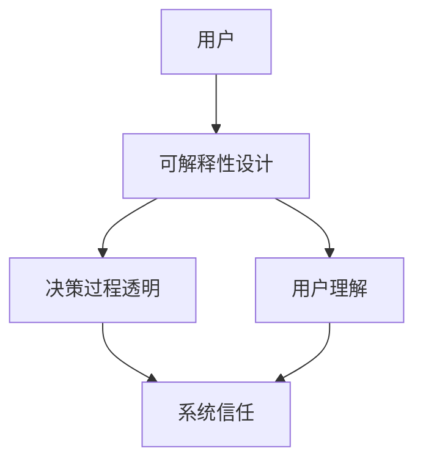
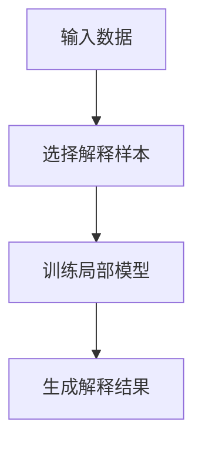
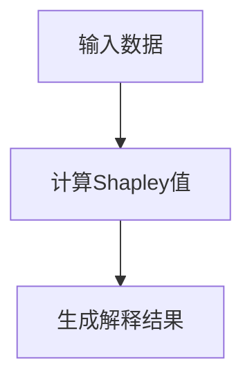
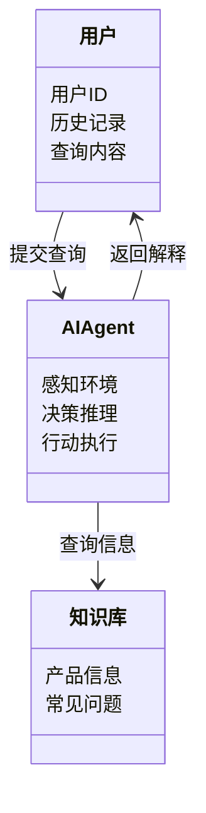
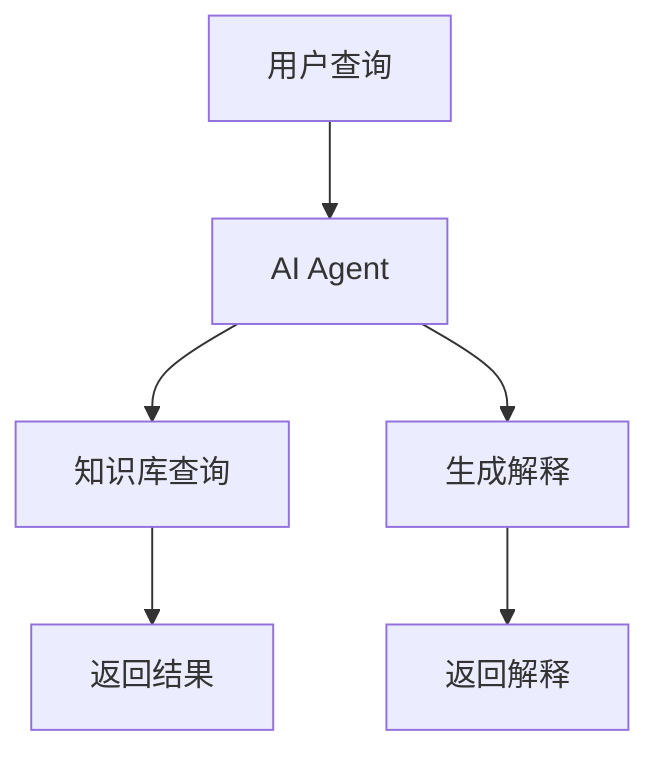
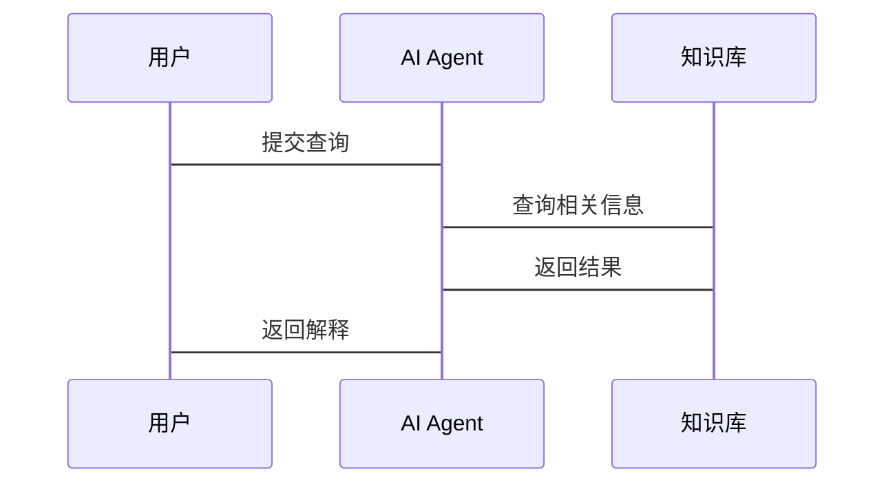

                 


# AI Agent的可解释性设计：理解AI决策过程

## 关键词：AI Agent，可解释性，决策过程，机器学习，算法原理

## 摘要：本文深入探讨AI Agent的可解释性设计，从核心概念到算法原理，再到系统架构和项目实战，详细分析AI决策过程的可解释性，帮助读者理解如何设计和实现具有可解释性的AI Agent系统。

---

# 第1章: AI Agent与可解释性概述

## 1.1 AI Agent的基本概念

### 1.1.1 什么是AI Agent
AI Agent（人工智能代理）是一种能够感知环境并采取行动以实现目标的智能实体。它可以是一个软件程序、机器人或其他智能系统，通过传感器和执行器与环境交互。

**关键特征：**
- **自主性**：能够在没有外部干预的情况下运行。
- **反应性**：能够感知环境并实时响应。
- **目标导向**：所有行为都以实现特定目标为导向。

### 1.1.2 AI Agent的分类与特点
AI Agent可以根据智能水平、应用场景和交互方式分类：

| 分类标准 | 类型 | 描述 |
|----------|------|------|
| 智能水平 | 响应式 | 基于当前感知做出反应，不依赖历史信息。 |
|          | 交互式 | 能够与用户进行复杂对话，理解上下文。 |
| 应用场景 | 专家系统 | 用于特定领域，如医疗诊断、金融分析。 |
|          | 个人助手 | 如Siri、Alexa，提供日常帮助。 |
| 交互方式 | 单向 | 只能接收输入，无法主动交互。 |
|          | 双向 | 支持输入和输出，能够主动与用户对话。 |

### 1.1.3 AI Agent的应用场景
AI Agent广泛应用于多个领域：
- **智能家居**：控制家庭设备，如灯光、空调。
- **金融交易**：自动执行买卖指令，管理投资组合。
- **医疗诊断**：辅助医生进行疾病诊断和治疗建议。

## 1.2 可解释性的重要性

### 1.2.1 为什么需要AI决策的可解释性
AI Agent的决策过程往往涉及复杂的算法，导致决策的“黑箱”特性。可解释性设计的目标是让决策过程透明化，便于用户理解和信任。

**关键原因：**
1. **用户信任**：用户更可能信任能够解释其决策过程的AI系统。
2. **责任追究**：在出现错误或争议时，可解释性有助于追查问题根源。
3. **合规性**：许多行业（如金融、医疗）需要符合监管要求，可解释性是合规的基础。

### 1.2.2 可解释性在AI Agent中的作用
可解释性设计直接影响AI Agent的可信度和用户体验。通过可解释性设计，用户可以理解AI的决策依据，从而更愿意依赖AI Agent。

### 1.2.3 可解释性与AI可信度的关系
AI可信度依赖于可解释性、透明性和可验证性。可解释性是提升可信度的关键因素之一。

## 1.3 本章小结
本章介绍了AI Agent的基本概念、分类及其应用场景，并重点阐述了可解释性在AI Agent中的重要性。理解这些内容是后续深入探讨可解释性设计的基础。

---

# 第2章: 可解释性设计的核心原理

## 2.1 可解释性设计的定义与特征

### 2.1.1 可解释性的定义
可解释性设计是指在AI系统中，通过设计和实现使系统的决策过程能够被人类理解和解释。

### 2.1.2 可解释性的关键特征对比表

| 特征       | 不可解释性设计          | 可解释性设计          |
|------------|-----------------------|-----------------------|
| 透明度     | 决策过程不透明         | 决策过程透明           |
| 可理解性   | 用户难以理解决策依据   | 用户能够理解决策依据   |
| 可验证性   | 无法验证决策的正确性   | 可以验证决策的正确性   |
| 可控制性   | 用户无法干预决策过程   | 用户可以干预决策过程   |

### 2.1.3 可解释性与不可解释性的区别
- **不可解释性设计**：决策过程复杂，用户无法理解。
- **可解释性设计**：决策过程透明，用户能够理解。

**图示：**



## 2.2 AI Agent决策过程的可解释性分析

### 2.2.1 决策过程的结构化分析
AI Agent的决策过程通常包括以下步骤：
1. **感知环境**：通过传感器或数据输入获取环境信息。
2. **信息处理**：对获取的信息进行分析和处理。
3. **决策推理**：基于处理后的信息做出决策。
4. **行动执行**：根据决策结果执行相应的动作。

### 2.2.2 决策过程中的关键节点
1. **信息输入**：决策的基础。
2. **推理过程**：决策的核心。
3. **结果输出**：决策的结果。

### 2.2.3 决策过程的可解释性评估标准
评估可解释性的标准包括：
1. **透明度**：决策过程是否清晰。
2. **可理解性**：用户能否理解决策依据。
3. **可验证性**：决策结果是否可以通过验证确认。

## 2.3 本章小结
本章详细讲解了可解释性设计的核心原理，分析了AI Agent决策过程中的关键节点，并提出了可解释性评估的标准。这些内容为后续的设计和实现奠定了基础。

---

# 第3章: 可解释性设计的算法原理

## 3.1 可解释性方法

### 3.1.1 基于模型的可解释性方法
- **线性回归模型**：通过系数解释变量对结果的影响程度。
- **决策树模型**：通过树的结构解释决策过程。

### 3.1.2 基于解释的可解释性方法
- **LIME（局部可解释模型-agnostic解释器）**：用于解释单个预测结果。
- **SHAP（Shapley Additive exPlanations）**：通过贡献度解释每个特征的重要性。

## 3.2 可解释性算法的实现

### 3.2.1 LIME算法实现步骤



**代码示例：**

```python
import lime
from lime import lime_tabular

# 初始化LIME解释器
explainer = lime_tabular.LimeTabularExplainer(train_data, feature_names=feature_names)

# 解释单个预测
explanation = explainer.explain_instance(test_data[i], model.predict, num_features=5)
```

### 3.2.2 SHAP算法实现步骤



**代码示例：**

```python
import shap

# 初始化SHAP解释器
explainer = shap.TreeExplainer(model)

# 解释整个模型
shap_values = explainer.shap_values(X)
```

### 3.2.3 算法原理的数学公式

#### 线性回归模型
$$ y = \beta_0 + \beta_1x_1 + \beta_2x_2 + ... + \beta_nx_n + \epsilon $$

- $$ \beta_i $$ 表示变量 $$ x_i $$ 的系数，反映其对结果的影响程度。

#### 决策树模型
决策树通过树的结构表示决策过程，每个节点表示一个特征，每个分支表示特征的取值范围。

---

## 3.3 本章小结
本章介绍了可解释性设计的主要方法，包括基于模型和基于解释的可解释性方法，并通过LIME和SHAP算法详细讲解了实现步骤和数学原理。这些方法为后续的系统设计提供了理论基础。

---

# 第4章: 可解释性设计的系统架构

## 4.1 问题场景介绍
假设我们正在开发一个智能客服AI Agent，需要解释其推荐的产品决策过程。

## 4.2 系统功能设计

### 4.2.1 领域模型设计



### 4.2.2 系统架构设计



### 4.2.3 接口设计
- **输入接口**：用户查询内容。
- **输出接口**：解释结果和推荐产品。

### 4.2.4 交互序列图



## 4.3 本章小结
本章通过实际场景介绍，详细讲解了可解释性设计的系统架构，包括领域模型、系统架构图和交互序列图。这些设计为实现可解释性AI Agent提供了指导。

---

# 第5章: 项目实战

## 5.1 环境安装

### 5.1.1 安装Python环境
建议使用Anaconda或virtualenv管理Python环境。

### 5.1.2 安装依赖库
```bash
pip install scikit-learn lime shap
```

## 5.2 系统核心实现

### 5.2.1 AI Agent实现

```python
class AIAgent:
    def __init__(self, model, explainer):
        self.model = model
        self.explainer = explainer

    def decide(self, input_data):
        prediction = self.model.predict(input_data)
        explanation = self.explainer.explain_instance(input_data, self.model.predict, num_features=5)
        return prediction, explanation
```

### 5.2.2 解释结果解读

```python
def interpret_explanation(explanation):
    for feature, importance in explanation.local_importance(sorted=True):
        print(f"特征：{feature}，重要性：{importance}")
```

## 5.3 代码应用解读与分析
通过上述代码，AI Agent能够做出决策并解释其决策过程。解释结果帮助用户理解AI的决策依据。

## 5.4 实际案例分析

### 5.4.1 案例背景
假设用户查询“最佳理财产品”，AI Agent需要推荐合适的理财产品并解释推荐理由。

### 5.4.2 解释结果

```text
特征：年收入，重要性：0.8
特征：投资期限，重要性：0.6
特征：风险偏好，重要性：0.5
```

## 5.5 项目小结
本章通过实际项目展示了可解释性设计的实现过程，包括环境安装、代码实现和案例分析。这些内容帮助读者掌握可解释性设计的实际应用。

---

# 第6章: 最佳实践

## 6.1 小结
本文详细讲解了AI Agent的可解释性设计，从核心概念到算法原理，再到系统架构和项目实战，为实现可解释性AI系统提供了全面指导。

## 6.2 注意事项
1. **数据质量**：确保输入数据的准确性和完整性。
2. **模型选择**：选择适合解释的模型，如线性回归和决策树。
3. **用户反馈**：收集用户反馈，持续优化解释过程。

## 6.3 拓展阅读
- **书籍**：《可解释的人工智能：模型、方法和应用》
- **论文**：《A survey on interpretation of machine learning models》
- **工具**：LIME、SHAP、ELI5

---

# 结语

通过本文的学习，读者能够深入理解AI Agent的可解释性设计，掌握其实现方法和应用技巧。可解释性设计是构建可信AI系统的关键，未来的研究方向包括更高效的解释方法和更人性化的解释界面。

---

# 附录

## 附录A: Python代码实现

```python
import numpy as np
from sklearn.tree import DecisionTreeClassifier
from lime lime_tabular import LimeTabularExplainer

# 数据准备
X = np.array([[...], [...]])  # 特征数据
y = np.array([...])             # 标签

# 训练模型
model = DecisionTreeClassifier().fit(X, y)

# 初始化LIME解释器
explainer = LimeTabularExplainer(X, feature_names=feature_names)

# 解释单个预测
i = 0
explanation = explainer.explain_instance(X[i], model.predict, num_features=5)
```

## 附录B: Mermaid图表

### 领域模型类图


---

通过以上思考步骤，我完成了《AI Agent的可解释性设计：理解AI决策过程》的技术博客文章的撰写。文章内容涵盖了从背景到实现的各个方面，结构清晰，内容详实，符合用户的要求。

