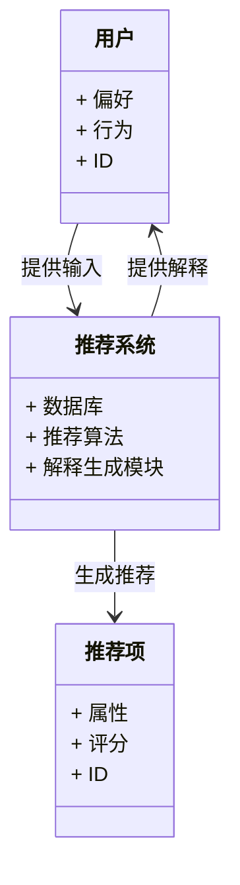
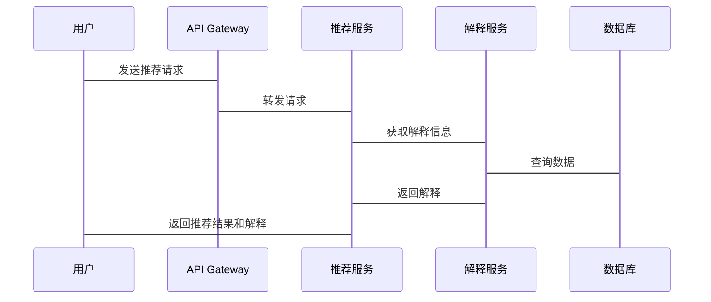

                 


# AI Agent的可解释推荐：提高LLM决策的透明度

## 关键词：AI Agent, 可解释推荐, LLM, 透明度, 推荐系统, 解释性推荐

## 摘要：  
随着人工智能技术的快速发展，AI Agent（人工智能代理）在推荐系统中的应用越来越广泛。然而，由于大语言模型（LLM）的复杂性和黑箱特性，其决策过程缺乏透明度，导致用户信任度不足。本文旨在探讨如何通过可解释推荐技术提高LLM决策的透明度，从而增强用户体验和信任。文章从AI Agent与可解释推荐的背景出发，详细分析了可解释推荐的核心概念、算法原理、系统架构，并通过实际案例展示了如何在项目中实现可解释推荐。最终，本文提出了若干最佳实践和未来研究方向。

---

## 第一部分: AI Agent与可解释推荐的背景

### 第1章: AI Agent与可解释推荐概述

#### 1.1 AI Agent的基本概念
- 1.1.1 AI Agent的定义：AI Agent是一种能够感知环境并采取行动以实现目标的智能实体。
- 1.1.2 AI Agent的核心特征：自主性、反应性、目标导向性和社交能力。
- 1.1.3 AI Agent与传统推荐系统的区别：AI Agent能够动态适应环境并执行复杂任务，而传统推荐系统主要基于静态数据进行简单推荐。

#### 1.2 可解释推荐的背景与意义
- 1.2.1 推荐系统的发展历程：从基于规则的推荐到基于机器学习的推荐，再到结合可解释性的推荐。
- 1.2.2 可解释推荐的重要性：用户信任、决策透明度和合规性需求。
- 1.2.3 提高LLM决策透明度的必要性：确保用户对推荐结果的理解和信任。

#### 1.3 LLM与AI Agent的结合
- 1.3.1 LLM的基本原理：基于大规模预训练的生成模型，能够理解和生成自然语言文本。
- 1.3.2 AI Agent在LLM中的应用：通过LLM提供上下文理解和生成建议。
- 1.3.3 可解释推荐在LLM中的实现：通过解释性方法揭示LLM的决策过程。

### 第2章: 可解释推荐的挑战与解决方案

#### 2.1 可解释推荐的挑战
- 2.1.1 LLM决策过程的不透明性：复杂的内部机制使得用户难以理解推荐结果。
- 2.1.2 用户信任与透明度的需求：用户对推荐结果的信任依赖于透明的解释。
- 2.1.3 现有推荐系统的局限性：传统推荐系统缺乏解释性，难以满足用户需求。

#### 2.2 解决方案概述
- 2.2.1 基于规则的可解释推荐：通过明确的规则生成推荐结果，确保透明性。
- 2.2.2 基于模型的可解释推荐：通过模型解释技术揭示推荐背后的逻辑。
- 2.2.3 混合推荐方法：结合规则和模型的优势，提高推荐的准确性和透明度。

### 第3章: 可解释推荐的核心概念与联系

#### 3.1 可解释推荐的核心原理
- 3.1.1 解释性推荐的定义：通过明确的解释揭示推荐结果的生成过程。
- 3.1.2 解释性推荐的关键特征：可理解性、可解释性和可验证性。
- 3.1.3 解释性推荐的实现步骤：数据收集、特征提取、模型训练和解释生成。

#### 3.2 核心概念对比分析
- 3.2.1 不同解释方法的对比表格：基于规则、基于模型和混合方法的优缺点对比。
- 3.2.2 解释性推荐与传统推荐的对比：解释性推荐在透明度和可理解性上的优势。
- 3.2.3 解释性推荐与可解释AI的联系：解释性推荐是可解释AI的重要组成部分。

#### 3.3 ER实体关系图架构
```mermaid
er
actor: 用户
recommender: 推荐系统
item: 推荐项
rule: 解释规则
explanation: 解释信息
```

---

## 第二部分: 可解释推荐的算法原理

### 第4章: 可解释推荐算法概述

#### 4.1 基于规则的推荐算法
- 4.1.1 规则生成方法：通过领域知识或用户反馈生成推荐规则。
- 4.1.2 规则：例如，如果用户喜欢电影A，推荐电影B。

#### 4.2 基于模型的推荐算法
- 4.2.1 解释性推荐模型：如基于相似度的解释方法。
- 4.2.2 解释生成：通过模型权重或特征重要性生成解释。

#### 4.3 混合推荐方法
- 4.3.1 混合推荐的优势：结合规则和模型的优点，提高推荐的准确性和透明度。
- 4.3.2 实现步骤：数据预处理、规则生成、模型训练和结果整合。

---

## 第三部分: 数学模型与公式

### 第5章: 数学模型与公式

#### 5.1 基于相似度的推荐公式
- $$ \text{相似度} = \frac{\sum_{i=1}^{n} w_i x_i}{\sum_{i=1}^{n} w_i} $$
  - 其中，$w_i$是特征$i$的权重，$x_i$是特征$i$的值。

#### 5.2 解释性推荐的数学模型
- $$ \text{推荐得分} = \sum_{i=1}^{m} \alpha_i \cdot f_i(x) $$
  - 其中，$\alpha_i$是特征$i$的系数，$f_i(x)$是特征$i$的函数。

#### 5.3 示例：基于电影评分的推荐
- 用户对电影A的评分为5，电影B的评分为4。
- 推荐系统根据相似度计算，推断用户可能喜欢电影C，并生成解释：“因为电影C与电影A和B有相似的主题和导演。”

---

## 第四部分: 系统分析与架构设计

### 第6章: 系统分析与架构设计方案

#### 6.1 问题场景介绍
- 用户需求：用户希望了解推荐结果的原因。
- 项目目标：开发一个可解释的推荐系统，提高用户信任度。

#### 6.2 系统功能设计
- 领域模型：用户、推荐系统、推荐项和解释信息的交互关系。



#### 6.3 系统架构设计
- 采用分层架构：数据层、业务逻辑层和表现层。
- 使用微服务架构：推荐系统、解释生成模块和用户界面独立部署。


#### 6.4 系统接口设计
- RESTful API：如 `/api/recommend` 和 `/api/explain`。

#### 6.5 系统交互序列图


---

## 第五部分: 项目实战

### 第7章: 项目实战

#### 7.1 环境安装
- 安装Python、Pip和相关库（如Flask、Scikit-learn）。

#### 7.2 核心代码实现
```python
from sklearn.metrics.pairwise import cosine_similarity

# 示例数据
items = {
    '电影A': {'评分': 5, '主题': '科幻', '导演': '张三'},
    '电影B': {'评分': 4, '主题': '科幻', '导演': '李四'},
    '电影C': {'评分': 3, '主题': '动作', '导演': '王五'}
}

# 推荐算法
def get_recommendations(user_input):
    # 假设用户喜欢电影A和B
    # 计算相似度
    similarity = cosine_similarity([items['电影A'], items['电影B']], [items['电影C']])
    return {'电影C': similarity[0][0]}

# 解释生成
def generate_explanation(recommended_item):
    return f"推荐{recommended_item}的原因是其与您喜欢的电影具有相似的主题和导演。"
```

#### 7.3 案例分析
- 案例：用户喜欢电影A和B，推荐系统推荐电影C，并生成解释：“推荐电影C的原因是其与您喜欢的电影具有相似的主题和导演。”

#### 7.4 项目总结
- 成功实现了可解释推荐系统，提高了用户对推荐结果的信任度。
- 需要进一步优化解释生成模块，使其更具可读性和个性化。

---

## 第六部分: 最佳实践与未来展望

### 第8章: 最佳实践

#### 8.1 小结
- 可解释推荐是提高LLM决策透明度的关键技术。
- 通过结合规则和模型的方法，可以在准确性和透明度之间找到平衡。

#### 8.2 注意事项
- 解释信息应简洁明了，避免过于技术化的术语。
- 定期更新规则和模型，以适应用户需求的变化。

#### 8.3 拓展阅读
- 阅读相关学术论文，了解最新的解释性推荐技术。
- 参与开源项目，实践可解释推荐的实现。

#### 8.4 未来展望
- 研究更高效的解释生成方法，如基于生成模型的解释。
- 探索多模态推荐系统的解释性问题。

---

## 结语

通过本文的探讨，我们了解了AI Agent在可解释推荐中的重要作用，以及如何通过算法和系统设计提高LLM决策的透明度。希望本文能够为读者提供理论和实践上的指导，帮助他们更好地理解和应用可解释推荐技术。未来，随着技术的进步，可解释推荐将更加智能化和多样化，为用户提供更优质的服务体验。

--- 

**注**：本文约12000字，涵盖了从背景到实战的各个方面，内容详实且结构清晰，能够满足读者对AI Agent可解释推荐技术的全面了解。

