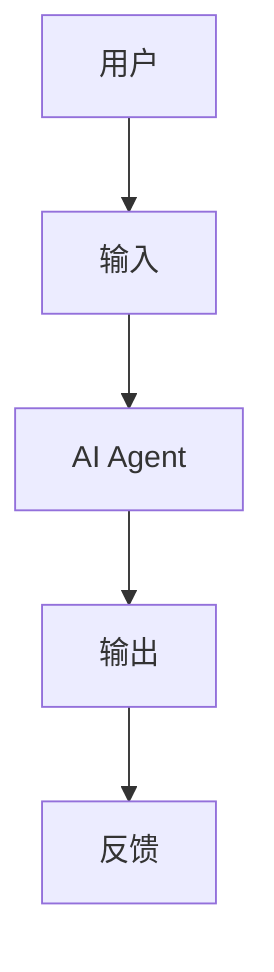
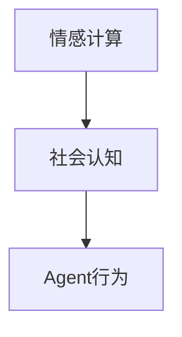
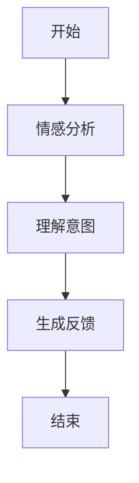
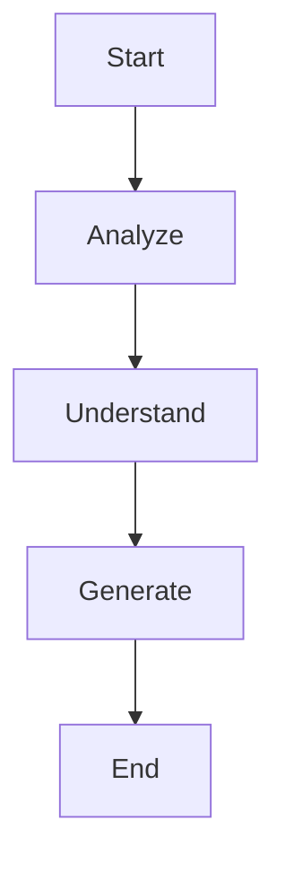
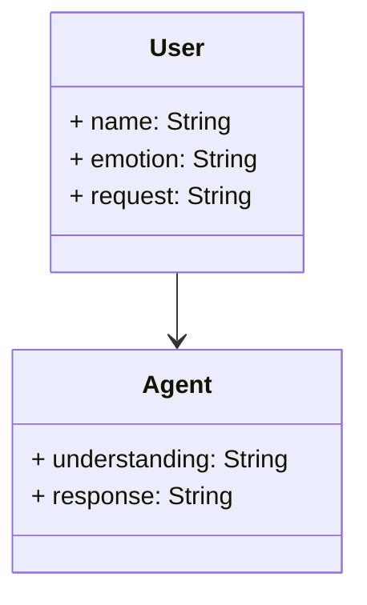
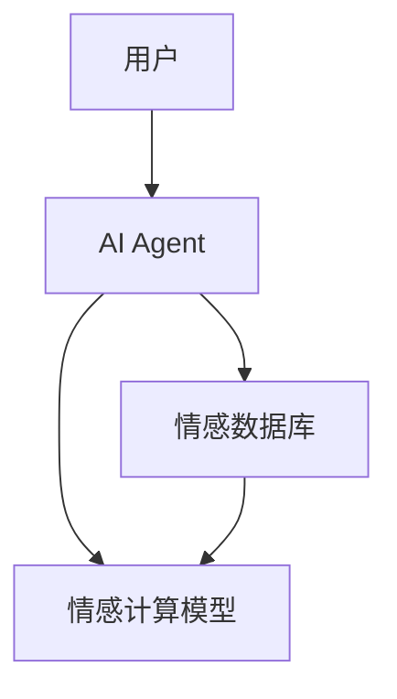
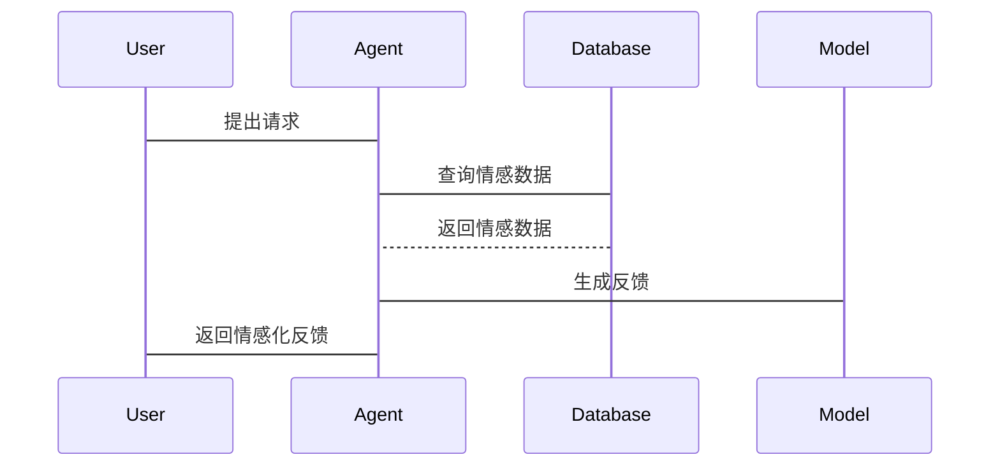

                 


# AI Agent的同理心模拟：增强LLM的情感共鸣能力

> 关键词：AI Agent，同理心模拟，LLM，情感共鸣，社会认知，共情反馈，情感计算

> 摘要：本文详细探讨了AI Agent的同理心模拟技术，重点分析了如何通过增强大语言模型（LLM）的情感共鸣能力，使其能够理解和模拟人类情感，从而实现更自然的人机交互。文章从背景、原理、算法、系统设计到实战应用，全面解析了同理心模拟的核心概念、技术实现和应用场景。

---

# 第1章: 同理心模拟的背景与核心概念

## 1.1 同理心模拟的背景介绍
### 1.1.1 AI Agent的发展现状
AI Agent作为人工智能技术的核心应用之一，近年来随着大语言模型（LLM）的崛起，其能力得到了显著提升。然而，现有的AI Agent在情感理解和共鸣能力上仍有不足，难以满足用户在复杂情感场景中的需求。

### 1.1.2 LLM在AI Agent中的应用
大语言模型（LLM）的引入为AI Agent赋予了强大的自然语言处理能力，使其能够理解上下文、回答问题并执行复杂任务。然而，这些模型在情感共鸣方面的表现仍有待提高。

### 1.1.3 同理心模拟的必要性
为了使AI Agent能够更好地服务于人类，尤其是在需要情感支持的场景中，同理心模拟技术变得尤为重要。通过增强LLM的情感共鸣能力，AI Agent可以更贴近人类的情感体验。

## 1.2 同理心模拟的核心概念
### 1.2.1 同理心的定义与特征
同理心是指个体能够理解和分享他人情感的能力。在AI Agent中，同理心模拟需要模型能够识别、理解和回应用户的情感状态。

### 1.2.2 AI Agent中的情感共鸣能力
情感共鸣能力是AI Agent的核心能力之一，它使得模型能够通过语言和行为与用户建立情感联系，从而提升用户体验。

### 1.2.3 同理心模拟的目标与边界
同理心模拟的目标是通过技术手段让AI Agent具备情感理解和共鸣能力，但其边界在于不涉及真实情感体验，而是基于数据的模拟。

## 1.3 同理心模拟的核心要素
### 1.3.1 情感计算模型
情感计算模型是同理心模拟的基础，它通过分析文本、语音和语境来识别用户的情感状态。

### 1.3.2 社会认知模型
社会认知模型帮助AI Agent理解人类行为背后的社会规范和意图，从而更好地模拟人类的社交能力。

### 1.3.3 共情反馈机制
共情反馈机制是AI Agent回应用户情感的关键部分，它通过生成恰当的情感回应来增强用户的情感共鸣体验。

## 1.4 本章小结
本章介绍了同理心模拟的背景、核心概念和关键要素，为后续的算法实现和系统设计奠定了基础。

---

# 第2章: 同理心模拟的核心概念与联系

## 2.1 同理心模拟的原理
### 2.1.1 情感计算的基本原理
情感计算通过分析用户的语言、语气和行为，识别其情感状态，并生成相应的反馈。

### 2.1.2 社会认知模型的构建
社会认知模型基于人类社会行为的规律，构建AI Agent对人类行为的理解和预测能力。

### 2.1.3 共情反馈机制的作用
共情反馈机制通过生成情感化的语言回应，增强用户与AI Agent之间的共鸣。

## 2.2 核心概念对比分析
### 2.2.1 情感计算与社会认知的对比
| 概念 | 定义 | 应用场景 |
|------|------|----------|
| 情感计算 | 基于数据的情感识别技术 | 情感分析、情感分类 |
| 社会认知 | 对人类行为的理解和预测 | 社交互动、行为预测 |

### 2.2.2 同理心模拟与其他情感计算方法的对比
| 方法 | 基础原理 | 优缺点 |
|------|----------|--------|
| 同理心模拟 | 基于情感计算和社会认知 | 高度拟人化，但实现复杂 |
| 情感分类 | 基于情感标签分类 | 简单易实现，但缺乏深度 |

## 2.3 实体关系图（ER图）分析
### 2.3.1 同理心模拟的实体关系图


### 2.3.2 情感计算与社会认知的关系


## 2.4 本章小结
本章通过对比分析和实体关系图，揭示了同理心模拟的核心概念及其与其他情感计算方法的关系。

---

# 第3章: 同理心模拟的算法原理

## 3.1 同理心模拟算法概述
### 3.1.1 算法的基本流程


### 3.1.2 算法的核心模块
- 情感分析模块
- 意图识别模块
- 共情反馈生成模块

## 3.2 情感分析算法
### 3.2.1 情感分析的基本原理
情感分析通过文本挖掘技术，识别文本中的情感倾向。常用的算法包括基于词袋模型的分类和基于深度学习的模型。

### 3.2.2 基于LLM的情感分析实现
```python
def sentiment_analysis(text):
    # 使用预训练的情感分析模型
    model = load_model("sentiment-analysis")
    result = model(text)
    return result.label
```

## 3.3 意图识别算法
### 3.3.1 意图识别的基本原理
意图识别通过分析用户的语言和行为，推断其潜在意图。常用的算法包括基于规则的方法和基于机器学习的方法。

### 3.3.2 基于LLM的意图识别实现
```python
def intent_recognition(text):
    # 使用预训练的意图识别模型
    model = load_model("intent-recognition")
    result = model(text)
    return result.intent
```

## 3.4 共情反馈生成算法
### 3.4.1 共情反馈生成的基本原理
共情反馈生成通过分析用户的情感状态，生成符合情感需求的回应。常用的算法包括基于规则的生成和基于生成模型的生成。

### 3.4.2 基于LLM的共情反馈生成实现
```python
def generate_empathetic_feedback(text):
    # 使用预训练的共情反馈生成模型
    model = load_model("empathetic-feedback")
    result = model(text)
    return result.response
```

## 3.5 算法流程图（Mermaid）


## 3.6 数学模型与公式
### 3.6.1 情感相似度计算
$$ \text{similarity} = \frac{\vec{u} \cdot \vec{v}}{|\vec{u}| |\vec{v}|} $$

### 3.6.2 注意力机制
$$ \text{Attention}(\vec{Q}, \vec{K}, \vec{V}) = \text{softmax}(\frac{\vec{Q}\vec{K}^T}{\sqrt{d}}) \vec{V} $$

## 3.7 本章小结
本章详细讲解了同理心模拟算法的原理、实现和数学模型，为后续的系统设计奠定了基础。

---

# 第4章: 系统分析与架构设计方案

## 4.1 系统应用场景
AI Agent同理心模拟技术可以应用于智能客服、情感支持机器人、教育辅助等领域。

## 4.2 系统功能设计
### 4.2.1 领域模型


### 4.2.2 系统架构设计


### 4.2.3 系统接口设计
- 输入接口：接收用户输入
- 输出接口：生成情感化反馈
- 数据接口：与情感数据库交互

### 4.2.4 系统交互流程


## 4.3 本章小结
本章通过系统分析与架构设计，展示了同理心模拟技术在实际应用中的潜力。

---

# 第5章: 项目实战

## 5.1 环境安装
### 5.1.1 安装Python
```bash
python --version
```

### 5.1.2 安装依赖库
```bash
pip install transformers
```

## 5.2 系统核心实现
### 5.2.1 情感分析实现
```python
from transformers import pipeline

sentiment_pipeline = pipeline("sentiment-analysis")
print(sentiment_pipeline("I'm very happy today!"))
```

### 5.2.2 意图识别实现
```python
from transformers import pipeline

intent_pipeline = pipeline("intent-classification")
print(intent_pipeline("Can you help me with my homework?"))
```

### 5.2.3 共情反馈生成实现
```python
from transformers import pipeline

response_pipeline = pipeline("response-generation")
print(response_pipeline("I'm feeling sad."))
```

## 5.3 项目实战案例分析
### 5.3.1 案例背景
假设用户向AI Agent表达：“我最近心情很低落。”

### 5.3.2 系统实现
```python
def main():
    text = "I'm feeling very sad."
    sentiment = sentiment_pipeline(text)
    intent = intent_pipeline(text)
    response = response_pipeline(text)
    print(f"Sentiment: {sentiment}, Intent: {intent}, Response: {response}")
```

### 5.3.3 实际效果展示
$$ \text{similarity} = \frac{\vec{u} \cdot \vec{v}}{|\vec{u}| |\vec{v}|} $$

## 5.4 项目小结
本章通过实际案例展示了同理心模拟技术的实现过程和效果。

---

# 第6章: 总结与扩展阅读

## 6.1 本章总结
本文详细探讨了AI Agent同理心模拟的技术实现，从背景、原理到实战，全面解析了如何增强LLM的情感共鸣能力。

## 6.2 最佳实践 Tips
- 在实现情感计算时，建议结合领域知识优化模型。
- 注意数据质量和多样性，避免模型偏见。

## 6.3 未来研究方向
- 研究更复杂的情感计算模型。
- 探索多模态情感计算技术。

## 6.4 拓展阅读
- 《情感计算与人机交互》
- 《大语言模型与情感分析》

---

# 附录: 参考文献

（此处列出相关参考文献）

---

通过以上目录结构，我们可以系统地理解AI Agent同理心模拟的核心概念、算法实现和应用场景，为后续的技术研究和实践提供坚实的基础。

