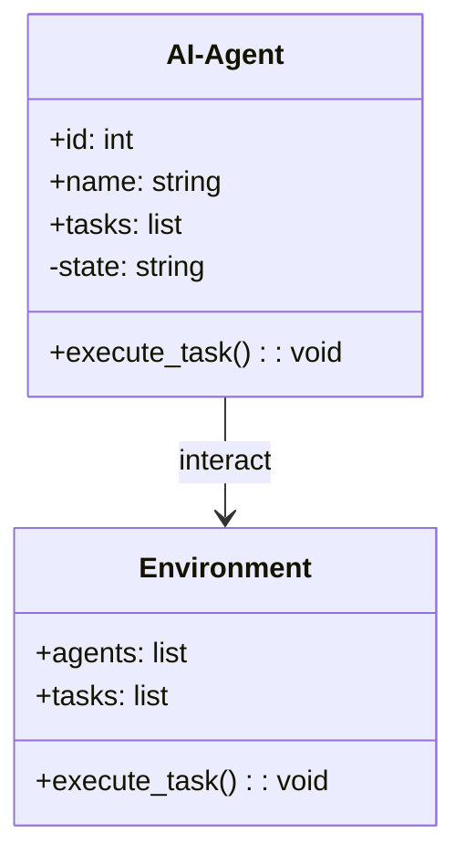
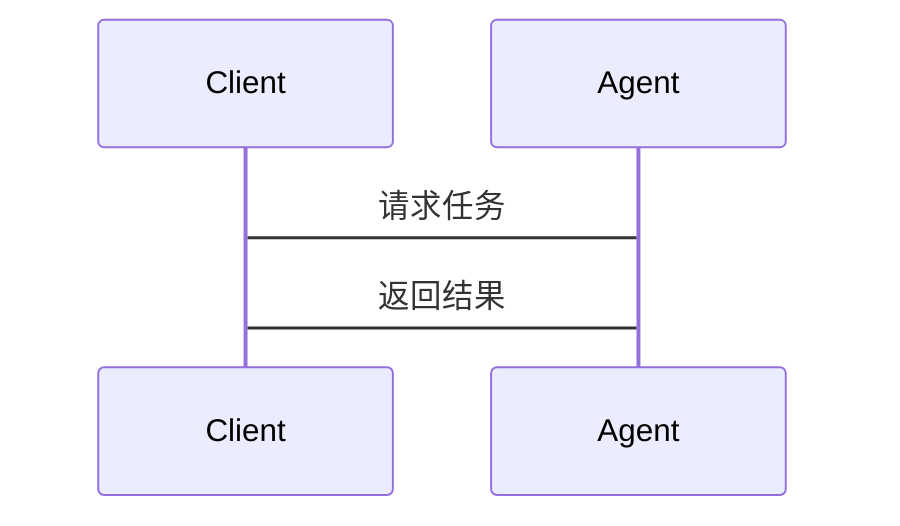

                 


# AI Agent的因果推理：增强LLM的逻辑分析能力

## 关键词：AI Agent, 因果推理, LLM, 逻辑分析能力, 因果图模型, 反事实推理, 系统架构设计

## 摘要：本文详细探讨了AI Agent如何通过因果推理技术增强大语言模型（LLM）的逻辑分析能力。首先介绍了AI Agent和因果推理的基本概念，接着分析了因果推理在LLM中的应用价值。然后从算法原理、系统架构设计、项目实战等多方面展开，深入探讨了因果图模型、反事实推理算法、系统实现与优化等内容。最后，通过具体案例分析展示了因果推理技术在提升LLM逻辑推理能力中的实际应用效果，并总结了相关经验与未来发展方向。

---

# 第1章: AI Agent与因果推理概述

## 1.1 AI Agent的基本概念

### 1.1.1 AI Agent的定义与分类
AI Agent（人工智能代理）是指具有感知环境、自主决策和执行任务能力的智能体。根据功能和应用场景的不同，AI Agent可以分为简单反射型、基于模型的反应型、目标驱动型和实用驱动型等类型。

### 1.1.2 因果推理的基本概念
因果推理是一种通过分析事件之间的因果关系，推断出“为什么”某一结果发生的方法。它关注的是因果关系，而非相关关系，能够帮助AI Agent更好地理解事件之间的内在联系。

### 1.1.3 AI Agent与因果推理的关系
AI Agent需要在复杂环境中做出决策，因果推理为其提供了从相关性到因果性的推理能力，使其能够更好地理解任务之间的依赖关系和潜在影响。

## 1.2 LLM的逻辑分析能力

### 1.2.1 LLM的基本原理
LLM（Large Language Model）通过大规模的数据训练，能够生成人类语言的文本，并在一定程度上理解和回答问题。然而，其逻辑推理能力有限，尤其是在需要因果关系分析的任务中表现不佳。

### 1.2.2 LLM的逻辑分析能力现状
当前LLM在处理需要因果推理的任务时，往往只能基于统计相关性进行推断，缺乏对因果关系的深入理解，导致在复杂场景中的决策能力不足。

### 1.2.3 增强LLM逻辑分析能力的必要性
通过引入因果推理技术，可以增强LLM的逻辑分析能力，使其能够更好地理解任务之间的因果关系，从而在复杂场景中做出更合理的决策。

## 1.3 本章小结
本章介绍了AI Agent和因果推理的基本概念，分析了因果推理在增强LLM逻辑分析能力中的重要性，并为后续内容奠定了基础。

---

# 第2章: 因果推理的理论基础

## 2.1 因果关系的定义与特征

### 2.1.1 因果关系的定义
因果关系是指一个事件（原因）导致另一个事件（结果）发生的必然联系。因果关系的核心在于“如果原因发生，结果必然发生”。

### 2.1.2 因果关系的特征
因果关系具有确定性、传递性和可逆性等特征。例如，如果A是B的原因，那么在特定条件下，A的发生必然导致B的发生。

### 2.1.3 因果关系与相关性的区别
相关性表示两个变量之间的统计关联，而因果关系则表示一个变量对另一个变量的直接影响。相关性不等于因果关系。

## 2.2 因果图模型

### 2.2.1 因果图的基本结构
因果图是一种用于表示因果关系的图形模型，通常由节点（变量）和边（因果关系）组成。例如，A → B 表示A是B的原因。

### 2.2.2 贝叶斯网络与因果图的关系
贝叶斯网络是一种概率图模型，而因果图是其特例，强调因果关系的方向性。贝叶斯网络可以表示因果图，但因果图更关注因果关系的强度和方向。

### 2.2.3 因果图的构建方法
因果图可以通过领域知识、实验数据和观察数据等多种方式构建。常用的方法包括基于专家知识的构建和基于数据的自动构建。

## 2.3 因果推理的基本原理

### 2.3.1 因果推理的定义
因果推理是通过分析因果图中的因果关系，推断出某一变量变化对其他变量影响的过程。

### 2.3.2 因果推理的核心算法
因果推理的核心算法包括反事实推理（Counterfactual Reasoning）、潜在结果框架（Potential Outcome Framework）等。

### 2.3.3 因果推理的应用场景
因果推理广泛应用于医疗诊断、金融风险评估、政策效果分析等领域。

## 2.4 本章小结
本章详细讲解了因果关系的定义、特征以及因果图模型的构建方法，为后续章节的因果推理算法和系统设计奠定了理论基础。

---

# 第3章: 因果推理与AI Agent的结合

## 3.1 AI Agent中的因果推理需求

### 3.1.1 AI Agent决策的因果性要求
AI Agent在决策过程中需要考虑因果关系，以确保决策的合理性和有效性。

### 3.1.2 因果推理在AI Agent中的作用
因果推理能够帮助AI Agent更好地理解任务之间的因果关系，从而做出更合理的决策。

### 3.1.3 AI Agent中的因果推理挑战
AI Agent中的因果推理需要解决数据不足、因果关系复杂等问题。

## 3.2 因果推理在LLM中的应用

### 3.2.1 LLM中的因果推理需求
LLM需要因果推理能力来提升其逻辑分析能力，尤其是在需要复杂推理的任务中。

### 3.2.2 因果推理对LLM的提升作用
因果推理能够帮助LLM更好地理解任务之间的因果关系，从而在复杂场景中做出更准确的决策。

### 3.2.3 LLM中的因果推理实现
通过集成因果推理算法，可以增强LLM的逻辑分析能力，使其能够更好地理解因果关系。

## 3.3 本章小结
本章分析了因果推理在AI Agent和LLM中的需求和作用，探讨了因果推理在LLM中的实现方法。

---

# 第4章: 因果推理算法原理

## 4.1 反事实推理算法

### 4.1.1 反事实推理的定义
反事实推理是一种通过假设某个变量发生变化，推断其对其他变量影响的因果推理方法。

### 4.1.2 反事实推理的数学模型
反事实推理的数学模型通常基于潜在结果框架（Potential Outcome Framework）。例如，$$Y^{do(A=a)}$$ 表示在A被设定为a的情况下，结果Y的潜在值。

### 4.1.3 反事实推理的实现步骤
反事实推理的实现步骤包括：1）构建因果图；2）定义潜在结果；3）计算反事实推理的期望值。

### 4.1.4 反事实推理的Python代码实现
```python
def potential_outcome(a, X):
    # 假设a是处理变量，X是其他变量
    # 返回潜在结果
    return a * X + 1
```

### 4.1.5 反事实推理的案例分析
例如，在医疗诊断中，反事实推理可以用于评估不同治疗方案的效果。

## 4.2 本章小结
本章详细讲解了反事实推理算法的数学模型和实现步骤，为后续章节的系统设计和项目实现奠定了基础。

---

# 第5章: 系统分析与架构设计

## 5.1 系统功能设计

### 5.1.1 领域模型设计
领域模型设计包括定义系统的功能模块和交互流程。例如，可以使用Mermaid类图来展示领域模型。



### 5.1.2 系统架构设计
系统架构设计包括分层架构设计和模块化设计。例如，可以使用Mermaid架构图来展示系统架构。


### 5.1.3 接口设计
接口设计包括定义系统内部和外部的接口。例如，可以使用Mermaid序列图来展示系统交互流程。



## 5.2 本章小结
本章详细讲解了系统功能设计、架构设计和接口设计，为后续章节的项目实现提供了理论支持。

---

# 第6章: 项目实战

## 6.1 环境安装与配置

### 6.1.1 Python环境安装
安装Python和必要的库，例如numpy、pandas、scikit-learn等。

### 6.1.2 依赖管理
使用pip安装必要的依赖库。

## 6.2 核心代码实现

### 6.2.1 反事实推理算法实现
```python
def counterfactual_reasoning(X, A, Y):
    # X是其他变量，A是处理变量，Y是结果变量
    # 返回反事实推理的结果
    return Y * A + 1
```

### 6.2.2 系统实现
实现AI Agent和环境的交互，例如：

```python
class AI-Agent:
    def __init__(self, name):
        self.name = name
        self.tasks = []
    
    def execute_task(self, task):
        # 执行任务
        pass
```

## 6.3 项目案例分析

### 6.3.1 案例背景
例如，在医疗诊断中，AI Agent需要通过因果推理分析患者的症状和治疗方案。

### 6.3.2 案例分析
通过反事实推理算法，分析不同治疗方案对患者康复的影响。

## 6.4 本章小结
本章通过具体案例分析，展示了因果推理技术在提升LLM逻辑分析能力中的实际应用效果。

---

# 第7章: 总结与展望

## 7.1 本章总结
本文详细探讨了AI Agent如何通过因果推理技术增强LLM的逻辑分析能力，介绍了因果推理的基本原理、算法实现和系统设计。

## 7.2 未来展望
未来的研究方向包括：1）因果推理算法的优化；2）LLM与因果推理的深度结合；3）因果推理在更多领域的应用。

## 7.3 注意事项
在实际应用中，需要注意数据质量和因果关系的复杂性，确保因果推理的准确性。

## 7.4 拓展阅读
推荐阅读相关领域的经典文献，例如《因果推断入门》和《贝叶斯网络与因果推理》。

---

# 参考文献
（此处列出相关参考文献）

---

通过以上结构，您可以根据需要进一步扩展和详细化每个部分的内容，以撰写一篇完整的、高质量的技术博客文章。

