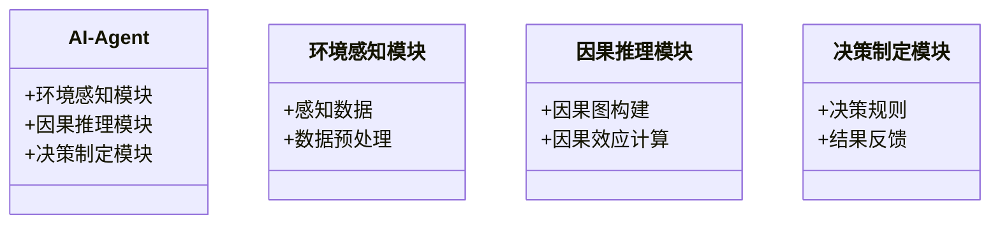
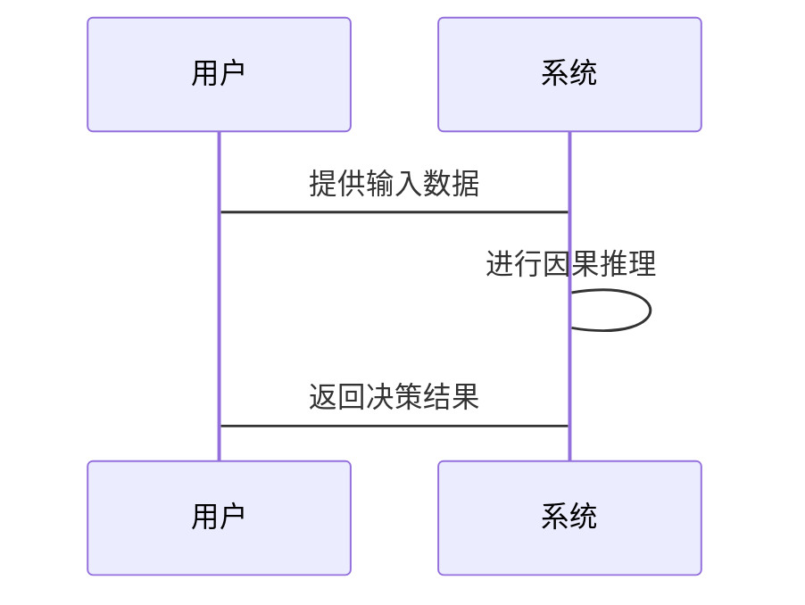

                 


# AI Agent的因果推理：增强决策能力

## 关键词
AI Agent, 因果推理, 决策能力, 反事实推理, 因果图, 系统架构, 项目实战

## 摘要
本文深入探讨AI Agent的因果推理能力，通过分析因果关系网络、反事实推理算法，结合数学模型和系统架构设计，展示如何利用因果推理增强AI Agent的决策能力。文章从基础概念到算法实现，再到系统架构和项目实战，全面解析因果推理在AI Agent中的应用。

---

## 第一部分: AI Agent的因果推理基础

### 第1章: AI Agent与因果推理概述

#### 1.1 问题背景与定义
##### 1.1.1 问题背景
在复杂的动态环境中，AI Agent需要做出高效、可靠的决策。传统基于相关性的推理方法在面对因果关系时存在局限性，因果推理成为提升决策能力的关键。

##### 1.1.2 AI Agent的定义与特点
AI Agent是一种能够感知环境、自主决策并采取行动的智能体。其特点包括自主性、反应性、目标导向性和社交能力。

##### 1.1.3 因果推理的定义与特点
因果推理研究变量间的因果关系，通过识别因果关系网络来理解事件之间的因果联系。其特点包括可解释性、干预性和动态性。

#### 1.2 问题描述与解决
##### 1.2.1 AI Agent决策问题的描述
AI Agent在决策过程中需要考虑多个变量之间的因果关系，以选择最优行动方案。

##### 1.2.2 因果推理在决策中的作用
因果推理帮助AI Agent识别因果关系，预测干预效果，从而做出更优决策。

##### 1.2.3 问题解决的边界与外延
因果推理的应用范围包括医疗诊断、金融风险评估等领域，但需注意数据质量和干预可行性。

#### 1.3 核心概念结构
##### 1.3.1 因果推理的核心要素
因果关系、干预、反事实推理是因果推理的三大核心要素。

##### 1.3.2 AI Agent的决策模型
基于因果图的决策模型能够有效处理复杂的因果关系。

##### 1.3.3 因果关系网络的构建
通过因果图构建因果关系网络，识别关键变量及其影响路径。

### 第2章: 因果推理的核心概念与联系

#### 2.1 因果推理的原理
##### 2.1.1 因果关系的定义
因果关系是变量间的一种确定性联系，X是Y的直接原因。

##### 2.1.2 因果链与因果图
因果链描述变量间的因果路径，因果图通过图结构展示变量间的关系。

##### 2.1.3 反事实推理的定义
反事实推理是通过假设相反事实，推断可能结果的推理方法。

#### 2.2 核心概念对比表
| 概念         | 相关性分析   | 条件概率推理 | 因果推理   |
|--------------|--------------|--------------|------------|
| 关注点       | 变量相关性   | 在给定条件下的概率 | 因果关系   |
| 适用场景     | 发现模式     | 预测         | 解释机制   |
| 解释能力     | 低          | 中           | 高         |

#### 2.3 ER实体关系图


---

## 第二部分: 因果推理的算法原理

### 第3章: 因果推理的数学模型与公式

#### 3.1 因果关系的数学表示
##### 3.1.1 因果图的数学表达
因果图通过结构方程表示变量间的因果关系，例如：
$$ Y = f(X, U) $$

##### 3.1.2 结构因果模型（SCM）
结构因果模型通过因果图和结构方程描述变量间的因果关系。

##### 3.1.3 隐变量模型
隐变量模型通过引入隐藏变量，更准确地描述复杂的因果关系。

#### 3.2 反事实推理的公式
##### 3.2.1 反事实推理的定义公式
反事实推理通过假设相反事实，计算可能结果：
$$ P(Y|do(X=x)) $$

##### 3.2.2 因果效应的计算公式
平均因果效应（ATE）计算公式为：
$$ ATE = E_{X}[P(Y=1|do(X=x))] - E_{X}[P(Y=0|do(X=x))] $$

##### 3.2.3 干预效果的数学表达
干预效果通过计算处理组和对照组的差异：
$$ E[Y|do(X=1)] - E[Y|do(X=0)] $$

### 第4章: 因果推理算法原理

#### 4.1 算法原理概述
##### 4.1.1 因果推理的基本算法
包括基于图的因果推理算法和基于潜在结果的因果推理算法。

##### 4.1.2 基于图的因果推理算法
通过构建因果图，识别因果路径并计算因果效应。

##### 4.1.3 基于潜在结果的因果推理算法
通过潜在结果模型，估计因果效应。

#### 4.2 算法流程图


#### 4.3 算法实现
##### 4.3.1 Python代码实现
```python
def causal_inference(data, treatment, outcome):
    # 数据预处理
    df = pd.DataFrame(data)
    # 构建因果图
    causal_graph = build_causal_graph(df.columns)
    # 识别因果路径
    paths = identify_causal_paths(causal_graph, treatment, outcome)
    # 计算因果效应
    effect = compute_causal_effect(df, paths)
    return effect
```

---

## 第三部分: 系统分析与架构设计

### 第5章: 系统功能设计
#### 5.1 领域模型设计


### 第6章: 系统架构设计
#### 6.1 系统架构图


### 第7章: 接口设计与交互流程
#### 7.1 接口设计
接口包括数据输入接口、模型调用接口和结果输出接口。

#### 7.2 交互流程


---

## 第四部分: 项目实战

### 第8章: 项目环境与安装
#### 8.1 环境要求
Python 3.8及以上版本，安装必要的库如pandas、networkx。

#### 8.2 安装步骤
```bash
pip install pandas networkx matplotlib
```

### 第9章: 核心代码实现
#### 9.1 数据预处理代码
```python
import pandas as pd

def preprocess_data(data):
    # 数据清洗和特征工程
    return processed_data
```

#### 9.2 因果图构建代码
```python
import networkx as nx

def build_causal_graph(variables):
    # 构建因果图
    return causal_graph
```

#### 9.3 决策制定代码
```python
def make_decision(data, causal_graph):
    # 基于因果图做出决策
    return decision
```

### 第10章: 案例分析与总结
#### 10.1 案例分析
通过一个医疗诊断案例，展示因果推理在决策中的应用。

#### 10.2 总结
因果推理增强了AI Agent的决策能力，使其在复杂环境中做出更优选择。

---

## 第五部分: 最佳实践与扩展阅读

### 第11章: 小结与注意事项
##### 11.1 小结
因果推理是提升AI Agent决策能力的关键技术，通过构建因果图和反事实推理，能够更准确地理解和预测因果关系。

##### 11.2 注意事项
数据质量和模型假设对因果推理结果有重要影响，需谨慎处理。

### 第12章: 拓展阅读
推荐阅读《因果推理入门》和《AI Agent原理与应用》等书籍，深入理解因果推理和AI Agent的相关知识。

---

通过以上详细的内容结构，您可以逐步展开撰写整篇文章，确保每部分内容详实，逻辑清晰。

