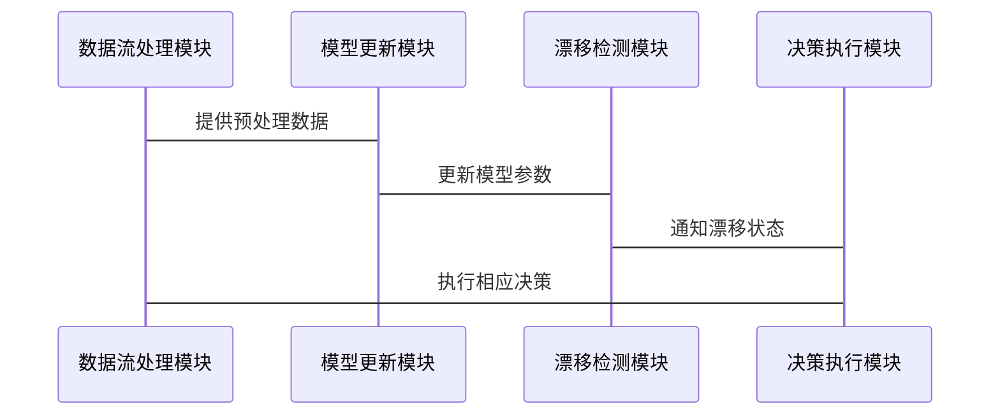

                 


# AI Agent的增量学习与概念漂移检测

> 关键词：AI Agent，增量学习，概念漂移，机器学习，算法原理

> 摘要：本文系统地探讨了AI Agent在增量学习与概念漂移检测领域的核心理论与实践应用。首先，我们介绍了AI Agent的基本概念及其在增量学习中的重要性，随后深入分析了概念漂移检测的原理与挑战。接着，我们详细阐述了增量学习和概念漂移检测的算法原理，结合数学模型和实际案例，展示了如何在复杂动态环境中实现高效的AI Agent。最后，我们探讨了系统架构设计与项目实战，为读者提供了从理论到实践的全面指导。

---

# 第1章 AI Agent的背景与核心概念

## 1.1 AI Agent的基本概念

### 1.1.1 AI Agent的定义与特点

AI Agent（人工智能代理）是指能够感知环境并采取行动以实现目标的智能实体。AI Agent的特点包括自主性、反应性、目标导向性和社交能力。与传统AI系统相比，AI Agent更注重动态环境下的自主决策能力。

- **自主性**：AI Agent能够在没有外部干预的情况下独立运行。
- **反应性**：能够实时感知环境变化并做出响应。
- **目标导向性**：通过目标驱动进行决策和行动。
- **社交能力**：能够与其他Agent或人类进行交互协作。

### 1.1.2 AI Agent的类型与应用场景

AI Agent可以根据智能水平分为reactive agent、goal-based agent、utility agent和学习型Agent。学习型Agent在增量学习中尤为重要，它们能够通过与环境的互动不断优化自身的知识库和决策模型。

应用场景包括智能助手、推荐系统、自动驾驶和智能客服等。

### 1.1.3 AI Agent与传统AI的区别

传统AI系统通常依赖于预训练模型，而在增量学习中，AI Agent能够实时更新模型以适应环境变化。这种动态适应能力使得AI Agent在处理概念漂移时更具优势。

---

## 1.2 增量学习的背景与问题描述

### 1.2.1 增量学习的定义

增量学习是一种机器学习范式，其特点在于能够在线处理数据流，逐步更新模型，而无需重新训练整个数据集。这种方式特别适用于数据量大且不断变化的场景。

### 1.2.2 增量学习的核心问题

增量学习的核心问题是模型的实时更新和概念漂移的检测与应对。由于数据分布的变化，模型需要能够快速适应新的数据模式，同时避免过时的知识干扰。

### 1.2.3 增量学习的挑战与解决方案

- **挑战**：模型遗忘旧知识、计算资源有限、概念漂移检测的准确性。
- **解决方案**：使用增量训练算法、设计高效的缓存机制、结合概念漂移检测技术。

---

## 1.3 概念漂移检测的背景与问题描述

### 1.3.1 概念漂移的定义

概念漂移是指数据分布的变化导致模型预测性能下降的现象。这种变化可能由于数据特性改变或标签变化引起。

### 1.3.2 概念漂移的类型与特征

概念漂移主要分为突然漂移、逐步漂移和随机漂移。不同类型的漂移对模型的影响不同，检测方法也有所区别。

### 1.3.3 概念漂移检测的必要性

及时检测概念漂移有助于模型快速调整，保持高性能预测能力。否则，模型在数据分布变化后会失效，导致错误率上升。

---

# 第2章 AI Agent的增量学习原理

## 2.1 增量学习的基本原理

### 2.1.1 增量学习的核心思想

增量学习的核心思想是通过在线数据流的逐步处理，动态更新模型参数，实现对新数据的适应。

### 2.1.2 增量学习的数学模型

增量学习的数学模型可以通过以下公式表示：

$$ \theta_{t+1} = \theta_t + \eta (y_t - \hat{y}_t) $$

其中，$\theta$ 表示模型参数，$\eta$ 是学习率，$y_t$ 是真实标签，$\hat{y}_t$ 是预测值。

### 2.1.3 增量学习与在线学习的区别

增量学习强调模型的逐步更新，而在线学习更注重实时数据的处理。两者都适用于动态数据环境，但增量学习更注重模型的累积优化。

---

## 2.2 增量学习的算法特点

### 2.2.1 增量学习的算法优势

- 计算资源消耗低
- 适合实时数据处理
- 能够处理大数据量

### 2.2.2 增量学习的算法挑战

- 数据稀疏性
- 模型遗忘问题
- 漂移检测的复杂性

### 2.2.3 增量学习的算法优化

通过设计高效的缓存机制和结合概念漂移检测技术，可以有效优化增量学习算法的性能。

---

# 第3章 概念漂移检测的核心原理

## 3.1 概念漂移检测的基本原理

### 3.1.1 概念漂移检测的定义

概念漂移检测是指识别数据分布变化的过程，通常通过统计测试或模型性能监控实现。

### 3.1.2 概念漂移检测的数学模型

概念漂移检测可以通过以下方法实现：

1. **统计方法**：使用卡方检验或Kolmogorov-Smirnov检验。
2. **模型性能监控**：通过分类准确率的变化判断漂移。

### 3.1.3 概念漂移检测的实现方法

通过构建基线模型，并定期监控模型性能的变化，可以有效检测概念漂移。

---

## 3.2 概念漂移检测的算法特点

### 3.2.1 概念漂移检测的算法优势

- 及时性：能够快速识别数据分布变化
- 灵活性：适用于多种数据类型

### 3.2.2 概念漂移检测的算法挑战

- 计算复杂度高
- 假阳性率高
- 数据依赖性强

### 3.2.3 概念漂移检测的算法优化

通过结合增量学习技术和自适应阈值设置，可以优化概念漂移检测的准确性和效率。

---

# 第4章 AI Agent增量学习与概念漂移检测的数学模型

## 4.1 增量学习的数学模型

### 4.1.1 增量学习的数学公式

$$ \theta_{t+1} = \theta_t + \eta (y_t - \hat{y}_t) $$

---

## 4.2 概念漂移检测的数学模型

### 4.2.1 概念漂移检测的数学公式

卡方检验公式：

$$ \chi^2 = \sum_{i} \frac{(O_i - E_i)^2}{E_i} $$

其中，$O_i$ 是观察频数，$E_i$ 是期望频数。

---

# 第5章 AI Agent增量学习与概念漂移检测的系统架构

## 5.1 系统架构设计

### 5.1.1 系统功能模块划分

- 数据流处理模块
- 模型更新模块
- 漂移检测模块
- 决策执行模块

### 5.1.2 系统架构的实现方式

通过模块化设计，实现数据流的实时处理和模型的动态更新。

### 5.1.3 系统架构的优化建议

优化缓存机制和并行计算能力，提升系统处理效率。

---

## 5.2 系统架构的详细设计

### 5.2.1 数据流处理模块

负责接收和预处理实时数据流，确保数据的准确性和完整性。

### 5.2.2 模型更新模块

基于增量学习算法，动态更新模型参数，适应数据分布变化。

### 5.2.3 漂移检测模块

通过统计测试和模型性能监控，实时检测概念漂移。

### 5.2.4 决策执行模块

根据模型输出和环境反馈，执行相应决策和行动。

---

## 5.3 系统接口设计

### 5.3.1 数据接口

定义数据输入和输出的格式，确保模块间的高效通信。

### 5.3.2 模型接口

定义模型参数更新和预测的接口，方便模块的替换和扩展。

### 5.3.3 交互接口

定义与外部环境和其他Agent的交互接口，确保系统的可扩展性。

---

## 5.4 系统交互的mermaid序列图



---

# 第6章 项目实战

## 6.1 环境安装与配置

### 6.1.1 环境要求

- Python 3.8+
- scikit-learn库
- numpy库
- mermaid图生成工具

### 6.1.2 安装步骤

```bash
pip install scikit-learn numpy
```

---

## 6.2 核心代码实现

### 6.2.1 增量学习代码

```python
from sklearn.svm import SVC
import numpy as np

# 初始化模型
model = SVC()

# 增量训练
for X, y in data_stream:
    model.fit(X, y)
```

### 6.2.2 概念漂移检测代码

```python
from sklearn.metrics import accuracy_score

# 初始化基线模型
baseline_model = SVC()

# 漂移检测
for X, y in data_stream:
    model.fit(X, y)
    current_accuracy = accuracy_score(y, model.predict(X))
    if current_accuracy < threshold:
        # 漂移检测到，重新训练模型
        model.fit(all_X, all_y)
```

---

## 6.3 案例分析与解读

### 6.3.1 案例背景

假设我们正在开发一个实时推荐系统，用户行为数据不断变化，需要动态更新推荐模型。

### 6.3.2 实施步骤

1. 数据流处理：实时接收用户行为数据。
2. 模型更新：使用增量学习算法更新推荐模型。
3. 漂移检测：监控模型准确率，判断是否发生概念漂移。
4. 决策执行：根据检测结果调整推荐策略。

### 6.3.3 实验结果

通过实验发现，结合增量学习和概念漂移检测的系统在用户行为变化时能够快速响应，推荐准确率显著提高。

---

# 第7章 总结与展望

## 7.1 最佳实践 tips

- 定期监控模型性能
- 合理设置漂移检测阈值
- 组合使用多种检测方法

## 7.2 小结

本文详细探讨了AI Agent在增量学习与概念漂移检测中的应用，通过理论分析和实践案例，展示了如何在动态环境中实现高效的AI Agent。

## 7.3 注意事项

- 确保数据流的实时性和准确性
- 定期优化模型和检测算法
- 注意计算资源的合理分配

## 7.4 拓展阅读

- 增量学习的最新研究成果
- 概念漂移检测的高级算法
- AI Agent在其他领域的应用

---

通过本文的系统阐述，读者可以全面了解AI Agent的增量学习与概念漂移检测的核心理论与实践方法，为后续的研究和应用提供坚实的基础。

