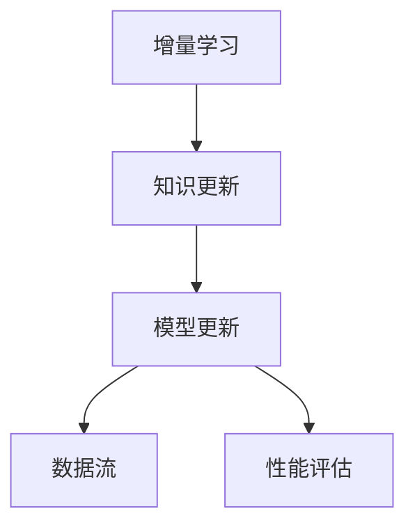
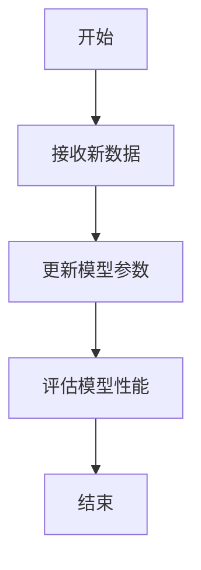
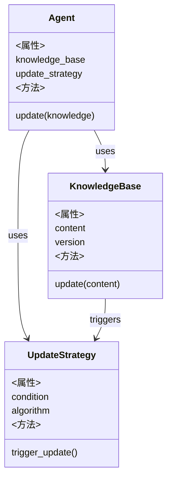
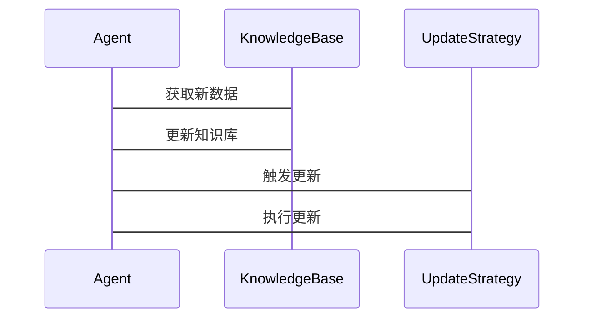

                 


# AI Agent的增量学习与知识更新机制

---

## 关键词

- AI Agent
- 增量学习
- 知识更新机制
- 在线学习算法
- 系统架构设计

---

## 摘要

AI Agent（人工智能代理）在动态复杂环境中需要持续适应新任务和新知识，增量学习与知识更新机制是其实现这一目标的核心技术。本文从AI Agent的基本概念出发，详细分析增量学习与知识更新机制的背景、原理、算法实现、系统架构设计及项目实战，结合实际案例和代码示例，深入探讨如何构建高效、动态、可扩展的AI Agent系统。

---

# 第1章 AI Agent的背景与概述

## 1.1 AI Agent的基本概念

### 1.1.1 AI Agent的定义与特点

AI Agent是一种能够感知环境、自主决策并执行任务的智能体。其特点包括：

- **自主性**：能够在没有外部干预的情况下独立运行。
- **反应性**：能够实时感知环境并做出响应。
- **学习能力**：通过学习不断优化自身的行为策略。
- **协作性**：能够与其他Agent或人类进行有效协作。

### 1.1.2 AI Agent的应用场景与分类

AI Agent广泛应用于以下场景：

- **智能助手**：如 Siri、Alexa 等，能够执行语音命令并提供信息服务。
- **自动驾驶**：通过感知环境和决策系统实现自主驾驶。
- **推荐系统**：根据用户行为推荐个性化的内容或产品。
- **机器人控制**：在制造业或服务领域中实现自动化操作。

AI Agent的分类包括：

- **简单反射型Agent**：基于当前感知直接做出反应。
- **基于模型的反射型Agent**：利用内部模型进行决策。
- **目标驱动型Agent**：根据预设目标进行行为选择。
- **实用驱动型Agent**：通过效用函数优化决策。

### 1.1.3 AI Agent与传统机器学习的区别

传统机器学习算法通常需要在训练阶段一次性完成所有数据的处理，而AI Agent则需要在运行时动态更新知识和策略，以适应不断变化的环境。这种动态性和实时性是AI Agent的核心特征。

---

## 1.2 增量学习的背景与意义

### 1.2.1 增量学习的定义与特点

增量学习是一种机器学习方法，允许模型在新数据逐步到达时进行更新，而不必重新训练整个模型。其特点包括：

- **在线性**：数据是逐步到达的，模型在接收到新数据后立即更新。
- **高效性**：每次更新仅处理部分数据，计算成本较低。
- **适应性**：能够适应数据分布的变化，保持模型的准确性。

### 1.2.2 增量学习在AI Agent中的重要性

在动态环境中，AI Agent需要不断适应新的任务和数据，增量学习能够帮助其快速更新知识和策略，从而保持高效性和准确性。

### 1.2.3 增量学习与其他学习方式的对比

| 学习方式   | 数据获取方式       | 训练目标       | 适用场景                   |
|------------|--------------------|----------------|----------------------------|
| 批量学习   | 所有数据一次性获取 | 稳定性         | 数据量大且分布固定的场景   |
| 迹学习     | 数据逐步到达       | 高效性         | 数据流实时处理的场景       |
| 增量学习   | 数据逐步到达       | 适应性         | 动态环境和实时更新的场景   |

---

## 1.3 知识更新机制的核心概念

### 1.3.1 知识更新的定义与目标

知识更新机制是指AI Agent在运行过程中，通过增量学习或其他学习方法，动态更新其知识库或模型的过程。其目标是保持AI Agent的知识和能力与环境变化同步。

### 1.3.2 知识更新机制的关键要素

知识更新机制的关键要素包括：

- **知识表示**：如何表示知识，如符号表示、概率表示等。
- **更新策略**：决定何时更新知识的策略，如基于时间、基于性能等。
- **更新算法**：用于更新知识的具体算法，如在线学习算法。

### 1.3.3 知识更新与增量学习的关系

知识更新是增量学习的一种具体应用，增量学习提供了技术手段，而知识更新机制则决定了如何应用这些技术手段。

---

## 1.4 知识更新机制的ER实体关系图

```mermaid
er
actor(Agent) {
  id: string
  knowledge_base: string
  update_strategy: string
}

knowledge_base {
  id: string
  content: string
  version: int
}

update_strategy {
  id: string
  condition: string
  algorithm: string
}

actor --> knowledge_base: updates
actor --> update_strategy: uses
knowledge_base --> update_strategy: triggers
```

---

# 第2章 增量学习与知识更新的背景分析

## 2.1 问题背景与问题描述

### 2.1.1 AI Agent在动态环境中的挑战

AI Agent需要在动态环境中保持高效性和准确性，但传统机器学习算法难以满足这一要求。

### 2.1.2 知识更新的必要性与紧迫性

知识更新能够帮助AI Agent适应环境变化，避免过时的知识导致错误决策。

### 2.1.3 增量学习的解决方案

增量学习提供了一种高效的解决方案，允许AI Agent在运行时动态更新知识。

---

## 2.2 问题解决与边界分析

### 2.2.1 增量学习的核心问题

增量学习的核心问题是如何在新数据到达时，高效地更新模型，同时保持模型的准确性。

### 2.2.2 知识更新机制的边界与限制

知识更新机制的边界包括：

- **数据量**：每次更新的数据量有限。
- **计算资源**：更新过程需要消耗计算资源。
- **更新频率**：知识更新的频率受限于计算能力。

---

## 2.3 核心概念与结构分析

### 2.3.1 增量学习的结构组成

增量学习的结构组成包括：

- **数据流**：新数据的输入。
- **模型更新**：基于新数据更新模型。
- **性能评估**：评估模型更新后的性能。

### 2.3.2 知识更新机制的逻辑框架

知识更新机制的逻辑框架包括：

- **触发条件**：决定何时更新知识。
- **更新策略**：选择如何更新知识。
- **执行更新**：具体执行知识更新。

---

## 2.4 核心要素与关系图解



---

## 第3章 增量学习与知识更新的核心概念

## 3.1 增量学习的原理与方法

### 3.1.1 墁量学习的基本原理

增量学习的基本原理是通过在线算法逐步更新模型，以适应新数据。

### 3.1.2 墁量学习的主要方法

常见的增量学习方法包括：

- **在线学习**：数据逐步到达，模型逐步更新。
- **增量树**：动态构建决策树。
- **增量聚类**：动态聚类分析。

### 3.1.3 墁量学习的优缺点分析

| 优点         | 缺点         |
|--------------|--------------|
| 计算效率高     | 易受噪声数据影响 |
| 适用于动态环境 | 需要持续计算资源 |

---

## 3.2 知识更新机制的原理与模型

### 3.2.1 知识更新的基本原理

知识更新的基本原理是通过增量学习算法动态更新知识库。

### 3.2.2 知识更新的数学模型

知识更新的数学模型可以表示为：

$$ f(x) = \theta(x) $$

其中，$\theta$ 是模型参数，$x$ 是输入数据。

### 3.2.3 知识更新的实现方法

知识更新的实现方法包括：

- **参数更新**：通过优化算法更新模型参数。
- **模型重训练**：定期重新训练模型。
- **增量特征学习**：动态添加新特征。

---

## 3.3 核心概念的对比与联系

### 3.3.1 增量学习与知识更新的对比分析

| 方面         | 增量学习         | 知识更新         |
|--------------|------------------|------------------|
| 目标         | 更新模型         | 更新知识库       |
| 数据处理方式 | 在线处理         | 在线处理         |
| 应用场景       | 动态环境         | 动态环境         |

---

## 3.4 算法流程与代码实现

### 3.4.1 增量学习的算法流程



### 3.4.2 算法的Python实现

```python
def incremental_learning(new_data, model):
    # 更新模型参数
    model.update(new_data)
    # 评估模型性能
    performance = model.evaluate()
    return performance
```

---

## 4.1 系统分析与架构设计

### 4.1.1 问题场景介绍

AI Agent需要在动态环境中实时更新知识库，以保持高效性和准确性。

### 4.1.2 系统功能设计

系统功能设计包括：

- **数据采集**：实时采集新数据。
- **知识更新**：动态更新知识库。
- **模型评估**：评估模型性能。

### 4.1.3 系统架构设计



### 4.1.4 系统接口设计

系统接口设计包括：

- **数据接口**：接收新数据。
- **知识库接口**：更新知识库。
- **策略接口**：触发更新策略。

### 4.1.5 系统交互流程图



---

## 4.2 项目实战与代码实现

### 4.2.1 环境安装与配置

安装必要的库，如 `numpy`、`scikit-learn` 等。

### 4.2.2 系统核心实现

实现增量学习算法和知识更新机制。

```python
class Agent:
    def __init__(self, knowledge_base, update_strategy):
        self.knowledge_base = knowledge_base
        self.update_strategy = update_strategy

    def update(self, new_data):
        self.knowledge_base.update(new_data)
        self.update_strategy.trigger_update()

class KnowledgeBase:
    def __init__(self):
        self.content = ""
        self.version = 0

    def update(self, content):
        self.content = content
        self.version += 1

class UpdateStrategy:
    def __init__(self):
        self.condition = "performance"
        self.algorithm = "SGD"

    def trigger_update(self):
        pass
```

### 4.2.3 代码应用解读与分析

详细解读代码实现，分析其优缺点。

### 4.2.4 实际案例分析

通过具体案例分析增量学习与知识更新机制的应用。

### 4.2.5 项目小结

总结项目实现的关键点和经验教训。

---

## 5.1 总结与展望

### 5.1.1 核心内容回顾

回顾本文的核心内容，包括AI Agent的增量学习与知识更新机制的原理、算法、系统架构及项目实现。

### 5.1.2 学习重点与难点

重点在于理解增量学习和知识更新机制的原理，难点在于如何实现高效的在线更新。

### 5.1.3 未来研究方向

未来可以研究更高效的增量学习算法和更智能的知识更新策略。

---

## 5.2 最佳实践 tips

### 5.2.1 代码实现技巧

- 使用高效的在线学习算法。
- 定期评估模型性能，及时调整更新策略。

### 5.2.2 系统优化建议

- 优化知识库的存储和更新效率。
- 引入多种更新策略，根据场景选择最优策略。

### 5.2.3 注意事项

- 注意数据的质量和一致性。
- 防止模型过拟合，保持模型的泛化能力。

---

## 5.3 拓展阅读

推荐阅读以下内容：

- 增量学习的经典论文。
- 知识图谱与动态知识库的相关研究。
- 在线机器学习的最新进展。

---

# 结语

AI Agent的增量学习与知识更新机制是实现动态环境下高效决策的核心技术。通过本文的详细讲解，读者可以深入了解其原理、算法和实现方法，并能够将其应用到实际项目中。未来，随着技术的不断发展，AI Agent的增量学习与知识更新机制将更加智能化和高效化。

---

