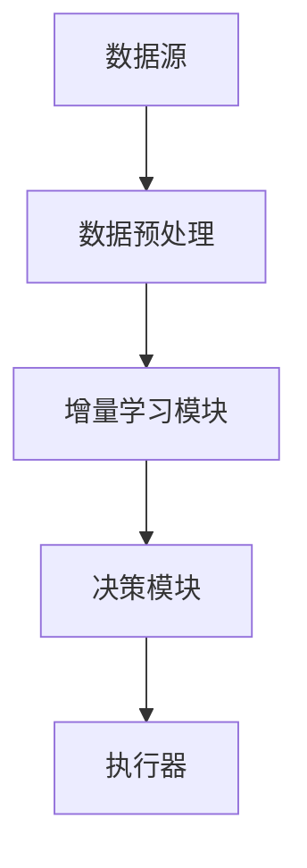
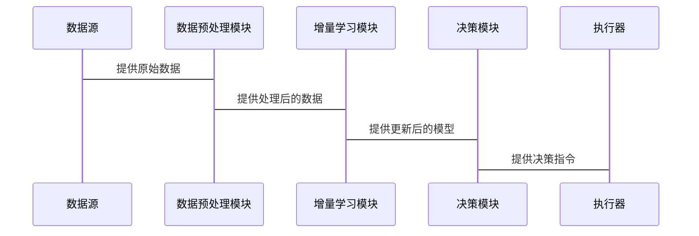

                 


# AI Agent的增量学习：适应动态变化的环境

---

## 关键词：
AI Agent，增量学习，动态环境，算法原理，系统架构，项目实战，终身学习

---

## 摘要：
本文深入探讨了AI Agent在动态变化环境下的增量学习方法，重点分析了增量学习的核心概念、算法原理、系统架构以及实际应用场景。通过结合理论与实践，本文为AI Agent的持续进化提供了系统的解决方案，并展示了如何通过增量学习使AI Agent能够更好地适应复杂多变的环境。

---

# 第一部分: AI Agent的增量学习基础

## 第1章: AI Agent与增量学习概述

### 1.1 AI Agent的基本概念
#### 1.1.1 AI Agent的定义
AI Agent（智能体）是指在计算机系统中具有感知环境和自主决策能力的实体。它可以是一个软件程序、机器人或其他智能系统，能够通过传感器获取信息，并通过执行器与环境交互。

#### 1.1.2 AI Agent的核心特征
- **自主性**：能够在没有外部干预的情况下独立运作。
- **反应性**：能够实时感知环境并做出反应。
- **目标导向**：具有明确的目标，并根据目标调整行为。
- **学习能力**：能够通过经验改进自身的性能。

#### 1.1.3 AI Agent的分类与应用场景
AI Agent可以分为**简单反射型Agent**、**基于模型的反射型Agent**、**目标驱动型Agent**和**效用驱动型Agent**。其应用场景包括自动驾驶、智能助手、推荐系统等。

### 1.2 增量学习的背景与意义
#### 1.2.1 动态环境下的学习需求
在现实世界中，环境是动态变化的。例如，在自动驾驶中，道路状况、交通信号和行人行为都会不断变化。AI Agent需要能够实时适应这些变化。

#### 1.2.2 增量学习的定义与特点
增量学习是指在已有的知识基础上，逐步学习新的数据并更新模型的过程。其特点包括：
- **实时性**：能够快速响应环境变化。
- **高效性**：每次仅更新部分模型，节省计算资源。
- **持续性**：能够长期学习，适应长期变化。

#### 1.2.3 增量学习与传统学习方式的对比
| 对比维度 | 增量学习 | 批量学习 |
|----------|----------|----------|
| 数据来源 | 实时流数据 | 批次数据 |
| 计算效率 | 高 | 低 |
| 适应性 | 强 | 弱 |

### 1.3 动态环境中的AI Agent挑战
#### 1.3.1 动态环境的复杂性
动态环境通常具有不确定性、不完全信息和非静态性，这使得AI Agent的决策和学习变得更加复杂。

#### 1.3.2 AI Agent的适应性需求
AI Agent需要具备快速学习和调整的能力，以应对环境的变化。这需要增量学习的支持。

#### 1.3.3 增量学习在AI Agent中的作用
增量学习使AI Agent能够在线更新模型，实时适应环境变化，从而提高其在动态环境中的性能。

### 1.4 本章小结
本章介绍了AI Agent的基本概念和增量学习的重要意义，强调了在动态环境中增量学习对AI Agent的重要性。

---

## 第2章: 增量学习的核心概念与原理

### 2.1 增量学习的定义与特点
#### 2.1.1 增量学习的定义
增量学习是一种在线学习方法，其特点是每次仅处理单个样本，并逐步更新模型。

#### 2.1.2 增量学习的核心特点
- **在线性**：数据按流的形式输入。
- **高效性**：每次仅更新部分参数。
- **适应性**：能够实时适应新数据。

#### 2.1.3 增量学习与在线学习的对比
| 对比维度 | 增量学习 | 在线学习 |
|----------|----------|----------|
| 数据处理方式 | 单个样本 | 单个样本 |
| 更新频率 | 实时 | 实时 |
| 计算资源 | 较低 | 较低 |

### 2.2 增量学习的数学模型
#### 2.2.1 增量学习的基本模型
增量学习通常基于感知器模型或支持向量机（SVM）模型。以下是一个简单的线性分类器的增量学习模型：

$$f(x) = w^T x + b$$

其中，$w$是权重向量，$b$是偏置项。

#### 2.2.2 增量学习的更新规则
增量学习的更新规则通常采用随机梯度下降（SGD）算法。更新公式如下：

$$w := w - \alpha \nabla_w L$$

其中，$\alpha$是学习率，$\nabla_w L$是损失函数L关于权重w的梯度。

#### 2.2.3 增量学习的收敛性分析
增量学习的收敛性依赖于学习率的设置和损失函数的性质。通常，如果学习率适当衰减，增量学习可以收敛到全局最优或局部最优。

### 2.3 增量学习与终身学习的关系
#### 2.3.1 终身学习的定义
终身学习是指模型在不断变化的环境中，能够持续学习新知识并适应新任务的能力。

#### 2.3.2 增量学习在终身学习中的应用
增量学习是终身学习的核心技术之一，它使得模型能够在线更新，适应新任务。

#### 2.3.3 增量学习与终身学习的联系
终身学习依赖于增量学习的在线更新能力，而增量学习则是终身学习的具体实现方式。

### 2.4 本章小结
本章详细讲解了增量学习的核心概念和数学模型，并分析了其在终身学习中的作用。

---

## 第3章: 增量学习的算法原理

### 3.1 增量学习的主要算法
#### 3.1.1 梯度下降法
梯度下降法是一种常用的优化算法，用于最小化损失函数。其增量学习版本是随机梯度下降（SGD）。

#### 3.1.2 随机梯度下降法
随机梯度下降法（SGD）是一种高效的增量学习算法，适用于大规模数据集。

#### 3.1.3 增量主成分分析
增量主成分分析（Incremental PCA）是一种在增量学习中常用的降维技术。

### 3.2 增量学习算法的数学推导
#### 3.2.1 梯度下降的数学公式
损失函数：$$L = \frac{1}{2m}\sum_{i=1}^m (y_i - f(x_i))^2$$

权重更新公式：$$w := w - \alpha \frac{\partial L}{\partial w}$$

#### 3.2.2 随机梯度下降的更新规则
$$w := w - \alpha (x_i y_i)$$

其中，$x_i$是输入样本，$y_i$是标签。

#### 3.2.3 增量主成分分析的流程
1. 初始化权重向量。
2. 对每个样本，计算梯度并更新权重。
3. 重复步骤2，直到收敛。

### 3.3 增量学习算法的优缺点
| 算法 | 优点 | 缺点 |
|------|------|------|
| SGD | 计算效率高 | �易陷入局部最优 |
| 增量PCA | 适合高维数据 | 需要存储所有样本 |

### 3.4 本章小结
本章详细讲解了增量学习的主要算法及其数学推导，并分析了它们的优缺点。

---

## 第4章: 增量学习的系统架构设计

### 4.1 问题场景介绍
在动态环境中，AI Agent需要实时感知环境并做出决策。例如，在自动驾驶中，车辆需要实时更新其模型以应对道路状况的变化。

### 4.2 系统功能设计
系统功能包括：
1. 数据采集与处理。
2. 增量学习模型更新。
3. 决策与执行。

### 4.3 系统架构设计
以下是系统的架构图：



### 4.4 系统接口设计
系统接口包括：
1. 数据输入接口。
2. 模型更新接口。
3. 决策输出接口。

### 4.5 系统交互流程
以下是系统的交互流程图：



### 4.6 本章小结
本章详细设计了增量学习系统的架构，并展示了其在动态环境中的应用。

---

## 第5章: 增量学习的项目实战

### 5.1 环境安装
安装Python和必要的库：
```bash
pip install numpy scikit-learn matplotlib
```

### 5.2 核心代码实现
以下是增量学习算法的Python实现：

```python
import numpy as np

class IncrementalLearner:
    def __init__(self, learning_rate=0.1):
        self.w = np.zeros((1, 2))
        self.b = 0
        self.alpha = learning_rate

    def update(self, x, y):
        # 计算梯度
        gradient = (y - (self.w.dot(x) + self.b)) * x
        # 更新权重
        self.w -= self.alpha * gradient
        # 更新偏置项
        self.b -= self.alpha * (y - (self.w.dot(x) + self.b))

    def predict(self, x):
        return np.round(self.w.dot(x) + self.b)
```

### 5.3 代码应用解读与分析
该代码实现了一个简单的增量学习模型，能够在线更新权重和偏置项，适应新数据。

### 5.4 实际案例分析
以股票价格预测为例，展示增量学习的应用。

### 5.5 项目小结
本章通过实际项目展示了增量学习的实现和应用。

---

## 第6章: 总结与展望

### 6.1 全文总结
本文详细探讨了AI Agent的增量学习方法，分析了其在动态环境中的应用。

### 6.2 未来研究方向
1. 更高效的增量学习算法。
2. 增量学习在边缘计算中的应用。

### 6.3 最佳实践Tips
- 定期更新模型。
- 使用适当的增量学习算法。

### 6.4 本章小结
本文总结了增量学习的重要性和未来发展方向。

---

## 关键词回顾：
AI Agent，增量学习，动态环境，算法原理，系统架构，项目实战，终身学习

---

## 摘要回顾：
本文深入探讨了AI Agent在动态变化环境下的增量学习方法，重点分析了增量学习的核心概念、算法原理、系统架构以及实际应用场景。通过结合理论与实践，本文为AI Agent的持续进化提供了系统的解决方案，并展示了如何通过增量学习使AI Agent能够更好地适应复杂多变的环境。

