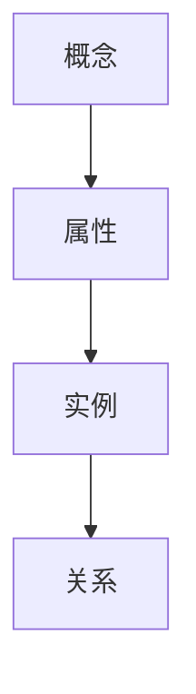
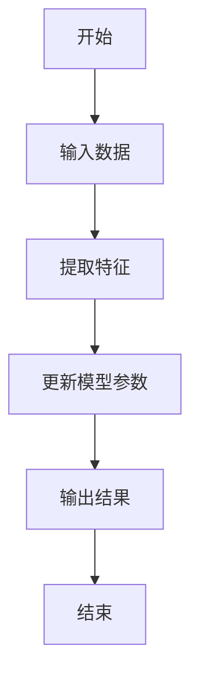
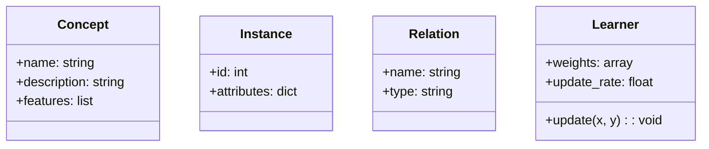
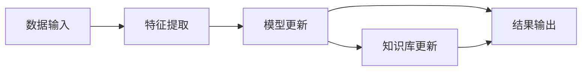
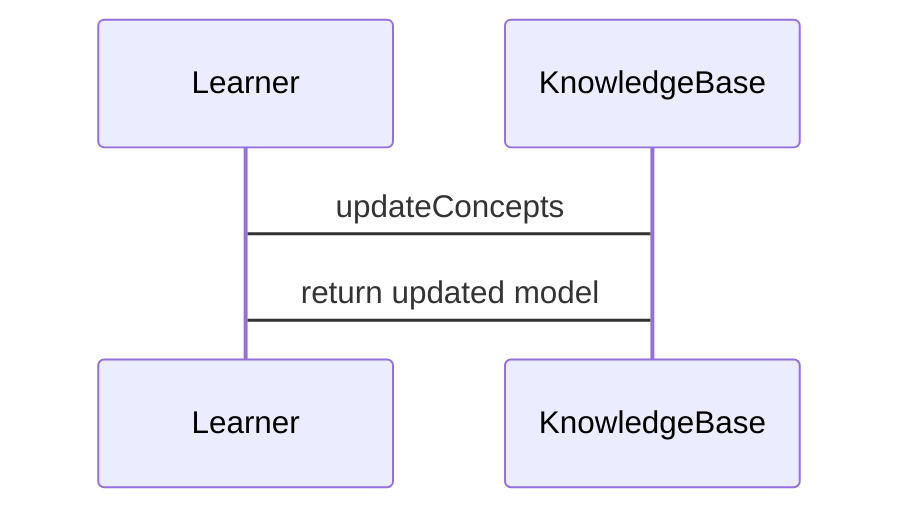

                 


# AI Agent的增量式概念学习与知识更新

## 关键词：
- AI Agent
- 增量式学习
- 知识更新
- 概念学习
- 系统架构
- 算法原理

## 摘要：
AI Agent的增量式概念学习与知识更新是人工智能领域的重要研究方向。本文从背景介绍、核心概念、算法原理、系统架构、项目实战等多个角度，详细探讨了AI Agent如何通过增量式学习不断更新知识和概念。文章通过实例分析和理论推导，揭示了增量式学习在AI Agent中的重要性，并提出了有效的实现方法和系统设计思路。

---

## 第一部分: AI Agent的增量式概念学习与知识更新背景介绍

### 第1章: 问题背景与概念描述

#### 1.1 问题背景
- **AI Agent的基本概念**：AI Agent是一种能够感知环境并自主决策的智能体，广泛应用于机器人、自动驾驶、智能助手等领域。
- **知识更新的必要性**：AI Agent需要不断适应动态变化的环境，知识更新是其实现自适应能力的关键。
- **增量式学习的定义与特点**：增量式学习是指在已有知识的基础上，逐步学习新概念和新知识，具有实时性、高效性和动态性的特点。

#### 1.2 问题描述
- **知识更新的核心问题**：如何在不重置已有知识的情况下，高效地更新和扩展知识库。
- **增量式概念学习的挑战**：如何在增量学习过程中保持知识的准确性和一致性，同时处理概念 drift（概念漂移）问题。
- **知识更新与概念学习的关联**：知识更新为概念学习提供新的数据和背景，而概念学习则通过更新的知识提升AI Agent的理解能力。

#### 1.3 问题解决思路
- **增量式学习的基本策略**：采用在线学习算法，逐步更新模型参数。
- **知识更新的实现方法**：通过增量式分类算法和对抗概念 drift 的方法，实现动态知识库的维护。
- **概念学习与知识更新的结合**：将增量式学习与知识图谱相结合，构建动态知识库。

#### 1.4 边界与外延
- **增量式学习的边界**：仅处理增量数据，不涉及已有知识的重置。
- **知识更新的范围**：包括数据、模型和规则的更新。
- **概念学习的适用场景**：适用于动态环境中的实时学习和自适应任务。

#### 1.5 概念结构与核心要素
- **概念表示的数学模型**：使用向量空间模型表示概念。
- **知识更新的核心要素**：包括数据流、模型更新和知识验证。
- **增量式学习的系统组成**：包括数据输入、特征提取、模型更新和知识输出。

---

## 第二部分: 核心概念与联系

### 第2章: 增量式概念学习的原理

#### 2.1 核心概念原理
- **概念表示的数学模型**：使用向量空间模型，例如Word2Vec，将概念表示为高维向量。
- **增量式学习的基本算法**：采用在线学习算法，如Perceptron，逐步更新分类器。
- **知识更新的机制**：通过增量式分类算法，动态更新分类模型，适应新数据。

#### 2.2 概念属性特征对比
| 特性         | 增量式学习         | 一次性学习         |
|--------------|--------------------|--------------------|
| 数据处理     | 实时处理新数据     | 需要全部数据一次性处理 |
| 学习效率     | 适合在线场景       | 适合离线场景       |
| 知识更新     | 支持动态更新       | 知识固定后不可更新  |

#### 2.3 ER实体关系图


---

## 第三部分: 算法原理讲解

### 第3章: 增量式概念学习算法

#### 3.1 算法原理
- **在线学习算法**：采用Perceptron算法，逐步更新分类器参数。
  $$w_{t+1} = w_t + \eta(y_t - y_t w_t^T x_t) x_t$$
- **增量式分类算法**：通过更新权重向量，实现分类模型的实时更新。
- **概念 drift 对抗方法**：检测数据分布的变化，调整学习率和模型结构。

#### 3.2 算法流程图


#### 3.3 代码实现
```python
class IncrementalLearner:
    def __init__(self, eta=0.1):
        self.eta = eta
        self.weights = np.zeros((n_features, 1))
    
    def update(self, x, y):
        # x: 输入向量，shape (n_features, 1)
        # y: 标签，0或1
        prediction = np.dot(self.weights.T, x)
        error = y - (1 / (1 + np.exp(-prediction)))
        self.weights += self.eta * error * x
```

---

## 第四部分: 系统分析与架构设计

### 第4章: 系统架构设计

#### 4.1 问题场景介绍
- **系统目标**：设计一个支持增量式概念学习的AI Agent，实现动态知识更新。
- **项目介绍**：构建一个增量式学习系统，应用于智能问答和推荐系统。

#### 4.2 领域模型设计


#### 4.3 系统架构设计


#### 4.4 接口设计与交互


---

## 第五部分: 项目实战

### 第5章: 项目实现与案例分析

#### 5.1 环境安装
- **Python环境**：安装numpy、scikit-learn、mermaid等库。

#### 5.2 核心代码实现
```python
import numpy as np

class IncrementalLearner:
    def __init__(self, eta=0.1):
        self.eta = eta
        self.weights = np.zeros((n_features, 1))
    
    def update(self, x, y):
        prediction = np.dot(self.weights.T, x)
        error = y - (1 / (1 + np.exp(-prediction)))
        self.weights += self.eta * error * x
```

#### 5.3 代码解读与分析
- **类初始化**：`__init__`方法初始化权重向量和学习率。
- **更新方法**：`update`方法计算预测值，计算误差，并更新权重。

#### 5.4 案例分析
- **增量式学习案例**：训练一个增量式分类器，逐步更新模型参数，实现动态分类。

---

## 第六部分: 总结与展望

### 第6章: 总结与展望

#### 6.1 核心内容总结
- **增量式学习的重要性**：实现动态知识更新，适应环境变化。
- **算法实现的关键点**：在线学习算法和概念 drift 对抗方法。

#### 6.2 最佳实践 tips
- **数据预处理**：确保数据质量和一致性。
- **模型评估**：定期评估模型性能，及时调整学习策略。
- **知识库管理**：设计高效的知识存储和更新机制。

#### 6.3 小结
- 增量式概念学习是AI Agent实现自适应能力的关键技术。
- 通过在线学习算法和动态知识更新，AI Agent能够实时适应环境变化。

#### 6.4 注意事项
- **概念 drift 检测**：及时发现数据分布变化，避免模型过时。
- **系统稳定性**：确保增量式学习过程的稳定性，防止模型崩溃。

#### 6.5 拓展阅读
- **推荐书籍**：《Incremental Learning: Theory and Algorithms》
- **相关论文**：《Incremental Learning with Concept Drift》

---

通过本文的详细探讨，读者可以全面了解AI Agent的增量式概念学习与知识更新的核心原理、算法实现和系统设计，为实际应用提供理论支持和实践指导。

