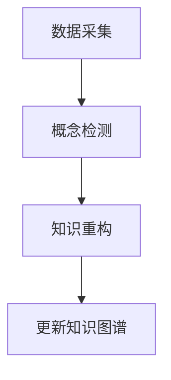
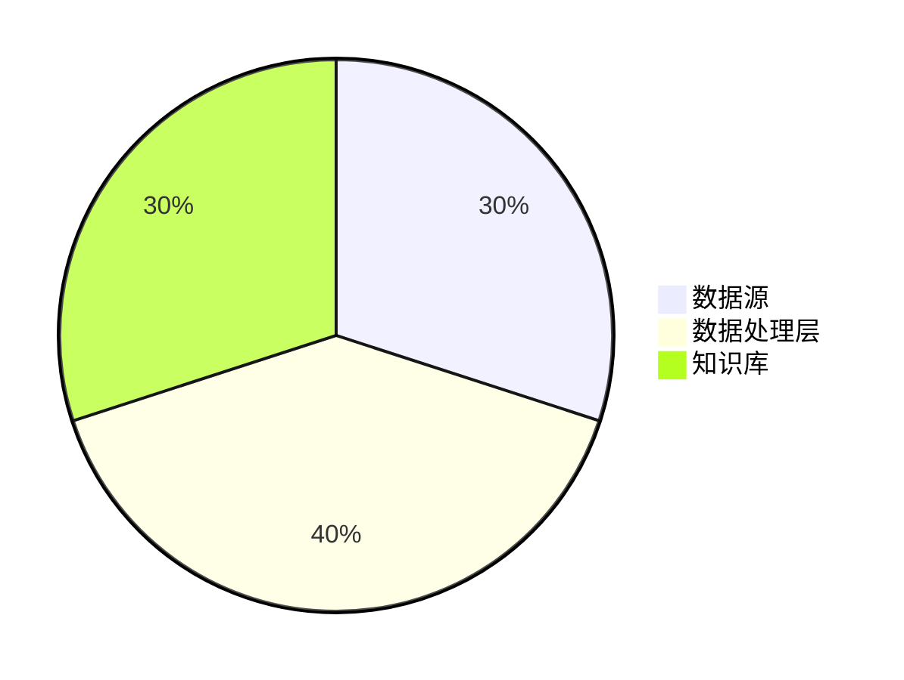
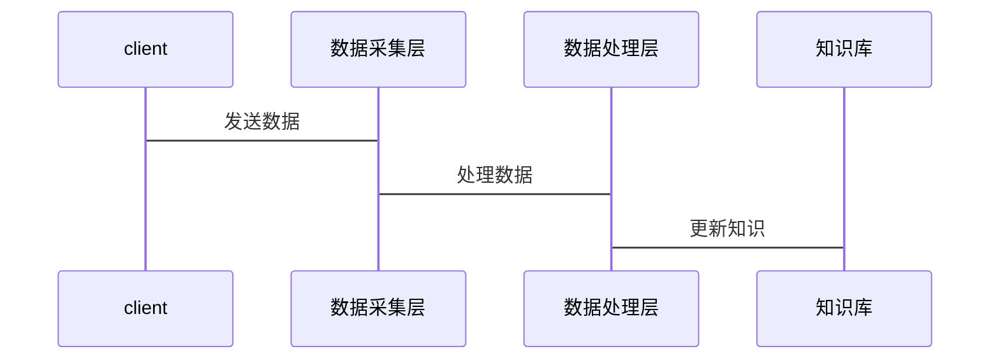

                 


# AI Agent的增量式概念形成与知识重构

> 关键词：AI Agent，增量式学习，知识重构，概念漂移，知识图谱

> 摘要：本文探讨AI Agent如何通过增量式概念形成和知识重构来适应动态环境。通过详细分析核心概念、算法原理和系统架构，结合实际案例，展示如何在实际项目中应用这些技术，实现动态知识更新和高效问题解决。

---

## 第1章 AI Agent与增量式概念形成概述

### 1.1 AI Agent的基本概念

#### 1.1.1 AI Agent的定义
AI Agent（人工智能代理）是能够感知环境并采取行动以实现目标的智能实体。它可以是一个软件程序或物理设备，通过与环境交互来完成特定任务。

#### 1.1.2 增量式学习的定义与特点
增量式学习是一种机器学习方法，系统在接收到新的数据样本时逐步更新模型，而非一次性训练整个数据集。其特点包括实时性、高效性和适应性。

#### 1.1.3 概念形成与知识重构的背景
在动态环境中，AI Agent需要不断更新其知识库以应对变化。概念形成和知识重构是实现这一目标的核心机制。

---

### 1.2 增量式概念形成的意义

#### 1.2.1 动态知识更新的需求
在实时应用中，数据不断变化，AI Agent需要快速适应新信息，保持知识库的准确性。

#### 1.2.2 增量式学习的优势
相比批量学习，增量式学习更高效，特别是在数据量大且动态变化的场景中。

#### 1.2.3 知识重构的应用场景
在推荐系统、实时数据分析等领域，知识重构帮助AI Agent保持高效性能。

---

### 1.3 问题背景与目标

#### 1.3.1 问题背景分析
动态环境中，数据分布变化导致模型性能下降，需通过增量式学习保持模型准确性。

#### 1.3.2 问题描述
AI Agent在处理增量数据时，如何有效更新知识库，保持对新概念的理解。

#### 1.3.3 问题解决的必要性
及时更新知识库是AI Agent在动态环境中生存和发展的关键。

#### 1.3.4 边界与外延
增量式概念形成主要关注知识更新机制，不涉及模型训练的初始阶段。

---

## 第2章 增量式概念形成的核心机制

### 2.1 概念漂移检测

#### 2.1.1 概念漂移的定义
概念漂移指数据分布的变化导致模型预测性能下降的现象。

#### 2.1.2 概念漂移检测算法
- 窗口法：比较新旧数据窗口的统计特征。
- 统计测试法：使用卡方检验等方法检测分布差异。

#### 2.1.3 漂移检测的实现步骤
1. 定义窗口大小。
2. 计算窗口内数据的统计指标。
3. 比较新旧窗口的统计指标，判断是否发生漂移。

---

### 2.2 增量式学习算法

#### 2.2.1 增量学习的基本原理
通过逐步更新模型参数，适应新数据的变化。

#### 2.2.2 增量学习与批量学习的对比
- 处理数据量：增量式学习适合实时数据，批量学习适合离线数据。
- 训练时间：增量式学习更高效。

---

### 2.3 知识图谱的构建与更新

#### 2.3.1 知识图谱的定义
知识图谱是结构化数据的图形表示，用于表示实体及其关系。

#### 2.3.2 知识图谱的构建流程
1. 数据抽取：从文本中提取实体和关系。
2. 数据融合：整合多源数据，消除冗余。
3. 数据建模：构建实体和关系的模型。

#### 2.3.3 知识图谱的更新机制
- 持续学习：定期更新知识图谱，适应新数据。

---

## 第3章 系统分析与架构设计方案

### 3.1 系统功能设计

#### 3.1.1 系统功能
- 数据采集：实时收集新数据。
- 概念检测：检测概念漂移。
- 知识重构：更新知识图谱。

#### 3.1.2 系统功能流程图


### 3.2 系统架构设计

#### 3.2.1 系统架构图


#### 3.2.2 系统交互序列图


---

## 第4章 项目实战

### 4.1 环境配置

```bash
pip install numpy
pip install scikit-learn
pip install networkx
```

### 4.2 核心代码实现

```python
import numpy as np
from sklearn.naive_bayes import GaussianNB

# 初始化模型
model = GaussianNB()

# 增量更新模型
def incremental_fit(model, X, y):
    model.fit(X, y)
    return model

# 示例数据
X = np.array([[1, 2], [3, 4]])
y = np.array([0, 1])

# 更新模型
model = incremental_fit(model, X, y)
```

### 4.3 案例分析

#### 4.3.1 案例背景
在一个实时推荐系统中，用户行为数据不断变化，需要实时更新推荐模型。

#### 4.3.2 案例实现步骤
1. 数据采集：实时收集用户行为数据。
2. 概念检测：检测数据分布的变化。
3. 知识重构：更新推荐模型。

---

## 第5章 总结与展望

### 5.1 总结
本文详细探讨了AI Agent的增量式概念形成与知识重构，分析了核心机制和实现方法。

### 5.2 展望
未来研究可以关注更高效的增量式算法和分布式知识重构技术。

### 5.3 最佳实践 Tips
- 定期更新知识库，保持模型准确性。
- 监控数据变化，及时调整模型。

---

通过以上步骤，AI Agent能够高效地适应动态环境，实现知识的持续更新和优化。

