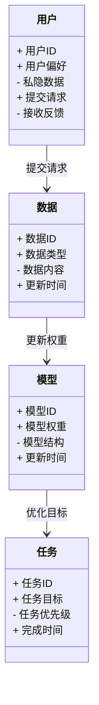
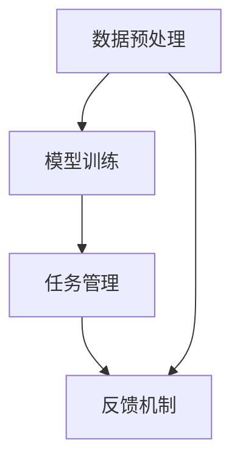
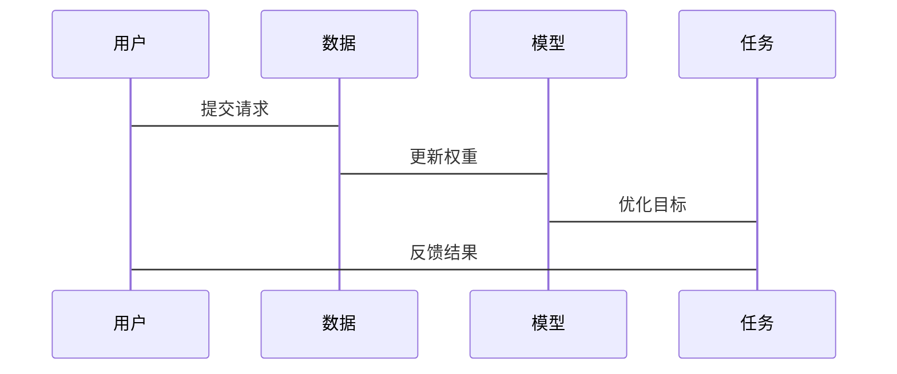

                 


# AI Agent的增量式终身学习框架

## 关键词：AI Agent，增量式学习，终身学习，机器学习，深度学习，强化学习

## 摘要：  
本文详细探讨了AI Agent的增量式终身学习框架，分析了其核心概念、算法原理、系统架构，并通过实际案例展示了其应用场景。文章从背景介绍开始，逐步深入，结合理论与实践，为读者提供了一个全面了解和实现AI Agent增量式终身学习框架的指南。

---

# 第一部分：背景介绍

## 第1章：AI Agent的基本概念

### 1.1 AI Agent的定义与特点  
AI Agent（人工智能代理）是指能够感知环境、自主决策并采取行动的智能体。其核心特点包括：  
1. **自主性**：能够在没有外部干预的情况下自主运行。  
2. **反应性**：能够实时感知环境并做出反应。  
3. **目标导向**：基于目标驱动行为，优化决策过程。  
4. **学习能力**：通过学习提升自身的智能水平和适应能力。  

AI Agent的应用场景广泛，包括智能助手、自动驾驶、机器人控制、推荐系统等。  

### 1.2 增量式学习的必要性  
在实际应用中，数据、任务和环境通常是动态变化的。传统的批量学习方法无法应对这种变化，因此需要一种能够持续学习和适应的机制——增量式学习。  

#### 1.2.1 数据量的动态变化  
数据是AI Agent学习的基础，增量式学习允许数据逐步引入，避免了批量学习对大量数据一次性需求的限制。  

#### 1.2.2 任务的动态变化  
任务目标可能会随时间变化，增量式学习能够动态调整学习策略，确保AI Agent能够持续优化其性能。  

#### 1.2.3 环境的动态变化  
在动态环境中，AI Agent需要不断调整其行为策略以适应新的环境条件，增量式学习提供了灵活性和适应性。  

### 1.3 终身学习的背景与意义  
终身学习是一种机器学习范式，旨在使模型能够持续学习和适应新的数据、任务和环境。对于AI Agent而言，终身学习能力使其能够在复杂多变的环境中保持高性能。  

#### 1.3.1 终身学习的定义  
终身学习是指模型在不断接收新数据的过程中，能够持续更新和优化自身的知识表示和决策策略。  

#### 1.3.2 终身学习在AI Agent中的应用  
在自动驾驶中，AI Agent需要不断学习新的道路规则和交通场景；在智能助手中，需要持续优化用户的偏好理解和对话能力。  

#### 1.3.3 终身学习的优势  
- **适应性强**：能够应对动态变化的环境。  
- **学习效率高**：通过持续学习，避免了批量学习的资源浪费。  
- **实时性好**：能够快速响应新任务和新数据。  

### 1.4 框架的整体架构  
增量式终身学习框架通常由数据预处理模块、学习算法模块、模型更新模块和任务管理模块组成。这些模块协同工作，确保AI Agent能够持续学习和优化。  

---

# 第二部分：核心概念与原理

## 第2章：增量式学习的核心概念  

### 2.1 增量式学习的原理  
增量式学习的核心在于逐步引入数据，逐步更新模型。其流程包括数据预处理、模型训练、模型评估和模型优化。  

#### 2.1.1 数据的逐步引入  
数据可以按批次或流式引入，模型在每一步中仅处理部分数据，避免了对大量数据的一次性处理需求。  

#### 2.1.2 模型的逐步更新  
模型在每一步中根据当前数据进行微调，逐步逼近最优解。  

#### 2.1.3 任务的逐步优化  
任务目标可能随时间变化，增量式学习能够动态调整学习策略，确保任务目标的实现。  

### 2.2 终身学习的核心概念  

#### 2.2.1 终身学习的实现方法  
终身学习通常采用经验重放机制、模型蒸馏和多任务学习等方法。  

### 2.3 数据、模型、任务的动态关系  

#### 2.3.1 数据的变化对模型的影响  
新数据的引入可能导致模型权重的调整，从而影响模型的预测能力。  

#### 2.3.2 任务的变化对模型的影响  
任务目标的变化可能导致模型需要重新优化其权重，以适应新的任务需求。  

#### 2.3.3 模型的动态更新与适应  
模型通过持续学习新数据和新任务，逐步优化其性能，适应动态变化的环境。  

---

## 第三部分：算法原理讲解

## 第3章：增量式学习的算法原理  

### 3.1 增量式学习的流程  

#### 3.1.1 数据预处理  
数据预处理包括数据清洗、特征提取和数据增强。  

#### 3.1.2 模型初始化  
模型初始化通常采用随机权重或预训练权重。  

#### 3.1.3 模型训练  
模型在每一步中仅处理部分数据，逐步更新其权重。  

#### 3.1.4 模型评估  
通过验证集评估模型的性能，调整学习率和正则化参数。  

#### 3.1.5 模型优化  
采用优化算法（如SGD、Adam）逐步优化模型权重。  

### 3.2 经验重放机制  

#### 3.2.1 经验重放的定义  
经验重放是指将过去的经验存储在记忆库中，并随机采样进行训练。  

#### 3.2.2 经验重放的作用  
- **缓解数据稀疏性**：通过复用历史数据，增加训练数据的多样性。  
- **加速收敛**：通过随机采样，减少梯度偏移的影响。  

### 3.3 模型更新策略  

#### 3.3.1 模型更新的必要性  
模型需要不断更新以适应新数据和新任务。  

#### 3.3.2 模型更新的方法  
- **在线更新**：实时更新模型权重。  
- **离线更新**：批量更新模型权重。  

---

## 第四部分：系统分析与架构设计

## 第4章：系统应用场景  

### 4.1 问题场景介绍  
本文将通过一个智能助手的应用场景，展示增量式终身学习框架的实际应用。  

### 4.2 系统功能设计  

#### 4.2.1 领域模型设计  
领域模型展示了系统中各实体之间的关系，包括用户、数据、模型和任务。  



### 4.3 系统架构设计  

#### 4.3.1 系统架构图  
系统架构图展示了各模块之间的关系，包括数据预处理模块、模型训练模块、任务管理模块和反馈机制模块。  



### 4.4 系统接口设计  

#### 4.4.1 系统接口设计  
系统接口包括数据接口、模型接口和任务接口。  

- **数据接口**：负责数据的输入和输出。  
- **模型接口**：负责模型的训练和更新。  
- **任务接口**：负责任务的分配和管理。  

### 4.5 系统交互流程  

#### 4.5.1 系统交互流程图  
系统交互流程图展示了用户、数据、模型和任务之间的交互流程。  



---

## 第五部分：项目实战

## 第5章：项目实战  

### 5.1 环境搭建  

#### 5.1.1 安装必要的库  
需要安装的库包括TensorFlow、PyTorch、scikit-learn等。  

```bash
pip install tensorflow==2.5.0
pip install torch==1.9.0
pip install scikit-learn==0.24.1
```

### 5.2 核心代码实现  

#### 5.2.1 数据预处理代码  
```python
import numpy as np
from sklearn.model_selection import train_test_split

# 示例数据
X = np.random.randn(100, 2)
y = np.random.randint(0, 2, 100)

# 数据分割
X_train, X_test, y_train, y_test = train_test_split(X, y, test_size=0.2)
```

#### 5.2.2 模型训练代码  
```python
import torch
import torch.nn as nn
import torch.optim as optim

# 定义模型
class SimpleModel(nn.Module):
    def __init__(self, input_dim, output_dim):
        super(SimpleModel, self).__init__()
        self.linear = nn.Linear(input_dim, output_dim)
    
    def forward(self, x):
        return self.linear(x)

# 初始化模型
model = SimpleModel(2, 1)
criterion = nn.BCEWithLogitsLoss()
optimizer = optim.Adam(model.parameters(), lr=0.01)

# 训练过程
for epoch in range(100):
    outputs = model(X_train)
    loss = criterion(outputs, y_train.unsqueeze(1).float())
    optimizer.zero_grad()
    loss.backward()
    optimizer.step()
```

### 5.3 案例分析  

#### 5.3.1 案例分析  
通过一个简单的分类任务，展示增量式学习框架的应用。  

### 5.4 性能测试与优化  

#### 5.4.1 模型性能测试  
在测试集上评估模型的准确率和F1分数。  

#### 5.4.2 模型优化  
通过调整学习率和批量大小，进一步优化模型性能。  

### 5.5 项目小结  
通过项目实战，验证了增量式终身学习框架的有效性和实用性。  

---

## 第六部分：最佳实践

## 第6章：最佳实践  

### 6.1 框架的优势  
- **灵活性**：能够适应动态变化的数据、任务和环境。  
- **高效性**：通过逐步学习，避免了批量学习的资源浪费。  

### 6.2 应用中的注意事项  
- **数据质量**：确保数据的准确性和代表性。  
- **模型选择**：根据任务需求选择合适的模型结构。  
- **学习策略**：合理设计学习策略，避免梯度偏移和模型退化。  

### 6.3 未来研究方向  
- **多任务学习**：探索增量式学习在多任务场景中的应用。  
- **在线学习**：研究在线增量式学习的算法优化。  

### 6.4 拓展阅读  
推荐阅读以下书籍和论文：  
- 《Deep Learning》——Ian Goodfellow  
- 《Incremental Learning: Algorithms and Applications》——A. Aranha et al.  

---

## 第七部分：小结

通过本文的详细讲解，读者可以全面了解AI Agent的增量式终身学习框架的核心概念、算法原理、系统架构和实际应用。增量式终身学习框架为动态环境下的AI Agent提供了一种灵活、高效的学习方法，具有广泛的应用前景。  

--- 

# 结语  
AI Agent的增量式终身学习框架是人工智能领域的重要研究方向，未来随着技术的不断发展，其应用将更加广泛和深入。希望本文能够为读者提供有价值的参考和启发，推动这一领域的进一步研究和应用。

