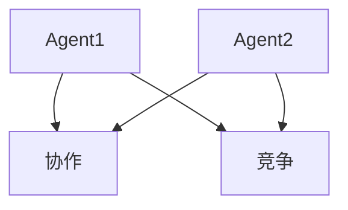
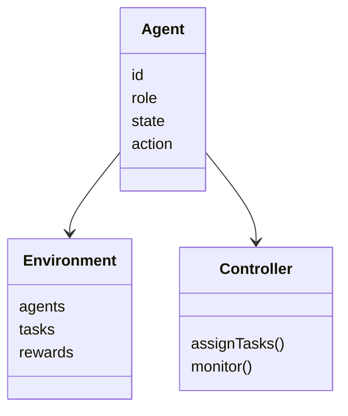
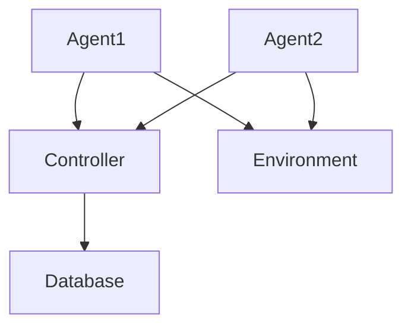
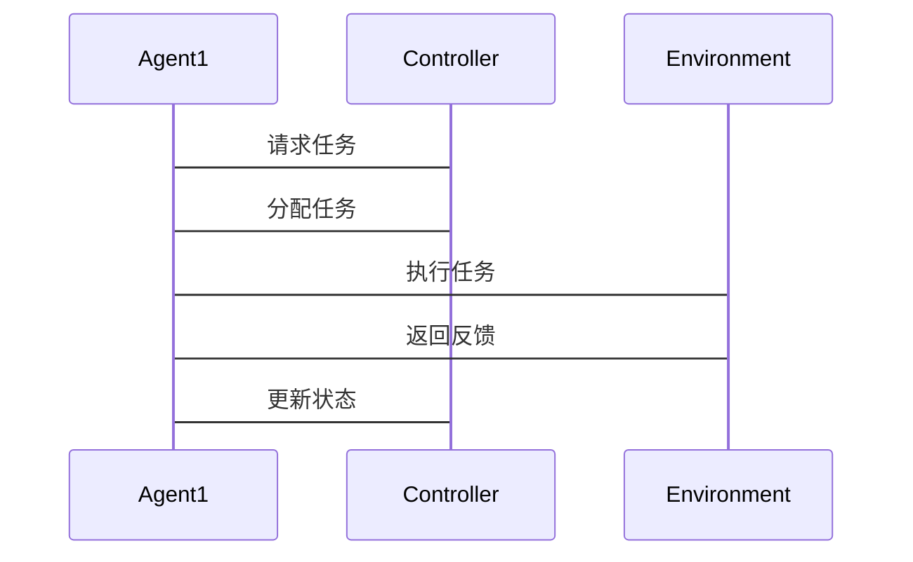

                 


# AI Agent的多Agent协作与竞争学习系统

## 关键词：
多Agent系统，AI Agent，协作与竞争，学习系统，算法原理，系统架构

## 摘要：
本文详细探讨了AI Agent在多Agent协作与竞争学习系统中的应用，分析了多Agent系统的背景、核心概念、协作与竞争机制、算法原理及系统架构。通过具体案例分析和代码实现，展示了如何构建高效、智能的多Agent协作与竞争学习系统，并提出了最佳实践建议。

---

## 第1章 多Agent系统与AI Agent概述

### 1.1 多Agent系统的基本概念

#### 1.1.1 多Agent系统的定义
多Agent系统（Multi-Agent System, MAS）是由多个智能体（Agent）组成的分布式系统，这些智能体通过协作和竞争完成特定任务。每个智能体具有自主性、反应性、社会性和学习能力。

#### 1.1.2 多Agent系统的特征
- **自主性**：每个Agent能够独立决策。
- **反应性**：Agent能够感知环境并实时响应。
- **社会性**：Agent之间可以通信、协作和竞争。
- **分布式性**：系统由多个独立的Agent组成，没有中央控制节点。

#### 1.1.3 多Agent系统的分类
1. **协作型多Agent系统**：Agent之间协作完成任务。
2. **竞争型多Agent系统**：Agent之间通过竞争完成任务。
3. **混合型多Agent系统**：结合协作与竞争机制。

### 1.2 AI Agent的基本原理

#### 1.2.1 AI Agent的定义
AI Agent是一种智能体，能够感知环境、执行任务并优化决策。AI Agent通常基于机器学习算法，如强化学习和深度学习。

#### 1.2.2 AI Agent的核心属性
- **感知能力**：通过传感器或数据输入感知环境。
- **决策能力**：基于感知信息做出决策。
- **学习能力**：通过与环境互动优化决策模型。
- **执行能力**：通过动作执行器完成任务。

#### 1.2.3 AI Agent与传统Agent的区别
| 属性       | AI Agent                     | 传统Agent                  |
|------------|-------------------------------|-----------------------------|
| 智能性     | 高，基于机器学习             | 低，基于规则或逻辑         |
| 学习能力   | 强，能够优化决策模型         | 无或弱                     |
| 适应性     | 强，能够自适应环境变化       | 较弱，通常需要人工干预     |

### 1.3 多Agent协作与竞争学习系统的背景

#### 1.3.1 问题背景与问题描述
多Agent系统在现实应用中面临复杂的协作与竞争问题，例如在自动驾驶、机器人协作、分布式任务分配等领域。

#### 1.3.2 多Agent协作与竞争学习的必要性
- **提高系统效率**：通过协作优化资源利用。
- **增强系统鲁棒性**：通过竞争机制避免单点故障。
- **适应动态环境**：通过学习机制应对环境变化。

#### 1.3.3 系统的边界与外延
- **系统边界**：系统内部的协作与竞争机制。
- **系统外延**：与其他系统（如用户界面、数据库）的接口。

---

## 第2章 多Agent协作与竞争机制

### 2.1 多Agent协作机制

#### 2.1.1 协作的定义与特征
协作是指多个Agent共同完成任务，通常通过通信和协商实现。

#### 2.1.2 协作的基本原理
- **通信**：Agent之间通过消息传递信息。
- **协商**：Agent通过协商分配任务。
- **协调**：通过协调机制确保任务顺利执行。

#### 2.1.3 协作的实现方式
1. **分布式协作**：Agent在分布式环境中协作。
2. **集中式协作**：通过中央协调器进行协作。

### 2.2 多Agent竞争机制

#### 2.2.1 竞争的定义与特征
竞争是指多个Agent为了资源或目标而进行的竞争。

#### 2.2.2 竞争的基本原理
- **资源分配**：通过竞争机制分配资源。
- **激励机制**：通过激励机制促进竞争。
- **平衡机制**：防止竞争过度。

#### 2.2.3 竞争的实现方式
1. **零和游戏**：竞争双方的收益总和为零。
2. **非零和游戏**：竞争双方的收益总和大于零。

### 2.3 协作与竞争的平衡

#### 2.3.1 协作与竞争的关系
协作与竞争是相互关联的，可以通过动态平衡实现系统的优化。

#### 2.3.2 协作与竞争的动态平衡
- **动态平衡**：根据环境变化调整协作与竞争的比例。
- **平衡机制**：通过反馈机制实现动态平衡。

#### 2.3.3 协作与竞争的优化策略
1. **协作优先**：在任务需求明确时优先协作。
2. **竞争优先**：在资源紧张时优先竞争。
3. **协作与竞争结合**：根据实际情况灵活调整。

### 2.4 核心概念对比分析

#### 2.4.1 协作与竞争的属性特征对比
| 属性       | 协作                          | 竞争                          |
|------------|-------------------------------|-------------------------------|
| 目标       | 完成任务                      | 获取资源或优势                |
| 机制       | 协商与协作                    | 激励与竞争                    |
| 结果       | 高效完成任务                  | 资源分配优化                  |

#### 2.4.2 协作与竞争的ER实体关系图



---

## 第3章 多Agent协作与竞争学习算法

### 3.1 分布式强化学习算法

#### 3.1.1 分布式强化学习的定义
分布式强化学习（Distributed Reinforcement Learning, DRL）是一种多Agent协作与竞争的学习方法，通过多个智能体协作完成任务。

#### 3.1.2 分布式强化学习的基本原理
- **多智能体协作**：通过通信和协作实现任务目标。
- **竞争机制**：通过竞争机制优化智能体行为。
- **学习机制**：通过强化学习更新策略。

#### 3.1.3 分布式强化学习的实现步骤
1. **环境初始化**：设置环境和任务目标。
2. **智能体初始化**：初始化多个智能体。
3. **智能体协作与竞争**：智能体通过协作与竞争完成任务。
4. **学习更新**：通过强化学习更新智能体策略。
5. **结果输出**：输出任务完成结果。

### 3.2 多智能体协作算法

#### 3.2.1 多智能体协作算法的定义
多智能体协作算法是一种通过协作实现任务目标的算法。

#### 3.2.2 多智能体协作算法的基本原理
- **任务分配**：通过协商分配任务。
- **协作执行**：通过协作完成任务。
- **反馈机制**：通过反馈机制优化协作策略。

#### 3.2.3 多智能体协作算法的实现步骤
1. **任务分配**：通过协商分配任务。
2. **协作执行**：智能体协作完成任务。
3. **反馈优化**：通过反馈机制优化协作策略。

### 3.3 竞争与协作的动态平衡算法

#### 3.3.1 动态平衡的定义
动态平衡是指在协作与竞争之间动态调整，以实现系统优化。

#### 3.3.2 动态平衡的实现原理
- **反馈机制**：通过反馈机制调整协作与竞争的比例。
- **平衡机制**：通过平衡机制实现动态平衡。

#### 3.3.3 动态平衡的数学模型
$$ \text{平衡状态} = \text{协作比例} \times \text{协作收益} + \text{竞争比例} \times \text{竞争收益} $$

### 3.4 算法实现的Python代码示例

#### 3.4.1 环境安装与配置
```bash
pip install gym numpy
```

#### 3.4.2 核心算法实现代码
```python
import gym
import numpy as np

class MultiAgentAlgorithm:
    def __init__(self, num_agents):
        self.num_agents = num_agents
        self.env = gym.make('Multi-Agent-Environment-v0')
    
    def协作与竞争(self):
        for i in range(self.num_agents):
            # 协作
            self.协作(i)
            # 竞争
            self.竞争(i)
    
    def 学习更新(self):
        # 更新策略
        pass

if __name__ == "__main__":
    algorithm = MultiAgentAlgorithm(5)
    algorithm.协作与竞争()
```

#### 3.4.3 代码运行与结果分析
- **协作结果**：任务完成情况。
- **竞争结果**：资源分配情况。

---

## 第4章 多Agent协作与竞争学习系统的分析与架构设计

### 4.1 问题场景介绍
在分布式任务分配中，多个AI Agent需要协作与竞争以优化资源利用。

### 4.2 系统功能设计

#### 4.2.1 领域模型


#### 4.2.2 系统架构


### 4.3 系统接口设计
- **Agent接口**：感知环境、执行动作。
- **环境接口**：提供任务和反馈。
- **控制器接口**：分配任务和监控系统。

### 4.4 系统交互流程图



---

## 第5章 项目实战：构建多Agent协作与竞争学习系统

### 5.1 环境安装与配置
```bash
pip install gym matplotlib numpy
```

### 5.2 核心代码实现

#### 5.2.1 Agent类
```python
class Agent:
    def __init__(self, id):
        self.id = id
        self.state = 0
        self.reward = 0
```

#### 5.2.2 环境类
```python
class Environment:
    def __init__(self, num_agents):
        self.agents = [Agent(i) for i in range(num_agents)]
        self.tasks = [i for i in range(num_agents)]
```

#### 5.2.3 控制器类
```python
class Controller:
    def __init__(self, environment):
        self.environment = environment
    
    def assign_tasks(self):
        for agent in self.environment.agents:
            task = self.environment.tasks.pop()
            agent.state = task
```

### 5.3 代码运行与结果分析
```python
env = Environment(5)
controller = Controller(env)
controller.assign_tasks()

for agent in env.agents:
    print(f"Agent {agent.id} assigned task {agent.state}")
```

### 5.4 案例分析与详细解读
通过上述代码实现一个多Agent协作与竞争学习系统，分析其任务分配和资源利用情况。

### 5.5 项目小结
本项目展示了如何构建一个多Agent协作与竞争学习系统，通过代码实现和案例分析，验证了系统的可行性和有效性。

---

## 第6章 最佳实践与总结

### 6.1 协作与竞争学习系统的优缺点

#### 优点
- **高效性**：通过协作优化资源利用。
- **鲁棒性**：通过竞争避免单点故障。
- **适应性**：通过学习适应动态环境。

#### 缺点
- **复杂性**：协作与竞争机制的设计和实现较为复杂。
- **计算资源需求**：需要较高的计算资源。

### 6.2 应用建议
- **协作优先**：在任务需求明确时优先协作。
- **竞争优先**：在资源紧张时优先竞争。
- **协作与竞争结合**：根据实际情况灵活调整。

### 6.3 小结
本文详细探讨了AI Agent的多Agent协作与竞争学习系统，通过理论分析和实践案例，展示了如何构建高效、智能的多Agent协作与竞争学习系统。

### 6.4 注意事项
- **系统设计**：确保系统架构清晰。
- **算法选择**：根据实际需求选择合适的算法。
- **资源管理**：合理分配计算资源。

### 6.5 拓展阅读
- **推荐书籍**：《Multi-Agent Systems: Algorithmic, Complexity, and Reasoning》
- **推荐论文**：《Distributed Reinforcement Learning in Multi-Agent Systems》

---

## 结语
通过本文的学习，读者可以全面了解AI Agent的多Agent协作与竞争学习系统的核心概念、算法原理和系统架构，并能够通过实际案例分析和代码实现，掌握如何构建高效的多Agent协作与竞争学习系统。

