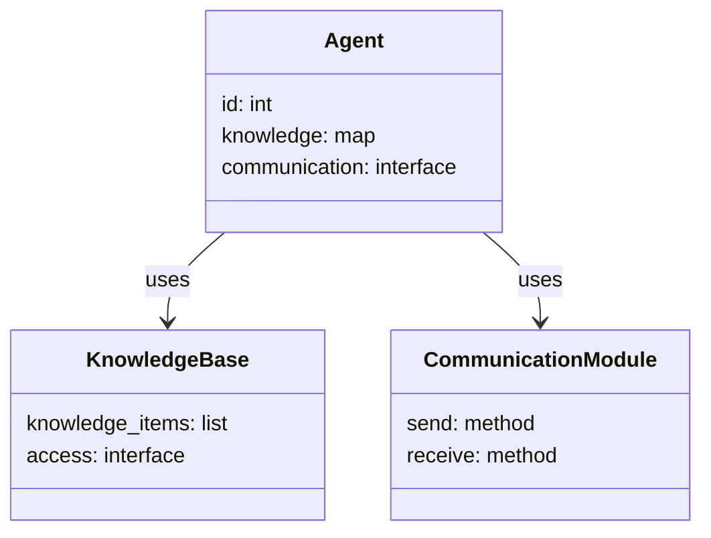
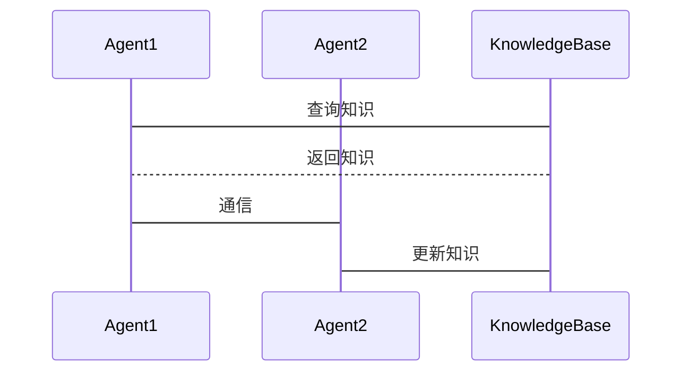

                 


# AI Agent的多Agent协作学习与知识共享

## 关键词：AI Agent, 多Agent协作学习, 知识共享, 分布式强化学习, 多智能体协作网络

## 摘要：  
本文深入探讨AI Agent的多Agent协作学习与知识共享的核心理论、算法实现和系统设计。从AI Agent的基本概念出发，分析多Agent协作学习的背景、原理与挑战，重点阐述知识共享的机制与实现。通过分布式强化学习和多智能体协作网络的算法案例，展示如何实现高效的多Agent协作学习与知识共享。文章还结合实际项目案例，详细讲解系统架构设计、接口设计与实现，并总结最佳实践与未来研究方向。

---

# 第1章: AI Agent与多Agent协作学习概述

## 1.1 AI Agent的基本概念  
### 1.1.1 什么是AI Agent  
AI Agent（人工智能代理）是指能够感知环境、自主决策并执行任务的智能实体。AI Agent具备以下核心特征：  
1. **自主性**：无需外部干预，自主完成任务。  
2. **反应性**：能够感知环境并实时响应。  
3. **目标导向性**：基于目标驱动行为。  
4. **学习能力**：通过经验改进性能。  

AI Agent的典型应用场景包括自动驾驶、智能助手（如Siri）、推荐系统等。  

### 1.1.2 AI Agent的类型与特点  
AI Agent可以分为以下几类：  
1. **简单反射Agent**：基于固定的规则执行任务。  
2. **基于模型的反射Agent**：利用内部模型进行决策。  
3. **目标驱动Agent**：以目标为导向进行行为选择。  
4. **效用驱动Agent**：通过最大化效用函数来优化决策。  

### 1.1.3 AI Agent的智能层次模型  
AI Agent的智能层次模型包括以下层次：  
1. **反应层**：基于当前感知做出反应。  
2. **规划层**：基于目标制定计划。  
3. **学习层**：通过经验改进智能体的能力。  
4. **协作层**：与多个智能体协同完成复杂任务。  

## 1.2 多Agent协作学习的背景与意义  
### 1.2.1 单Agent学习与多Agent学习的对比  
单Agent学习是指单个智能体独立完成任务的学习过程，而多Agent协作学习是指多个智能体协同完成任务的学习过程。多Agent协作学习的优势在于：  
1. **任务分解**：通过分工合作提高效率。  
2. **知识互补**：多个智能体共享知识，提升整体智能。  
3. **容错性**：通过协作降低单点失败的风险。  

### 1.2.2 多Agent协作学习的优势  
1. **分布式计算能力**：多个智能体协同计算，提升整体性能。  
2. **知识共享**：通过协作实现知识的高效共享与利用。  
3. **适应性增强**：多个智能体能够动态调整策略，适应复杂环境。  

### 1.2.3 多Agent协作学习的应用场景  
1. **机器人协作**：多机器人协同完成复杂任务，如物流配送、灾害救援。  
2. **分布式推荐系统**：多个智能体协同推荐，提升推荐效果。  
3. **游戏AI**：多个AI Agent协作完成游戏任务，如MOBA游戏中的团队协作。  

## 1.3 知识共享的核心概念  
### 1.3.1 知识共享的定义与特点  
知识共享是指多个智能体之间交换信息、经验和知识的过程。知识共享的特点包括：  
1. **动态性**：知识不断更新与变化。  
2. **协作性**：通过协作实现知识的高效共享。  
3. **多样性**：知识来源多样，形式多样。  

### 1.3.2 知识共享的挑战与解决方案  
1. **知识表示**：如何有效地表示和传递知识是关键。  
2. **知识冲突**：不同智能体的知识可能冲突，需要协调一致。  
3. **隐私与安全**：知识共享可能涉及隐私和安全问题。  

### 1.3.3 知识共享与多Agent协作学习的关系  
知识共享是多Agent协作学习的核心机制，通过知识共享，多个智能体能够协同学习、优化决策并提升整体性能。  

## 1.4 本章小结  
本章介绍了AI Agent的基本概念、多Agent协作学习的背景与意义，以及知识共享的核心概念与挑战。通过这些内容，读者可以理解多Agent协作学习与知识共享的重要性和基本原理。

---

# 第2章: 多Agent协作学习的理论基础

## 2.1 多Agent协作学习的基本原理  
### 2.1.1 多Agent协作学习的定义  
多Agent协作学习是指多个智能体通过协作与共享，共同完成学习任务的过程。  

### 2.1.2 多Agent协作学习的核心要素  
1. **协作目标**：明确的协作任务目标。  
2. **知识共享机制**：智能体之间共享知识的机制。  
3. **决策机制**：基于共享知识做出决策的机制。  

### 2.1.3 多Agent协作学习的数学模型  
多Agent协作学习的数学模型可以用以下公式表示：  
$$ V(s) = \max_{a} Q(s,a) $$  
其中，$V(s)$表示状态$s$的价值，$Q(s,a)$表示状态$s$下动作$a$的Q值。  

## 2.2 知识共享的模型与机制  
### 2.2.1 知识共享的模型构建  
知识共享模型包括知识表示、知识存储和知识传输三个部分。  

### 2.2.2 知识共享的机制与流程  
知识共享的流程可以分为以下步骤：  
1. **知识表示**：将知识转化为可共享的形式。  
2. **知识传输**：通过通信模块传输知识。  
3. **知识整合**：接收端智能体整合接收到的知识。  

### 2.2.3 知识共享的评价指标  
1. **知识共享效率**：知识共享的速度与效率。  
2. **知识共享质量**：共享知识的准确性和完整性。  
3. **知识共享安全性**：共享过程中的安全与隐私保护。  

## 2.3 多Agent协作学习与知识共享的关系  
### 2.3.1 多Agent协作学习中的知识共享  
多Agent协作学习需要智能体之间共享知识，以实现协作目标。  

### 2.3.2 知识共享对多Agent协作学习的促进作用  
知识共享能够提升多Agent协作学习的效率与效果，增强智能体的协作能力。  

### 2.3.3 多Agent协作学习与知识共享的协同进化  
多Agent协作学习与知识共享相互促进，共同推动智能体的协作能力与知识水平的提升。  

## 2.4 本章小结  
本章详细探讨了多Agent协作学习的理论基础与知识共享的模型与机制，分析了两者之间的关系，为后续的算法实现与系统设计奠定了理论基础。

---

# 第3章: 多Agent协作学习的算法与实现

## 3.1 分布式强化学习算法  
### 3.1.1 分布式强化学习的定义与特点  
分布式强化学习是指多个智能体通过分布式计算和协作学习完成任务的强化学习方法。  

### 3.1.2 分布式强化学习的核心算法  
分布式强化学习的核心算法包括：  
1. **分布式Q-learning**：多个智能体分别学习Q值，通过通信共享知识。  
2. **多智能体协作网络**：通过网络结构实现智能体之间的协作与知识共享。  

### 3.1.3 分布式强化学习的数学模型  
分布式强化学习的数学模型可以用以下公式表示：  
$$ Q_i(s,a) = Q_i(s,a) + \alpha \left(r + \max_j Q_j(s',a') - Q_i(s,a)\right) $$  
其中，$Q_i(s,a)$表示智能体$i$在状态$s$下动作$a$的Q值，$\alpha$表示学习率，$r$表示奖励，$\max_j Q_j(s',a')$表示其他智能体在新状态下的最大Q值。  

## 3.2 多智能体协作网络  
### 3.2.1 多智能体协作网络的定义  
多智能体协作网络是指通过网络结构实现多个智能体协作与知识共享的系统。  

### 3.2.2 多智能体协作网络的实现流程  
1. **知识表示**：将知识转化为网络节点。  
2. **网络构建**：通过网络结构实现智能体之间的协作。  
3. **知识共享**：通过网络实现知识的动态共享与更新。  

### 3.2.3 多智能体协作网络的优化算法  
多智能体协作网络的优化算法包括：  
1. **参数优化**：通过优化算法（如梯度下降）优化网络参数。  
2. **知识更新**：通过通信模块实现知识的动态更新。  

## 3.3 本章小结  
本章详细介绍了分布式强化学习算法与多智能体协作网络的实现，分析了它们在多Agent协作学习中的应用，为后续的系统设计与项目实现奠定了基础。

---

# 第4章: 系统分析与架构设计

## 4.1 问题场景分析  
本系统的目标是实现多个AI Agent的协作学习与知识共享，应用场景包括智能机器人协作、分布式推荐系统等。  

## 4.2 系统功能设计  
### 4.2.1 领域模型设计  
通过mermaid类图展示系统的领域模型：  


### 4.2.2 系统架构设计  
通过mermaid架构图展示系统的架构设计：  


### 4.2.3 系统接口设计  
系统接口包括：  
1. **知识共享接口**：实现知识的上传、下载与查询功能。  
2. **通信接口**：实现智能体之间的通信与数据交互。  

### 4.2.4 系统交互设计  
通过mermaid序列图展示系统的交互过程：  


## 4.3 本章小结  
本章通过对问题场景的分析，设计了系统的功能模块、架构和接口，为系统的实现提供了清晰的指导。

---

# 第5章: 项目实战

## 5.1 环境安装与配置  
### 5.1.1 安装Python环境  
安装Python 3.8以上版本，并安装必要的库（如numpy、tensorflow、scikit-learn等）。  

### 5.1.2 安装依赖项  
通过pip安装必要的依赖项：  
```bash
pip install numpy tensorflow scikit-learn
```

## 5.2 系统核心实现  
### 5.2.1 知识共享模块的实现  
实现知识共享模块的核心代码如下：  
```python
class KnowledgeSharingModule:
    def __init__(self):
        self.knowledge_base = {}
        
    def share_knowledge(self, agent_id, knowledge):
        self.knowledge_base[agent_id] = knowledge
        
    def receive_knowledge(self, agent_id):
        return self.knowledge_base.get(agent_id, {})
```

### 5.2.2 多智能体协作网络的实现  
实现多智能体协作网络的核心代码如下：  
```python
import numpy as np

class MultiAgentCollaborationNetwork:
    def __init__(self, num_agents):
        self.num_agents = num_agents
        self.communication_matrix = np.zeros((num_agents, num_agents))
        
    def communicate(self, sender, receiver, knowledge):
        self.communication_matrix[sender, receiver] = 1
        # 更新接收端的知识
        receiver.knowledge.update(knowledge)
```

## 5.3 案例分析与实现  
### 5.3.1 案例分析  
以多智能体协作网络为例，分析系统的实现过程。  

### 5.3.2 代码实现与解读  
实现多智能体协作网络的代码如下：  
```python
class Agent:
    def __init__(self, id):
        self.id = id
        self.knowledge = {}
        
    def share_knowledge(self, knowledge):
        # 分享知识到知识库
        knowledge_sharing_module.share_knowledge(self.id, knowledge)
        
    def receive_knowledge(self):
        # 获取知识库中的知识
        return knowledge_sharing_module.receive_knowledge(self.id)

# 初始化知识共享模块
knowledge_sharing_module = KnowledgeSharingModule()

# 初始化多个Agent
agents = [Agent(i) for i in range(3)]

# Agent 0分享知识
agents[0].share_knowledge({'name': 'John', 'age': 25})

# Agent 1获取知识
print(agents[1].receive_knowledge())  # 输出：{'name': 'John', 'age': 25}
```

## 5.4 项目总结  
本章通过具体的项目实战，展示了如何实现多Agent协作学习与知识共享系统，验证了理论的可行性和实际应用价值。

---

# 第6章: 总结与展望

## 6.1 总结  
本文深入探讨了AI Agent的多Agent协作学习与知识共享的核心理论、算法实现和系统设计。通过理论分析与实践案例，展示了多Agent协作学习与知识共享的实现过程与实际应用。  

## 6.2 最佳实践Tips  
1. **知识表示**：选择合适的知识表示方法，提升知识共享的效率。  
2. **通信机制**：设计高效的通信机制，确保智能体之间的有效协作。  
3. **系统架构**：根据实际需求设计系统的架构，确保系统的可扩展性和可维护性。  

## 6.3 未来研究方向  
1. **多Agent协作学习的优化算法**：研究更高效的多Agent协作学习算法。  
2. **知识共享的安全性**：提升知识共享的安全性与隐私保护能力。  
3. **多Agent协作学习的应用场景扩展**：探索更多领域的应用，如智慧城市、医疗健康等。  

---

# 结语  
通过本文的深入探讨，读者可以全面理解AI Agent的多Agent协作学习与知识共享的核心理论与实践应用。希望本文能够为相关领域的研究与实践提供有价值的参考与启示。

