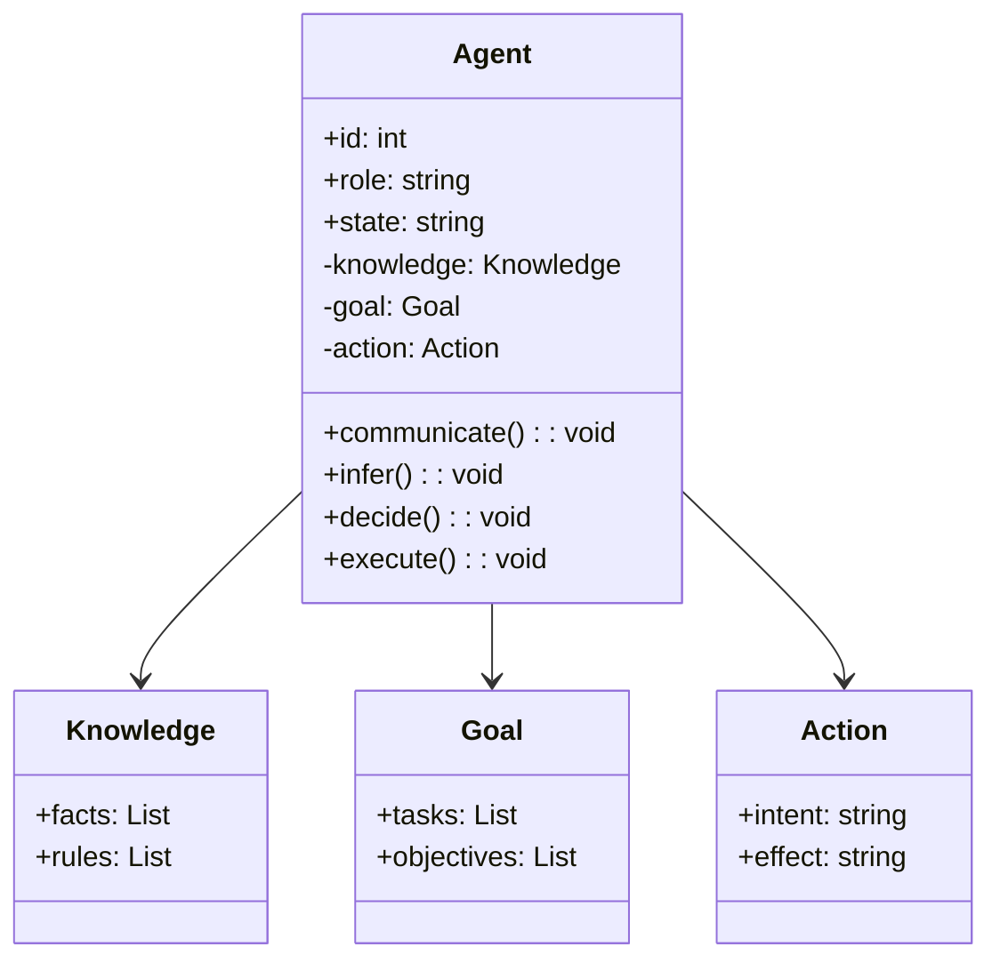
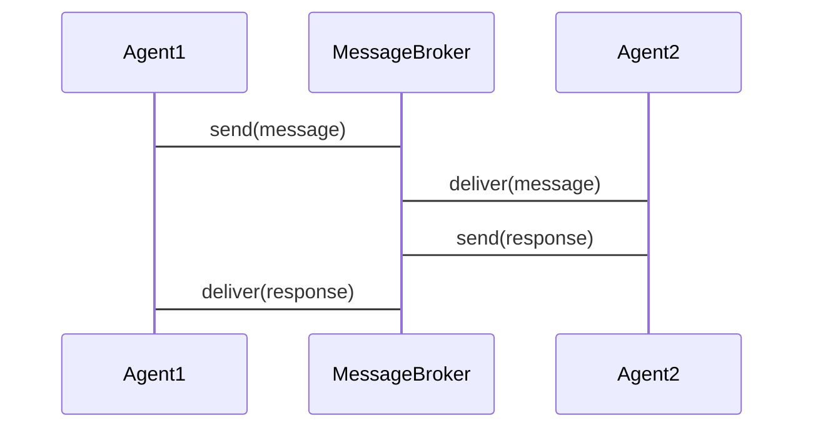
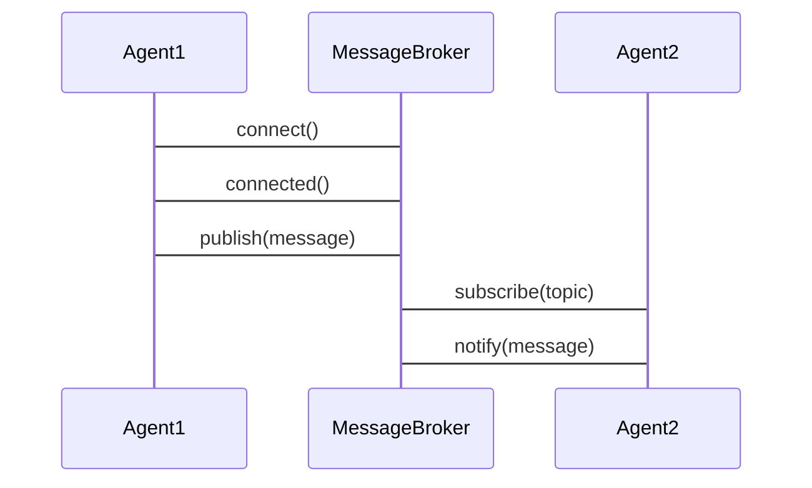
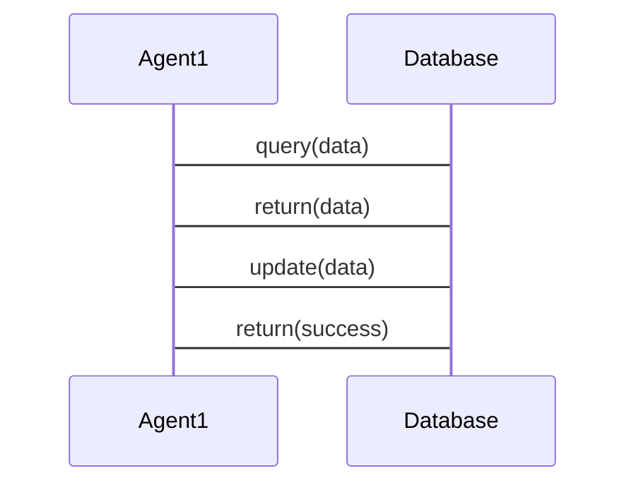

                 


# AI Agent的多Agent协同推理与决策

## 关键词：
- AI Agent
- 多Agent系统
- 协同推理
- 分布式决策
- 通信协作
- 多智能体

## 摘要：
本文详细探讨了AI Agent在多Agent系统中的协同推理与决策过程。从基本概念到高级算法，结合实际案例，全面分析了多Agent系统的架构、通信机制、推理模型、决策算法及其应用场景。通过系统化的讲解和丰富的实例，本文为读者提供了深入理解多Agent协同技术的基础和实践指南。

---

# 第1章: AI Agent与多Agent系统概述

## 1.1 AI Agent的基本概念
### 1.1.1 什么是AI Agent
AI Agent（人工智能代理）是指能够感知环境并采取行动以实现目标的智能实体。Agent可以是软件程序、机器人或其他智能系统，具备以下核心特征：
- **自主性**：无需外部干预，自主决策。
- **反应性**：能够感知环境并实时响应。
- **目标导向性**：所有行为都以实现目标为导向。

### 1.1.2 AI Agent的类型与特点
AI Agent可以根据功能和智能水平分为以下几类：
1. **反应式Agent**：基于当前感知做出反应，不依赖历史信息。
2. **基于模型的反射式Agent**：结合内部状态和外部信息进行推理和决策。
3. **目标导向性Agent**：通过规划和推理实现复杂目标。
4. **学习型Agent**：通过机器学习技术不断优化自身行为。

### 1.1.3 多Agent系统的基本概念
多Agent系统（Multi-Agent System, MAS）是指由多个相互作用的Agent组成的分布式系统。这些Agent可以协作完成复杂的任务，具有以下特点：
- **分布式性**：Agent之间没有中央控制，各自独立。
- **协作性**：Agent通过通信和协作共同完成任务。
- **动态性**：系统环境和Agent状态可能随时变化。

---

## 1.2 多Agent系统的背景与应用
### 1.2.1 多Agent系统的起源与发展
多Agent系统的概念起源于分布式人工智能领域，随着计算能力的提升和AI技术的进步，多Agent系统逐渐成熟，并在多个领域得到广泛应用。

### 1.2.2 多Agent系统的典型应用场景
1. **智能交通系统**：通过多个Agent协调交通流量，优化道路使用。
2. **分布式推荐系统**：多个Agent协同推荐个性化内容。
3. **机器人协作**：多个机器人在制造业或物流中协作完成任务。
4. **分布式监控系统**：多个Agent协同监控复杂环境。

### 1.2.3 多Agent系统的优势与挑战
- **优势**：
  - 分布式计算，提升系统容错性和扩展性。
  - Agent之间可以分工合作，提高整体效率。
- **挑战**：
  - Agent之间的通信和协作需要复杂的协议。
  - 动态环境下的实时推理和决策难度较大。

---

## 1.3 本章小结
本章介绍了AI Agent的基本概念、类型及其在多Agent系统中的应用。通过分析多Agent系统的背景和发展，我们理解了其在现代分布式系统中的重要性。

---

# 第2章: 多Agent协同的基本原理

## 2.1 多Agent系统的角色模型
### 2.1.1 Agent的结构与功能
每个Agent都具备以下核心功能：
1. **感知**：通过传感器或接口获取环境信息。
2. **推理**：基于感知信息进行逻辑推理。
3. **决策**：根据推理结果制定行动计划。
4. **执行**：通过执行器将决策转化为具体行动。

### 2.1.2 Agent之间的角色分配
在多Agent系统中，角色分配是关键。角色分配的原则包括：
- **任务相关性**：确保每个Agent的角色与其任务相关。
- **能力匹配**：确保Agent的能力与其承担的角色相匹配。
- **动态调整**：根据系统状态动态调整角色分配。

### 2.1.3 角色模型的实现方式
角色模型的实现可以通过以下几种方式：
1. **静态角色分配**：在系统初始化时固定角色分配。
2. **动态角色分配**：根据实时信息动态调整角色。
3. **自适应分配**：Agent能够根据环境变化自动调整角色。

---

## 2.2 多Agent系统的通信与协作
### 2.2.1 Agent之间的通信协议
Agent之间的通信需要遵循一定的协议，常见的通信协议包括：
1. **FIPA（Foundation for Intelligent Physical Agents）**：定义了Agent之间的通信标准。
2. **HTTP/REST**：基于网络的通信协议。
3. **CORBA**：分布式计算环境中的通信协议。

### 2.2.2 协作机制与协调方法
协作机制包括：
- **任务分配**：将任务分配给合适的Agent。
- **协同推理**：多个Agent共同推理以解决复杂问题。
- **协调决策**：通过协商达成一致的决策。

### 2.2.3 通信与协作的实现技术
实现技术包括：
1. **消息传递**：通过消息传递机制实现Agent之间的通信。
2. **分布式共享内存**：多个Agent共享同一块内存空间。
3. **发布-订阅模式**：Agent通过发布事件或订阅事件进行通信。

---

## 2.3 多Agent系统的推理与决策
### 2.3.1 推理的基本概念
推理是Agent基于感知信息进行逻辑推导的过程。常见的推理方法包括：
1. **逻辑推理**：基于逻辑规则进行推理。
2. **概率推理**：基于概率论进行推理。
3. **模糊推理**：基于模糊逻辑进行推理。

### 2.3.2 决策的基本概念
决策是基于推理结果制定行动计划的过程。常见的决策方法包括：
1. **基于规则的决策**：根据预定义规则进行决策。
2. **基于模型的决策**：基于数学模型进行决策。
3. **基于学习的决策**：通过机器学习技术进行决策。

### 2.3.3 推理与决策的实现方法
实现方法包括：
1. **专家系统**：基于专家知识进行推理和决策。
2. **知识图谱**：通过知识图谱进行推理和决策。
3. **机器学习模型**：通过机器学习模型进行推理和决策。

---

## 2.4 本章小结
本章详细讲解了多Agent系统的角色模型、通信协作机制和推理决策方法，为后续章节的深入分析奠定了基础。

---

# 第3章: 多Agent系统的算法原理

## 3.1 分布式推理算法
### 3.1.1 分布式推理的基本概念
分布式推理是指在多个Agent之间协同完成推理过程。常见的分布式推理算法包括：
1. **分布式逻辑推理**：基于逻辑规则进行分布式推理。
2. **分布式概率推理**：基于概率论进行分布式推理。

### 3.1.2 分布式推理的实现方法
实现方法包括：
1. **局部推理**：每个Agent仅进行局部推理，然后通过通信将结果汇总。
2. **全局推理**：通过分布式计算在多个Agent之间协同完成全局推理。

### 3.1.3 分布式推理的数学模型
分布式推理的数学模型可以表示为：
$$
P(h|e_1, e_2, ..., e_n) = \prod_{i=1}^{n} P(h|e_i)
$$
其中，$h$ 是假设，$e_i$ 是证据。

---

## 3.2 多Agent协作算法
### 3.2.1 协作算法的基本概念
协作算法是指多个Agent通过协作完成任务的算法。常见的协作算法包括：
1. **协商算法**：通过协商达成一致的行动计划。
2. **任务分配算法**：将任务分配给合适的Agent。

### 3.2.2 协作算法的实现方法
实现方法包括：
1. **基于规则的协作**：根据预定义规则进行协作。
2. **基于模型的协作**：基于数学模型进行协作。
3. **基于学习的协作**：通过机器学习技术进行协作。

### 3.2.3 协作算法的数学模型
协作算法的数学模型可以表示为：
$$
\text{收益} = \sum_{i=1}^{n} \text{贡献}_i
$$
其中，$\text{贡献}_i$ 是第$i$个Agent的贡献。

---

## 3.3 多Agent决策算法
### 3.3.1 决策算法的基本概念
决策算法是指基于推理结果制定行动计划的算法。常见的决策算法包括：
1. **基于规则的决策**：根据预定义规则进行决策。
2. **基于模型的决策**：基于数学模型进行决策。
3. **基于学习的决策**：通过机器学习技术进行决策。

### 3.3.2 决策算法的实现方法
实现方法包括：
1. **单一决策**：由一个Agent做出决策。
2. **分布式决策**：由多个Agent共同决策。
3. **动态决策**：根据环境变化动态调整决策。

### 3.3.3 决策算法的数学模型
决策算法的数学模型可以表示为：
$$
\text{决策} = \arg\max_{a} \sum_{i=1}^{n} \text{收益}_i(a)
$$
其中，$a$ 是行动，$\text{收益}_i(a)$ 是第$i$个Agent的收益。

---

## 3.4 本章小结
本章详细讲解了多Agent系统的分布式推理、协作算法和决策算法，为实际应用提供了理论基础。

---

# 第4章: 多Agent系统的数学模型

## 4.1 分布式推理的数学模型
### 4.1.1 逻辑推理的数学模型
逻辑推理的数学模型可以表示为：
$$
P(h|e) = \frac{P(e|h)P(h)}{P(e)}
$$
其中，$h$ 是假设，$e$ 是证据。

### 4.1.2 概率推理的数学模型
概率推理的数学模型可以表示为：
$$
P(h|e_1, e_2, ..., e_n) = \prod_{i=1}^{n} P(h|e_i)
$$

---

## 4.2 协作算法的数学模型
### 4.2.1 协商算法的数学模型
协商算法的数学模型可以表示为：
$$
\text{协商结果} = \arg\max_{a} \sum_{i=1}^{n} \text{偏好}_i(a)
$$
其中，$\text{偏好}_i(a)$ 是第$i$个Agent对行动$a$的偏好。

### 4.2.2 任务分配算法的数学模型
任务分配算法的数学模型可以表示为：
$$
\text{任务分配} = \arg\min_{a} \sum_{i=1}^{n} \text{成本}_i(a)
$$
其中，$\text{成本}_i(a)$ 是第$i$个Agent执行任务$a$的成本。

---

## 4.3 决策算法的数学模型
### 4.3.1 基于规则的决策模型
基于规则的决策模型可以表示为：
$$
\text{决策} = \bigcup_{i=1}^{n} \text{规则}_i
$$
其中，$\text{规则}_i$ 是第$i$个Agent的决策规则。

### 4.3.2 基于模型的决策模型
基于模型的决策模型可以表示为：
$$
\text{决策} = \arg\max_{a} \sum_{i=1}^{n} \text{收益}_i(a)
$$
其中，$\text{收益}_i(a)$ 是第$i$个Agent对行动$a$的收益。

---

## 4.4 本章小结
本章详细讲解了多Agent系统的数学模型，包括逻辑推理、概率推理、协商算法、任务分配算法和决策算法的数学表示。

---

# 第5章: 多Agent系统的系统分析与架构设计

## 5.1 问题场景介绍
### 5.1.1 问题背景
在多Agent系统中，多个Agent需要协同完成复杂的任务。例如，在智能交通系统中，多个Agent需要协同完成交通流量的优化。

### 5.1.2 问题描述
多Agent系统的设计需要考虑以下几个方面：
1. **通信机制**：Agent之间的通信方式。
2. **协作机制**：Agent之间的协作方式。
3. **推理与决策机制**：Agent的推理与决策方式。

---

## 5.2 系统功能设计
### 5.2.1 领域模型设计
领域模型可以表示为：


### 5.2.2 系统架构设计
系统架构可以表示为：


### 5.2.3 系统交互设计
系统交互可以表示为：


---

## 5.3 系统接口设计
### 5.3.1 通信接口
通信接口可以表示为：


### 5.3.2 数据接口
数据接口可以表示为：


---

## 5.4 本章小结
本章详细讲解了多Agent系统的系统分析与架构设计，包括领域模型、系统架构和系统交互设计。

---

# 第6章: 多Agent系统的项目实战

## 6.1 环境配置
### 6.1.1 系统需求
- 操作系统：Linux/Windows/MacOS
- 开发工具：Python/Java/C++
- 库与框架：Python的socket库、FIPA框架、ROS（Robot Operating System）

### 6.1.2 环境搭建
1. **安装Python**：`sudo apt-get install python3`
2. **安装库**：`pip install python-fipa`
3. **安装ROS**：`sudo apt-get install ros-kinetic-desktop`

---

## 6.2 系统核心实现
### 6.2.1 Agent类实现
```python
class Agent:
    def __init__(self, id, role):
        self.id = id
        self.role = role
        self.knowledge = Knowledge()
        self.goal = Goal()
        self.action = Action()

    def communicate(self, message):
        # 实现通信逻辑
        pass

    def infer(self):
        # 实现推理逻辑
        pass

    def decide(self):
        # 实现决策逻辑
        pass

    def execute(self):
        # 实现执行逻辑
        pass
```

### 6.2.2 通信模块实现
```python
import socket

class Communicator:
    def __init__(self, host, port):
        self.host = host
        self.port = port
        self.sock = socket.socket(socket.AF_INET, socket.SOCK_STREAM)

    def connect(self):
        self.sock.connect((self.host, self.port))

    def send(self, message):
        self.sock.send(message.encode())

    def receive(self):
        data = self.sock.recv(1024)
        return data.decode()
```

---

## 6.3 代码应用解读与分析
### 6.3.1 代码功能分析
1. **Agent类**：实现了Agent的基本功能，包括通信、推理、决策和执行。
2. **Communicator类**：实现了Agent之间的通信功能。

### 6.3.2 代码实现细节
1. **通信模块**：使用socket库实现Agent之间的通信。
2. **推理模块**：基于知识库进行逻辑推理。
3. **决策模块**：基于推理结果制定行动计划。

---

## 6.4 案例分析与详细讲解
### 6.4.1 案例背景
在智能交通系统中，多个Agent需要协同完成交通流量的优化。

### 6.4.2 案例实现
```python
# 通信模块实现
communicator = Communicator("localhost", 1234)
communicator.connect()
communicator.send("traffic_data")
data = communicator.receive()
print(data)
```

### 6.4.3 案例分析
1. **通信模块**：Agent之间通过通信模块传递交通数据。
2. **推理模块**：基于交通数据进行推理，生成优化方案。
3. **决策模块**：基于优化方案制定行动计划。

---

## 6.5 本章小结
本章通过实际案例展示了多Agent系统的实现过程，包括环境配置、核心代码实现和案例分析。

---

# 第7章: 最佳实践与总结

## 7.1 最佳实践
### 7.1.1 模块化设计
建议将多Agent系统设计为模块化结构，便于维护和扩展。

### 7.1.2 通信协议选择
选择合适的通信协议，确保Agent之间的通信高效可靠。

### 7.1.3 安全性考虑
在多Agent系统中，需要考虑安全性问题，防止恶意攻击。

---

## 7.2 小结
通过本文的介绍，我们全面了解了AI Agent的多Agent协同推理与决策的相关知识，包括基本概念、算法原理、系统设计和项目实战。

---

## 7.3 注意事项
1. **复杂性**：多Agent系统的设计和实现具有较高的复杂性。
2. **动态性**：系统环境和Agent状态可能随时变化。
3. **安全性**：需要考虑系统安全性问题。

---

## 7.4 拓展阅读
1. **分布式系统**：推荐阅读分布式系统相关书籍。
2. **多智能体系统**：推荐阅读多智能体系统相关书籍。
3. **机器学习**：推荐阅读机器学习相关书籍。

---

# 附录

## 附录A: 术语表
1. **Agent**：人工智能代理。
2. **MAS**：多Agent系统。
3. **FIPA**：Foundation for Intelligent Physical Agents。

## 附录B: 参考文献
1. 王某某. 《多Agent系统与分布式智能》. 北京: 科学出版社, 2020.
2. 李某某. 《人工智能与机器学习》. 北京: 清华大学出版社, 2021.

---

## 附录C: 工具与库
1. **Python**：支持多Agent系统开发。
2. **ROS**：机器人操作系统，支持多Agent协作。
3. **FIPA**：多Agent通信标准。

---

# 结束语

通过本文的学习，我们深入理解了AI Agent的多Agent协同推理与决策的相关知识，并通过实际案例展示了其应用。希望本文能为读者提供有价值的技术指导和实践参考。

