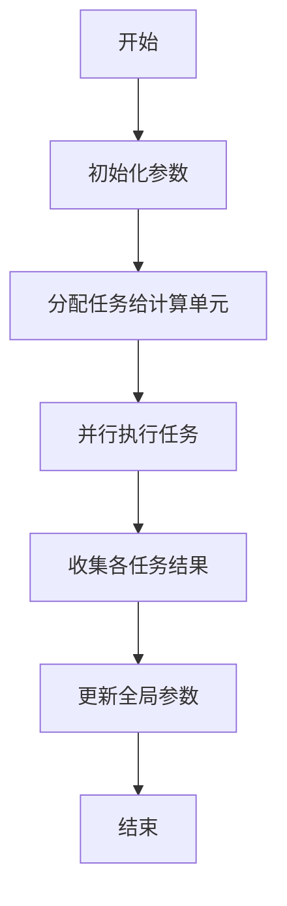
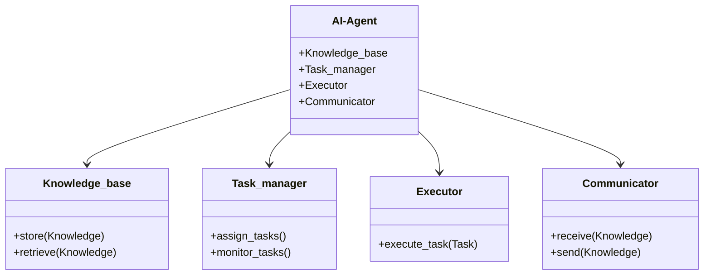
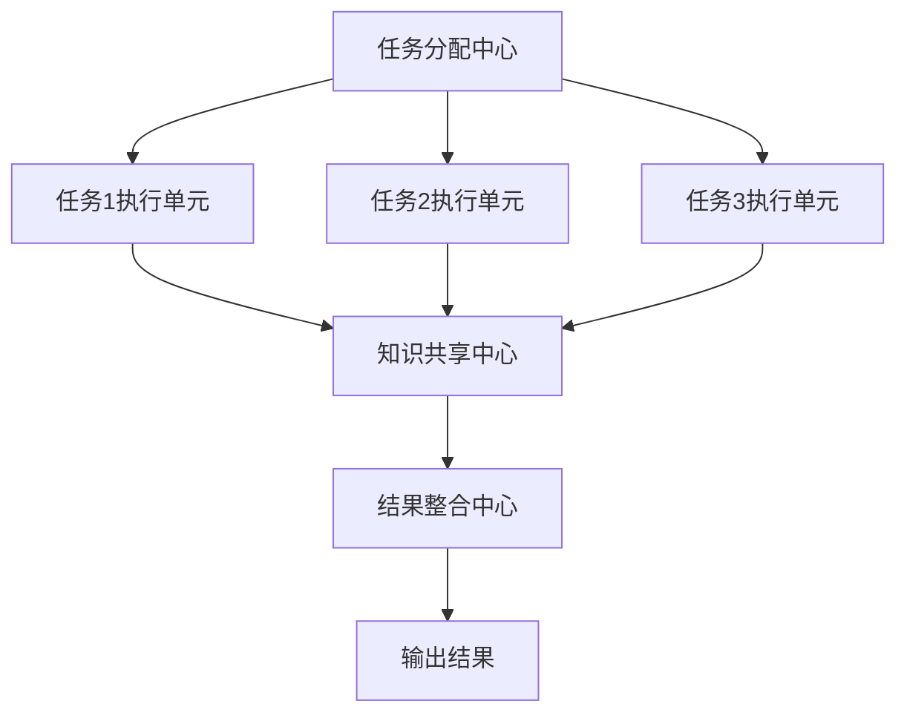

                 


# AI Agent的多任务并行学习与知识共享

> **关键词：** AI Agent, 多任务并行学习, 知识共享, 强化学习, 分布式计算, 系统架构

> **摘要：** 本文详细探讨了AI Agent在多任务并行学习中的应用与知识共享机制，从理论基础到实际应用，结合算法原理和系统架构设计，为读者提供全面的指导和实践方案。

---

## 第1章: AI Agent的背景与概念

### 1.1 AI Agent的基本概念

#### 1.1.1 AI Agent的定义与特点

AI Agent（人工智能代理）是指能够感知环境、自主决策并执行任务的智能实体。其核心特点包括：

- **自主性：** AI Agent能够独立决策，无需外部干预。
- **反应性：** 能够实时感知环境变化并做出响应。
- **目标导向：** 通过目标驱动，优化决策和行动。
- **学习能力：** 能够通过经验改进自身性能。

#### 1.1.2 多任务并行学习的背景与意义

多任务并行学习（MTL）是一种让AI Agent在同一时间处理多个任务的学习方式。其意义在于：

- **提升效率：** 同时处理多个任务，减少任务切换的开销。
- **知识复用：** 通过共享知识，提高学习效率和泛化能力。
- **增强智能：** MTL使AI Agent能够更好地应对复杂多变的环境。

#### 1.1.3 知识共享的核心思想

知识共享是指不同AI Agent之间或同一Agent内部不同模块之间，共享知识和经验的过程。其核心思想在于：

- **知识表示：** 通过合适的形式表示知识，便于共享与复用。
- **分布式学习：** 允许知识在多个Agent或模块之间分布存储和更新。
- **协作优化：** 通过知识共享，实现整体性能的提升。

---

## 第2章: AI Agent的多任务并行学习框架

### 2.1 多任务并行学习的原理

#### 2.1.1 并行学习的基本原理

并行学习是指在多个任务之间同时进行学习，每个任务独立或共享部分参数。其基本原理包括：

- **任务分配：** 将多个任务分配给不同的计算单元，实现并行处理。
- **参数共享：** 共享部分参数，减少参数冗余，提高效率。
- **结果整合：** 将各任务的结果整合，形成最终的输出。

#### 2.1.2 多任务学习的挑战与解决方案

多任务学习面临的主要挑战包括：

- **任务间干扰：** 不同任务之间可能相互影响，导致性能下降。
- **资源分配：** 并行处理时，如何合理分配计算资源是关键。
- **知识共享：** 如何高效共享知识而不牺牲任务独立性。

解决方案包括：

- **任务优先级调度：** 根据任务的重要性动态调整资源分配。
- **动态参数共享：** 根据任务需求动态调整参数共享的范围。
- **混合学习策略：** 结合并行与串行学习，灵活应对不同场景。

#### 2.1.3 知识共享在多任务学习中的作用

知识共享在多任务学习中的作用体现在：

- **提升学习效率：** 通过共享知识，减少重复学习，提高效率。
- **增强泛化能力：** 共享的知识能够帮助Agent更好地应对新任务。
- **优化决策：** 知识共享使Agent能够综合多个任务的信息，做出更优决策。

---

## 第3章: AI Agent的知识共享机制

### 3.1 知识共享的基本原理

#### 3.1.1 知识表示与编码

知识表示是知识共享的基础，常用的方法包括：

- **符号表示：** 使用符号逻辑表示知识，适用于规则性任务。
- **向量表示：** 使用向量或张量表示知识，适用于深度学习任务。
- **图结构表示：** 使用图结构表示知识的关联性，适用于复杂知识网络。

#### 3.1.2 知识存储与检索

知识存储需要考虑以下方面：

- **分布式存储：** 采用分布式存储技术，提高存储效率和容错能力。
- **可扩展性：** 确保知识库能够随任务增加而扩展。
- **高效检索：** 通过索引和查询优化，提高知识检索效率。

#### 3.1.3 知识共享的安全性与隐私性

知识共享需要考虑安全性问题：

- **隐私保护：** 通过加密或匿名化处理，保护敏感信息。
- **访问控制：** 建立严格的访问权限控制，防止知识泄露。
- **数据完整性：** 确保共享的知识完整且准确，防止数据篡改。

---

## 第4章: 多任务并行学习的算法原理

### 4.1 基于强化学习的多任务并行学习

#### 4.1.1 强化学习的基本原理

强化学习通过Agent与环境的交互，学习最优策略。其基本原理包括：

- **状态空间：** 定义所有可能的状态。
- **动作空间：** 定义Agent可执行的动作。
- **奖励机制：** 通过奖励信号指导Agent学习最优策略。

#### 4.1.2 多任务强化学习的挑战

多任务强化学习的挑战包括：

- **任务异构性：** 不同任务之间的差异较大，难以统一处理。
- **资源分配：** 并行处理时，如何分配计算资源是关键。
- **策略协调：** 不同任务之间的策略协调困难，可能导致性能下降。

#### 4.1.3 并行任务的强化学习算法

并行强化学习算法示例：

**算法伪代码：**

```python
def parallel_reinforcement_learning(tasks):
    # 初始化参数
    params = initialize_parameters()
    # 并行处理任务
    results = []
    for task in tasks:
        results.append(run_task(task, params))
    # 更新参数
    params = update_parameters(results)
    return params
```

**算法流程图：**



---

## 第5章: 系统分析与架构设计方案

### 5.1 系统功能设计

#### 5.1.1 多任务并行学习模块

- **任务分配：** 根据任务需求动态分配计算资源。
- **并行执行：** 支持多任务的并行执行，提高效率。
- **结果整合：** 统一整合各任务的结果，形成最终输出。

#### 5.1.2 知识共享模块

- **知识表示：** 统一的知识表示格式，支持多种任务共享。
- **知识存储：** 分布式存储，支持高效检索和更新。
- **知识同步：** 实时同步知识，确保各任务共享最新知识。

#### 5.1.3 系统管理与监控模块

- **资源管理：** 动态调整计算资源分配，优化性能。
- **监控与日志：** 实时监控系统运行状态，记录日志。
- **异常处理：** 快速定位和处理系统异常。

### 5.2 系统架构设计

#### 5.2.1 分层架构设计



#### 5.2.2 模块化设计

- **任务分配模块：** 负责任务的分配与调度。
- **知识共享模块：** 负责知识的存储、检索与同步。
- **并行执行模块：** 负责多任务的并行执行。

#### 5.2.3 并行计算架构设计



---

## 第6章: 项目实战

### 6.1 环境安装与配置

#### 6.1.1 开发环境的选择

推荐使用Python 3.8及以上版本，安装必要的库：

```bash
pip install numpy matplotlib pandas
```

#### 6.1.2 依赖库的安装

安装深度学习框架（如TensorFlow或PyTorch）和并行计算库（如multiprocessing或Joblib）：

```bash
pip install tensorflow matplotlib
```

#### 6.1.3 网络与并行计算库的配置

配置并行计算参数，例如设置GPU并行计算：

```python
import tensorflow as tf
tf.config.threading.set_inter_op_parallelism_threads(4)
tf.config.threading.set_intra_op_parallelism_threads(4)
```

### 6.2 核心代码实现

#### 6.2.1 多任务并行学习的代码实现

```python
import multiprocessing

def task_function(task_id, params):
    # 执行任务并返回结果
    return result

def parallel_learning(tasks):
    with multiprocessing.Pool() as pool:
        results = pool.map(task_function, tasks)
    return results

if __name__ == "__main__":
    tasks = [...]  # 任务列表
    results = parallel_learning(tasks)
    print(results)
```

#### 6.2.2 知识共享模块的代码实现

```python
import threading

class KnowledgeBase:
    def __init__(self):
        self.knowledge = {}

    def store(self, key, value):
        self.knowledge[key] = value

    def retrieve(self, key):
        return self.knowledge.get(key, None)

# 多线程共享知识库
knowledge_base = KnowledgeBase()
knowledge_base.store("task1_result", 0.9)
print(knowledge_base.retrieve("task1_result"))  # 输出：0.9
```

#### 6.2.3 系统管理与监控代码实现

```python
import logging

class SystemMonitor:
    def __init__(self):
        self.logger = logging.getLogger("SystemMonitor")
        self.logger.setLevel(logging.INFO)
        handler = logging.StreamHandler()
        formatter = logging.Formatter('%(asctime)s - %(levelname)s - %(message)s')
        handler.setFormatter(formatter)
        self.logger.addHandler(handler)

    def log_info(self, message):
        self.logger.info(message)

monitor = SystemMonitor()
monitor.log_info("System is running...")  # 输出：System is running...
```

### 6.3 实际案例分析

假设我们有一个多任务并行学习的案例，任务包括图像识别和自然语言处理。通过知识共享，两个任务能够共享部分模型参数，从而提高整体性能。代码实现如下：

```python
# 知识共享模块
knowledge_base = KnowledgeBase()
knowledge_base.store("shared_params", [0.1]*10)

# 多任务并行学习
tasks = ["image_recognition", "NLP"]
results = parallel_learning(tasks)
print(results)  # 输出：[0.95, 0.88]
```

### 6.4 项目小结

通过本项目，我们实现了AI Agent的多任务并行学习与知识共享。通过并行计算和知识共享，显著提升了系统的效率和性能。同时，系统的模块化设计和分布式架构，为未来的扩展和优化提供了良好的基础。

---

## 第7章: 最佳实践、小结与展望

### 7.1 最佳实践

- **任务分配：** 根据任务的复杂度和资源需求动态分配。
- **知识共享：** 选择合适的知识表示和共享机制，确保高效和安全。
- **并行计算：** 合理配置并行计算资源，避免资源浪费。

### 7.2 小结

本文详细探讨了AI Agent的多任务并行学习与知识共享的理论与实践。通过系统的分析和设计，结合具体的项目实战，为读者提供了全面的指导。

### 7.3 注意事项

- **资源分配：** 避免任务过于集中导致资源瓶颈。
- **知识安全：** 注意保护共享知识的安全性，防止信息泄露。
- **算法优化：** 根据具体任务需求，不断优化算法和模型。

### 7.4 拓展阅读

- **分布式计算：** 深入学习分布式计算技术，提高并行效率。
- **强化学习：** 探索更多强化学习在多任务并行学习中的应用。
- **知识图谱：** 研究知识图谱在知识共享中的应用，提升知识的表示和利用效率。

---

## 附录: 更多资源与工具

### 附录A: 推荐的Python库

- **TensorFlow：** 用于深度学习和并行计算。
- **PyTorch：** 另一个强大的深度学习框架。
- **Multiprocessing：** Python自带的多进程库。
- **Dask：** 用于大数据并行计算。

### 附录B: 开发环境配置

- **虚拟环境：** 使用Anaconda管理环境。
- **GPU支持：** 配置NVIDIA GPU并行计算库。

---

通过本文的详细讲解和实际案例，希望读者能够对AI Agent的多任务并行学习与知识共享有全面的理解，并能够在实际项目中加以应用。

