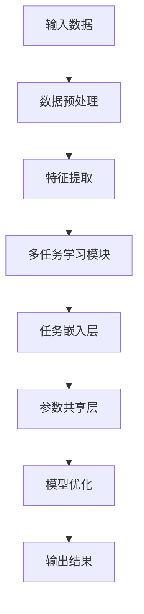
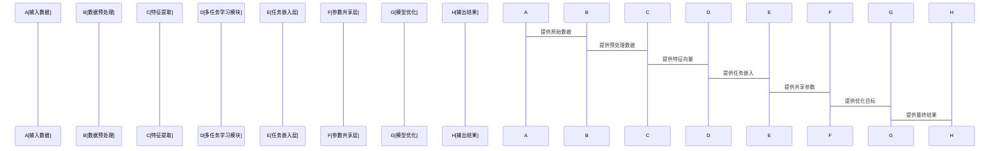

                 


# AI Agent的多任务迁移学习技术

## 关键词：AI Agent，多任务学习，迁移学习，深度学习，机器学习

## 摘要：  
随着人工智能技术的飞速发展，AI Agent（智能体）在多任务环境中的应用越来越广泛。为了提高AI Agent在复杂场景下的性能和适应性，多任务迁移学习技术成为关键。本文将深入探讨AI Agent的多任务迁移学习技术，从基本概念、算法原理、系统架构到实际应用，全面解析其核心思想与实现方法。通过本文，读者将能够理解多任务迁移学习的重要性，并掌握其在AI Agent中的实际应用。

---

## 第1章 AI Agent与多任务迁移学习概述

### 1.1 AI Agent的基本概念  
AI Agent（智能体）是指能够感知环境、自主决策并执行任务的智能系统。它可以是一个软件程序、机器人或其他智能设备，具备以下核心特点：  
1. **自主性**：能够在没有外部干预的情况下自主运行。  
2. **反应性**：能够实时感知环境并做出响应。  
3. **目标导向性**：以明确的目标为导向，优化决策和行动。  
4. **学习能力**：通过学习提升自身的任务处理能力。  

AI Agent的应用场景非常广泛，例如智能助手、自动驾驶、智能客服、游戏AI等。在这些场景中，AI Agent需要处理的任务往往不止一个，这就引出了多任务学习的需求。

---

### 1.2 多任务迁移学习的背景与必要性  

#### 1.2.1 多任务学习的定义与特点  
多任务学习（Multi-Task Learning, MTL）是一种机器学习范式，旨在同时学习多个任务，利用任务之间的关联性来提升模型的泛化能力和学习效率。其核心思想是通过共享任务间的特征或参数，降低模型的复杂性和训练数据的需求。  

多任务学习具有以下特点：  
1. **任务共享性**：多个任务之间存在共享的特征或规律。  
2. **数据效率高**：通过共享任务信息，减少每个任务所需的数据量。  
3. **模型复用性**：同一个模型可以同时处理多个任务。  

#### 1.2.2 迁移学习的定义与优势  
迁移学习（Transfer Learning）是一种机器学习技术，旨在将一个任务中学到的知识迁移到另一个任务中，尤其是在数据分布相似的场景下。其优势在于：  
1. **减少数据需求**：当目标任务数据有限时，可以通过迁移学习利用源任务的数据。  
2. **提升模型泛化能力**：通过跨任务学习，模型能够更好地泛化到新的任务。  

#### 1.2.3 多任务迁移学习的背景与意义  
多任务迁移学习（Multi-Task Transfer Learning, MTTL）是多任务学习和迁移学习的结合，旨在通过多个任务之间的知识共享，进一步提升模型的迁移能力和适应性。在AI Agent中，多任务迁移学习的应用场景包括：  
- **多模态任务处理**：例如，同时处理视觉、听觉和文本任务。  
- **复杂环境适应**：在动态变化的环境中，快速适应新任务。  

通过多任务迁移学习，AI Agent可以更高效地处理多个相关任务，同时具备更强的环境适应能力。

---

## 第2章 多任务迁移学习的核心概念  

### 2.1 多任务学习的核心概念  

#### 2.1.1 多任务学习的定义与特点  
多任务学习通过共享任务之间的特征或参数，提升模型的泛化能力。其核心思想是：通过同时学习多个任务，模型可以更好地发现任务之间的关联性，从而提高整体性能。  

#### 2.1.2 多任务学习的分类与应用场景  
多任务学习可以分为以下几类：  
1. **共享参数模型**：所有任务共享部分或全部参数。  
2. **任务嵌入模型**：每个任务都有独立的嵌入层，但共享其他层的参数。  
3. **层次化模型**：通过构建层次化的任务结构，逐步共享特征。  

多任务学习的应用场景包括自然语言处理、计算机视觉、机器人控制等领域。例如，在自然语言处理中，多任务学习可以同时进行文本分类、命名实体识别和语义理解。

---

### 2.2 迁移学习的核心概念  

#### 2.2.1 迁移学习的定义与特点  
迁移学习的核心思想是通过将一个任务中的知识迁移到另一个任务中，减少目标任务的数据需求。其特点包括：  
1. **数据分布变化**：源任务和目标任务的数据分布可能不同。  
2. **任务相关性**：源任务和目标任务之间必须存在一定的关联性。  

#### 2.2.2 迁移学习的分类与应用场景  
迁移学习可以分为以下几种类型：  
1. **有监督迁移学习**：基于标注数据进行迁移。  
2. **无监督迁移学习**：基于未标注数据进行迁移。  
3. **半监督迁移学习**：结合标注和未标注数据进行迁移。  

迁移学习的应用场景包括图像识别、语音识别、文本分类等领域。例如，在图像识别中，可以通过迁移学习将图像分类模型应用于目标检测任务。

---

### 2.3 多任务迁移学习的核心概念  

#### 2.3.1 多任务迁移学习的定义与特点  
多任务迁移学习是多任务学习和迁移学习的结合，旨在通过多个任务之间的知识共享，进一步提升模型的迁移能力和适应性。其核心思想是：通过同时学习多个相关任务，模型可以更好地发现任务之间的关联性，并将这些关联性迁移到新的任务中。

#### 2.3.2 多任务迁移学习的核心要素  
多任务迁移学习的核心要素包括：  
1. **任务嵌入**：通过任务嵌入层捕捉任务之间的关联性。  
2. **参数共享**：通过共享参数降低模型的复杂性和数据需求。  
3. **联合优化**：通过联合优化多个任务的目标函数，提升模型的性能。  

#### 2.3.3 多任务迁移学习的实现方式  
多任务迁移学习的实现方式包括：  
1. **联合学习**：同时优化多个任务的目标函数。  
2. **任务嵌入**：通过任务嵌入层捕捉任务之间的关联性。  
3. **参数共享**：通过共享参数降低模型的复杂性和数据需求。  

---

## 第3章 多任务迁移学习的算法原理  

### 3.1 多任务迁移学习的算法框架  

#### 3.1.1 联合学习的基本原理  
联合学习（Joint Learning）是多任务迁移学习的核心算法之一。其基本原理是：通过同时优化多个任务的目标函数，共享任务之间的特征或参数，从而提升模型的性能。  

联合学习的数学模型可以表示为：  
$$ \min_{\theta} \sum_{i=1}^{n} \lambda_i L_i(\theta) $$  
其中，$\theta$是模型的参数，$L_i$是第$i$个任务的目标函数，$\lambda_i$是任务的权重系数。  

#### 3.1.2 任务嵌入的基本原理  
任务嵌入（Task Embedding）是一种通过嵌入层捕捉任务之间关联性的方法。其基本原理是：将每个任务表示为一个向量，并通过嵌入层捕捉任务之间的关联性。  

任务嵌入的数学模型可以表示为：  
$$ E_t = \text{Embedding}(t) $$  
其中，$E_t$是任务$t$的嵌入向量。  

#### 3.1.3 参数共享的基本原理  
参数共享（Parameter Sharing）是多任务迁移学习中常用的一种方法。其基本原理是：通过共享部分或全部参数，降低模型的复杂性和数据需求。  

参数共享的数学模型可以表示为：  
$$ \theta = \{\theta_1, \theta_2, \dots, \theta_n\} $$  
其中，$\theta_i$是第$i$个任务的参数。  

---

### 3.2 多任务迁移学习的数学模型  

#### 3.2.1 联合损失函数的定义与公式  
联合损失函数（Joint Loss Function）是多任务迁移学习的核心数学模型之一。其定义为：  
$$ L(\theta) = \sum_{i=1}^{n} \lambda_i L_i(\theta) $$  
其中，$\lambda_i$是第$i$个任务的权重系数。  

#### 3.2.2 任务嵌入的表示方法  
任务嵌入的表示方法包括：  
1. **向量表示**：将每个任务表示为一个向量。  
2. **矩阵表示**：将每个任务表示为一个矩阵。  

任务嵌入的数学模型可以表示为：  
$$ E_t = \text{Embedding}(t) $$  

#### 3.2.3 参数共享的数学模型  
参数共享的数学模型可以表示为：  
$$ \theta = \{\theta_1, \theta_2, \dots, \theta_n\} $$  

---

### 3.3 多任务迁移学习的算法流程  

#### 3.3.1 数据预处理与特征提取  
数据预处理包括：  
1. 数据清洗：去除噪声数据。  
2. 数据归一化：将数据标准化。  

特征提取包括：  
1. 文本特征提取：使用词袋模型或词嵌模型。  
2. 图像特征提取：使用CNN或ResNet。  

#### 3.3.2 模型训练与优化  
模型训练包括：  
1. 初始化模型参数。  
2. 计算损失函数。  
3. 更新模型参数。  

模型优化包括：  
1. 使用优化算法（如Adam）。  
2. 调整学习率。  

#### 3.3.3 模型评估与调优  
模型评估包括：  
1. 计算准确率、召回率和F1分数。  
2. 绘制混淆矩阵。  

模型调优包括：  
1. 调整权重系数。  
2. 调整任务嵌入维度。  

---

## 第4章 系统分析与架构设计  

### 4.1 系统架构设计  

#### 4.1.1 系统功能设计  
系统功能设计包括：  
1. 多任务学习模块：负责同时学习多个任务。  
2. 迁移学习模块：负责将知识迁移到新任务中。  
3. 任务管理模块：负责管理多个任务。  

#### 4.1.2 系统架构图  



#### 4.1.3 系统交互流程  



---

## 第5章 项目实战  

### 5.1 项目环境配置  

#### 5.1.1 环境需求  
- Python 3.7及以上版本  
- TensorFlow或PyTorch框架  
- Jupyter Notebook  

#### 5.1.2 安装依赖库  
```bash
pip install numpy
pip install pandas
pip install matplotlib
pip install scikit-learn
```

---

### 5.2 系统核心实现  

#### 5.2.1 多任务学习模块实现  

```python
import tensorflow as tf

def multi_task_model():
    input_layer = tf.keras.layers.Input(shape=(input_dim,))
    dense_layer = tf.keras.layers.Dense(64, activation='relu')(input_layer)
    task1_output = tf.keras.layers.Dense(num_classes_task1, activation='softmax')(dense_layer)
    task2_output = tf.keras.layers.Dense(num_classes_task2, activation='softmax')(dense_layer)
    model = tf.keras.Model(inputs=input_layer, outputs=[task1_output, task2_output])
    return model
```

#### 5.2.2 迁移学习模块实现  

```python
def transfer_learning_model():
    base_model = tf.keras.applications.ResNet50(weights='imagenet', include_top=False)
    input_tensor = tf.keras.Input(shape=(224, 224, 3))
    x = base_model(input_tensor)
    x = tf.keras.layers.Dense(256, activation='relu')(x)
    output = tf.keras.layers.Dense(num_classes, activation='softmax')(x)
    model = tf.keras.Model(inputs=input_tensor, outputs=output)
    return model
```

---

### 5.3 实际案例分析  

#### 5.3.1 数据准备  
```python
import numpy as np

# 示例数据
X_train = np.random.randn(1000, input_dim)
y_train_task1 = np.random.randint(2, size=1000)
y_train_task2 = np.random.randint(2, size=1000)
```

#### 5.3.2 模型训练  

```python
model = multi_task_model()
model.compile(optimizer='adam', loss={'task1': 'sparse_categorical_crossentropy', 'task2': 'sparse_categorical_crossentropy'}, loss_weights=[0.5, 0.5])
model.fit(X_train, {'task1': y_train_task1, 'task2': y_train_task2}, epochs=10, batch_size=32)
```

---

## 第6章 总结与展望  

### 6.1 本章小结  
本文深入探讨了AI Agent的多任务迁移学习技术，从基本概念、算法原理到系统架构，全面解析了其核心思想与实现方法。通过多任务迁移学习，AI Agent可以更高效地处理多个相关任务，同时具备更强的环境适应能力。

### 6.2 最佳实践 tips  
1. 在实际应用中，建议根据任务之间的关联性选择合适的多任务迁移学习方法。  
2. 在模型优化过程中，建议通过调整权重系数和任务嵌入维度来提升模型性能。  
3. 在系统设计中，建议通过任务管理模块来管理多个任务，确保系统的可扩展性和可维护性。  

### 6.3 展望  
未来，随着深度学习和强化学习技术的不断发展，多任务迁移学习在AI Agent中的应用将更加广泛。研究者们可以进一步探索多任务迁移学习的优化方法，例如通过元学习和自适应学习来提升模型的泛化能力和适应性。

---

## 参考文献  
[1] Goodfellow, I., Bengio, Y., & Courville, A. (2016). Deep Learning. MIT Press.  
[2] Caruana, R. (1997). Multi-task learning. AAAI/IAAI.  
[3] Pan, S. J., & Yang, Q. (2010). A survey on transfer learning. IEEE Transactions on Knowledge and Data Engineering.  

---

通过本文的详细讲解，读者可以全面理解AI Agent的多任务迁移学习技术，并将其应用到实际项目中。希望本文能够为相关领域的研究者和开发者提供有价值的参考。

