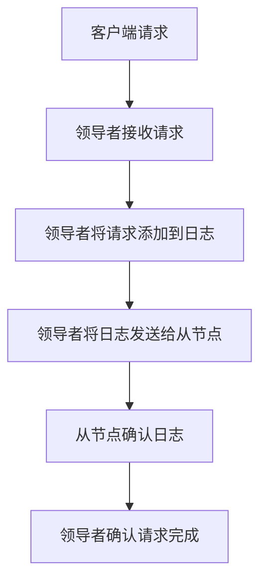
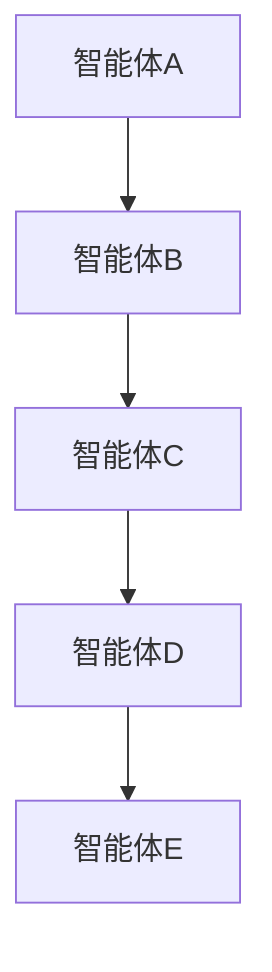
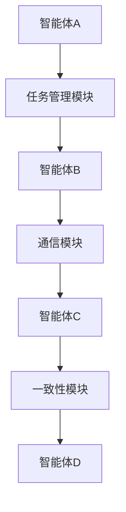

                 


# AI Agent的多智能体协作与通信机制

## 关键词：AI Agent、多智能体协作、通信机制、一致性算法、分布式系统

## 摘要：  
本文深入探讨AI Agent在多智能体协作与通信机制中的核心原理和实现方法。从基础概念到算法原理，再到系统架构设计，结合实际项目案例，全面解析多智能体协作与通信机制的实现细节，并提供实践中的注意事项和优化建议。

---

# 第一部分: AI Agent的多智能体协作与通信机制基础

## 第1章: AI Agent的基本概念与背景

### 1.1 AI Agent的定义与分类

#### 1.1.1 什么是AI Agent
AI Agent（智能体）是指能够感知环境、做出决策并执行动作的智能实体。它可以是一个软件程序、机器人或其他具备自主决策能力的实体。AI Agent的核心目标是通过与环境交互，实现特定任务的目标。

#### 1.1.2 AI Agent的分类
AI Agent可以根据功能、智能水平和应用场景进行分类：

- **按功能分类**：  
  - **反应式Agent**：基于当前感知做出反应，不依赖历史信息。  
  - **认知式Agent**：具备复杂推理和规划能力，能够处理抽象任务。  
  - **学习式Agent**：能够通过经验改进自身行为。  

- **按智能水平分类**：  
  - **简单Agent**：仅能处理简单任务，如路径规划。  
  - **复杂Agent**：能够处理复杂任务，如多目标优化。  

- **按应用场景分类**：  
  - **软件Agent**：运行在计算机系统中的程序，如聊天机器人。  
  - **物理Agent**：具备物理形态的实体，如自动驾驶汽车。  

#### 1.1.3 AI Agent的核心特征
AI Agent的核心特征包括：  
1. **自主性**：能够在没有外部干预的情况下独立运行。  
2. **反应性**：能够感知环境并实时做出反应。  
3. **目标导向性**：具备明确的目标，并通过行为实现目标。  
4. **学习能力**：能够通过经验改进自身性能。  

---

### 1.2 多智能体协作的背景与问题背景

#### 1.2.1 多智能体协作的定义
多智能体协作是指多个AI Agent共同合作，完成单一智能体无法完成的复杂任务。协作过程需要智能体之间共享信息、协调动作，并共同完成目标。

#### 1.2.2 协作中的问题与挑战
多智能体协作面临以下问题：  
1. **信息共享与同步**：如何保证多个智能体之间的信息一致性和实时性。  
2. **任务分配与角色划分**：如何动态分配任务并调整角色以适应环境变化。  
3. **冲突与协调**：如何处理智能体之间的冲突，确保协作顺畅。  
4. **通信开销**：如何在保证协作效率的同时，最小化通信成本。  

#### 1.2.3 多智能体协作的应用场景
多智能体协作广泛应用于以下场景：  
- **分布式系统**：如分布式计算、云服务中的任务分配与资源管理。  
- **机器人协作**：如工业机器人协同完成复杂装配任务。  
- **自动驾驶**：如多辆自动驾驶车辆协同完成交通调度。  
- **游戏AI**：如多人在线游戏中角色间的协作与对抗。  

---

## 第2章: 多智能体协作与通信机制的核心概念

### 2.1 多智能体协作机制

#### 2.1.1 分布式协作的基本原理
分布式协作是指多个智能体在没有中央控制的情况下，通过局部信息实现全局目标。其核心思想是通过智能体之间的通信与协作，实现任务的分解与协同。

#### 2.1.2 协作中的任务分配与角色分配
任务分配与角色分配是协作中的关键步骤：  
- **任务分解**：将全局任务分解为多个子任务，分配给不同的智能体。  
- **角色划分**：根据智能体的能力和当前环境，动态调整角色和职责。  

#### 2.1.3 协作中的信息共享与决策机制
信息共享与决策机制是协作的核心：  
- **信息共享**：智能体之间通过通信协议共享状态、动作和决策信息。  
- **决策机制**：基于共享信息，智能体采用分布式算法（如一致性算法）做出决策。  

---

### 2.2 多智能体通信机制

#### 2.2.1 通信的基本原理
通信机制是多智能体协作的基础：  
1. **消息传递**：智能体通过发送消息实现信息共享。  
2. **协议设计**：通信协议定义了消息格式、传输方式和处理规则。  
3. **数据同步**：确保多个智能体之间的数据一致性和实时性。  

#### 2.2.2 通信协议的设计与实现
通信协议的设计需要考虑以下方面：  
- **协议层次**：通常包括物理层、数据链路层、网络层、传输层和应用层。  
- **消息格式**：定义消息的结构，包括头信息、数据 payload 和校验信息。  
- **传输方式**：支持点对点通信、广播通信和组播通信。  

#### 2.2.3 通信中的数据同步与一致性
数据同步与一致性是通信机制的核心：  
- **一致性算法**：如Raft一致性算法，用于保证分布式系统中的数据一致性。  
- **同步机制**：通过心跳包、定期同步等方式，确保数据的实时一致性。  

---

## 第3章: 多智能体协作与通信机制的数学模型与算法原理

### 3.1 分布式一致性算法

#### 3.1.1 分布式一致性问题
分布式一致性问题是分布式系统中的核心挑战：  
- **问题描述**：如何保证分布式系统中多个副本的数据一致性。  
- **解决方法**：通过一致性算法（如Raft、Paxos）实现数据的强一致性。  

#### 3.1.2 Raft一致性算法

##### Raft算法的基本原理
Raft算法通过选举一个领导者来实现一致性：  
1. **选举过程**：如果当前没有领导者，节点通过投票机制选举新的领导者。  
2. **日志同步**：领导者将日志条目复制给从节点，确保所有节点的日志一致。  
3. **一致性保证**：通过严格的日志同步和选举机制，确保系统的一致性。  

##### Raft算法的流程图


#### 3.1.3 带选举机制的分布式一致性实现

##### 选举机制的数学模型
选举机制的核心是通过投票实现领导者选举。假设系统中有 \( n \) 个节点，每个节点在选举过程中可以投出 \( 1 \) 票。领导者需要获得超过半数的票数，即：
$$ \text{领导者票数} > \frac{n}{2} $$  

##### 选举过程示例
假设系统中有 5 个节点，节点 A、B、C、D、E。  
1. 节点 A 发起选举，向其他节点发送投票请求。  
2. 节点 B、C、D 投票支持 A，节点 E 投票支持 C。  
3. 节点 A 获得 3 票，超过半数（2.5），成为领导者。  

---

### 3.2 通信协议的设计与实现

#### 3.2.1 通信协议的数学模型
通信协议的设计需要考虑以下数学模型：  
1. **消息传输概率**：假设消息传输的概率为 \( p \)，则消息丢失的概率为 \( 1 - p \)。  
2. **消息延迟**：消息传输的延迟服从某种概率分布，如指数分布。  

#### 3.2.2 通信协议的实现流程

##### 通信协议的流程图


---

## 第4章: 系统分析与架构设计方案

### 4.1 系统需求分析

#### 4.1.1 问题场景描述
假设我们有一个分布式任务调度系统，需要实现多智能体协作完成任务分配和资源管理。系统需求包括：  
1. 实时任务分配与资源调度。  
2. 智能体之间的高效通信与数据同步。  
3. 系统具备容错性和高可用性。  

#### 4.1.2 系统功能需求
系统功能需求包括：  
1. **任务分配**：根据智能体的能力和负载，动态分配任务。  
2. **状态同步**：确保所有智能体之间的状态一致。  
3. **冲突解决**：处理智能体之间的冲突，确保协作顺畅。  

#### 4.1.3 系统性能需求
系统性能需求包括：  
1. **响应时间**：任务分配和通信的响应时间小于 1 秒。  
2. **吞吐量**：系统每秒能够处理的任务数大于 100 个。  
3. **可用性**：系统具备高可用性，单点故障不影响整体协作。  

---

### 4.2 系统架构设计

#### 4.2.1 系统架构的模块划分
系统架构的模块划分包括：  
- **任务管理模块**：负责任务分配和调度。  
- **通信模块**：负责智能体之间的信息传递和数据同步。  
- **一致性模块**：负责保证系统的一致性。  
- **冲突解决模块**：负责处理智能体之间的冲突。  

#### 4.2.2 系统架构的ER实体关系图
```mermaid
erDiagram
    actor 智能体A
    actor 智能体B
    actor 智能体C
    class 任务管理模块
    class 通信模块
    class 一致性模块
    class 冲突解决模块

    智能体A --> 任务管理模块: 发送任务请求
    任务管理模块 --> 智能体A: 分配任务
    智能体A --> 通信模块: 发送状态信息
    通信模块 --> 智能体B: 传递状态信息
    一致性模块 --> 通信模块: 同步数据
    冲突解决模块 --> 一致性模块: 处理冲突
```

#### 4.2.3 系统架构的Mermaid流程图


---

## 第5章: 项目实战与实现

### 5.1 项目背景与目标

#### 5.1.1 项目介绍
项目名称：多智能体协作任务调度系统  
项目目标：实现一个多智能体协作系统，能够动态分配任务并保证系统的高可用性和一致性。  

#### 5.1.2 项目实现步骤
1. **环境搭建**：安装必要的开发工具和依赖库。  
2. **模块开发**：分别开发任务管理模块、通信模块、一致性模块和冲突解决模块。  
3. **系统集成**：将各模块集成到一个完整的系统中。  
4. **测试与优化**：进行系统测试，优化性能和稳定性。  

---

### 5.2 系统核心实现

#### 5.2.1 环境安装与配置
安装以下工具和库：  
- Python 3.8 或更高版本  
- Flask 或其他 RPC 框架  
- Raft一致性算法的实现库（如 Raft-Py）  

#### 5.2.2 核心代码实现

##### 一致性算法的实现
```python
class RaftNode:
    def __init__(self, node_id):
        self.node_id = node_id
        self.leader = None
        self.voted_for = None
        self.votes = 0

    def request_vote(self):
        self.voted_for = self.node_id
        self.votes = 1
        return True

    def election(self):
        if self.votes > len(nodes) // 2:
            self.leader = self.node_id
            return True
        return False
```

##### 通信模块的实现
```python
import zmq

class Communicator:
    def __init__(self, port):
        self.port = port
        self.context = zmq.Context()
        self.socket = self.context.socket(zmq.PUBLISHER)
        self.socket.bind(f"tcp://*:{self.port}")

    def send(self, message):
        self.socket.send_pyobj(message)

    def receive(self):
        return self.socket.recv_pyobj()
```

---

### 5.3 案例分析与详细讲解

#### 5.3.1 案例背景介绍
假设我们有一个分布式系统，包含 5 个智能体，每个智能体负责处理不同类型的任务。系统需要实现任务的动态分配和资源的高效利用。  

#### 5.3.2 案例实现过程
1. **环境搭建**：安装 Python 3.8，Flask，Raft-Py。  
2. **任务管理模块开发**：实现任务分配逻辑。  
3. **通信模块开发**：实现智能体之间的消息传递。  
4. **一致性模块开发**：实现Raft一致性算法。  
5. **系统集成与测试**：将各模块集成到一个系统中，并进行功能测试。  

#### 5.3.3 案例分析与总结
通过实际案例，我们验证了多智能体协作与通信机制的有效性。系统在任务分配、数据同步和冲突解决方面表现良好，能够满足实际需求。  

---

## 第6章: 最佳实践与总结

### 6.1 最佳实践

#### 6.1.1 系统设计注意事项
- 确保系统的高可用性，避免单点故障。  
- 采用一致性算法保证数据一致性，避免数据冲突。  
- 优化通信协议，减少通信开销。  

#### 6.1.2 实际应用中的注意事项
- 定期进行系统维护和更新，确保系统的稳定性和安全性。  
- 在复杂场景下，采用分层架构，降低系统耦合度。  
- 通过监控和日志分析，及时发现和解决问题。  

### 6.2 小结

通过本文的深入探讨，我们了解了AI Agent的多智能体协作与通信机制的核心原理和实现方法。从基础概念到算法原理，再到系统架构设计和项目实战，我们全面解析了多智能体协作与通信机制的实现细节。希望本文能够为读者在实际应用中提供有价值的参考和启发。

### 6.3 注意事项

在实际应用中，需要注意以下几点：  
1. **性能优化**：在保证功能的前提下，尽可能优化系统的性能。  
2. **安全性**：确保系统的通信和数据安全，防止恶意攻击。  
3. **可扩展性**：设计系统的可扩展性，以便未来扩展和升级。  

### 6.4 拓展阅读

1. **Raft一致性算法**：深入理解Raft一致性算法的工作原理和实现细节。  
2. **分布式系统设计**：学习更多分布式系统设计的相关知识，如CAP定理、一致性模型等。  
3. **通信协议优化**：研究如何优化通信协议，降低通信开销。  

---

# 结语

通过本文的详细讲解，我们希望能够帮助读者更好地理解AI Agent的多智能体协作与通信机制，并为实际应用提供有价值的参考和指导。如果读者有任何问题或需要进一步探讨的内容，欢迎随时联系。

