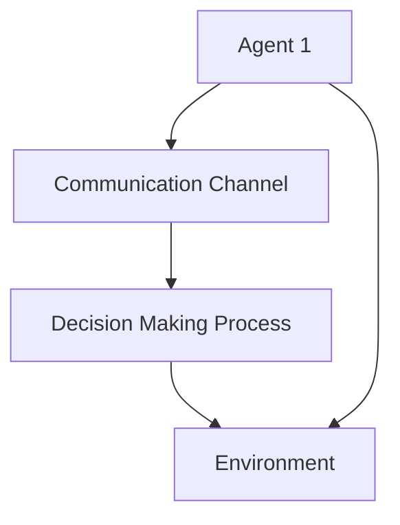
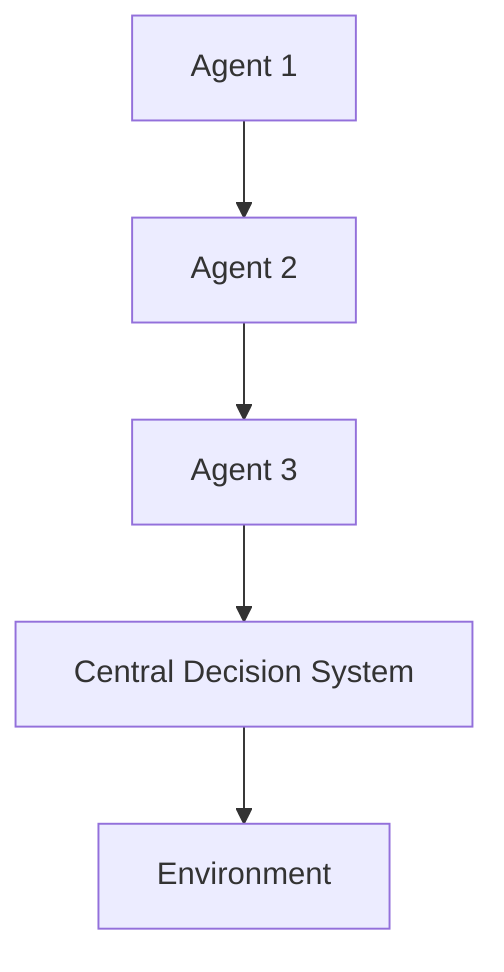
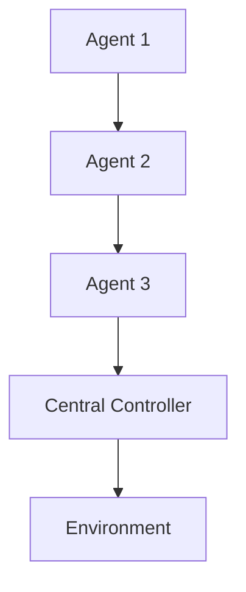
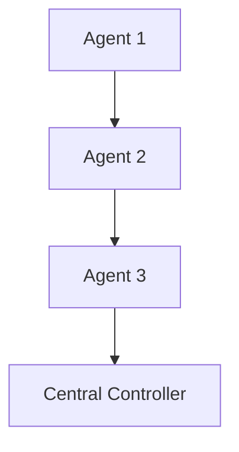
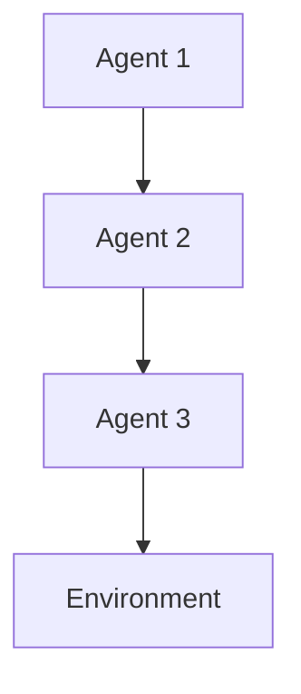
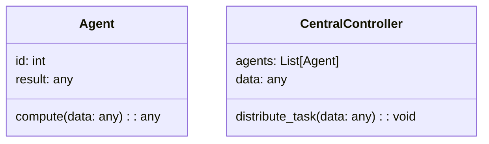
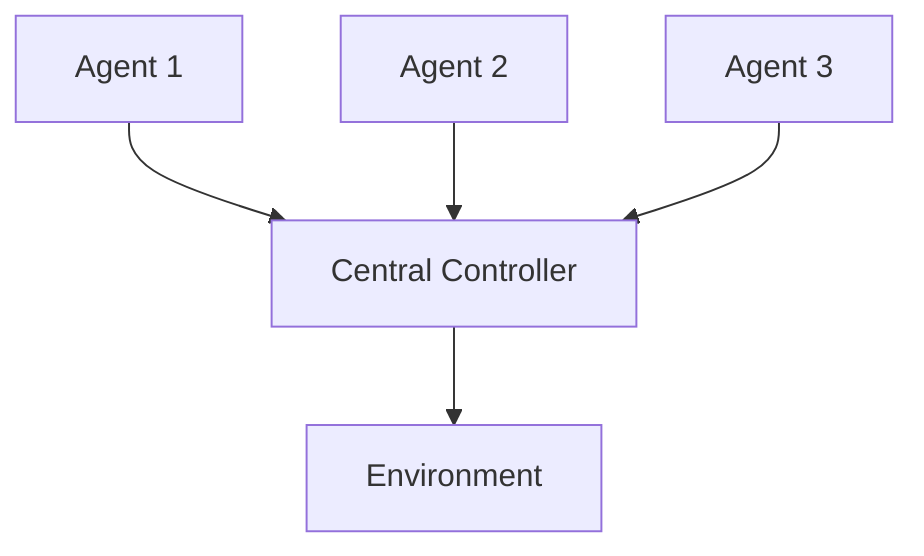
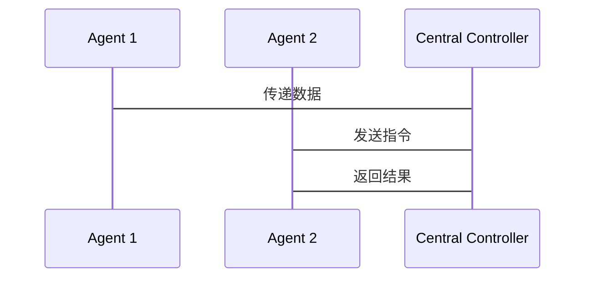

                 


# AI Agent的多智能体协作决策系统

> 关键词：AI Agent，多智能体，协作决策，分布式计算，博弈论，强化学习

> 摘要：本文详细探讨了AI Agent的多智能体协作决策系统的核心概念、算法原理、系统架构及实际应用。通过分析多智能体协作的背景与挑战，结合具体案例，深入讲解了协作决策的数学模型和实现方法，为读者提供了全面的理解和实践指导。

---

# 第一部分: AI Agent与多智能体协作决策系统概述

## 第1章: AI Agent的基本概念与背景

### 1.1 AI Agent的定义与特征
AI Agent（智能体）是指能够感知环境、自主决策并采取行动以实现特定目标的实体。其核心特征包括：
- **自主性**：无需外部干预，自主决策。
- **反应性**：能够实时感知环境并做出响应。
- **社会性**：能够与其他智能体或人类进行交互与协作。

### 1.2 多智能体协作决策系统的背景
随着AI技术的发展，单智能体决策逐渐暴露出局限性。多智能体协作决策系统通过多个智能体的协同工作，能够更好地处理复杂任务，如自动驾驶、机器人协作和分布式计算等。

### 1.3 问题背景与描述
在多智能体协作中，主要挑战包括：
1. **通信与协调**：智能体之间如何高效通信与协调。
2. **决策冲突**：多个智能体的目标可能存在冲突，需找到平衡点。
3. **动态环境**：环境复杂多变，智能体需实时调整决策。

### 1.4 系统的边界与外延
多智能体协作决策系统的边界包括：
- **输入**：环境感知数据、其他智能体状态。
- **输出**：决策指令、协作信号。
- **内部**：决策算法、通信机制。

---

# 第二部分: 多智能体协作决策系统的概念模型

## 第2章: 多智能体协作决策系统的概念模型

### 2.1 核心概念对比
| 概念 | AI Agent | 多智能体协作系统 |
|------|----------|------------------|
| 目标 | 单一目标 | 多目标协同 |
| 决策 | 独立决策 | 协作决策 |
| 通信 | 无/单向 | 高频双向 |

### 2.2 实体关系图


### 2.3 概念结构


---

# 第三部分: 多智能体协作决策系统的算法原理

## 第3章: 分布式计算与多智能体协作

### 3.1 分布式计算的原理
- **定义**：将计算任务分发到多个节点，协同完成。
- **特点**：任务分解、节点协作、结果汇总。

### 3.2 多智能体协作中的分布式计算


### 3.3 代码实现
```python
import threading

class Agent:
    def __init__(self, id):
        self.id = id
        self.result = None

    def compute(self, data):
        # 模拟计算
        self.result = data * self.id
        print(f"Agent {self.id} computed {self.result}")

class CentralController:
    def __init__(self):
        self.agents = []
        self.data = None

    def distribute_task(self, data):
        for agent in self.agents:
            agent.compute(data)
        self.aggregate_results()

    def aggregate_results(self):
        total = sum(agent.result for agent in self.agents)
        print(f"Total result: {total}")

# 示例
controller = CentralController()
controller.agents = [Agent(1), Agent(2), Agent(3)]
controller.distribute_task(5)
```

---

## 第4章: 博弈论与多智能体协作

### 4.1 博弈论的基本原理
- **定义**：研究多个决策者在冲突中的策略选择。
- **纳什均衡**：所有参与者都采取最优策略，无法单方面改变以提高收益。

### 4.2 多智能体协作中的纳什均衡


### 4.3 数学模型
$$ 纳什均衡条件：对于每个智能体i，策略s_i是最佳反应，即对于其他智能体策略s_{-i}，s_i \in arg\max_{s_i} U_i(s_i, s_{-i}) $$

---

## 第5章: 强化学习与多智能体协作

### 5.1 强化学习的基本原理
- **定义**：通过试错学习，智能体通过与环境交互获得奖励，优化策略。

### 5.2 多智能体强化学习


### 5.3 代码实现
```python
import numpy as np

class Agent:
    def __init__(self, state_dim, action_dim):
        self.theta = np.random.randn(state_dim, action_dim)

    def act(self, state):
        return np.argmax(state.dot(self.theta))

class Environment:
    def __init__(self):
        self.state = None
        self.agents = []

    def step(self):
        state = self.state
        rewards = [state.dot(a.theta) for a in self.agents]
        return rewards

# 示例
env = Environment()
env.agents = [Agent(2, 2), Agent(2, 2)]
env.state = np.array([1, 1])
rewards = env.step()
print(rewards)
```

---

# 第四部分: 系统分析与架构设计

## 第6章: 问题场景与系统分析

### 6.1 问题场景
- **场景描述**：多个智能体协同完成复杂任务，如自动驾驶中的车辆路径规划与避障。

### 6.2 系统功能设计
- **功能模块**：环境感知、决策计算、通信机制、结果汇总。

### 6.3 领域模型


---

## 第7章: 系统架构设计

### 7.1 系统架构


### 7.2 接口设计
- **输入接口**：环境数据、智能体状态。
- **输出接口**：决策指令、协作信号。

### 7.3 交互序列图


---

# 第五部分: 项目实战

## 第8章: 项目实战与案例分析

### 8.1 环境安装
- **工具**：Python、NumPy、Mermaid、TensorFlow。

### 8.2 核心代码实现
```python
import threading

class Agent:
    def __init__(self, id):
        self.id = id
        self.result = None

    def compute(self, data):
        self.result = data * self.id
        print(f"Agent {self.id} computed {self.result}")

class CentralController:
    def __init__(self):
        self.agents = []
        self.data = None

    def distribute_task(self, data):
        for agent in self.agents:
            agent.compute(data)
        self.aggregate_results()

    def aggregate_results(self):
        total = sum(agent.result for agent in self.agents)
        print(f"Total result: {total}")

# 示例
controller = CentralController()
controller.agents = [Agent(1), Agent(2), Agent(3)]
controller.distribute_task(5)
```

### 8.3 案例分析
- **案例描述**：三个智能体协同完成数据处理任务。
- **代码解读**：智能体独立计算，中央控制器汇总结果。

### 8.4 总结
通过案例分析，展示了多智能体协作决策系统的实际应用和实现过程。

---

# 第六部分: 最佳实践

## 第9章: 最佳实践与注意事项

### 9.1 小结
- **核心内容**：多智能体协作决策系统的概念、算法、架构与应用。
- **关键点**：通信机制、决策算法、系统架构。

### 9.2 注意事项
1. **通信效率**：确保智能体之间的通信高效低延迟。
2. **算法选择**：根据任务需求选择合适的算法。
3. **系统扩展性**：设计时考虑系统的可扩展性。

### 9.3 拓展阅读
- **推荐书籍**：《Multi-Agent Systems》。
- **在线资源**：推荐相关论文和开源项目。

---

# 结语

通过本文的详细讲解，读者可以系统地了解AI Agent的多智能体协作决策系统的原理、算法和应用。希望本文能为相关领域的研究和实践提供有价值的参考。

