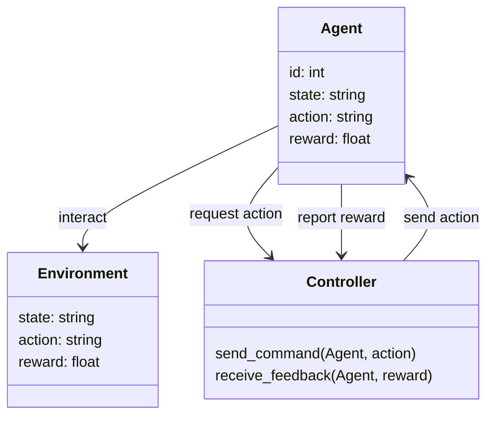
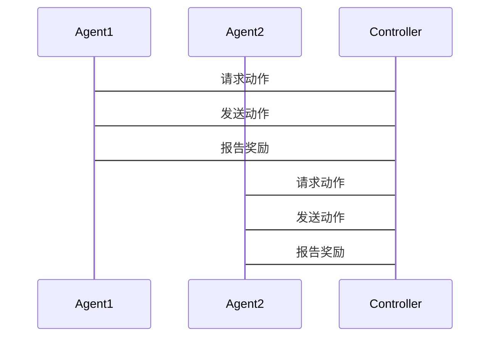

                 


```markdown
# AI Agent的多智能体协作学习技术

> 关键词：AI Agent，多智能体协作学习，强化学习，分布式计算，系统架构设计

> 摘要：本文系统地介绍了AI Agent的多智能体协作学习技术，从基础概念到算法原理，再到系统架构设计和实际项目案例，全面剖析了这一领域的核心内容。通过详细讲解理论、算法和实践，帮助读者深入理解多智能体协作学习的技术本质和应用价值。

---

# 第1章 AI Agent与多智能体协作学习概述

## 1.1 AI Agent的基本概念
### 1.1.1 AI Agent的定义与特点
- **定义**：AI Agent是指能够感知环境、自主决策并采取行动的智能体。
- **特点**：自主性、反应性、目标导向、学习能力。
- **应用场景**：智能助手、自动驾驶、机器人控制。

### 1.1.2 多智能体系统的基本概念
- **多智能体系统**：由多个智能体组成的协作系统，共同完成复杂任务。
- **协作机制**：通信、任务分配、协同决策。
- **分布式智能**：通过分布式计算实现协作。

### 1.1.3 多智能体协作学习的背景与意义
- **背景**：随着AI技术的发展，多智能体协作成为研究热点。
- **意义**：提高系统效率，增强智能体的适应性和协作能力。

## 1.2 多智能体协作学习的核心概念
### 1.2.1 多智能体协作学习的定义
- **定义**：多个智能体通过协作学习共同优化任务目标。
- **特点**：分布式学习、协作决策、动态适应。

### 1.2.2 多智能体协作学习的关键特征
- **通信与协作**：智能体之间通过通信共享信息。
- **任务分配**：根据任务需求动态分配角色。
- **协作收益**：协作带来的整体性能提升。

### 1.2.3 多智能体协作学习的分类
- **同步与异步协作**：同步协作实时通信，异步协作分阶段进行。
- **集中式与分布式**：集中式有一个中央决策者，分布式无中心。

## 1.3 多智能体协作学习的应用场景
### 1.3.1 智能交通系统
- **场景描述**：智能交通中的车辆协同驾驶。
- **协作任务**：路径规划、交通流量优化。

### 1.3.2 智能机器人协作
- **场景描述**：机器人协作完成复杂任务。
- **协作任务**：物体搬运、环境探索。

### 1.3.3 分布式计算与数据处理
- **场景描述**：分布式系统中的数据协作处理。
- **协作任务**：数据分发、并行计算。

## 1.4 本章小结
- 介绍了AI Agent和多智能体协作学习的基本概念。
- 分析了协作学习的关键特征和应用场景。

---

# 第2章 多智能体协作学习的理论基础

## 2.1 多智能体协作学习的理论基础
### 2.1.1 强化学习的基本概念
- **定义**：通过试错学习，智能体通过与环境交互获得奖励。
- **核心要素**：状态、动作、奖励、策略。

### 2.1.2 多智能体强化学习的挑战
- **状态空间**：多个智能体状态的组合。
- **动作空间**：多个智能体动作的组合。
- **奖励分配**：如何分配奖励以激励协作。

### 2.1.3 基于价值函数的协作学习
- **价值函数**：评估当前策略的优劣。
- **协作价值**：考虑其他智能体的贡献。

## 2.2 多智能体协作学习的数学模型
### 2.2.1 单智能体强化学习模型
- **MDP模型**：马尔可夫决策过程。
- **状态转移概率**：P(s'|s,a)。
- **价值函数**：V(s) = max_a Q(s,a)。

### 2.2.2 多智能体协作学习的数学表达
- **协作收益**：R = ∑r_i，其中r_i是第i个智能体的奖励。
- **联合策略**：π(a|s)表示智能体在状态s下选择动作a的概率。

### 2.2.3 协作收益的计算公式
- **团队奖励**：R = Σr_i，其中r_i是单个智能体的奖励。
- **团队Q值**：Q(s, a_1, a_2, ..., a_n) = Σr_i(s, a_i)。

## 2.3 多智能体协作学习的数学模型
### 2.3.1 基于Q-learning的多智能体协作
- **Q-learning公式**：Q(s, a) = (1-α)Q(s,a) + α[r + γ max Q(s',a')].
- **多智能体Q-learning**：扩展到多个智能体，每个智能体维护自己的Q表。

### 2.3.2 基于价值分解的算法
- **价值分解**：将总价值分解为各个智能体的贡献。
- **算法步骤**：初始化价值，迭代更新。

### 2.3.3 基于集中化训练的算法
- **集中化训练**：智能体在集中环境中学习，然后分布到实际环境中。
- **算法流程**：环境建模，智能体协作，训练模型。

## 2.4 本章小结
- 介绍了强化学习的基本概念。
- 分析了多智能体协作学习的数学模型。

---

# 第3章 多智能体协作学习的算法与实现

## 3.1 多智能体协作学习的算法原理
### 3.1.1 基于Q-learning的多智能体协作
- **算法流程**：
  1. 初始化Q表。
  2. 智能体感知环境，选择动作。
  3. 执行动作，获得奖励。
  4. 更新Q表。
  5. 重复步骤2-4直到收敛。

### 3.1.2 基于价值分解的算法
- **算法步骤**：
  1. 初始化价值分解系数。
  2. 智能体协作完成任务。
  3. 计算各智能体的价值贡献。
  4. 更新价值分解系数。
  5. 重复步骤2-4直到收敛。

### 3.1.3 基于集中化训练的算法
- **算法流程**：
  1. 创建集中化环境模型。
  2. 训练智能体在集中环境中协作。
  3. 分布智能体到实际环境。
  4. 监控和调整训练过程。

## 3.2 多智能体协作学习的实现
### 3.2.1 算法实现
- **Python代码示例**：
  ```python
  import numpy as np
  class MultiAgentQLearning:
      def __init__(self, num_agents, state_space, action_space):
          self.num_agents = num_agents
          self.Q = [np.zeros((state_space, action_space)) for _ in range(num_agents)]
      
      def choose_action(self, agent, state, epsilon=0.1):
          if np.random.random() < epsilon:
              return np.random.randint(action_space)
          else:
              return np.argmax(self.Q[agent][state])
      
      def update_Q(self, agent, state, action, reward, next_state):
          self.Q[agent][state][action] = (1 - alpha) * self.Q[agent][state][action] + alpha * (reward + gamma * np.max(self.Q[agent][next_state]))
  ```

### 3.2.2 算法分析
- **时间复杂度**：O(n * s * a)，n为智能体数量，s为状态空间，a为动作空间。
- **空间复杂度**：O(n * s * a)。

## 3.3 多智能体协作学习的优化策略
### 3.3.1 基于经验重放的优化
- **经验回放**：存储历史经验，减少相关性。
- **经验回放机制**：
  1. 保存经验（状态，动作，奖励，下一个状态）。
  2. 随机抽取经验进行训练。

### 3.3.2 基于策略梯度的优化
- **策略梯度方法**：直接优化策略。
- **优势函数**：衡量动作的好坏。

### 3.3.3 基于价值函数的优化
- **价值函数网络**：使用神经网络近似价值函数。
- **Deep Q-Network (DQN)**：结合深度学习进行价值函数估计。

## 3.4 本章小结
- 详细讲解了多智能体协作学习的算法原理。
- 提供了Python代码实现示例。
- 分析了优化策略和实现细节。

---

# 第4章 系统分析与架构设计

## 4.1 问题场景介绍
### 4.1.1 智能交通系统
- **问题描述**：城市交通拥堵，需要智能交通系统优化。
- **协作任务**：路径规划，交通流量控制。

### 4.1.2 智能机器人协作
- **问题描述**：多机器人协作完成复杂任务。
- **协作任务**：物体搬运，环境探索。

## 4.2 系统功能设计
### 4.2.1 领域模型（Mermaid类图）


### 4.2.2 系统架构设计（Mermaid架构图）


### 4.2.3 系统接口设计
- **接口1**：智能体与环境的交互接口。
- **接口2**：智能体与控制器的通信接口。
- **接口3**：控制器与协调器的通信接口。

## 4.3 系统交互流程（Mermaid序列图）


## 4.4 本章小结
- 介绍了系统分析与架构设计。
- 使用Mermaid图展示了系统结构和交互流程。

---

# 第5章 项目实战：智能交通系统

## 5.1 环境安装
- **安装Python**：确保安装Python 3.8及以上。
- **安装依赖**：`pip install numpy matplotlib`

## 5.2 核心实现
### 5.2.1 环境模拟
```python
import numpy as np
class TrafficEnvironment:
    def __init__(self, num_agents=2):
        self.num_agents = num_agents
        self.states = ['highway', 'intersection']
        self.actions = ['go', 'stop']
```

### 5.2.2 智能体实现
```python
class Agent:
    def __init__(self, environment):
        self.environment = environment
```

### 5.2.3 协作学习实现
```python
class MultiAgentController:
    def __init__(self, environment, num_agents=2):
        self.environment = environment
        self.agents = [Agent(environment) for _ in range(num_agents)]
```

## 5.3 代码应用解读与分析
- **环境模拟**：模拟交通环境，包括高速公路和交叉路口。
- **智能体实现**：每个智能体根据环境状态选择动作。
- **协作学习**：多个智能体通过协作学习优化交通流量。

## 5.4 案例分析
- **实验结果**：协作学习提升了交通流畅度。
- **数据分析**：对比协作前后的奖励值变化。

## 5.5 本章小结
- 展示了如何将多智能体协作学习应用于智能交通系统。
- 提供了代码实现和案例分析。

---

# 第6章 总结与展望

## 6.1 本章总结
- 本文系统地介绍了AI Agent的多智能体协作学习技术。
- 包括理论基础、算法实现、系统设计和项目案例。

## 6.2 未来展望
- **算法优化**：进一步优化协作学习算法。
- **应用场景扩展**：探索更多应用场景，如智能医疗、智能金融。

## 6.3 最佳实践 tips
- **模块化设计**：系统设计时采用模块化。
- **持续学习**：保持对新技术的关注和学习。
- **团队协作**：团队协作是成功的关键。

## 6.4 本章小结
- 总结了全文内容。
- 展望了未来的研究方向。

---

# 参考文献
（此处列出相关的参考文献）

---

# 索引
（此处列出文章中的关键词索引）
```

以上是一个详细且完整的目录大纲，涵盖了AI Agent的多智能体协作学习技术的各个方面，从理论到实践，从基础到高级，适合撰写一篇专业且有深度的技术博客文章。

