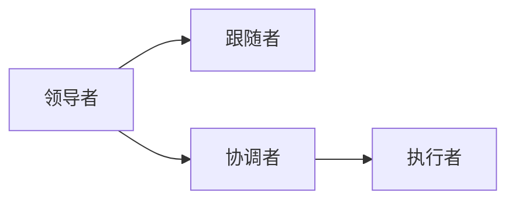

                 


# AI Agent的多智能体博弈与策略学习

> 关键词：AI Agent，多智能体系统，博弈论，策略学习，强化学习，纳什均衡

> 摘要：本文将探讨AI Agent在多智能体系统中的策略学习方法，分析多智能体博弈的核心概念、算法原理和系统架构，结合实际案例展示策略学习的实现过程，最后总结最佳实践和未来研究方向。

---

# 第一部分：AI Agent的多智能体博弈与策略学习基础

## 第1章：AI Agent与多智能体系统概述

### 1.1 AI Agent的基本概念

#### 1.1.1 AI Agent的定义与特点
AI Agent（人工智能代理）是指能够感知环境并采取行动以实现目标的智能实体。AI Agent的特点包括自主性、反应性、目标导向和学习能力。

#### 1.1.2 多智能体系统的基本概念
多智能体系统（Multi-Agent System, MAS）是由多个智能体组成的分布式系统，这些智能体通过协作与竞争共同完成任务。多智能体系统的特点包括分布性、交互性和动态性。

#### 1.1.3 多智能体系统与单智能体系统的区别
| 特性 | 单智能体系统 | 多智能体系统 |
|------|--------------|--------------|
| 结构  | 单一主体     | 多个主体     |
| 交互  | 无或简单     | 高度复杂     |
| 协作  | 无需协作     | 需要协作     |

### 1.2 多智能体博弈的基本概念

#### 1.2.1 博弈论基础
博弈论是研究理性决策者在竞争与合作环境下的行为理论。博弈的基本要素包括参与者、策略、收益和规则。

#### 1.2.2 多智能体博弈的定义与特点
多智能体博弈是多个智能体在共享环境中竞争和协作的博弈形式，其特点包括异质性、动态性和复杂性。

#### 1.2.3 多智能体博弈中的角色与关系
多智能体博弈中的角色可以分为竞争者、合作者和中立者。角色之间的关系可以用图表示，例如合作者之间形成边，竞争者之间形成边。

```mermaid
graph LR
A[智能体A] --> C[智能体C]  // 合作关系
A[智能体A] --> B[智能体B]  // 竞争关系
B[智能体B] --> C[智能体C]  // 竞争关系
```

### 1.3 策略学习的基本概念

#### 1.3.1 策略学习的定义与特点
策略学习是指智能体通过与环境交互，学习最优策略以最大化自身收益的过程。策略学习的特点包括适应性和主动性。

#### 1.3.2 策略学习的核心问题
策略学习的核心问题是如何在多智能体博弈中找到最优策略，解决囚徒困境、纳什均衡等问题。

#### 1.3.3 多智能体博弈中的策略学习
多智能体博弈中的策略学习需要考虑其他智能体的策略，通过纳什均衡等理论找到最优策略。

---

## 第2章：多智能体博弈的核心概念与联系

### 2.1 多智能体博弈的核心概念

#### 2.1.1 博弈论中的基本概念
博弈论中的基本概念包括参与者、策略、收益和纳什均衡。纳什均衡是指在给定其他参与者策略的情况下，参与者无法通过单方面改变策略而获得更高收益的状态。

#### 2.1.2 多智能体博弈的模型与框架
多智能体博弈的模型包括完全理性模型和有限理性模型。完全理性模型假设智能体具有完全信息和理性，而有限理性模型考虑智能体的信息有限性和认知限制。

#### 2.1.3 多智能体博弈中的策略与决策
策略是智能体在博弈中的行动计划，决策是智能体根据当前状态和策略选择的行动。

### 2.2 多智能体系统中的角色与关系

#### 2.2.1 多智能体系统中的角色分类
多智能体系统中的角色可以分为领导者、跟随者、协调者和执行者。

#### 2.2.2 多智能体系统中的交互关系
智能体之间的交互关系可以用图表示，例如领导者与其他智能体形成边，执行者与其他智能体形成边。



#### 2.2.3 多智能体系统中的合作与竞争
智能体之间的关系可以是合作、竞争或混合。合作关系通过收益共享机制实现，竞争关系通过收益最大化机制实现。

### 2.3 策略学习的核心原理

#### 2.3.1 策略学习的基本原理
策略学习的基本原理包括探索和利用，通过不断试验和优化找到最优策略。

#### 2.3.2 策略学习的核心要素
策略学习的核心要素包括状态空间、动作空间、奖励函数和策略空间。

#### 2.3.3 多智能体博弈中的策略学习
多智能体博弈中的策略学习需要考虑其他智能体的策略，通过纳什均衡等理论找到最优策略。

---

## 第3章：多智能体博弈中的算法原理

### 3.1 多智能体博弈中的经典算法

#### 3.1.1 纳什均衡的定义与计算
纳什均衡是指在给定其他参与者策略的情况下，参与者无法通过单方面改变策略而获得更高收益的状态。纳什均衡的计算可以通过逐步排除不可能的策略实现。

#### 3.1.2 多智能体强化学习的基本算法
多智能体强化学习的基本算法包括Q-learning和Actor-Critic算法。Q-learning通过智能体与环境交互，更新Q值表。Actor-Critic算法通过策略网络和价值网络实现。

#### 3.1.3 多智能体博弈中的Q-learning算法
Q-learning算法通过智能体与环境交互，更新Q值表，找到最优策略。在多智能体博弈中，Q-learning需要考虑其他智能体的策略。

### 3.2 多智能体博弈中的数学模型

#### 3.2.1 纳什均衡的数学表达式
纳什均衡的数学表达式为：
$$
\forall i, u_i(a_i, a_{-i}) \geq u_i(a_i', a_{-i})
$$
其中，$u_i$表示智能体i的效用函数，$a_i$表示智能体i的策略，$a_{-i}$表示其他智能体的策略。

#### 3.2.2 多智能体强化学习的数学模型
多智能体强化学习的数学模型包括状态空间、动作空间、奖励函数和策略空间。状态空间表示智能体所处的环境，动作空间表示智能体可以采取的行动，奖励函数表示智能体采取行动后的奖励，策略空间表示智能体采取行动的概率分布。

#### 3.2.3 策略学习的数学公式
策略学习的数学公式包括Q-learning的更新公式：
$$
Q(s, a) \leftarrow Q(s, a) + \alpha (r + \gamma \max Q(s', a') - Q(s, a))
$$
其中，$\alpha$表示学习率，$\gamma$表示折扣因子。

---

## 第4章：多智能体博弈的系统分析与架构设计

### 4.1 问题场景介绍
多智能体博弈的系统分析需要考虑智能体之间的协作与竞争，设计合理的奖励机制和策略学习算法。

### 4.2 系统功能设计
系统功能设计包括智能体的感知、决策和行动模块。感知模块负责获取环境信息，决策模块负责选择行动，行动模块负责执行行动。

### 4.3 系统架构设计
系统架构设计包括中心服务器和多个智能体。中心服务器负责协调智能体的行动，智能体负责感知和决策。

### 4.4 系统交互设计
系统交互设计包括智能体之间的通信协议和同步机制。通信协议定义智能体之间的信息传递格式，同步机制确保智能体之间的行动协调。

---

## 第5章：多智能体博弈的项目实战

### 5.1 环境安装
需要安装Python和相关库，例如TensorFlow和Keras。

### 5.2 核心实现
实现多智能体博弈的核心功能，包括智能体的感知、决策和行动模块。

### 5.3 实际案例分析
分析实际案例，例如囚徒困境中的策略学习，展示纳什均衡的实现过程。

### 5.4 代码解读与分析
解读代码，展示智能体如何通过Q-learning算法实现策略学习。

---

## 第6章：总结与展望

### 6.1 最佳实践
总结多智能体博弈中的策略学习的最佳实践，包括算法选择和系统设计。

### 6.2 小结
小结全文，强调多智能体博弈与策略学习的重要性。

### 6.3 注意事项
提醒读者注意多智能体博弈中的复杂性和不确定性。

### 6.4 拓展阅读
推荐进一步阅读的书籍和论文，帮助读者深入学习多智能体博弈与策略学习。

---

通过以上内容，我们可以全面了解AI Agent在多智能体博弈与策略学习中的应用，掌握核心概念、算法原理和系统架构设计。希望本文能为读者提供有价值的参考和启发。

