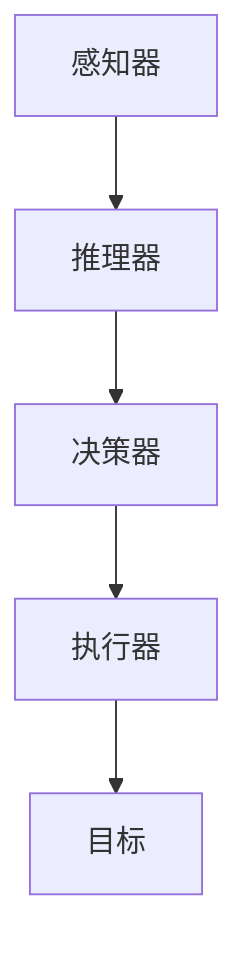
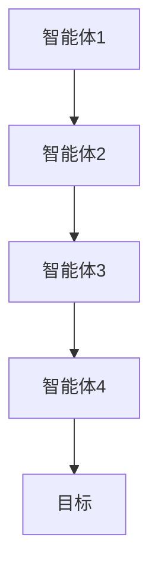
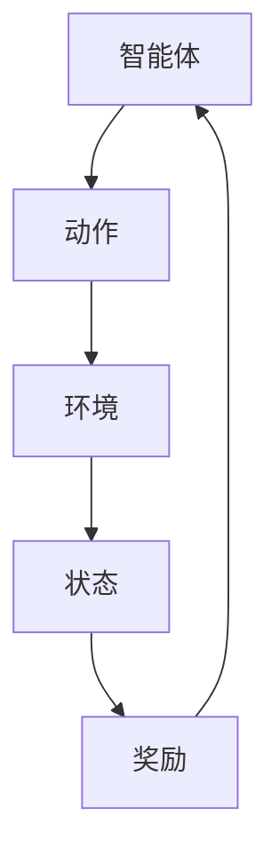
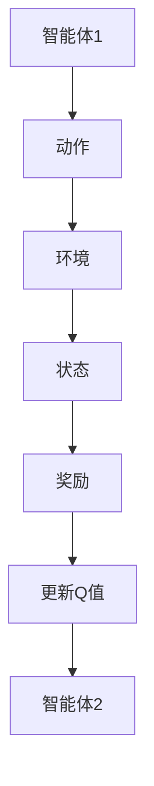
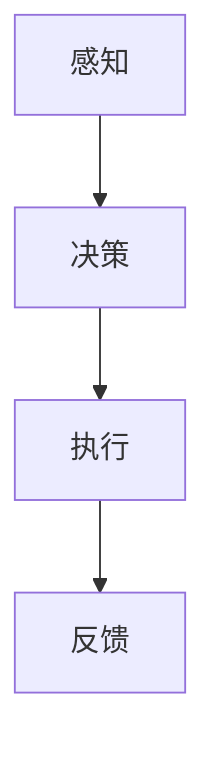

                 


# AI Agent的多智能体强化学习协作机制

**关键词：** AI Agent，多智能体，强化学习，协作机制，分布式系统，分布式计算

**摘要：**  
本文深入探讨了AI Agent在多智能体系统中的协作机制，重点分析了多智能体强化学习的核心原理、算法实现及实际应用。文章从基本概念出发，逐步解析了多智能体系统中的协作问题，详细介绍了强化学习在多智能体环境中的应用，结合实际案例分析了协作机制的设计与优化方法。通过理论与实践相结合的方式，为读者提供了全面的理解和实践指导。

---

## 第1章 AI Agent与多智能体系统基础

### 1.1 AI Agent的基本概念

#### 1.1.1 AI Agent的定义
AI Agent（人工智能代理）是指能够感知环境、自主决策并执行任务的智能实体。它可以是一个软件程序、机器人或其他智能设备，通过传感器获取信息，利用算法进行推理和决策，最终完成特定任务。

**图1-1：AI Agent的基本构成**



#### 1.1.2 AI Agent的核心特征
- **自主性**：能够在没有外部干预的情况下自主运行。
- **反应性**：能够根据环境变化实时调整行为。
- **目标导向**：基于目标驱动决策和行动。
- **学习能力**：能够通过经验改进性能。

#### 1.1.3 AI Agent的分类与应用场景
AI Agent可以分为以下几类：
1. **简单反射型Agent**：基于当前感知做出反应，适用于简单的任务。
2. **基于模型的反射型Agent**：利用内部模型进行决策，适用于复杂环境。
3. **目标驱动型Agent**：以明确目标为导向，适用于任务型场景。
4. **效用驱动型Agent**：基于效用函数优化决策，适用于资源分配问题。

应用场景包括：
- 智能家居：控制家庭设备。
- 机器人：工业机器人和家庭服务机器人。
- 自动驾驶：实现车辆自主导航。

### 1.2 多智能体系统概述

#### 1.2.1 多智能体系统的定义
多智能体系统（Multi-Agent System, MAS）是由多个相互作用的智能体组成的分布式系统，这些智能体通过协作完成共同目标。

**图1-2：多智能体系统的组成**



#### 1.2.2 多智能体系统的特点
- **分布性**：智能体独立运行，不依赖中心控制。
- **协作性**：智能体之间通过协作完成共同目标。
- **动态性**：环境和智能体状态动态变化。
- **复杂性**：智能体之间的交互复杂，需要协调。

#### 1.2.3 多智能体系统的组成部分
1. **智能体**：系统的执行单元。
2. **环境**：智能体运行的物理或虚拟空间。
3. **通信机制**：智能体之间的信息交互方式。
4. **协作机制**：智能体协作完成任务的规则和策略。

### 1.3 多智能体系统与AI Agent的结合

#### 1.3.1 多智能体系统中的AI Agent角色
在多智能体系统中，AI Agent可以作为独立的智能体，通过协作完成复杂任务。

**图1-3：多智能体系统中的AI Agent协作**


#### 1.3.2 多智能体系统与AI Agent的协作机制
协作机制是多智能体系统的核心，通过通信和共享目标实现协作。

#### 1.3.3 多智能体系统的优势与挑战
优势：
- 高效性：多个智能体协作完成任务。
- 灵活性：适应动态环境变化。
- 可扩展性：可以添加更多智能体。

挑战：
- 协作复杂性：智能体之间的协调需要复杂的算法。
- 通信开销：智能体之间需要频繁通信。
- 决策冲突：智能体目标可能冲突。

---

## 第2章 强化学习协作机制的基本原理

### 2.1 强化学习的基本概念

#### 2.1.1 强化学习的定义
强化学习（Reinforcement Learning, RL）是一种通过试错学习最优策略的方法，智能体通过与环境交互获得奖励，最终实现目标。

**图2-1：强化学习的基本流程**



#### 2.1.2 强化学习的核心要素
- **智能体**：执行动作的主体。
- **环境**：智能体运行的空间。
- **状态**：环境的当前情况。
- **动作**：智能体的行动。
- **奖励**：智能体获得的反馈。

#### 2.1.3 强化学习与监督学习的区别
- 监督学习：有标签数据，直接学习函数。
- 强化学习：通过奖励信号学习策略。

### 2.2 多智能体强化学习的挑战

#### 2.2.1 多智能体强化学习中的协调问题
智能体需要协调动作以实现共同目标。

#### 2.2.2 多智能体强化学习中的通信问题
智能体之间需要有效通信以共享信息。

#### 2.2.3 多智能体强化学习中的同步问题
智能体需要同步状态和动作以避免冲突。

### 2.3 协作机制的设计原则

#### 2.3.1 协作机制的目标
- 实现共同目标。
- 提高整体性能。
- 降低通信开销。

#### 2.3.2 协作机制的设计方法
- 基于通信的协作：智能体之间共享信息。
- 基于共享目标的协作：所有智能体共享同一个目标。
- 基于博弈论的协作：通过博弈实现最优策略。

---

## 第3章 多智能体强化学习协作机制的核心概念

### 3.1 多智能体系统中的协作问题

#### 3.1.1 协作问题的定义
协作问题是多智能体系统中智能体如何协作以实现共同目标的问题。

#### 3.1.2 协作问题的分类
- **正向协作**：智能体之间互相帮助。
- **负向协作**：智能体之间互相竞争。

#### 3.1.3 协作问题的影响因素
- 智能体的目标。
- 智能体的通信能力。
- 环境的动态性。

### 3.2 强化学习协作机制的数学模型

#### 3.2.1 协作机制的数学表达
协作机制可以用以下公式表示：

$$
r_i = \sum_{j=1}^{n} w_{ij} \cdot r_j
$$

其中，$r_i$ 是智能体i的奖励，$w_{ij}$ 是智能体i对智能体j的权重，$r_j$ 是智能体j的奖励。

#### 3.2.2 协作机制的优化目标
最大化整体奖励：

$$
\max \sum_{i=1}^{n} r_i
$$

#### 3.2.3 协作机制的约束条件
- 智能体之间的通信限制。
- 智能体的计算能力限制。

### 3.3 协作机制的实现方法

#### 3.3.1 基于通信的协作方法
智能体之间通过通信共享信息。

#### 3.3.2 基于共享目标的协作方法
所有智能体共享同一个目标。

#### 3.3.3 基于博弈论的协作方法
通过博弈论实现智能体之间的协作。

---

## 第4章 算法实现与优化

### 4.1 多智能体强化学习算法

#### 4.1.1 多智能体Q-learning算法

**图4-1：多智能体Q-learning算法流程**



### 4.2 算法优化策略

#### 4.2.1 参数调整
调整学习率和折扣因子。

#### 4.2.2 经验共享
智能体之间共享经验以提高学习效率。

---

## 第5章 系统设计与应用场景

### 5.1 系统设计

#### 5.1.1 系统架构设计

**图5-1：系统架构设计**


#### 5.1.2 系统功能设计

**图5-2：系统功能设计**



### 5.2 应用场景

#### 5.2.1 游戏AI
多智能体协作完成游戏任务。

#### 5.2.2 智能交通
多智能体协作实现交通优化。

#### 5.2.3 协作机器人
多智能体协作完成机器人任务。

---

## 第6章 项目实战与扩展

### 6.1 项目实战

#### 6.1.1 环境安装
安装必要的库和工具。

#### 6.1.2 核心代码实现

```python
class Agent:
    def __init__(self, state_space, action_space):
        self.state_space = state_space
        self.action_space = action_space
        self.q_table = np.zeros((state_space, action_space))

    def act(self, state):
        # 选择动作
        pass

    def update(self, state, action, reward, next_state):
        # 更新Q表
        pass
```

#### 6.1.3 案例分析
分析一个具体案例，展示协作机制的应用。

### 6.2 项目小结

#### 6.2.1 注意事项
- 合理设计协作机制。
- 优化算法性能。

#### 6.2.2 拓展阅读
推荐相关书籍和论文。

---

## 参考文献

（此处列出相关的参考文献）

---

## 附录

（此处列出附录内容，如代码、数据等）

---

通过以上内容，我们系统地介绍了AI Agent的多智能体强化学习协作机制，从基本概念到算法实现，再到实际应用，为读者提供了全面的知识体系和实践指导。

