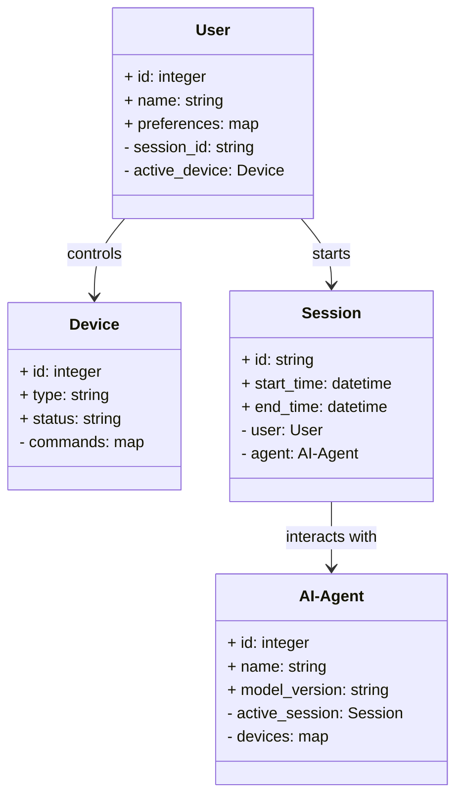
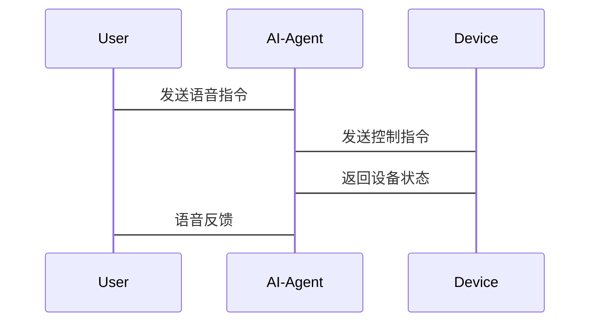

                 


# AI Agent的多模态交互界面设计与实现

## 关键词：AI Agent，多模态交互，用户界面设计，人机交互，系统架构

## 摘要：  
随着人工智能技术的快速发展，AI Agent（智能代理）在多模态交互界面设计中的应用越来越广泛。多模态交互界面能够通过多种感官通道（如视觉、听觉、触觉等）与用户进行交互，显著提升了用户体验。本文系统地探讨了AI Agent的多模态交互界面设计与实现的关键技术，包括多模态数据融合算法、系统架构设计、项目实战与案例分析等。通过理论与实践相结合的方式，本文为读者提供了全面的技术指导，帮助他们理解和实现高效的多模态交互界面。

---

## 第一部分: AI Agent与多模态交互概述

### 第1章: AI Agent与多模态交互概述

#### 1.1 AI Agent的基本概念

##### 1.1.1 AI Agent的定义与特点
AI Agent（智能代理）是指能够感知环境、自主决策并执行任务的智能实体。它能够通过多种方式与用户或环境交互，例如接收输入、处理信息并输出结果。AI Agent的特点包括：

- **自主性**：能够在没有外部干预的情况下自主决策。
- **反应性**：能够实时感知环境并做出响应。
- **社交能力**：能够与用户或其他系统进行交互。
- **学习能力**：通过数据和经验不断优化自身的行为。

##### 1.1.2 多模态交互的定义与意义
多模态交互是指通过多种感官通道（如视觉、听觉、触觉等）进行信息交换的方式。与单一模态交互相比，多模态交互能够提供更丰富、更自然的用户体验。例如，用户可以通过语音指令和手势同时与AI Agent交互，从而实现更高效的沟通。

##### 1.1.3 AI Agent在多模态交互中的角色
在多模态交互中，AI Agent扮演着桥梁的角色，它不仅需要接收多种模态的输入信息，还需要将处理结果通过多种方式反馈给用户。AI Agent的核心任务包括：

- **信息融合**：将来自不同模态的数据进行整合和分析。
- **决策与推理**：基于融合后的信息做出最优决策。
- **多模态输出**：通过多种方式将结果反馈给用户，例如文本、语音、图像等。

#### 1.2 多模态交互的背景与发展趋势

##### 1.2.1 多模态交互的背景
随着人工智能技术的快速发展，用户对交互体验的要求越来越高。传统的单一模态交互方式（如键盘输入或按钮点击）已经难以满足用户的需求。多模态交互能够提供更自然、更高效的交互方式，因此在近年来得到了广泛关注。

##### 1.2.2 多模态交互的发展趋势
当前，多模态交互技术正在快速发展，主要体现在以下几个方面：

1. **技术融合**：多模态交互技术与其他先进技术（如深度学习、自然语言处理）的结合越来越紧密。
2. **应用场景多样化**：多模态交互技术已经广泛应用于智能家居、医疗健康、教育培训、娱乐等多个领域。
3. **用户体验优化**：通过多模态交互，用户能够以更自然的方式与智能系统进行互动，从而提升用户体验。

##### 1.2.3 多模态交互在AI Agent中的应用前景
AI Agent作为多模态交互的核心载体，其应用前景广阔。未来的AI Agent将更加智能化、个性化，并能够通过多种模态与用户进行高效互动。例如，未来的AI Agent不仅可以理解用户的语音指令，还能够识别用户的情绪、姿态等信息，从而提供更贴心的服务。

#### 1.3 本章小结
本章从AI Agent的基本概念出发，探讨了多模态交互的定义、意义以及发展趋势。通过分析AI Agent在多模态交互中的角色，读者可以更好地理解多模态交互界面设计的重要性。

---

## 第二部分: 多模态交互的核心概念与原理

### 第2章: 多模态交互的核心概念

#### 2.1 多模态数据的类型与特征

##### 2.1.1 文本模态
文本模态是多模态交互中最常见的形式之一。它包括文本输入、文本输出等。文本模态的特点是信息密度高、易于处理，但缺乏情感和语境信息。

##### 2.1.2 视觉模态
视觉模态主要通过图像或视频进行信息传递。视觉模态能够提供丰富的空间信息，但处理复杂度较高。

##### 2.1.3 听觉模态
听觉模态主要通过语音进行信息传递。语音模态能够提供情感和语调信息，但易受环境噪声的影响。

##### 2.1.4 其他模态（如触觉、位置等）
除了视觉和听觉模态，触觉模态（如震动、压力）和位置模态（如GPS定位）也在多模态交互中发挥重要作用。

| 模态类型 | 特点 | 优缺点 |
|----------|------|--------|
| 文本     | 信息密度高 | 易处理，但缺乏情感信息 |
| 视觉     | 信息丰富 | 复杂度高，受环境影响 |
| 听觉     | 情感性强 | 易受噪声干扰 |
| 触觉     | 反馈直接 | 依赖硬件支持 |

#### 2.2 多模态数据融合的原理

##### 2.2.1 多模态数据融合的定义
多模态数据融合是指将来自不同模态的数据进行整合和分析，以获得更全面的信息。

##### 2.2.2 多模态数据融合的方法
多模态数据融合的方法主要包括以下几种：

1. **特征级融合**：在特征层面对不同模态的数据进行融合。
2. **决策级融合**：在决策层面对不同模态的结果进行融合。
3. **混合融合**：结合特征级和决策级的融合方法。

##### 2.2.3 数据融合的挑战与解决方案
数据融合的挑战主要体现在以下几个方面：

- **模态异构性**：不同模态的数据格式和特征维度不同。
- **数据稀疏性**：某些模态的数据可能缺失或不完整。
- **计算复杂度**：多模态数据的处理需要较高的计算资源。

针对这些挑战，可以采用以下解决方案：

1. **跨模态对齐**：通过数据变换将不同模态的数据对齐到同一空间。
2. **模态权重调整**：根据模态的重要性动态调整融合权重。
3. **轻量化处理**：通过降维或压缩技术降低计算复杂度。

#### 2.3 多模态交互的核心要素

##### 2.3.1 交互目标
交互目标是指用户通过多模态交互希望实现的具体目标，例如查询信息、控制设备等。

##### 2.3.2 交互方式
交互方式是指用户与AI Agent之间的互动形式，例如语音指令、手势识别等。

##### 2.3.3 交互反馈
交互反馈是指AI Agent在接收到用户的输入后，通过多种方式将结果反馈给用户，例如语音播报、视觉提示等。

#### 2.4 本章小结
本章详细介绍了多模态数据的类型与特征，并探讨了数据融合的原理与方法。通过分析多模态交互的核心要素，读者可以更好地理解多模态交互界面设计的关键点。

---

## 第三部分: 多模态交互的算法原理与实现

### 第3章: 多模态数据融合算法

#### 3.1 多模态注意力机制

##### 3.1.1 注意力机制的定义
注意力机制是一种用于关注输入数据中重要部分的技术，广泛应用于自然语言处理和计算机视觉领域。

##### 3.1.2 多模态注意力机制的实现
多模态注意力机制通过同时关注不同模态的数据，实现更高效的融合。其实现步骤如下：

1. **特征提取**：从不同模态中提取特征。
2. **注意力权重计算**：计算每个模态的注意力权重。
3. **特征加权融合**：根据注意力权重对特征进行加权融合。

##### 3.1.3 多模态注意力机制的优缺点
多模态注意力机制的优点是能够自动关注重要模态，但其计算复杂度较高。

#### 3.2 多模态数据融合的典型算法

##### 3.2.1 多模态编码器-解码器模型
多模态编码器-解码器模型是一种常用的多模态数据融合模型。其核心思想是将不同模态的数据分别编码为一个共同的表示空间，然后通过解码器生成最终的输出。

##### 3.2.2 多模态对比学习
多模态对比学习通过对比不同模态的数据，实现跨模态信息的对齐。其关键在于设计有效的对比损失函数。

##### 3.2.3 多模态生成模型
多模态生成模型（如多模态GAN）能够生成逼真的多模态数据，例如图像和语音。

#### 3.3 算法实现的数学模型

##### 3.3.1 多模态注意力机制的数学表达
假设我们有$N$个模态，每个模态的特征表示为$x_i$，则多模态注意力权重$\alpha_i$的计算公式为：

$$
\alpha_i = \frac{\exp(a_i)}{\sum_{j=1}^{N} \exp(a_j)}
$$

其中，$a_i$是第$i$个模态的注意力得分。

##### 3.3.2 多模态编码器-解码器模型的数学表达
编码器将输入数据$x$映射到一个共同的表示空间$z$，解码器根据$z$生成输出$y$：

$$
z = f_{\text{encoder}}(x)
$$

$$
y = f_{\text{decoder}}(z)
$$

#### 3.4 本章小结
本章介绍了多模态数据融合的典型算法，包括多模态注意力机制、编码器-解码器模型和生成模型。通过数学公式和算法流程图的展示，读者可以更好地理解这些算法的实现细节。

---

## 第四部分: 系统分析与架构设计

### 第4章: 系统分析与架构设计

#### 4.1 问题场景介绍
在本章中，我们将以一个智能家居助手为例，介绍多模态交互界面的系统设计与实现。

#### 4.2 系统功能设计

##### 4.2.1 领域模型类图
以下是智能家居助手的领域模型类图：



#### 4.3 系统架构设计

##### 4.3.1 系统架构图
以下是系统的总体架构图：


#### 4.4 系统接口设计
系统接口设计包括以下部分：

- **输入接口**：支持语音、文本、手势等多种输入方式。
- **输出接口**：支持语音播报、视觉提示等多种输出方式。
- **数据接口**：与智能家居设备进行数据交互。

#### 4.5 系统交互流程图



#### 4.6 本章小结
本章通过智能家居助手的案例，介绍了系统分析与架构设计的关键步骤。通过类图、架构图和交互流程图的展示，读者可以更好地理解系统的实现细节。

---

## 第五部分: 项目实战与案例分析

### 第5章: 项目实战与案例分析

#### 5.1 项目实战

##### 5.1.1 环境安装
要运行本项目，需要安装以下环境：

- Python 3.8及以上版本
- pip 20.0及以上版本
- 安装依赖：`pip install numpy matplotlib scikit-learn`

##### 5.1.2 系统核心实现源代码
以下是AI Agent的核心代码实现：

```python
import numpy as np

class AI-Agent:
    def __init__(self, model_version):
        self.model_version = model_version
        self.devices = {}
    
    def process_input(self, input_data):
        # 处理输入数据
        pass
    
    def generate_output(self, output_data):
        # 生成输出数据
        pass

# 示例用法
agent = AI-Agent(model_version="1.0")
agent.process_input("打开灯")
```

##### 5.1.3 代码应用解读与分析
上述代码定义了一个AI-Agent类，其实现了基本的输入处理和输出生成功能。在实际应用中，需要根据具体的多模态交互需求进行扩展。

#### 5.2 案例分析

##### 5.2.1 案例介绍
本案例以智能家居助手为例，展示多模态交互界面的实现过程。

##### 5.2.2 案例实现与分析
通过分析智能家居助手的实现过程，我们可以得出以下结论：

1. 多模态交互能够显著提升用户体验。
2. 系统设计需要充分考虑不同模态的交互需求。
3. 实现过程中需要注意硬件与软件的协同工作。

#### 5.3 本章小结
本章通过项目实战和案例分析，展示了多模态交互界面设计与实现的具体过程。通过代码和案例的分析，读者可以更好地理解理论知识。

---

## 第六部分: 总结与展望

### 第6章: 总结与展望

#### 6.1 总结
本文系统地探讨了AI Agent的多模态交互界面设计与实现的关键技术，包括多模态数据融合算法、系统架构设计和项目实战与案例分析。通过理论与实践相结合的方式，本文为读者提供了全面的技术指导。

#### 6.2 未来展望
随着人工智能技术的不断发展，多模态交互界面设计将朝着以下几个方向发展：

1. **更自然的交互方式**：通过脑机接口等技术实现更自然的交互。
2. **更智能的决策能力**：通过强化学习等技术提升AI Agent的决策能力。
3. **更广泛的应用场景**：多模态交互技术将在更多领域得到应用。

#### 6.3 最佳实践 tips
- 在设计多模态交互界面时，需要充分考虑用户的需求和习惯。
- 系统设计需要注重模块化和可扩展性。
- 在实现过程中，需要结合具体场景选择合适的算法和工具。

#### 6.4 本章小结
本章总结了全文的主要内容，并展望了多模态交互界面设计的未来发展方向。通过最佳实践 tips的分享，读者可以更好地应用于实际项目中。

---

## 结语
通过本文的系统介绍，读者可以全面了解AI Agent的多模态交互界面设计与实现的关键技术。希望本文能够为相关领域的研究和实践提供有价值的参考。

