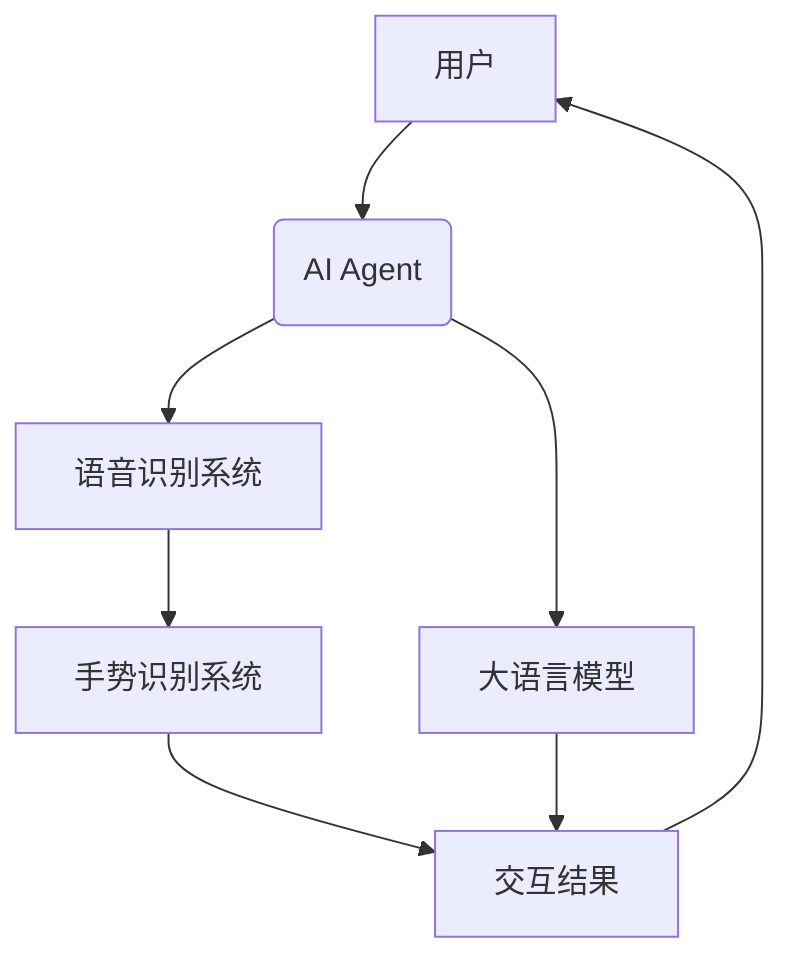
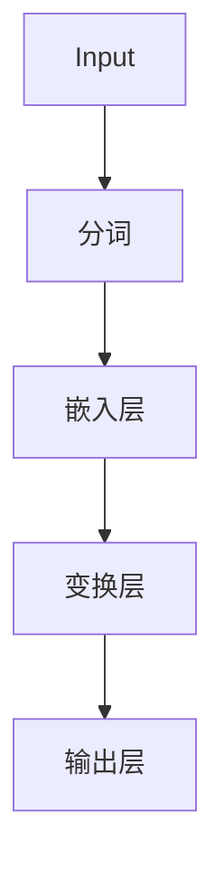
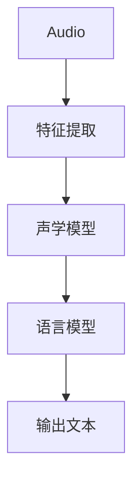
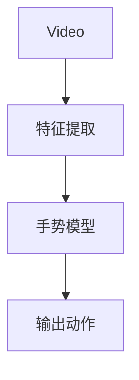
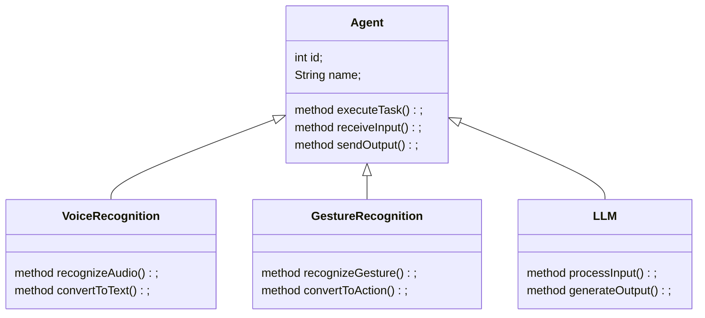
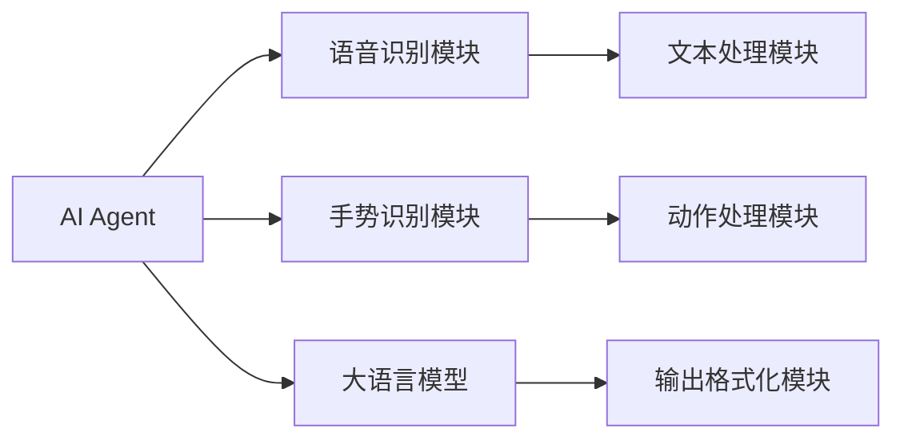
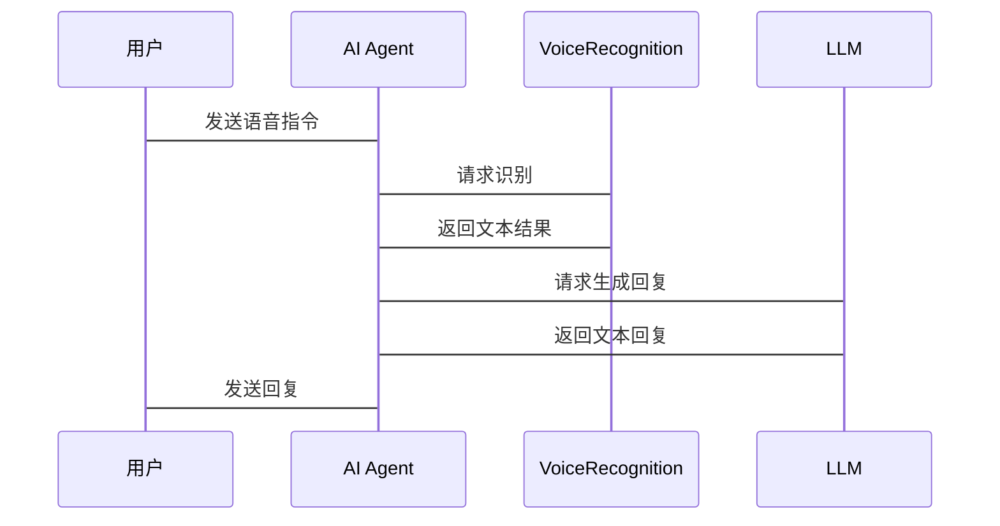

                 


# AI Agent的多模态交互：整合LLM与语音、手势识别

> **关键词**：AI Agent，多模态交互，LLM，语音识别，手势识别，人机交互，人工智能，自然语言处理，计算机视觉

> **摘要**：  
本文详细探讨了AI Agent的多模态交互技术，重点介绍了如何将大语言模型（LLM）与语音识别、手势识别技术进行整合。通过分析多模态交互的核心概念、算法原理、系统架构设计及实际应用案例，本文为读者提供了从理论到实践的全面指导。我们还将讨论如何通过Python代码实现多模态交互的核心功能，并结合实际案例分析其应用场景和优化方法。

---

## 第一部分: AI Agent与多模态交互概述

### 第1章: AI Agent与多模态交互概述

#### 1.1 AI Agent的基本概念
##### 1.1.1 AI Agent的定义与特点
AI Agent（人工智能代理）是指能够感知环境、自主决策并执行任务的智能实体。与传统的程序不同，AI Agent具备以下特点：
- **自主性**：能够在没有外部干预的情况下运行。
- **反应性**：能够根据环境的变化实时调整行为。
- **目标导向性**：以实现特定目标为导向执行任务。
- **社会能力**：能够与其他AI Agent或人类进行交互和协作。

##### 1.1.2 多模态交互的定义与重要性
多模态交互是指通过多种感官渠道（如文本、语音、视觉、手势等）进行信息交换的交互方式。与单一模态交互相比，多模态交互能够提供更丰富的信息表达和更自然的用户体验。

**重要性**：
1. 提供更直观的交互方式，减少用户操作复杂性。
2. 支持更广泛的应用场景，如教育、医疗、娱乐等。
3. 提高系统的智能性和用户体验。

##### 1.1.3 多模态交互的背景与应用领域
随着AI技术的快速发展，多模态交互的应用领域不断扩大。例如：
- **智能家居**：通过语音和手势控制家电。
- **虚拟助手**：结合语音和视觉信息提供更智能的服务。
- **机器人技术**：通过多模态交互实现更自然的人机协作。

---

#### 1.2 LLM与多模态交互的整合
##### 1.2.1 大语言模型（LLM）的基本原理
大语言模型（LLM）是基于深度学习的自然语言处理模型，如GPT系列。其核心原理是通过大量数据训练，生成与输入上下文相关的文本输出。

##### 1.2.2 语音识别与手势识别的技术特点
- **语音识别**：通过将语音信号转化为文本或命令，实现语音交互。
- **手势识别**：通过计算机视觉技术识别手部动作，实现非语言指令的输入。

##### 1.2.3 多模态交互的核心优势
1. **信息互补性**：通过整合不同模态的信息，提高系统的理解能力。
2. **用户体验优化**：提供更自然和便捷的交互方式。
3. **场景适应性**：在复杂场景中，多模态交互能够提供更可靠的交互体验。

---

#### 1.3 本章小结
本章主要介绍了AI Agent的基本概念、多模态交互的定义与重要性，以及大语言模型与语音、手势识别技术的整合。通过这些内容，读者可以理解多模态交互的核心价值和应用场景。

---

## 第二部分: 多模态交互的核心概念与原理

### 第2章: 多模态交互的核心概念

#### 2.1 AI Agent的实体关系分析
##### 2.1.1 实体关系图（ER图）
以下是多模态交互系统的实体关系图：

```mermaid
er
actor(Agent, "用户") 
actor(AI Agent, "智能代理")
actor(语音识别系统, "语音识别模块")
actor(手势识别系统, "手势识别模块")
actor(大语言模型, "LLM模块")

AI Agent --> 语音识别系统: 发送语音指令
AI Agent <-- 语音识别系统: 接收语音文本
AI Agent --> 手势识别系统: 发送手势指令
AI Agent <-- 手势识别系统: 接收手势动作
AI Agent --> 大语言模型: 发送文本指令
AI Agent <-- 大语言模型: 接收文本回复
```

##### 2.1.2 多模态交互的实体关系分析
多模态交互系统涉及多个实体，包括用户、AI Agent、语音识别系统、手势识别系统和大语言模型。这些实体之间的关系通过上述ER图清晰展示。

##### 2.1.3 交互流程图（Mermaid）
以下是多模态交互的流程图：



---

#### 2.2 多模态交互的核心算法原理
##### 2.2.1 大语言模型的处理流程
以下是大语言模型的处理流程图：



##### 2.2.2 语音识别的处理流程
以下是语音识别的处理流程图：



##### 2.2.3 手势识别的处理流程
以下是手势识别的处理流程图：



---

## 第三部分: 多模态交互的算法原理与实现

### 第3章: 大语言模型与语音识别的结合

#### 3.1 大语言模型的处理流程
##### 3.1.1 输入处理
以下是输入处理的代码示例：

```python
import torch

# 定义输入文本
input_text = "今天天气很好"

# 分词处理
tokenizer = AutoTokenizer.from_pretrained("gpt2")
tokens = tokenizer.encode(input_text)
```

##### 3.1.2 模型推理
以下是模型推理的代码示例：

```python
# 加载模型
model = AutoModelForCausalLM.from_pretrained("gpt2")

# 生成输出
outputs = model.generate(torch.tensor(tokens), max_length=50)
generated_text = tokenizer.decode(outputs[0].tolist())
```

##### 3.1.3 输出处理
以下是输出处理的代码示例：

```python
print(f"模型生成的输出为：{generated_text}")
```

---

#### 3.2 语音识别的实现原理
##### 3.2.1 语音信号处理
以下是语音信号处理的代码示例：

```python
import numpy as np

# 模拟语音信号
fs = 16000
t = np.linspace(0, 1, fs)
signal = np.sin(2 * np.pi * 1000 * t)
```

##### 3.2.2 声学模型训练
以下是声学模型训练的代码示例：

```python
# 定义模型
class AcousticModel(torch.nn.Module):
    def __init__(self):
        super(AcousticModel, self).__init__()
        self.conv1 = torch.nn.Conv1d(1, 32, kernel_size=3, padding=1)
        self.pool = torch.nn.MaxPool1d(2)
        self.fc = torch.nn.Linear(32, 10)

    def forward(self, x):
        x = x.unsqueeze(1)
        x = self.conv1(x)
        x = self.pool(x)
        x = x.view(-1, 32)
        x = self.fc(x)
        return x

# 初始化模型
model = AcousticModel()
```

##### 3.2.3 解码与识别
以下是解码与识别的代码示例：

```python
# 加载预训练模型
tokenizer = AutoTokenizer.from_pretrained("facebook/wav2vec2")
model = AutoModelForCTC.from_pretrained("facebook/wav2vec2")

# 加载语音信号
audio_input = ...  # 模拟的语音信号

# 解码
outputs = model(audio_input)
decoded = tokenizer.decode(outputs)
print(f"识别结果为：{decoded}")
```

---

## 第四部分: 多模态交互系统的架构设计与实现

### 第5章: 系统架构设计

#### 5.1 系统功能设计
##### 5.1.1 领域模型设计
以下是领域模型设计的Mermaid类图：



---

#### 5.2 系统架构设计
##### 5.2.1 系统架构图
以下是系统架构设计的Mermaid图：



---

#### 5.3 系统接口设计
##### 5.3.1 接口设计
以下是系统接口设计的Mermaid序列图：



---

## 第五部分: 项目实战

### 第6章: 项目实战

#### 6.1 环境安装
以下是项目实战的环境安装说明：
```bash
pip install torch transformers numpy matplotlib
pip install mermaid
```

#### 6.2 系统核心实现
##### 6.2.1 核心功能实现
以下是核心功能实现的代码示例：

```python
import torch
from transformers import AutoTokenizer, AutoModelForCausalLM

# 加载模型
tokenizer = AutoTokenizer.from_pretrained("gpt2")
model = AutoModelForCausalLM.from_pretrained("gpt2")

# 定义输入
input_text = "请解释量子计算的基本原理"

# 生成输出
tokens = tokenizer.encode(input_text)
outputs = model.generate(torch.tensor(tokens), max_length=100)
response = tokenizer.decode(outputs[0].tolist())
print(f"模型生成的回复为：{response}")
```

##### 6.2.2 代码应用解读与分析
以上代码展示了如何使用大语言模型生成文本回复。首先，加载模型和分词器，然后对输入文本进行分词处理，最后生成并输出回复。

##### 6.2.3 实际案例分析
以下是一个实际案例分析：
假设用户通过语音指令输入“打开灯”，系统通过语音识别模块将指令转换为文本，然后传递给大语言模型生成执行指令，最后通过手势识别模块确认操作完成。

---

#### 6.3 项目小结
通过本章的项目实战，读者可以掌握如何将理论知识应用于实际项目中。通过代码实现和案例分析，进一步理解多模态交互技术的核心原理和应用场景。

---

## 第六部分: 总结与展望

### 第7章: 总结与展望

#### 7.1 本章总结
本文详细介绍了AI Agent的多模态交互技术，重点探讨了如何将大语言模型与语音、手势识别技术进行整合。通过理论分析和实际案例，读者可以全面理解多模态交互的核心原理和实现方法。

#### 7.2 未来展望
随着AI技术的不断发展，多模态交互的应用场景将更加广泛。未来的研究方向包括：
- 更高效的多模态信息融合方法。
- 更智能的交互方式，如情感识别和环境理解。
- 更安全的交互技术，确保用户数据的安全性。

---

## 第八部分: 最佳实践与注意事项

### 第8章: 最佳实践与注意事项

#### 8.1 最佳实践
1. 在实际项目中，建议先进行小规模测试，确保各模块的兼容性和稳定性。
2. 在处理多模态数据时，要注意数据格式的统一和转换问题。
3. 在优化系统性能时，可以尝试使用并行计算和缓存技术。

#### 8.2 注意事项
1. 确保系统的安全性，防止数据泄露和恶意攻击。
2. 在实际应用中，要注意不同设备和环境的兼容性问题。
3. 在设计交互界面时，要注重用户体验，避免过于复杂的操作流程。

---

## 第九部分: 拓展阅读

### 第9章: 拓展阅读

#### 9.1 推荐书籍
1. 《Deep Learning》—— Ian Goodfellow
2. 《Python深度学习》—— Aurélien Géron
3. 《自然语言处理入门》—— 李航

#### 9.2 推荐论文
1. "Attention Is All You Need" —— Vaswani et al.
2. "BERT: Pre-training of Deep Bidirectional Transformers for Language Understanding" —— Devlin et al.

---

## 第十部分: 结语

### 第10章: 结语

通过本文的详细讲解，读者可以全面理解AI Agent的多模态交互技术，并掌握其实现方法和应用场景。希望本文能够为读者在相关领域的研究和实践提供有价值的参考。

--- 

**END**

