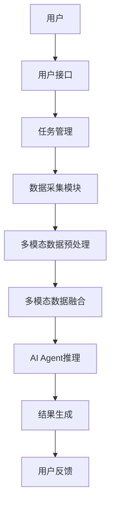
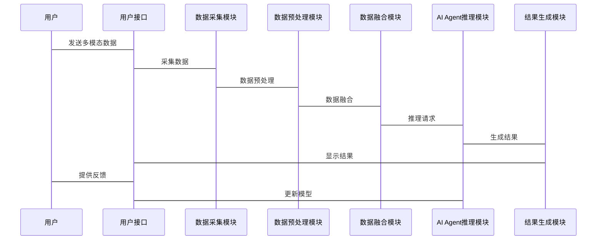
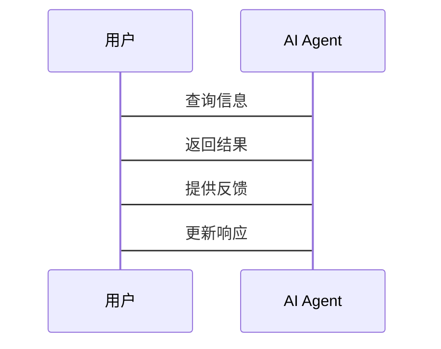

                 


# 第五章: 多模态AI Agent的系统架构设计

## 5.1 系统架构设计概述

### 5.1.1 问题场景介绍
- 多模态AI Agent需要在多种数据源间进行交互和处理
- 需要处理文本、图像、语音等多种数据类型
- 系统需要具备实时性、高可用性和可扩展性

### 5.1.2 系统功能设计
- 数据采集与预处理模块
- 多模态数据融合模块
- AI Agent核心算法模块
- 用户交互与反馈模块

## 5.2 系统架构设计

### 5.2.1 系统架构图


### 5.2.2 模块设计
- 用户接口模块：负责接收用户输入和显示结果
- 数据采集模块：收集多模态数据
- 数据预处理模块：对数据进行清洗和标准化
- 数据融合模块：将不同模态的数据进行对齐和融合
- AI Agent推理模块：基于融合后的数据进行理解和生成
- 结果生成模块：将推理结果转化为可理解的形式
- 反馈模块：收集用户反馈并优化系统

## 5.3 系统接口设计

### 5.3.1 接口设计概述
- 标准化接口设计
- 支持多种数据格式
- 支持多种通信协议

### 5.3.2 接口实现


## 5.4 交互设计

### 5.4.1 交互流程图


### 5.4.2 交互设计要点
- 用户友好的界面设计
- 支持多种交互方式（文本、语音、图像）
- 实时反馈机制

## 5.5 系统优化与扩展

### 5.5.1 系统优化
- 并行处理多模态数据
- 分布式架构设计
- 负载均衡与容错机制

### 5.5.2 系统扩展
- 支持更多模态数据类型
- 支持更大规模的数据处理
- 支持更多应用场景

---

# 第六章: 项目实战——构建一个多模态AI Agent

## 6.1 项目背景与目标

### 6.1.1 项目背景
- 构建一个多模态问答系统
- 集成文本、图像和语音处理功能
- 提供智能交互体验

### 6.1.2 项目目标
- 实现多模态数据的理解与生成
- 实现AI Agent的交互功能
- 提供用户友好的界面

## 6.2 环境搭建与工具安装

### 6.2.1 系统环境
- 操作系统：Linux/Windows/macOS
- Python版本：3.8+

### 6.2.2 工具安装
- 安装Python依赖：`pip install -r requirements.txt`
- 安装TensorFlow/PyTorch框架
- 安装OpenCV和其他图像处理库

## 6.3 项目核心实现

### 6.3.1 数据采集与预处理
```python
import cv2
import numpy as np
from tensorflow.keras.preprocessing.image import load_img, img_to_array

def load_image(image_path):
    img = load_img(image_path)
    img_array = img_to_array(img)
    return img_array / 255.0
```

### 6.3.2 多模态数据融合
```python
import tensorflow as tf
from tensorflow.keras.layers import Input, Dense, Concatenate
from tensorflow.keras.models import Model

input_text = Input(shape=(max_length,))
input_image = Input(shape=(height, width, 3))

x_text = Dense(128, activation='relu')(input_text)
x_image = Dense(128, activation='relu')(input_image)
x = Concatenate()([x_text, x_image])
output = Dense(num_classes, activation='softmax')(x)

model = Model(inputs=[input_text, input_image], outputs=output)
model.compile(optimizer='adam', loss='categorical_crossentropy', metrics=['accuracy'])
```

### 6.3.3 AI Agent推理与生成
```python
import numpy as np
from tensorflow.keras.models import load_model
from transformers import GPT2LMHeadModel, GPT2Tokenizer

tokenizer = GPT2Tokenizer.from_pretrained('gpt2')
model = GPT2LMHeadModel.from_pretrained('gpt2')

def generate_response(prompt, max_length=50):
    inputs = tokenizer(prompt, return_tensors='np')
    outputs = model.generate(**inputs, max_length=max_length)
    return tokenizer.decode(outputs[0], skip_special_tokens=True)
```

## 6.4 项目运行与测试

### 6.4.1 系统测试
- 功能测试：多模态数据的输入与输出
- 性能测试：系统响应时间、资源消耗
- 安全性测试：数据加密与隐私保护

### 6.4.2 用户反馈收集
- 收集用户对系统功能、性能的反馈
- 根据反馈优化系统
- 更新模型参数和算法

## 6.5 项目小结

### 6.5.1 实践总结
- 项目实现了多模态数据的理解与生成
- 系统具备良好的可扩展性和可维护性
- 通过实际案例展示了AI Agent的应用场景

### 6.5.2 经验与教训
- 数据预处理和融合是系统设计的关键
- 选择合适的模型和工具能够提高系统性能
- 用户反馈对于系统优化非常重要

---

# 第七章: 高级应用与挑战

## 7.1 当前研究热点

### 7.1.1 多模态大语言模型
- 结合文本、图像、语音等多种模态的大型语言模型
- 提供更丰富的语义理解和生成能力

### 7.1.2 人机协作与共同创作
- 人机协作的多模态交互方式
- 支持多种模态的共同创作工具

### 7.1.3 实时多模态交互
- 实时处理多模态数据的技术挑战
- 低延迟、高带宽的通信技术

## 7.2 应用场景分析

### 7.2.1 教育领域
- 多模态教学工具
- AI助教系统
- 智能学习伴侣

### 7.2.2 企业应用
- 多模态客服系统
- 企业知识管理
- 智能文档处理

### 7.2.3 娱乐与社交
- 多模态智能助手
- 虚拟形象交互
- 智能社交网络

## 7.3 技术挑战与解决方案

### 7.3.1 技术挑战
- 多模态数据的高效处理
- 跨模态对齐的精度问题
- 模型的可解释性
- 系统的实时性和响应速度

### 7.3.2 解决方案
- 使用更高效的算法和模型
- 优化数据处理和传输的效率
- 提高模型的可解释性
- 采用分布式计算和边缘计算技术

---

# 第八章: 总结与展望

## 8.1 核心内容回顾

### 8.1.1 AI Agent的多模态理解与生成
- 多模态数据的理解与生成是AI Agent的核心能力
- 多模态融合技术是实现这一能力的关键
- 通过多模态数据的融合，AI Agent能够更好地理解用户需求并生成更准确的响应

### 8.1.2 本书的主要内容
- 系统介绍了AI Agent的多模态理解与生成技术
- 详细讲解了多模态数据的基础知识
- 推导了多模态AI Agent的核心算法
- 展示了实际的项目实现和应用案例

## 8.2 未来展望

### 8.2.1 技术发展
- 多模态大语言模型的进一步发展
- 更高效的多模态数据处理技术
- 更智能的多模态交互方式

### 8.2.2 应用场景拓展
- 更多领域的应用，如医疗、法律、金融等
- 人机协作的深度加强
- 多模态交互的普及和推广

## 8.3 最终总结

### 8.3.1 重要性
- 多模态AI Agent是未来人工智能发展的趋势
- 能够更好地满足用户需求
- 能够在更多领域实现智能化

### 8.3.2 建议
- 持续关注技术发展，及时更新知识
- 多实践，积累经验
- 关注伦理和隐私问题，确保技术的健康发展

---

# 附录: 代码库与工具推荐

## 附录A: 开源库与工具

### 1. 多模态数据处理
- **TensorFlow**: [https://tensorflow.google.cn](https://tensorflow.google.cn)
- **PyTorch**: [https://pytorch.org](https://pytorch.org)
- **OpenCV**: [https://opencv.org](https://opencv.org)

### 2. NLP工具
- **Hugging Face**: [https://huggingface.co](https://huggingface.co)
- **Transformers**: [https://github.com/huggingface/transformers](https://github.com/huggingface/transformers)
- **spaCy**: [https://spacy.io](https://spacy.io)

### 3. CV工具
- **YOLO**: [https://github.com/pjwisdom/yolov5](https://github.com/pjwisdom/yolov5)
- **Faster R-CNN**: [https://github.com/facebookresearch/fairDetection](https://github.com/facebookresearch/fairDetection)
- **MMDetection**: [https://github.com/open-mmlab/mmdetection](https://github.com/open-mmlab/mmdetection)

### 4. AI Agent框架
- **Rasa**: [https://rasa.com](https://rasa.com)
- **Snips**: [https://github.com/snipsco/snips-nlu](https://github.com/snipsco/snips-nlu)
- **Dexmo**: [https://github.com/justinribeiro/dexmo](https://github.com/justinribeiro/dexmo)

## 附录B: 进一步学习资源

### 1. 书籍
- 《Deep Learning》 —— Ian Goodfellow
- 《Pattern Recognition and Machine Learning》 —— Christopher M. Bishop
- 《Multi-modal Machine Learning》 —— 李航

### 2. 在线课程
- Coursera: "Deep Learning Specialization" by Andrew Ng
- edX: "Introduction to AI" by MIT
- Udemy: "Multi-modal Data Processing with Python"

### 3. 博客与技术文章
- Hugging Face的官方博客
- TensorFlow的官方博客
- PyTorch的官方博客

### 4. 会议与研讨会
- CVPR
- NIPS
- ICML
- EMNLP

---

# 结束语

感谢您阅读《AI Agent的多模态内容理解与生成》。希望通过本书，您能够对多模态AI Agent的技术和应用有更深入的理解。未来，随着技术的不断进步，多模态AI Agent将在更多领域展现出强大的能力。希望您能够持续关注这一领域的发展，积极参与到技术创新和应用实践中去。

---

**关键词**：AI Agent、多模态数据、自然语言处理、计算机视觉、跨模态融合、生成模型  
**摘要**：本文系统介绍了AI Agent在多模态内容理解与生成中的核心技术和应用。从基础概念到高级算法，从系统架构到项目实战，全面阐述了如何构建一个多模态AI Agent。通过具体案例和代码实现，帮助读者掌握多模态数据的处理和生成技术，并展望了未来的发展方向。

