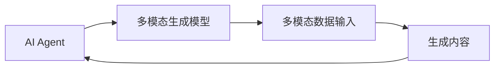
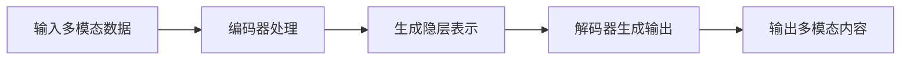
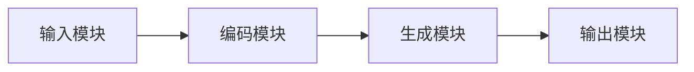

                 


# AI Agent的多模态内容生成与编辑

> 关键词：AI Agent，多模态生成，内容编辑，生成式AI，多模态模型

> 摘要：本文深入探讨AI Agent在多模态内容生成与编辑领域的应用，分析其核心概念、算法原理、系统架构，并通过实际案例展示其在多模态生成中的优势与挑战。文章旨在为读者提供全面的技术视角，帮助理解AI Agent如何通过多模态生成技术提升内容创作的效率与质量。

---

# 第一部分: AI Agent的多模态内容生成与编辑概述

## 第1章: AI Agent与多模态内容生成的背景介绍

### 1.1 AI Agent的基本概念

AI Agent，即人工智能代理，是指能够感知环境、自主决策并执行任务的智能实体。它通过传感器获取信息，利用算法处理信息，并通过执行器与环境交互。AI Agent的核心特征包括：

1. **自主性**：能够在没有外部干预的情况下自主运行。
2. **反应性**：能够实时感知环境并做出反应。
3. **目标导向**：具有明确的目标，并通过规划和推理实现目标。
4. **学习能力**：能够通过经验或数据改进自身的性能。

AI Agent的应用场景广泛，包括智能助手、自动驾驶、智能客服、机器人控制等。

---

### 1.2 多模态内容生成的背景与意义

多模态数据指的是融合了多种数据类型的输入，如文本、图像、语音、视频、传感器数据等。多模态内容生成是指基于多模态输入，生成具有多种模态输出的过程。例如，根据一段文本生成对应的图像或视频，或者根据语音生成文字或翻译成其他语言。

多模态内容生成的背景与意义在于：

1. **信息丰富性**：多模态数据能够提供更全面的信息，提升生成内容的质量与准确性。
2. **用户体验优化**：通过多模态生成，用户能够获得更丰富、更直观的交互体验。
3. **应用场景扩展**：多模态生成技术在教育、医疗、娱乐、广告等领域具有广泛的应用潜力。

---

### 1.3 AI Agent与多模态内容生成的结合

AI Agent与多模态内容生成的结合是当前人工智能领域的研究热点。AI Agent通过多模态生成技术，能够实现更复杂、更智能的任务。例如：

1. **智能助手**：通过多模态生成技术，智能助手可以理解用户的语音指令，并生成相应的文本或图像反馈。
2. **自动驾驶**：AI Agent可以通过多模态数据（如视觉、雷达、语音）进行环境感知，并生成相应的驾驶指令。
3. **内容创作**：AI Agent可以根据用户提供的多模态输入，生成高质量的文章、图像或视频内容。

---

# 第二部分: AI Agent的多模态内容生成核心概念

## 第2章: 多模态内容生成的核心概念与联系

### 2.1 多模态内容生成的原理

多模态内容生成的核心在于如何有效地融合多种数据模态，并通过模型生成高质量的输出。以下是多模态生成的关键步骤：

1. **数据融合**：将多种模态的数据进行预处理和融合，例如通过特征提取或对齐技术将文本与图像对齐。
2. **模型训练**：利用多模态数据训练生成模型，使其能够同时理解并生成多种模态的内容。
3. **生成输出**：根据输入的多模态数据，生成相应的输出内容。

---

### 2.2 AI Agent与多模态生成的实体关系图

以下是AI Agent与多模态生成的实体关系图：



---

### 2.3 多模态生成模型的对比分析

以下是几种典型的多模态生成模型的对比分析：

| 模型名称 | 输入模态 | 输出模态 | 核心优势 | 适用场景 |
|----------|----------|----------|----------|----------|
| GAN | 图像+文本 | 图像 | 生成逼真图像 | 图像生成 |
| Transformer | 文本 | 文本 | 处理长文本序列 | 文本生成 |
| ViT | 图像 | 图像 | 处理大分辨率图像 | 图像生成 |
| TTS | 音频 | 文本 | 文本转语音 | 语音合成 |

---

# 第三部分: 多模态内容生成的算法原理

## 第3章: 生成式AI的算法原理

### 3.1 生成式AI的核心算法

生成式AI的核心算法主要包括生成对抗网络（GAN）和变体自编码器（VAE）。以下是两种算法的简要介绍：

1. **生成对抗网络（GAN）**：
   - GAN由生成器和判别器组成，通过对抗训练生成逼真的数据。
   - 生成器的目标是欺骗判别器，使其认为生成的数据是真实的。
   - 判别器的目标是区分生成数据和真实数据。

2. **变体自编码器（VAE）**：
   - VAE通过编码器将数据映射到潜在空间，再通过解码器生成数据。
   - 通过最大化似然函数，VAE能够生成多样化的数据。

---

### 3.2 多模态生成的算法流程图

以下是多模态生成的算法流程图：



---

### 3.3 算法实现的Python代码示例

以下是生成式AI的Python代码示例：

```python
import torch
import torch.nn as nn

class Generator(nn.Module):
    def __init__(self, latent_dim, output_dim):
        super(Generator, self).__init__()
        self.fc = nn.Linear(latent_dim, output_dim)
    
    def forward(self, x):
        return torch.sigmoid(self.fc(x))

class Discriminator(nn.Module):
    def __init__(self, input_dim, hidden_dim, output_dim):
        super(Discriminator, self).__init__()
        self.fc = nn.Sequential(
            nn.Linear(input_dim, hidden_dim),
            nn.ReLU(),
            nn.Linear(hidden_dim, output_dim),
            nn.Sigmoid()
        )
    
    def forward(self, x):
        return self.fc(x)

# 示例用法
latent_dim = 100
output_dim = 256
generator = Generator(latent_dim, output_dim)
discriminator = Discriminator(output_dim, 128, 1)

# 生成假数据
noise = torch.randn(1, latent_dim)
fake_data = generator(noise)

# 判别器判断
prediction = discriminator(fake_data)
print("预测结果:", prediction)
```

---

## 第4章: 多模态生成模型的数学模型与公式

### 4.1 GAN的数学模型

GAN的损失函数包括生成器损失和判别器损失：

1. **生成器损失**：
   $$ L_G = -\mathbb{E}_{z \sim p_z}[\log D(G(z))] $$

2. **判别器损失**：
   $$ L_D = -\mathbb{E}_{x \sim p_x}[\log D(x)] - \mathbb{E}_{z \sim p_z}[\log (1 - D(G(z)))] $$

---

### 4.2 Transformer的数学模型

Transformer的注意力机制公式为：

$$ \text{Attention}(Q, K, V) = \text{softmax}\left(\frac{QK^T}{\sqrt{d_k}}\right)V $$

其中：
- \( Q \)：查询向量
- \( K \)：键向量
- \( V \)：值向量
- \( d_k \)：键的维度

---

## 第5章: 多模态生成的系统分析与架构设计方案

### 5.1 问题场景介绍

本章以一个AI Agent驱动的多模态生成系统为例，分析其系统架构设计。系统的主要功能包括：

1. 接收多模态输入（如文本、图像、语音）。
2. 通过AI Agent进行内容生成。
3. 输出多模态生成内容（如图像、文本、语音）。

---

### 5.2 系统功能设计

以下是系统的功能模块设计：

1. **输入模块**：接收多种模态的数据输入。
2. **编码模块**：对输入数据进行特征提取和编码。
3. **生成模块**：基于编码后的数据生成多模态输出。
4. **输出模块**：将生成的内容输出给用户。

---

### 5.3 系统架构设计

以下是系统的架构图：



---

### 5.4 系统接口设计

系统接口设计包括：

1. **输入接口**：支持多种模态数据的输入，如文本、图像、语音。
2. **生成接口**：提供生成内容的API。
3. **输出接口**：支持多种模态数据的输出，如文本、图像、语音。

---

## 第6章: 项目实战

### 6.1 环境安装

安装所需的Python库：

```bash
pip install torch
pip install matplotlib
pip install numpy
```

---

### 6.2 系统核心实现源代码

以下是生成式AI的Python代码实现：

```python
import torch
import torch.nn as nn
import torch.optim as optim

class SimpleGenerator(nn.Module):
    def __init__(self, latent_dim, output_dim):
        super(SimpleGenerator, self).__init__()
        self.fc = nn.Linear(latent_dim, output_dim)
    
    def forward(self, x):
        return torch.sigmoid(self.fc(x))

class SimpleDiscriminator(nn.Module):
    def __init__(self, input_dim, hidden_dim, output_dim):
        super(SimpleDiscriminator, self).__init__()
        self.fc = nn.Sequential(
            nn.Linear(input_dim, hidden_dim),
            nn.ReLU(),
            nn.Linear(hidden_dim, output_dim),
            nn.Sigmoid()
        )
    
    def forward(self, x):
        return self.fc(x)

# 训练过程
latent_dim = 100
output_dim = 256
hidden_dim = 128

generator = SimpleGenerator(latent_dim, output_dim)
discriminator = SimpleDiscriminator(output_dim, hidden_dim, 1)

criterion = nn.BCELoss()
g_optimizer = optim.Adam(generator.parameters(), lr=0.0002)
d_optimizer = optim.Adam(discriminator.parameters(), lr=0.0002)

# 生成假数据
noise = torch.randn(1, latent_dim)
fake_data = generator(noise)

# 判别器训练
d_optimizer.zero_grad()
d_loss = criterion(discriminator(fake_data), torch.ones(1, 1))
d_loss.backward()
d_optimizer.step()

# 生成器训练
g_optimizer.zero_grad()
g_loss = criterion(discriminator(fake_data), torch.zeros(1, 1))
g_loss.backward()
g_optimizer.step()

print("生成器损失:", g_loss.item())
print("判别器损失:", d_loss.item())
```

---

## 第7章: 总结与展望

### 7.1 总结

本文详细探讨了AI Agent在多模态内容生成与编辑领域的应用，从核心概念、算法原理到系统架构设计，再到实际项目实战，为读者提供了全面的技术视角。

---

### 7.2 展望

随着人工智能技术的不断发展，AI Agent的多模态生成能力将更加智能化和多样化。未来的研究方向包括：

1. **更高效的生成算法**：探索更高效的生成算法，如基于Transformer的多模态生成模型。
2. **多模态数据的实时处理**：研究如何在实时环境下处理多模态数据。
3. **跨模态交互**：研究不同模态之间的交互与协同生成。

---

### 7.3 小结

AI Agent的多模态生成技术正在迅速发展，其应用潜力巨大。通过不断的研究与实践，我们相信这一技术将在未来为人类带来更加智能、便捷的体验。

---

### 7.4 注意事项

1. 在实际应用中，需注意生成内容的质量与安全性。
2. 多模态生成模型的训练需要大量数据与计算资源，需合理配置。
3. 生成内容的版权与伦理问题需引起重视。

---

### 7.5 拓展阅读

1.《生成式AI: 革新产业的颠覆性技术》
2.《多模态数据处理与深度学习》
3.《AI Agent: 智能系统的构建与应用》

