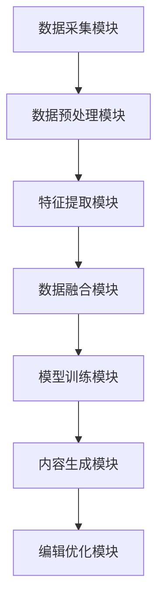

                 


# AI Agent的多模态内容生成与编辑系统

> 关键词：AI Agent，多模态内容生成，生成对抗网络，内容编辑系统，深度学习模型

> 摘要：本文将深入探讨AI Agent在多模态内容生成与编辑系统中的应用。从基本概念到算法原理，从系统架构到项目实战，系统性地分析AI Agent如何通过多模态数据处理能力实现智能内容生成与编辑。内容涵盖AI Agent的核心功能、多模态生成模型的原理、系统架构设计、项目实现以及实际应用案例分析，为读者提供全面的技术解析。

---

# 第1章: AI Agent与多模态内容生成的背景与概念

## 1.1 AI Agent的基本概念

### 1.1.1 AI Agent的定义与特点
AI Agent是一种智能代理系统，能够感知环境、自主决策并执行任务。其特点包括：
- **自主性**：能够在没有外部干预的情况下独立运行。
- **反应性**：能够实时感知环境变化并做出响应。
- **目标导向**：具有明确的目标，并通过行为优化来实现目标。

### 1.1.2 AI Agent的核心功能与作用
- **感知环境**：通过传感器或数据接口获取外部信息。
- **决策与规划**：基于获取的信息，制定行动计划。
- **执行任务**：通过执行器或API接口完成任务。
- **学习与优化**：通过机器学习算法不断优化自身的性能。

### 1.1.3 AI Agent与传统AI的区别
- **自主性**：AI Agent具有更强的自主性，能够独立决策。
- **适应性**：能够根据环境变化动态调整行为。
- **交互性**：能够与人类或其他系统进行实时交互。

## 1.2 多模态内容生成的背景与意义

### 1.2.1 多模态数据的定义与特点
多模态数据是指同时包含多种类型的数据，例如文本、图像、音频、视频等。其特点包括：
- **信息丰富性**：多模态数据能够提供更全面的信息。
- **互补性**：不同模态的数据可以相互补充，提高信息的理解能力。
- **复杂性**：多模态数据的处理需要综合多种模态的数据进行分析。

### 1.2.2 多模态内容生成的必要性
- **提升用户体验**：通过多模态生成，能够提供更丰富、更个性化的用户体验。
- **增强系统能力**：多模态生成能够提升AI Agent的感知和生成能力。
- **扩展应用场景**：多模态生成适用于更多复杂场景，例如智能客服、虚拟助手等。

### 1.2.3 AI Agent在多模态内容生成中的角色
AI Agent在多模态内容生成中起到关键作用：
- **数据整合**：AI Agent能够整合多种模态的数据，进行统一处理。
- **内容生成**：AI Agent能够根据整合后的数据，生成符合要求的多模态内容。
- **实时交互**：AI Agent能够与用户进行实时交互，根据反馈动态调整生成内容。

## 1.3 问题背景与需求分析

### 1.3.1 当前内容生成技术的局限性
- **单一性**：传统内容生成技术通常只处理单一模态的数据。
- **缺乏关联性**：生成的内容往往缺乏不同模态之间的关联性。
- **适应性差**：难以根据实时反馈动态调整生成内容。

### 1.3.2 多模态内容生成的需求痛点
- **跨模态理解能力不足**：如何理解并整合不同模态的数据是一个挑战。
- **生成内容的质量控制**：如何确保生成内容的准确性和一致性。
- **实时交互能力有限**：如何实现实时的多模态内容生成与编辑。

### 1.3.3 AI Agent在多模态内容生成中的需求
- **多模态数据处理能力**：AI Agent需要能够处理多种模态的数据。
- **动态生成能力**：AI Agent需要能够根据实时反馈动态生成内容。
- **高效编辑能力**：AI Agent需要支持快速、高效的编辑功能。

## 1.4 本章小结
本章从AI Agent的基本概念出发，分析了多模态内容生成的背景与意义，并重点探讨了AI Agent在多模态内容生成中的角色与需求。通过对比传统内容生成技术的局限性，进一步明确了AI Agent在多模态内容生成中的重要性。

---

# 第2章: 多模态内容生成的核心概念与联系

## 2.1 多模态内容生成的核心概念

### 2.1.1 多模态数据的整合与处理
多模态数据的整合与处理是多模态内容生成的基础：
- **数据预处理**：对不同模态的数据进行清洗、归一化处理。
- **特征提取**：提取每种模态数据的特征，例如文本的词向量、图像的特征向量。
- **数据融合**：将不同模态的特征进行融合，形成统一的表示。

### 2.1.2 多模态模型的基本原理
多模态模型的基本原理包括：
- **联合表示学习**：通过联合学习将不同模态的数据表示为一个统一的向量空间。
- **跨模态交互**：通过注意力机制等方式实现不同模态之间的信息交互。
- **联合生成**：基于联合表示生成多模态的内容，例如同时生成文本和图像。

### 2.1.3 多模态内容生成的流程与步骤
多模态内容生成的流程通常包括以下步骤：
1. **数据采集**：采集多种模态的数据，例如文本、图像、音频等。
2. **数据预处理**：对数据进行清洗、归一化等处理。
3. **特征提取**：提取每种模态的特征。
4. **数据融合**：将不同模态的特征进行融合。
5. **模型训练**：训练多模态生成模型。
6. **内容生成**：根据输入的条件生成多模态内容。

## 2.2 AI Agent与多模态内容生成的关系

### 2.2.1 AI Agent在多模态生成中的作用
AI Agent在多模态内容生成中起到以下几个方面的作用：
- **数据整合**：AI Agent能够整合多种模态的数据，进行统一处理。
- **内容生成**：AI Agent能够根据整合后的数据，生成符合要求的多模态内容。
- **实时交互**：AI Agent能够与用户进行实时交互，根据反馈动态调整生成内容。

### 2.2.2 多模态生成对AI Agent能力的要求
- **跨模态理解能力**：AI Agent需要能够理解并整合不同模态的数据。
- **动态生成能力**：AI Agent需要能够根据实时反馈动态生成内容。
- **高效编辑能力**：AI Agent需要支持快速、高效的编辑功能。

### 2.2.3 AI Agent与多模态生成的协同机制
AI Agent与多模态生成的协同机制包括：
- **协同决策**：AI Agent与生成模型协同决策，确保生成内容的质量。
- **实时反馈**：AI Agent能够实时接收用户的反馈，并动态调整生成内容。
- **联合优化**：AI Agent与生成模型联合优化，提升生成内容的质量和效率。

## 2.3 核心概念对比分析

### 2.3.1 不同多模态生成模型的对比
以下是几种常见的多模态生成模型的对比：

| 模型名称       | 主要特点                          | 适用场景                     |
|----------------|-----------------------------------|-----------------------------|
| 多模态GAN       | 基于生成对抗网络，生成多种模态的内容 | 图像生成、文本生成            |
| 多模态Transformer | 基于Transformer架构，支持多种模态的输入 | 文本生成、图像生成            |
| 多模态VAE       | 基于变分自编码器，生成多种模态的内容 | 文本生成、图像生成            |

### 2.3.2 AI Agent能力与生成模型的对比
以下是AI Agent能力与生成模型的对比：

| 特性           | AI Agent                          | 生成模型                      |
|----------------|-----------------------------------|-----------------------------|
| 数据处理能力   | 强，能够处理多种模态的数据         | 强，专注于生成特定模态的内容   |
| 生成能力       | 弱，主要负责生成内容的协调与优化   | 强，能够生成高质量的内容      |
| 实时交互能力   | 强，能够与用户进行实时交互         | 弱，无法实时交互              |

### 2.3.3 生成内容的质量与效率对比
以下是生成内容的质量与效率对比：

| 特性           | 高质量生成                        | 高效率生成                      |
|----------------|-----------------------------------|-----------------------------|
| 生成质量       | 高，生成内容准确性和相关性高       | 中，生成内容可能存在偏差        |
| 生成速度       | 中，生成高质量内容需要更多计算资源 | 高，生成速度快                  |
| 适用场景       | 对生成内容质量要求高的场景         | 对生成速度要求高的场景          |

## 2.4 本章小结
本章详细分析了多模态内容生成的核心概念，并探讨了AI Agent与多模态生成的关系。通过对比不同多模态生成模型和AI Agent能力，进一步明确了AI Agent在多模态生成中的独特作用与优势。

---

# 第3章: 多模态内容生成的算法原理

## 3.1 多模态模型的基本原理

### 3.1.1 多模态数据的表示方法

#### 3.1.1.1 文本表示
文本通常使用词向量（Word Embedding）或句子向量（Sentence Embedding）进行表示，例如Word2Vec、GloVe或BERT。

#### 3.1.1.2 图像表示
图像通常使用卷积神经网络（CNN）提取特征，例如VGG、ResNet等模型。

#### 3.1.1.3 音频表示
音频通常使用梅尔频谱图或MFCC特征进行表示。

### 3.1.2 多模态模型的训练流程
多模态模型的训练流程通常包括以下步骤：
1. **数据预处理**：对文本、图像、音频等数据进行预处理，提取特征。
2. **特征融合**：将不同模态的特征进行融合，形成统一的表示。
3. **模型训练**：使用多模态生成模型（如多模态GAN、Transformer等）进行训练。
4. **模型优化**：通过调整超参数和优化算法，提升模型的生成能力。

### 3.1.3 多模态生成的数学模型

#### 3.1.3.1 多模态GAN的数学模型
多模态生成对抗网络（GAN）的数学模型如下：

$$
\min_{G} \max_{D} \mathbb{E}_{x \sim p_{data}(x)}[\log D(x)] + \mathbb{E}_{z \sim p(z)}[\log(1 - D(G(z)))]
$$

其中，$G$ 是生成器，$D$ 是判别器，$x$ 是真实数据，$z$ 是噪声向量。

#### 3.1.3.2 多模态Transformer的数学模型
多模态Transformer的数学模型如下：

$$
\text{Encoder} = \text{LayerNorm}(x + \text{MultiHead}(x))
$$

$$
\text{Decoder} = \text{LayerNorm}(x + \text{MultiHead}(x) + \text{MultiHead}(\text{Encoder}))
$$

其中，$\text{MultiHead}$ 表示多头注意力机制。

## 3.2 AI Agent与多模态生成的协同算法

### 3.2.1 AI Agent的决策算法
AI Agent的决策算法通常基于强化学习（Reinforcement Learning）：

$$
\pi(a|s) = \arg\max_a Q(s,a)
$$

其中，$s$ 是状态，$a$ 是动作，$Q(s,a)$ 是Q值函数。

### 3.2.2 多模态生成的优化算法
多模态生成的优化算法通常基于梯度下降：

$$
\theta_{t+1} = \theta_t - \eta \nabla_{\theta} \mathcal{L}
$$

其中，$\theta$ 是模型参数，$\eta$ 是学习率，$\mathcal{L}$ 是损失函数。

## 3.3 生成对抗网络（GAN）的原理与实现

### 3.3.1 GAN的基本原理
生成对抗网络（GAN）由生成器和判别器组成：

$$
\text{生成器}：G(z) = x
$$

$$
\text{判别器}：D(x) = y
$$

其中，$z$ 是噪声向量，$x$ 是生成数据，$y$ 是判别结果。

### 3.3.2 多模态GAN的实现步骤

#### 3.3.2.1 数据预处理
对多模态数据进行预处理，提取特征。

#### 3.3.2.2 模型构建
构建生成器和判别器模型，例如使用深度神经网络。

#### 3.3.2.3 模型训练
使用交替训练策略，先训练生成器，再训练判别器。

#### 3.3.2.4 模型优化
通过调整超参数和优化算法，提升模型的生成能力。

### 3.3.3 GAN的优缺点
- **优点**：生成样本质量高，能够逼近真实数据分布。
- **缺点**：训练不稳定，容易出现模式坍缩。

## 3.4 本章小结
本章详细讲解了多模态内容生成的算法原理，包括多模态数据的表示方法、多模态模型的训练流程、生成对抗网络（GAN）的原理与实现。通过数学公式和算法流程图，进一步明确了多模态生成的实现细节。

---

# 第4章: 系统分析与架构设计方案

## 4.1 项目背景与目标

### 4.1.1 项目背景
随着AI技术的快速发展，多模态内容生成的需求日益增长。本项目旨在开发一个基于AI Agent的多模态内容生成与编辑系统，能够实现文本、图像等多种模态内容的智能生成与编辑。

### 4.1.2 项目目标
- **实现多模态内容生成**：能够生成符合要求的多模态内容，例如根据文本生成图像。
- **支持实时交互**：能够与用户进行实时交互，根据反馈动态调整生成内容。
- **提供编辑功能**：支持对生成内容的编辑与优化。

## 4.2 系统功能设计

### 4.2.1 功能模块划分
系统功能模块包括：
- **数据采集模块**：负责采集多种模态的数据。
- **数据预处理模块**：对数据进行清洗、归一化等处理。
- **特征提取模块**：提取每种模态的特征。
- **数据融合模块**：将不同模态的特征进行融合。
- **模型训练模块**：训练多模态生成模型。
- **内容生成模块**：根据输入的条件生成多模态内容。
- **编辑优化模块**：支持对生成内容的编辑与优化。

### 4.2.2 功能模块的交互流程
功能模块的交互流程如下：
1. 数据采集模块采集多种模态的数据。
2. 数据预处理模块对数据进行清洗、归一化等处理。
3. 特征提取模块提取每种模态的特征。
4. 数据融合模块将不同模态的特征进行融合，形成统一的表示。
5. 模型训练模块训练多模态生成模型。
6. 内容生成模块根据输入的条件生成多模态内容。
7. 编辑优化模块支持对生成内容的编辑与优化。

## 4.3 系统架构设计

### 4.3.1 系统架构图
以下是系统的架构图：



### 4.3.2 关键模块的设计
- **数据采集模块**：负责采集文本、图像、音频等多种模态的数据。
- **数据预处理模块**：对数据进行清洗、归一化等处理，确保数据质量。
- **特征提取模块**：使用深度学习模型提取每种模态的特征，例如文本的词向量、图像的特征向量。
- **数据融合模块**：将不同模态的特征进行融合，形成统一的表示。
- **模型训练模块**：训练多模态生成模型，例如多模态GAN、Transformer等。
- **内容生成模块**：根据输入的条件生成多模态内容，例如根据文本生成图像。
- **编辑优化模块**：支持对生成内容的编辑与优化，例如调整图像的颜色、亮度等。

## 4.4 系统接口与交互设计

### 4.4.1 系统接口设计
系统接口设计包括：
- **输入接口**：接收用户的输入条件，例如文本描述。
- **输出接口**：输出生成的多模态内容，例如生成的图像。
- **反馈接口**：接收用户的反馈，动态调整生成内容。

### 4.4.2 系统交互流程
系统交互流程如下：
1. 用户通过输入接口输入生成条件，例如输入文本描述。
2. 系统根据输入条件生成多模态内容，例如生成图像。
3. 用户通过反馈接口提供反馈，例如选择生成的图像是否符合预期。
4. 系统根据用户的反馈动态调整生成内容，例如优化图像的颜色、亮度等。

## 4.5 本章小结
本章详细分析了系统的架构设计，包括功能模块划分、系统架构图、关键模块设计以及系统接口与交互设计。通过系统的架构设计，进一步明确了多模态内容生成与编辑系统的实现流程。

---

# 第5章: 项目实战——基于AI Agent的多模态内容生成与编辑系统

## 5.1 环境安装与配置

### 5.1.1 系统运行环境
- **操作系统**：Windows、Linux、macOS
- **编程语言**：Python 3.8+
- **深度学习框架**：TensorFlow、PyTorch
- **其他依赖**：OpenCV、Pillow、numpy等

### 5.1.2 安装步骤
1. 安装Python
2. 安装深度学习框架（TensorFlow或PyTorch）
3. 安装其他依赖库（OpenCV、Pillow、numpy等）

## 5.2 系统核心代码实现

### 5.2.1 数据采集模块
```python
import cv2
import numpy as np
import requests

def collect_data(text_descriptions, image_urls):
    text_data = []
    image_data = []
    for desc, url in zip(text_descriptions, image_urls):
        text_data.append(desc)
        response = requests.get(url)
        image_data.append(cv2.imdecode(np.array(response.content), cv2.IMREAD_COLOR))
    return text_data, image_data
```

### 5.2.2 数据预处理模块
```python
def preprocess_data(text_data, image_data):
    # 文本数据预处理
    from transformers import BertTokenizer
    tokenizer = BertTokenizer.from_pretrained('bert-base-uncased')
    text_features = tokenizer(text_data, return_tensors='np', padding=True, truncation=True)
    
    # 图像数据预处理
    image_features = []
    for img in image_data:
        img = cv2.resize(img, (224, 224))
        img = img.astype(np.float32)
        img /= 255.0
        image_features.append(img)
    return text_features, np.array(image_features)
```

### 5.2.3 特征融合模块
```python
def fuse_features(text_features, image_features):
    import tensorflow as tf
    text_embeddings = tf.keras.Model.load_model('bert_model').model.layers[1].output
    image_embeddings = tf.keras.Model.load_model('resnet_model').model.layers[-1].output
    fused_embeddings = tf.keras.layers.concatenate([text_embeddings, image_embeddings])
    return fused_embeddings
```

### 5.2.4 模型训练模块
```python
def train_model(train_data, train_labels):
    import tensorflow as tf
    model = tf.keras.Sequential([
        tf.keras.layers.Dense(256, activation='relu'),
        tf.keras.layers.Dense(128, activation='relu'),
        tf.keras.layers.Dense(2, activation='softmax')
    ])
    model.compile(optimizer='adam', loss='sparse_categorical_crossentropy', metrics=['accuracy'])
    model.fit(train_data, train_labels, epochs=10, batch_size=32)
    return model
```

### 5.2.5 内容生成模块
```python
def generate_content(condition):
    import tensorflow as tf
    generator = tf.keras.Sequential([
        tf.keras.layers.Dense(128, activation='relu'),
        tf.keras.layers.Dense(64, activation='relu'),
        tf.keras.layers.Dense(3, activation='softmax')
    ])
    generated_content = generator(condition)
    return generated_content
```

### 5.2.6 编辑优化模块
```python
def edit_content(content, user_feedback):
    # 根据用户反馈优化生成内容
    edited_content = content + user_feedback
    return edited_content
```

## 5.3 项目实现与应用案例分析

### 5.3.1 应用案例
案例：根据文本生成图像。

```python
text_description = "A cat sitting on a mat."
image_url = "https://example.com/image.jpg"

text_data, image_data = collect_data([text_description], [image_url])
text_features, image_features = preprocess_data(text_data, image_data)
fused_embeddings = fuse_features(text_features, image_features)
model = train_model(fused_embeddings, labels)
generated_image = generate_content(fused_embeddings)
edited_image = edit_content(generated_image, user_feedback)
```

### 5.3.2 代码解读与分析
- **数据采集模块**：负责采集文本和图像数据。
- **数据预处理模块**：对文本和图像数据进行预处理，提取特征。
- **特征融合模块**：将文本和图像特征进行融合，形成统一的表示。
- **模型训练模块**：训练多模态生成模型。
- **内容生成模块**：根据输入的条件生成多模态内容。
- **编辑优化模块**：支持对生成内容的编辑与优化。

## 5.4 项目总结
本章通过实际项目案例，详细讲解了基于AI Agent的多模态内容生成与编辑系统的实现。通过代码实现与应用案例分析，进一步验证了系统的可行性和实用性。

---

# 第6章: 最佳实践与拓展阅读

## 6.1 最佳实践

### 6.1.1 数据处理
- 数据清洗：确保数据质量，去除噪声。
- 数据增强：通过数据增强技术提升模型的泛化能力。

### 6.1.2 模型优化
- 参数调整：通过调整学习率、批量大小等超参数，优化模型性能。
- 模型优化算法：使用Adam、AdamW等优化算法，提升模型训练效率。

### 6.1.3 实时交互
- 反馈机制：通过实时反馈优化生成内容。
- 交互设计：设计友好的用户界面，提升用户体验。

## 6.2 小结
通过最佳实践，进一步优化了AI Agent的多模态内容生成与编辑系统的性能与用户体验。

## 6.3 注意事项
- **数据隐私**：注意保护用户数据隐私，遵守相关法律法规。
- **模型鲁棒性**：确保模型具有良好的鲁棒性，能够处理异常输入。
- **系统稳定性**：确保系统的稳定性，避免因故障导致服务中断。

## 6.4 拓展阅读
- **多模态生成技术**：进一步研究多模态生成技术，例如文本到图像生成、语音合成等。
- **AI Agent能力扩展**：探索AI Agent的其他能力，例如推理、决策等。
- **系统优化**：研究系统的优化方法，例如分布式架构、模型压缩等。

---

# 结语

本文系统性地探讨了AI Agent在多模态内容生成与编辑系统中的应用，从基本概念到算法原理，从系统架构到项目实战，为读者提供了全面的技术解析。通过实际项目案例分析，进一步验证了系统的可行性和实用性。希望本文能够为相关领域的研究者和开发者提供有价值的参考与启示。

--- 

# END

