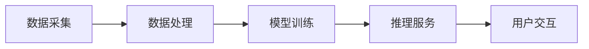
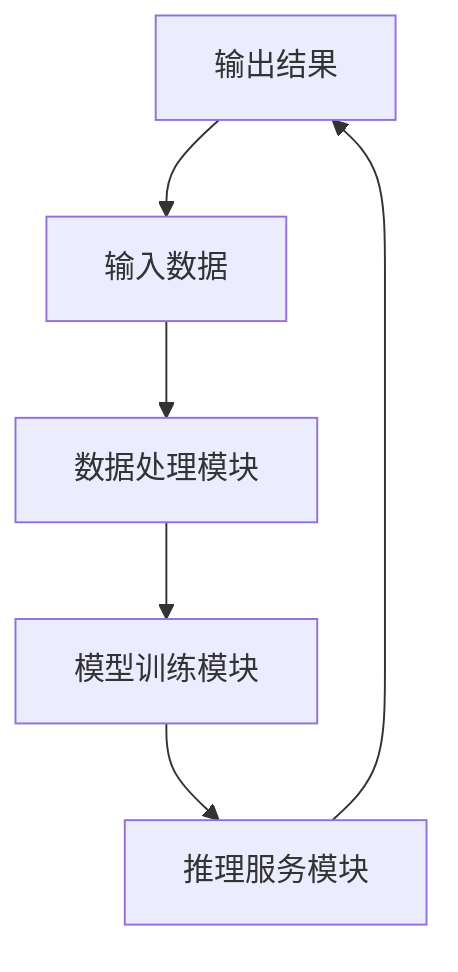

                 

<think>
好的，我现在需要帮助用户完成《AI Agent的多模态场景理解与推理》这篇文章的目录大纲，并根据用户的要求撰写详细的内容。用户已经提供了部分内容，但需要继续完成后面的章节。以下是接下来的部分：

---

# 第三部分: 多模态场景理解与推理的系统架构设计

# 第4章: 多模态场景理解与推理的系统架构设计

## 4.1 系统功能设计
### 4.1.1 数据采集模块
### 4.1.2 数据处理模块
### 4.1.3 模型训练模块
### 4.1.4 推理服务模块

## 4.2 系统架构图


## 4.3 系统功能模块接口设计
### 4.3.1 数据采集接口
### 4.3.2 数据处理接口
### 4.3.3 模型训练接口
### 4.3.4 推理服务接口

## 4.4 系统交互流程图


## 4.5 系统架构设计的优缺点分析

## 4.6 本章小结

# 第5章: 多模态场景理解与推理的项目实战

## 5.1 项目环境安装
### 5.1.1 系统需求
### 5.1.2 安装依赖
```bash
pip install numpy
pip install tensorflow
pip install matplotlib
pip install pymermaid
```

## 5.2 系统核心实现源代码
### 5.2.1 数据处理代码
```python
import numpy as np

def process_data(data):
    # 数据预处理逻辑
    return processed_data
```

### 5.2.2 模型训练代码
```python
import tensorflow as tf

model = tf.keras.Sequential([
    tf.keras.layers.Dense(64, activation='relu'),
    tf.keras.layers.Dense(1, activation='sigmoid')
])

model.compile(optimizer='adam', loss='binary_crossentropy', metrics=['accuracy'])
model.fit(x_train, y_train, epochs=10, batch_size=32)
```

### 5.2.3 推理服务代码
```python
def infer(model, input_data):
    prediction = model.predict(input_data)
    return prediction
```

## 5.3 代码应用解读与分析
### 5.3.1 数据处理模块解读
### 5.3.2 模型训练模块解读
### 5.3.3 推理服务模块解读

## 5.4 实际案例分析
### 5.4.1 案例背景介绍
### 5.4.2 数据准备
### 5.4.3 模型训练与调优
### 5.4.4 推理结果分析

## 5.5 本章小结

# 第6章: 多模态场景理解与推理的扩展与应用

## 6.1 扩展内容
### 6.1.1 更多模态数据的接入
### 6.1.2 更复杂的推理逻辑
### 6.1.3 高效训练与推理优化

## 6.2 实际应用案例
### 6.2.1 智能客服中的应用
### 6.2.2 智能机器人中的应用
### 6.2.3 智能驾驶中的应用

## 6.3 未来发展趋势
### 6.3.1 多模态数据融合技术的进步
### 6.3.2 AI Agent推理能力的增强
### 6.3.3 场景应用的扩展与深化

## 6.4 本章小结

# 第四部分: 总结与展望

# 第7章: 总结与展望

## 7.1 核心内容回顾
### 7.1.1 多模态场景理解的关键技术
### 7.1.2 AI Agent推理的核心算法
### 7.1.3 系统架构设计的要点

## 7.2 未来研究方向
### 7.2.1 更高效的数据处理方法
### 7.2.2 更智能的推理算法
### 7.2.3 更广泛的应用场景

## 7.3 最佳实践 tips
### 7.3.1 数据预处理的注意事项
### 7.3.2 模型训练的优化技巧
### 7.3.3 系统部署的实用建议

## 7.4 本章小结

---

### 关键词：AI Agent, 多模态场景, 场景理解, 推理算法, 系统架构, 项目实战

### 摘要：
本文系统地探讨了AI Agent在多模态场景理解与推理中的关键技术和应用。首先，我们从问题背景出发，分析了多模态数据的特点及其在AI Agent中的作用。接着，我们详细讲解了多模态场景理解与推理的核心概念，包括多模态数据的特征分析、AI Agent的推理机制以及相关实体关系图。随后，我们深入探讨了多模态场景理解与推理的算法原理，通过详细的数学公式和流程图，分析了编码器、解码器及注意力机制的设计。在系统架构设计部分，我们提出了一个多模态场景理解与推理的系统架构，并通过项目实战展示了如何将理论应用于实践。最后，我们展望了该领域的未来发展趋势和研究方向，为读者提供了全面的指导和启示。

---

这个目录大纲涵盖了从基础理论到系统设计再到项目实战的全过程，确保内容全面且逻辑清晰。接下来，我会根据这个大纲开始撰写详细的技术博客内容。

