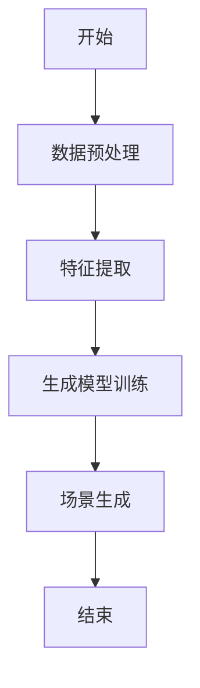
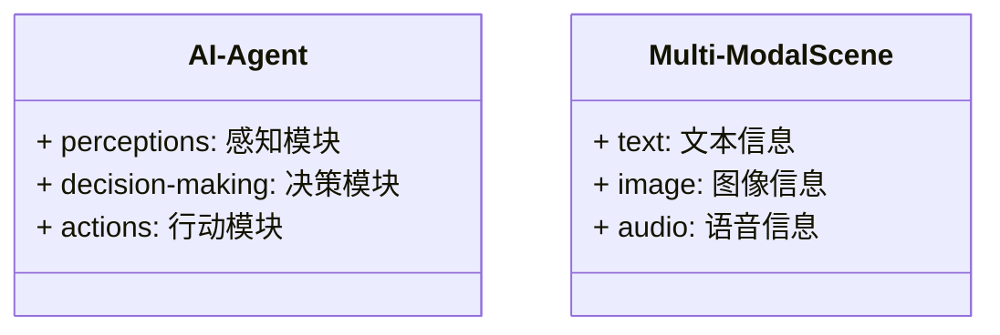
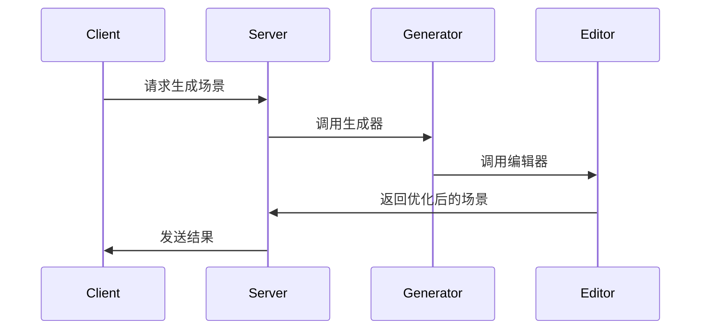

                 


# AI Agent的多模态场景生成与编辑

## 关键词
AI Agent，多模态场景，生成与编辑，深度学习，自然语言处理，计算机视觉，强化学习

## 摘要
本文深入探讨了AI Agent在多模态场景生成与编辑中的应用，从理论基础到实际应用，详细介绍了多模态数据融合、生成模型、编辑算法以及系统架构设计。文章结合数学模型和实际案例，分析了AI Agent在多模态场景生成中的技术挑战与解决方案，为相关领域的研究和实践提供了有价值的参考。

---

## 第一部分：背景介绍

### 第1章：AI Agent的基本概念

#### 1.1 AI Agent的定义与特点
- **1.1.1 什么是AI Agent**
  AI Agent（人工智能代理）是一种能够感知环境、自主决策并执行任务的智能实体。它通过传感器获取信息，利用算法进行分析，并通过执行器采取行动以实现预定目标。
  
- **1.1.2 AI Agent的核心特点**
  - **自主性**：能够在没有外部干预的情况下自主运行。
  - **反应性**：能够实时感知环境并做出反应。
  - **目标导向性**：所有行动都以实现特定目标为导向。
  - **学习能力**：能够通过经验改进自身的性能。

- **1.1.3 AI Agent的分类与应用场景**
  - 分类：
    - **简单反射型**：基于规则的反应，适用于简单任务。
    - **基于模型的反应型**：利用内部模型进行决策，适用于复杂环境。
    - **目标驱动型**：以目标为导向，主动规划行动。
    - **实用驱动型**：通过效用函数优化决策，适用于多目标场景。
  - 应用场景：
    - 智能助手（如Siri、Alexa）
    - 自动驾驶
    - 智能推荐系统
    - 机器人控制

#### 1.2 多模态场景生成的背景
- **1.2.1 多模态数据的定义**
  多模态数据指的是结合了多种数据类型的综合数据，常见的包括文本、图像、语音、视频、传感器数据等。多模态数据能够提供更全面的信息，帮助AI Agent更好地理解和处理复杂场景。

- **1.2.2 多模态场景生成的需求与挑战**
  - 需求：
    - 提供更丰富、更准确的场景信息。
    - 支持AI Agent在复杂环境中的智能决策。
    - 实现多模态数据的协同生成与编辑。
  - 挑战：
    - 数据模态多样，处理复杂。
    - 各模态数据之间的关联性需要准确建模。
    - 高计算资源需求，实现高效生成。

- **1.2.3 多模态场景生成的应用领域**
  - 智能虚拟助手：生成多模态交互场景，提供更自然的对话体验。
  - 虚拟现实：生成逼真的虚拟场景，提升用户体验。
  - 自动驾驶：处理多模态数据，提高驾驶系统的感知能力。
  - 智能客服：生成多模态对话场景，提供更智能的服务。

#### 1.3 AI Agent的多模态能力
- **1.3.1 多模态数据处理的重要性**
  多模态数据处理能力是AI Agent在复杂场景中实现高效决策的关键。通过融合多种数据，AI Agent能够更全面地理解环境，做出更准确的判断。

- **1.3.2 AI Agent在多模态场景中的角色**
  AI Agent在多模态场景中不仅是数据的处理者，更是场景的生成者和编辑者。它能够根据任务需求，动态生成和调整多模态场景，以支持决策过程。

- **1.3.3 多模态场景生成的未来趋势**
  随着技术的发展，多模态场景生成将更加智能化和个性化。未来的AI Agent将能够处理更多模态的数据，并生成更加逼真、动态的场景，为人类提供更高效、更自然的交互体验。

---

## 第二部分：核心概念与联系

### 第2章：AI Agent与多模态场景的关系

#### 2.1 核心概念原理
- **2.1.1 AI Agent的感知与决策机制**
  AI Agent通过多种传感器获取环境信息，利用感知模型处理数据，并基于决策模型做出行动决策。感知和决策过程涉及多模态数据的融合与分析。

- **2.1.2 多模态数据的融合与处理**
  多模态数据的融合需要考虑各模态数据的特点，采用适当的融合方法（如早期融合、晚期融合）进行处理，以提取有用的信息。

- **2.1.3 场景生成的算法流程**
  场景生成算法通常包括数据预处理、特征提取、生成模型训练和场景生成等步骤。生成的场景需要满足任务需求，并能够被AI Agent理解和利用。

#### 2.2 概念属性对比表格
- **表2-1：AI Agent与传统Agent的属性对比**

| 属性                | AI Agent                  | 传统Agent                 |
|---------------------|---------------------------|---------------------------|
| 智能水平            | 高度智能，具备学习能力   | 通常基于规则，智能有限    |
| 决策能力            | 能够自主决策，动态调整   | 需要外部指令或规则驱动    |
| 适应能力            | 能够自适应复杂环境       | 适应性有限                |
| 应用场景            | 智能助手、自动驾驶等     | 工作流自动化、流程管理等  |

- **表2-2：多模态与单模态场景的特征对比**

| 特征                | 多模态场景               | 单模态场景               |
|---------------------|-------------------------|-------------------------|
| 数据类型            | 文本、图像、语音等多种   | 单一类型，如文本或图像    |
| 信息丰富度          | 信息全面，细节丰富       | 信息单一，细节有限       |
| 处理复杂度          | 处理复杂，需要多模态融合 | 处理简单，单一模态处理    |
| 应用场景            | 智能交互、虚拟现实等     | 简单显示、基本交互等     |

#### 2.3 ER实体关系图
- **图2-1：AI Agent与多模态场景的实体关系图（Mermaid）**

```mermaid
er
actor: AI Agent
plays: 多模态场景生成系统
entity: 场景信息
entity: 用户需求
entity: 生成结果
```

---

## 第三部分：算法原理讲解

### 第3章：多模态场景生成算法

#### 3.1 算法流程
- **图3-1：多模态场景生成的算法流程图（Mermaid）**



#### 3.2 数学模型与公式
- **3.2.1 概率生成模型**
  - **公式3-1**：$P(x|z) = \text{Decoder}(z)$，其中$x$是生成的场景，$z$是潜在变量。

- **3.2.2 对抗训练**
  - **公式3-2**：$\min_{G} \max_{D} \mathbb{E}_{x}[D(x)] + \mathbb{E}_{z}[1 - D(G(z))]$，其中$G$是生成器，$D$是判别器。

#### 3.3 算法实现步骤
- **3.3.1 数据预处理**
  - 数据清洗、标准化、格式转换等。

- **3.3.2 模型训练**
  - 选择合适的生成模型（如GAN、VAE等），训练生成器和判别器。

- **3.3.3 场景生成与优化**
  - 利用训练好的模型生成多模态场景，并根据反馈进行优化。

---

## 第四部分：系统分析与架构设计方案

### 第4章：系统架构设计

#### 4.1 问题场景介绍
- **4.1.1 场景生成问题描述**
  - 需要生成包含多种模态的场景，如文本描述、图像背景等。
- **4.1.2 场景编辑问题描述**
  - 根据用户需求，对生成的场景进行调整和优化。

#### 4.2 系统功能设计
- **图4-1：领域模型类图（Mermaid）**



- **图4-2：系统架构设计图（Mermaid）**


- **图4-3：系统接口设计和交互流程图（Mermaid）**



---

## 第五部分：项目实战

### 第5章：项目实现与案例分析

#### 5.1 环境安装
- 安装Python、TensorFlow、Keras等依赖库。

#### 5.2 系统核心实现源代码
- **代码示例：多模态场景生成与编辑的实现**

```python
import tensorflow as tf
from tensorflow.keras import layers

# 定义生成器模型
def build_generator():
    model = tf.keras.Sequential([
        layers.Dense(256, activation='relu', input_shape=(100,)),
        layers.Dense(512, activation='relu'),
        layers.Dense(28*28, activation='sigmoid')
    ])
    return model

# 定义判别器模型
def build_discriminator():
    model = tf.keras.Sequential([
        layers.Dense(256, activation='relu', input_shape=(28*28,)),
        layers.Dense(128, activation='relu'),
        layers.Dense(1, activation='sigmoid')
    ])
    return model

# 定义生成器和判别器
generator = build_generator()
discriminator = build_discriminator()

# 定义损失函数和优化器
cross_entropy = tf.keras.losses.BinaryCrossentropy()
generator_optimizer = tf.keras.optimizers.Adam(0.0002)
discriminator_optimizer = tf.keras.optimizers.Adam(0.0002)

# 训练过程
def train_step(images):
    noise = tf.random.normal([batch_size, 100])
    generated_images = generator(noise)
    real_labels = tf.ones_like(discriminator(images))
    generated_labels = tf.zeros_like(discriminator(generated_images))
    
    # 判别器训练
    d_loss = cross_entropy(real_labels, discriminator(images)) + cross_entropy(generated_labels, discriminator(generated_images))
    discriminator.trainable = True
    discriminator_loss = d_loss
    discriminator.optimizer.minimize(d_loss, discriminator.trainable_weights)
    
    # 生成器训练
    g_loss = cross_entropy(tf.ones_like(generated_labels), discriminator(generated_images))
    generator.trainable = True
    generator_loss = g_loss
    generator.optimizer.minimize(g_loss, generator.trainable_weights)
    
    return generator_loss, discriminator_loss

# 训练循环
for epoch in range(num_epochs):
    for batch in dataset:
        g_loss, d_loss = train_step(batch)
        # 记录损失值
        ...
```

#### 5.3 案例分析
- **多模态场景生成案例**
  - 生成一个包含文本描述和图像背景的虚拟场景，用于智能助手的交互界面。
- **场景编辑案例**
  - 根据用户反馈，调整生成的场景，优化用户体验。

---

## 第六部分：最佳实践、小结、注意事项与拓展阅读

### 第6章：总结与展望

#### 6.1 最佳实践tips
- 数据预处理是关键，确保数据质量。
- 选择合适的生成模型，根据任务需求进行调整。
- 多模态数据的融合需要考虑各模态的特点，采用适当的融合方法。

#### 6.2 小结
本文详细介绍了AI Agent在多模态场景生成与编辑中的应用，从理论基础到实际应用，涵盖了算法原理、系统架构和项目实战。通过本文的学习，读者可以掌握多模态场景生成的核心技术，并能够将其应用于实际项目中。

#### 6.3 注意事项
- 数据隐私和安全问题需要高度重视。
- 计算资源需求较高，需要优化算法和硬件配置。
- 模型的泛化能力和鲁棒性需要进一步提升。

#### 6.4 拓展阅读推荐
- 推荐阅读《生成式AI：AI Agent与多模态交互》。
- 关注最新的研究成果，如多模态生成模型和AI Agent的前沿技术。

---

通过以上结构，读者可以系统地了解AI Agent的多模态场景生成与编辑的相关知识，并能够在实际项目中应用这些技术。

