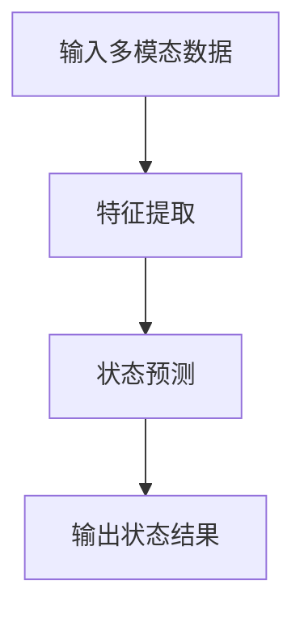
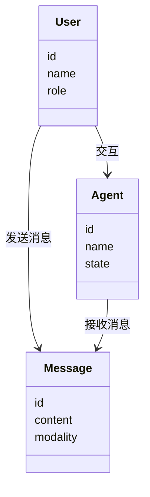
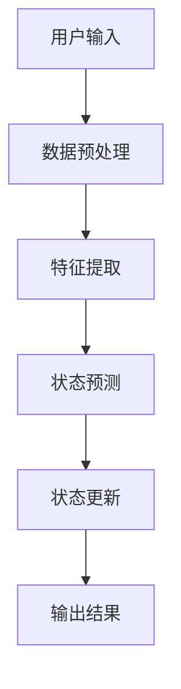
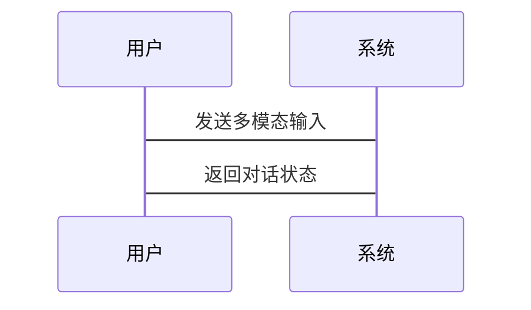

                 


# AI Agent的多模态对话状态跟踪

> 关键词：多模态对话、对话状态跟踪、AI Agent、自然语言处理、多模态数据融合

> 摘要：本文深入探讨了AI Agent在多模态对话中的状态跟踪问题，从背景、算法、系统架构到实战，全面解析多模态对话状态跟踪的核心技术与实现方法。文章不仅分析了多模态数据的融合策略，还详细介绍了基于Transformer的算法原理，并通过系统架构设计和项目实战，展示了如何构建高效可靠的多模态对话状态跟踪系统。

---

# 第一部分: AI Agent与多模态对话状态跟踪基础

# 第1章: AI Agent与多模态对话概述

## 1.1 AI Agent的基本概念
### 1.1.1 AI Agent的定义与特点
- **定义**：AI Agent（人工智能代理）是一种能够感知环境、执行任务并做出决策的智能体。
- **特点**：
  - 自主性：能够在没有外部干预的情况下自主运行。
  - 反应性：能够实时感知环境并做出反应。
  - 目标导向：通过实现目标来完成特定任务。
  - 学习能力：能够通过经验改进性能。

### 1.1.2 多模态对话的定义与特点
- **定义**：多模态对话是指在对话过程中，除了文本之外，还结合了语音、图像、视频等多种模态的信息。
- **特点**：
  - 信息丰富性：多模态数据能够提供更全面的信息。
  - 复杂性：不同模态的数据需要协调处理。
  - 交互性：多模态对话能够提升用户体验。

### 1.1.3 AI Agent在多模态对话中的作用
- **信息处理**：AI Agent能够整合多种模态的数据，提供更准确的语义理解。
- **状态跟踪**：AI Agent能够实时跟踪对话的状态，确保对话的连贯性。
- **决策支持**：AI Agent能够基于对话状态做出智能决策。

## 1.2 多模态对话状态跟踪的背景与意义
### 1.2.1 多模态对话的背景
- 随着人工智能技术的发展，对话系统逐渐从单一模态向多模态方向发展。
- 多模态对话能够提升用户体验，使得对话更加自然和高效。

### 1.2.2 对话状态跟踪的重要性
- 对话状态跟踪是对话系统的核心任务之一，能够确保对话的连贯性和准确性。
- 多模态对话状态跟踪能够结合多种信息，提高对话理解的准确性。

### 1.2.3 多模态对话状态跟踪的独特优势
- 结合多种模态数据，能够提供更丰富的语境信息。
- 能够通过不同模态的数据相互补充，提高对话理解的鲁棒性。

## 1.3 问题背景与问题描述
### 1.3.1 多模态对话中的信息融合挑战
- 不同模态的数据具有不同的特征，如何有效地融合这些数据是一个挑战。
- 如何在多模态数据中提取有用的特征，是一个关键问题。

### 1.3.2 对话状态跟踪的复杂性
- 对话状态的动态变化使得状态跟踪具有较高的复杂性。
- 如何在复杂多变的对话中准确跟踪状态，是一个难点。

### 1.3.3 问题解决的目标与边界
- **目标**：实现准确、高效的多模态对话状态跟踪。
- **边界**：限于多模态对话场景，不考虑其他类型的对话。

## 1.4 核心概念与联系
### 1.4.1 多模态数据的实体关系图
```mermaid
erDiagram
    user {
        id
        name
        role
    }
    agent {
        id
        name
        state
    }
    message {
        id
        content
        modality
    }
    user --> message : 发送消息
    agent --> message : 接收消息
    user --> agent : 交互
```

### 1.4.2 对话状态跟踪的算法原理


## 1.5 本章小结
- 本章介绍了AI Agent和多模态对话的基本概念，分析了对话状态跟踪的重要性和复杂性。
- 提出了多模态对话状态跟踪的核心概念和算法原理，为后续章节奠定了基础。

---

# 第2章: 多模态对话状态跟踪的核心算法

## 2.1 多模态数据融合方法
### 2.1.1 多模态数据的特征提取
- **文本特征**：包括词袋模型、TF-IDF、Word2Vec等。
- **语音特征**：包括音调、语速、停顿等。
- **图像特征**：包括颜色、纹理、目标检测等。

### 2.1.2 多模态数据的融合策略
- **早期融合**：在特征提取阶段就进行多模态数据的融合。
- **晚期融合**：在特征提取后，再进行多模态数据的融合。
- **层次融合**：结合上述两种策略，分层次进行数据融合。

### 2.1.3 基于Transformer的多模态编码
- **多模态编码器**：将不同模态的数据编码为统一的向量表示。
- **跨模态注意力机制**：通过注意力机制，实现不同模态数据之间的信息交互。

## 2.2 对话状态跟踪的算法原理
### 2.2.1 基于RNN的对话状态跟踪
- **循环神经网络（RNN）**：适用于处理序列数据，能够捕捉对话的时序信息。
- **长短期记忆网络（LSTM）**：能够更好地捕捉长距离依赖关系。

### 2.2.2 基于Transformer的对话状态跟踪
- **Transformer模型**：通过自注意力机制，能够捕捉全局语义信息。
- **多模态Transformer**：结合不同模态的数据，实现多模态对话状态跟踪。

### 2.2.3 模型的数学表达式
$$
p(y_t|x_{1..t}, s_{t-1}) = \text{softmax}(W_{y}h_t)
$$
其中，$h_t$ 是编码器输出的隐藏层向量，$W_y$ 是目标词表的权重矩阵。

## 2.3 多模态对话状态跟踪的改进方法
### 2.3.1 跨模态注意力机制
- **跨模态注意力**：通过注意力机制，实现不同模态数据之间的信息交互。
- **动态权重分配**：根据对话上下文，动态调整不同模态数据的权重。

### 2.3.2 状态表示的优化方法
- **嵌入式表示**：通过嵌入层，将不同模态的数据映射到统一的向量空间。
- **混合式表示**：结合嵌入式表示和注意力机制，优化状态表示。

### 2.3.3 动态权重分配策略
- **权重动态调整**：根据对话上下文，动态调整不同模态数据的权重。
- **自适应融合**：通过自适应机制，实现多模态数据的最优融合。

## 2.4 本章小结
- 本章介绍了多模态数据融合方法，分析了对话状态跟踪的算法原理。
- 提出了多模态对话状态跟踪的改进方法，为后续章节的系统设计提供了理论基础。

---

# 第3章: 多模态对话状态跟踪的系统架构

## 3.1 系统功能设计
### 3.1.1 用户交互界面
- **输入模块**：接收用户的多模态输入，包括文本、语音、图像等。
- **输出模块**：将对话状态反馈给用户，包括文本、语音、图像等。

### 3.1.2 多模态数据处理模块
- **数据预处理**：对输入的多模态数据进行清洗、归一化等预处理。
- **特征提取**：提取多模态数据的特征，包括文本特征、语音特征、图像特征等。

### 3.1.3 对话状态跟踪模块
- **状态预测**：基于多模态特征，预测对话的状态。
- **状态更新**：根据对话的动态变化，实时更新对话状态。

## 3.2 系统架构设计
### 3.2.1 领域模型类图


### 3.2.2 系统架构图


### 3.2.3 系统接口设计
- **输入接口**：接收用户的多模态输入。
- **输出接口**：输出对话状态的反馈。
- **内部接口**：模块之间的交互接口，包括数据预处理、特征提取、状态预测等。

### 3.2.4 系统交互流程图


## 3.3 本章小结
- 本章设计了多模态对话状态跟踪系统的功能模块和架构。
- 通过领域模型类图和系统架构图，清晰展示了系统的整体结构。
- 系统接口设计和交互流程图，为后续的项目实现提供了具体的指导。

---

# 第4章: 多模态对话状态跟踪的项目实战

## 4.1 项目背景与目标
### 4.1.1 项目背景
- **需求分析**：实现一个高效的多模态对话状态跟踪系统。
- **目标设定**：通过项目实战，验证算法的有效性和系统的可行性。

## 4.2 环境安装与配置
### 4.2.1 Python环境安装
- 安装Python 3.8及以上版本。
- 安装必要的Python库，包括`numpy`、`pandas`、`tensorflow`、`pytorch`等。

### 4.2.2 系统依赖安装
- 安装`mermaid`用于绘制图表。
- 安装`matplotlib`用于数据可视化。

## 4.3 核心代码实现
### 4.3.1 数据预处理代码
```python
import numpy as np
import pandas as pd

def preprocess_data(data):
    # 数据清洗
    data = data.dropna()
    # 数据归一化
    data = (data - data.mean()) / data.std()
    return data
```

### 4.3.2 多模态特征提取代码
```python
import tensorflow as tf
from tensorflow.keras.layers import Dense, Activation

def extract_features(inputs):
    # 文本特征提取
    text_features = Dense(64, activation='relu')(inputs['text'])
    # 语音特征提取
    audio_features = Dense(64, activation='relu')(inputs['audio'])
    # 图像特征提取
    image_features = Dense(64, activation='relu')(inputs['image'])
    return text_features, audio_features, image_features
```

### 4.3.3 对话状态预测代码
```python
import tensorflow as tf
from tensorflow.keras.layers import LSTM, Dense, Dropout

def build_model():
    inputs = tf.keras.Input(shape=(None, 64))
    lstm_layer = LSTM(64, return_sequences=True)(inputs)
    lstm_layer = Dropout(0.5)(lstm_layer)
    dense_layer = Dense(32, activation='relu')(lstm_layer)
    predictions = Dense(1, activation='sigmoid')(dense_layer)
    model = tf.keras.Model(inputs=inputs, outputs=predictions)
    return model
```

## 4.4 项目实现与测试
### 4.4.1 数据集准备
- 数据集包括多模态对话数据，每个样本包含文本、语音、图像三种模态的信息。
- 数据集分为训练集、验证集和测试集。

### 4.4.2 模型训练与评估
- 使用训练集训练模型。
- 使用验证集调参。
- 使用测试集评估模型性能。

### 4.4.3 实际案例分析
- **案例1**：用户输入文本“我需要帮助”，系统预测对话状态为“请求帮助”。
- **案例2**：用户输入语音“好的，我明白了”，系统预测对话状态为“确认理解”。

## 4.5 本章小结
- 本章通过项目实战，详细介绍了多模态对话状态跟踪系统的实现过程。
- 提供了核心代码实现，展示了如何通过Python和深度学习框架实现对话状态跟踪。

---

# 第5章: 多模态对话状态跟踪的优化与扩展

## 5.1 优化方法
### 5.1.1 参数优化
- **超参数调优**：通过网格搜索或随机搜索优化模型参数。
- **学习率调整**：使用学习率衰减策略，提升模型收敛速度。

### 5.1.2 模型优化
- **模型压缩**：通过剪枝、知识蒸馏等技术，降低模型的计算复杂度。
- **模型融合**：结合多种模型的优势，提升整体性能。

## 5.2 系统扩展
### 5.2.1 新增模态数据
- **扩展文本模态**：引入更多文本特征，如情感分析、实体识别等。
- **扩展语音模态**：引入更多语音特征，如语音情感、语音识别等。
- **扩展图像模态**：引入更多图像特征，如目标检测、图像分割等。

### 5.2.2 新增功能模块
- **对话历史记录**：记录对话历史，提升对话状态的准确性。
- **用户画像构建**：基于对话数据，构建用户画像，提升个性化服务。

## 5.3 最佳实践
### 5.3.1 实用技巧
- **数据预处理**：确保数据质量，避免噪声干扰。
- **特征选择**：选择与任务相关的特征，提升模型性能。
- **模型评估**：使用准确率、召回率、F1值等指标，全面评估模型性能。

### 5.3.2 注意事项
- **数据隐私保护**：确保数据的安全性和隐私性。
- **系统可扩展性**：设计可扩展的系统架构，方便后续功能的扩展。
- **系统性能优化**：通过并行计算、分布式训练等技术，提升系统性能。

### 5.3.3 拓展阅读
- **推荐书籍**：《深度学习》（Deep Learning）、《自然语言处理入门》（Natural Language Processing: An Introduction）。
- **推荐论文**：阅读最新的多模态对话状态跟踪相关论文，了解前沿技术。

## 5.4 本章小结
- 本章总结了多模态对话状态跟踪系统的优化方法和扩展方向。
- 提供了最佳实践的建议，为读者进一步研究和应用提供了指导。

---

# 结语
通过本文的详细讲解，读者可以全面了解AI Agent的多模态对话状态跟踪的核心技术与实现方法。从算法原理到系统架构，从项目实战到优化扩展，本文为读者提供了丰富的知识和实践指导。未来，随着人工智能技术的不断发展，多模态对话状态跟踪将有更广阔的应用前景，值得我们进一步深入研究和探索。

