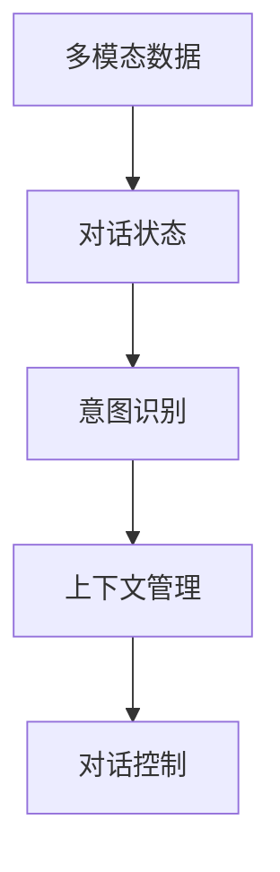
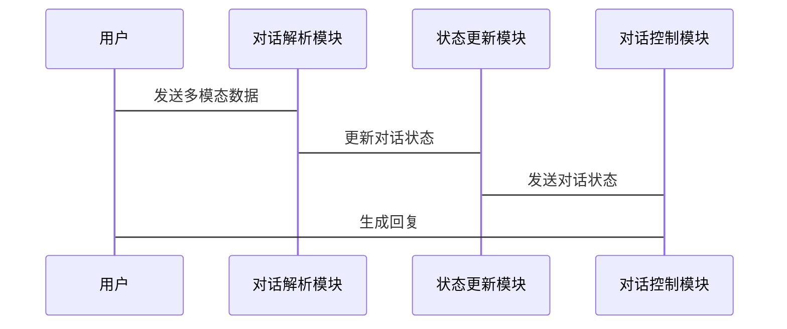

                 


# AI Agent的多模态对话状态追踪与管理

> 关键词：AI Agent，多模态对话，状态追踪，对话管理，知识图谱

> 摘要：  
> 本文深入探讨了AI Agent在多模态对话中的状态追踪与管理技术。从多模态数据的特征分析到对话状态的定义，再到基于机器学习的算法实现，系统性地分析了多模态对话状态追踪的核心原理与实现方法。文章结合实际应用场景，提出了基于知识图谱的状态管理架构，并通过具体案例展示了系统的实现与优化方法。

---

# 第一部分: 多模态对话状态追踪与管理的背景与挑战

# 第1章: 多模态对话状态追踪与管理的背景与挑战

## 1.1 多模态对话的定义与特点
### 1.1.1 多模态数据的定义
多模态数据是指同时包含多种类型的数据形式，如文本、语音、图像、视频等。这些数据形式能够提供更全面的信息，帮助AI Agent更准确地理解用户的意图和需求。

### 1.1.2 多模态对话的核心特征
- **多维度性**：对话信息不仅来自单一模态，而是多个模态的综合。
- **复杂性**：多模态数据的处理需要协调不同模态之间的信息。
- **动态性**：对话过程中，状态会随着输入的多模态数据不断更新。

### 1.1.3 多模态对话与单模态对话的对比
| 对比维度 | 单模态对话 | 多模态对话 |
|----------|------------|------------|
| 信息来源 | 单一模态    | 多种模态    |
| 信息量   | 较小        | 较大        |
| 处理难度 | 较低        | 较高        |

---

## 1.2 对话状态追踪与管理的重要性
### 1.2.1 对话状态的定义与作用
对话状态是指在对话过程中，AI Agent对当前对话的理解和记忆。它是连接过去、现在和未来的桥梁，能够帮助AI Agent更好地预测和生成下一步的对话内容。

### 1.2.2 状态管理在AI Agent中的关键性
- **意图识别**：准确的状态管理能够帮助AI Agent理解用户的意图。
- **上下文理解**：状态管理是实现上下文理解的基础。
- **对话控制**：基于状态的信息，AI Agent可以更灵活地控制对话流程。

### 1.2.3 多模态对话中状态管理的挑战
- **数据融合**：如何高效地融合多种模态的数据。
- **计算复杂性**：多模态数据的处理需要更高的计算资源。
- **实时性要求**：在实时对话中，状态更新必须快速准确。

---

## 1.3 AI Agent的多模态对话场景
### 1.3.1 多轮对话场景
多轮对话是多模态对话的核心场景，用户会通过多种模态的数据与AI Agent进行交互。

### 1.3.2 多模态数据输入的复杂性
用户可能同时使用文本、语音和图像等多种模态的数据进行输入。

### 1.3.3 状态管理的边界与外延
- **边界**：对话状态管理仅关注与当前对话相关的部分。
- **外延**：状态管理需要与知识图谱、外部数据库等进行联动。

---

## 1.4 本章小结
本章从多模态对话的定义、特点出发，分析了对话状态追踪与管理的重要性，并讨论了AI Agent在多模态对话中的应用场景和挑战。

---

# 第二部分: 多模态对话状态追踪的核心概念与联系

# 第2章: 多模态数据与对话状态的关系

## 2.1 多模态数据的分类与属性
### 2.1.1 多模态数据的分类
- **文本数据**：包括自然语言文本和结构化文本。
- **语音数据**：包括语音信号和声学特征。
- **图像数据**：包括RGB图像、深度图像等。
- **视频数据**：包括视频流和动作捕捉数据。

### 2.1.2 各类数据的特征对比（表格形式）
| 数据类型 | 特征            | 优势          |
|----------|-----------------|---------------|
| 文本     | 语义丰富         | 易于处理       |
| 语音     | 包含情感信息     | 更具表现力     |
| 图像     | 信息量大         | 可视化能力强   |
| 视频     | 结合了图像和语音 | 更具动态性     |

### 2.1.3 多模态数据的关联性
- **语义一致性**：不同模态的数据需要表达相似的语义。
- **互补性**：不同模态的数据能够互相补充信息。

## 2.2 对话状态的核心要素
### 2.2.1 对话历史
对话历史是对话状态管理的基础，记录了对话的全过程。

### 2.2.2 当前意图
当前意图是指用户在当前对话中的主要目标，是对话状态的核心。

### 2.2.3 上下文信息
上下文信息包括对话的背景、场景、用户身份等，是对话状态的重要组成部分。

## 2.3 多模态数据与对话状态的关联
### 2.3.1 数据驱动的状态更新机制
通过多模态数据的输入，AI Agent能够实时更新对话状态。

### 2.3.2 多模态融合对状态准确性的提升
多模态数据的融合能够提高对话状态的准确性和丰富性。

### 2.3.3 ER实体关系图架构（Mermaid流程图）


---

## 2.4 本章小结
本章分析了多模态数据与对话状态的关系，探讨了多模态数据对对话状态管理的促进作用。

---

# 第三部分: 多模态对话状态追踪的算法原理

# 第3章: 基于机器学习的对话状态追踪算法

## 3.1 隐马尔可夫模型（HMM）在对话状态追踪中的应用
### 3.1.1 HMM的基本原理
隐马尔可夫模型是一种基于概率的序列建模方法，适用于处理具有马尔可夫性质的序列数据。

### 3.1.2 对话状态追踪中的状态转移概率计算
状态转移概率是HMM的核心参数，用于描述当前状态转移到下一个状态的概率。

### 3.1.3 观察概率的计算与优化
观察概率描述了在给定状态下，观察到特定数据的概率。

---

## 3.2 基于条件随机场（CRF）的状态追踪算法
### 3.2.1 CRF的基本原理
条件随机场是一种用于序列标注的无向图模型，能够捕捉长距离依赖关系。

### 3.2.2 对话状态的线性链式建模
CRF通过线性链式结构建模对话状态，能够有效捕捉对话的上下文信息。

### 3.2.3 转移特征与发射特征的设计
- **转移特征**：描述状态之间的转移关系。
- **发射特征**：描述当前状态与观测数据之间的关系。

---

## 3.3 基于深度学习的对话状态追踪算法
### 3.3.1 基于LSTM的序列建模
长短时记忆网络（LSTM）能够有效处理长序列数据，适用于对话状态的建模。

### 3.3.2 Transformer在对话状态追踪中的应用
Transformer通过自注意力机制，能够捕捉对话中的全局信息。

### 3.3.3 图神经网络（GNN）在多模态数据中的应用
图神经网络能够处理多模态数据的复杂关系，适用于多模态对话状态的建模。

---

## 3.4 本章小结
本章介绍了几种常用的对话状态追踪算法，包括HMM、CRF和深度学习方法，并分析了它们的优缺点。

---

# 第四部分: 多模态对话状态追踪的系统设计与实现

# 第4章: 系统功能设计与实现

## 4.1 系统功能设计
### 4.1.1 对话解析模块
对话解析模块负责将多模态数据转换为可处理的格式。

### 4.1.2 状态更新模块
状态更新模块根据对话内容实时更新对话状态。

### 4.1.3 对话控制模块
对话控制模块根据对话状态生成下一步的对话内容。

## 4.2 系统架构设计
### 4.2.1 微服务架构
系统采用微服务架构，包括数据处理服务、模型服务和对话控制服务。

### 4.2.2 系统交互流程图（Mermaid序列图）


---

## 4.3 系统接口设计
### 4.3.1 输入接口
- **文本输入接口**：接收用户的文本输入。
- **语音输入接口**：接收用户的语音输入。
- **图像输入接口**：接收用户的图像输入。

### 4.3.2 输出接口
- **文本输出接口**：生成回复文本。
- **语音输出接口**：生成回复语音。
- **图像输出接口**：生成回复图像。

---

## 4.4 本章小结
本章详细设计了多模态对话状态追踪系统的功能模块和系统架构，并通过Mermaid图展示了系统的交互流程。

---

# 第五部分: 项目实战与优化

# 第5章: 项目实战

## 5.1 项目背景
本项目旨在实现一个基于多模态数据的对话状态追踪系统，应用于智能客服场景。

## 5.2 环境配置
### 5.2.1 开发工具
- Python 3.8+
- PyTorch 1.9+
- Transformers库

### 5.2.2 数据集
使用公开的多模态对话数据集，包括文本、语音和图像数据。

## 5.3 核心代码实现
### 5.3.1 对话解析模块
```python
def parse Dialogue(dialogue_data):
    # 对话解析逻辑
    pass
```

### 5.3.2 状态更新模块
```python
def update_state(current_state, dialogue_data):
    # 状态更新逻辑
    pass
```

### 5.3.3 对话控制模块
```python
def generate_response(current_state, dialogue_data):
    # 回复生成逻辑
    pass
```

## 5.4 系统优化与调优
### 5.4.1 模型优化
- 参数调整：优化模型的超参数。
- 模型压缩：减少模型的计算复杂度。

### 5.4.2 数据增强
- 文本增强：增加数据的多样性。
- 图像增强：通过数据增强技术提高模型的鲁棒性。

---

## 5.5 本章小结
本章通过具体案例展示了多模态对话状态追踪系统的实现过程，并分析了系统的优化方法。

---

# 第六部分: 总结与展望

# 第6章: 总结与展望

## 6.1 核心结论
本文系统性地探讨了AI Agent在多模态对话中的状态追踪与管理技术，提出了基于知识图谱的状态管理架构，并通过具体案例展示了系统的实现与优化方法。

## 6.2 未来研究方向
- **多模态数据的高效融合**：探索更高效的多模态数据融合方法。
- **轻量化模型**：研究轻量化模型在多模态对话中的应用。
- **实时性优化**：进一步优化系统的实时性，满足更苛刻的应用需求。

## 6.3 最佳实践Tips
- **数据质量**：数据质量对系统的性能影响至关重要。
- **模型调优**：模型调优是系统优化的关键步骤。
- **系统架构**：合理设计系统架构是确保系统可扩展性和维护性的基础。

---

# 附录

## 附录A: 常见问题解答

## 附录B: 参考文献

## 附录C: 源代码

---

# 结语

多模态对话状态追踪与管理是AI Agent技术的重要组成部分，随着技术的不断发展，其应用前景将更加广阔。希望本文能够为相关领域的研究者和开发者提供有价值的参考和启发。

