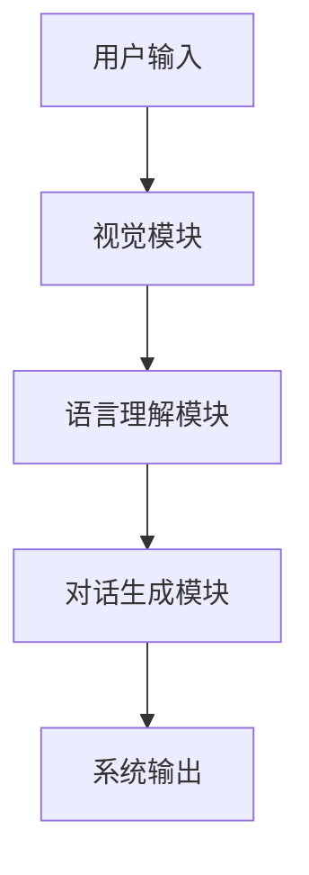
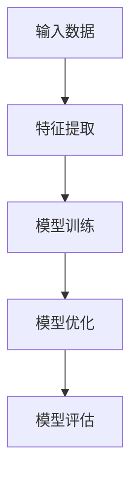
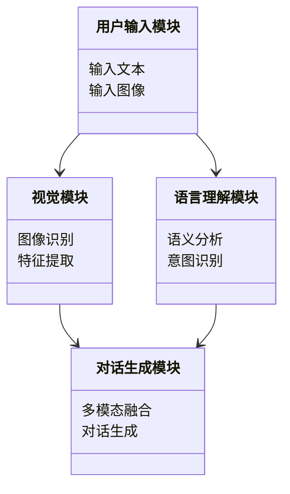
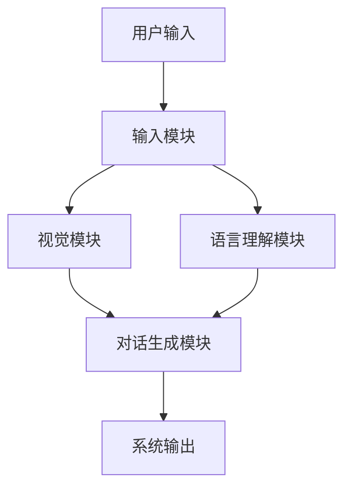
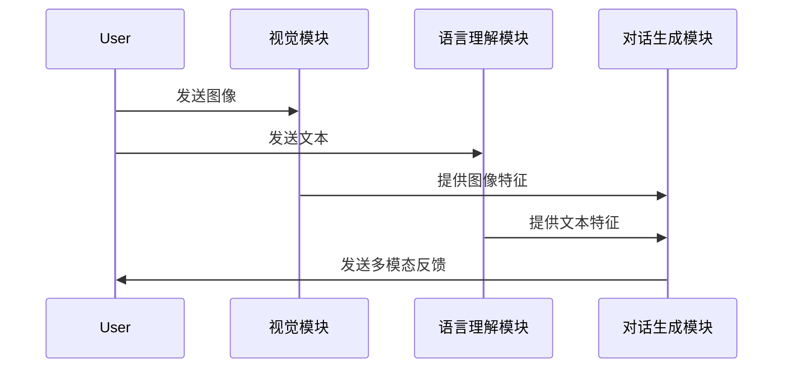

                 


# AI Agent的多模态对话系统：整合视觉和语言理解

## 关键词：AI Agent, 多模态对话, 视觉语言理解, 对话系统设计, 多模态数据融合

## 摘要：本文系统阐述了AI Agent多模态对话系统的构建与实现，详细分析了视觉与语言理解的整合方法，探讨了多模态对话系统的算法原理、系统架构及实际应用案例。文章从理论到实践，结合技术细节与应用场景，全面解析了如何打造高效、智能的多模态对话系统，为AI Agent的未来发展提供了深入的技术洞察。

---

# 第一部分: 多模态对话系统的背景与概念

## # 第1章: 多模态对话系统的背景与概念

### 1.1 多模态对话系统的定义与特点

#### 1.1.1 多模态对话系统的定义
多模态对话系统是一种结合视觉、语言和其他模态信息的AI对话系统，能够通过多种感官与用户进行交互。例如，用户可以通过文本、图像或语音与系统对话，系统则能够理解并生成相应的多模态反馈。

#### 1.1.2 多模态对话系统的三大特点
- **多感官交互**：支持视觉、听觉、触觉等多种感官输入。
- **语境理解能力强**：能够结合上下文信息进行更智能的对话。
- **用户体验更自然**：通过多模态信息的融合，提供更贴近人类自然对话的交互体验。

#### 1.1.3 多模态对话系统与传统对话系统的区别
| 特性                | 多模态对话系统           | 传统对话系统         |
|---------------------|--------------------------|----------------------|
| 输入方式            | 文本、图像、语音          | 文本或单一语音        |
| 对话能力            | 能理解并生成多模态信息    | 仅能处理单一模态信息  |
| 语境理解            | 更强的语境理解和关联性    | 语境理解能力较弱      |
| 应用场景            | 适用于复杂交互场景        | 适用于简单交互场景    |

### 1.2 多模态对话系统的发展背景

#### 1.2.1 当前对话系统的发展趋势
随着AI技术的快速发展，对话系统从单一模态向多模态方向演进，用户对交互体验的要求也越来越高。

#### 1.2.2 多模态技术的兴起
多模态技术的兴起源于以下几个方面：
- 数据获取技术的进步：如图像识别、语音识别等技术的成熟。
- 计算能力的提升：强大的计算能力支持多模态数据的处理与融合。
- 应用场景的扩展：如智能客服、智能助手、教育机器人等领域对多模态交互的需求增加。

#### 1.2.3 AI Agent在多模态对话中的角色
AI Agent作为多模态对话的核心，负责整合视觉、语言等多种模态信息，理解用户意图，并生成相应的反馈。

### 1.3 多模态对话系统的技术优势

#### 1.3.1 多模态数据的融合优势
通过整合多种模态信息，系统能够更全面地理解用户意图，提供更准确的反馈。

#### 1.3.2 多模态对话的用户体验提升
多模态交互更加贴近人类自然对话，能够提升用户体验，降低用户操作的复杂性。

#### 1.3.3 多模态对话系统的应用场景扩展
多模态对话系统可以应用于更多复杂场景，如医疗咨询、法律咨询、教育培训等领域，提供更智能的服务。

---

## # 第2章: 多模态对话系统的核心概念与联系

### 2.1 多模态对话系统的组成模块

#### 2.1.1 视觉模块
视觉模块负责处理图像、视频等视觉信息，提取其中的关键特征，为对话生成提供视觉上下文。

#### 2.1.2 语言理解模块
语言理解模块负责对文本或语音输入进行语义分析，理解用户意图。

#### 2.1.3 对话生成模块
对话生成模块根据用户输入和系统理解，生成合适的多模态反馈。

### 2.2 多模态数据的交互机制

#### 2.2.1 视觉与语言信息的融合方式
- **早期融合**：在特征提取阶段对多模态数据进行融合。
- **晚期融合**：在生成阶段对多模态数据进行融合。

#### 2.2.2 多模态特征的提取与转换
- **图像特征提取**：使用CNN等技术提取图像特征。
- **文本特征提取**：使用BERT等模型提取文本特征。

#### 2.2.3 多模态数据的同步与协调
通过时间戳或相似度匹配，确保多模态数据在时间和空间上的协调一致。

### 2.3 多模态对话系统的实体关系图



---

## # 第3章: 多模态对话系统的算法原理

### 3.1 多模态对话模型的构建

#### 3.1.1 多模态编码器的设计
多模态编码器负责将多种模态的数据转换为统一的特征表示。

$$x_v = \text{VisualEncoder}(I)$$

$$x_l = \text{LanguageEncoder}(T)$$

#### 3.1.2 多模态解码器的实现
多模态解码器根据编码器输出生成多模态的对话反馈。

$$y_v = \text{VisualDecoder}(x_v, x_l)$$

$$y_l = \text{LanguageDecoder}(x_l)$$

#### 3.1.3 多模态注意力机制的应用
通过注意力机制，模型可以更关注重要的模态信息。

$$\alpha = \text{Attention}(x_v, x_l)$$

### 3.2 多模态对话模型的训练流程



### 3.3 多模态对话系统的数学模型

#### 3.3.1 多模态编码器的数学表达
$$x_v = \text{VisualEncoder}(I)$$

其中，$I$表示输入的图像数据，$\text{VisualEncoder}$表示视觉编码器。

#### 3.3.2 多模态解码器的数学表达
$$y_v = \text{VisualDecoder}(x_v, x_l)$$

其中，$x_v$和$x_l$分别表示视觉和语言的编码特征，$\text{VisualDecoder}$表示视觉解码器。

---

## # 第4章: 多模态对话系统的系统分析与架构设计

### 4.1 系统功能设计

#### 4.1.1 领域模型设计



#### 4.1.2 系统架构设计



### 4.2 系统接口设计

- **输入接口**：支持文本、图像等多种输入形式。
- **输出接口**：支持文本、图像、语音等多种输出形式。

### 4.3 系统交互设计



---

## # 第5章: 多模态对话系统的项目实战

### 5.1 项目背景介绍

#### 5.1.1 项目目标
构建一个支持多模态对话的AI Agent系统，能够处理文本和图像输入，并生成相应的多模态反馈。

#### 5.1.2 项目技术选型
- 视觉处理：使用OpenCV和CNN模型。
- 语言理解：使用BERT模型。
- 对话生成：基于Transformer模型。

### 5.2 核心代码实现

#### 5.2.1 环境配置

```python
# 安装依赖
pip install numpy
pip install tensorflow
pip install keras
pip installopencv-python
```

#### 5.2.2 视觉模块实现

```python
import cv2
import numpy as np

def process_image(image_path):
    img = cv2.imread(image_path)
    # 图像预处理
    return img
```

#### 5.2.3 语言理解模块实现

```python
from tensorflow.keras import layers, models

def language_encoder(input_text):
    # 使用预训练的BERT模型进行编码
    pass
```

#### 5.2.4 对话生成模块实现

```python
def dialog_generator(image_features, text_features):
    # 多模态融合
    pass
```

### 5.3 项目小结

- **实现难点**：多模态数据的同步与融合。
- **优化建议**：引入更先进的多模态模型，如ViLBERT。

---

## # 第6章: 多模态对话系统的最佳实践

### 6.1 小结

- 多模态对话系统通过整合视觉和语言信息，显著提升了对话系统的智能性和用户体验。

### 6.2 注意事项

- 数据质量：多模态数据需要经过严格的清洗和预处理。
- 模型选择：根据具体场景选择合适的多模态模型。
- 交互设计：确保多模态交互的自然性和流畅性。

### 6.3 拓展阅读

- 《多模态学习：理论与应用》
- 《基于Transformer的多模态对话模型研究》

---

## 总结

通过本文的系统阐述，我们深入探讨了AI Agent多模态对话系统的构建与实现，从理论到实践，结合技术细节与应用场景，全面解析了如何打造高效、智能的多模态对话系统。希望本文能够为AI Agent的未来发展提供深入的技术洞察和实践指导。

