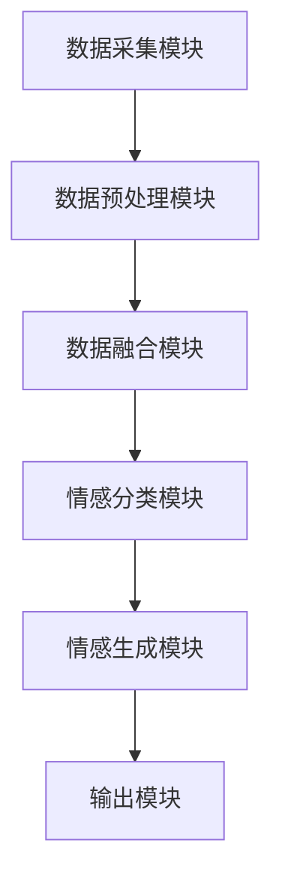

                 


# AI Agent的多模态情感计算与共情能力

> 关键词：AI Agent，多模态情感计算，共情能力，情感分析，生成模型，系统架构设计

> 摘要：本文将深入探讨AI Agent的多模态情感计算与共情能力，从背景介绍、核心概念、算法原理、系统架构设计到项目实战，全面解析如何实现具备情感理解与共情能力的AI Agent。我们将结合具体案例，分析多模态数据融合、情感生成算法以及系统架构设计的关键步骤，并提供实践建议和注意事项。

---

## 第1章: 多模态情感计算与共情能力的背景介绍

### 1.1 问题背景与问题描述

#### 1.1.1 人工智能代理的发展现状
随着AI技术的快速发展，AI Agent（智能代理）在多个领域得到了广泛应用，例如智能助手、智能客服、虚拟助手等。然而，现有的AI Agent在处理复杂情感任务时仍存在诸多不足，主要表现为：

- **情感理解能力有限**：传统AI Agent通常只能处理基于规则的情感分类任务，难以理解和处理复杂的情感场景。
- **多模态数据处理不足**：AI Agent在处理多模态数据时，难以有效融合文本、语音、图像等多种数据源，导致情感理解不够精准。
- **共情能力缺失**：AI Agent缺乏共情能力，无法真正理解用户的深层情感需求，导致用户体验较差。

#### 1.1.2 问题描述
为了提升AI Agent的情感理解与共情能力，我们需要解决以下问题：

1. 如何有效融合多模态数据，提升情感理解的准确性和深度？
2. 如何设计算法模型，使AI Agent具备共情能力，能够理解和回应用户的情感需求？
3. 如何实现AI Agent的多模态情感计算与共情能力的实际应用？

#### 1.1.3 解决问题的技术思路
为了解决上述问题，我们可以从以下几个方面入手：

1. **多模态数据融合**：结合文本、语音、图像等多种数据源，通过数据融合技术提升情感理解的准确性。
2. **情感计算模型优化**：设计高效的算法模型，能够准确捕捉和理解用户的情感状态。
3. **共情能力构建**：通过生成模型和对话策略优化，使AI Agent能够产生符合用户情感需求的回应。

#### 1.1.4 情感计算与共情能力的概念结构
情感计算的核心目标是通过分析多模态数据，识别和理解用户的情感状态；共情能力则是建立在情感理解基础上，通过生成合适的回应，增强用户体验。两者相辅相成，共同构成了AI Agent的多模态情感计算与共情能力。

---

### 1.2 问题解决思路与技术路径

#### 1.2.1 情感计算的核心目标
情感计算的目标是通过分析用户的多模态数据，识别用户的情感状态，并将其应用于实际场景中。例如，在智能客服中，通过分析用户的情感状态，提供更优质的服务。

#### 1.2.2 共情能力的实现方法
共情能力的实现需要结合情感计算和生成模型，通过分析用户情感状态，并生成符合情感需求的回应，从而实现共情。

#### 1.2.3 多模态数据融合的技术挑战
多模态数据融合需要解决数据异构性、数据关联性以及融合策略优化等问题。例如，如何将文本、语音和图像数据有效融合，以提升情感计算的准确性。

---

### 1.3 情感计算与共情能力的核心要素

#### 1.3.1 情感计算的基本组成要素
情感计算的基本组成要素包括：

- **数据采集**：获取多模态数据（如文本、语音、图像）。
- **数据预处理**：对数据进行清洗和标准化处理。
- **特征提取**：提取有助于情感分析的关键特征。
- **情感分析**：基于特征进行情感分类。

#### 1.3.2 共情能力的层次结构
共情能力可以分为以下几个层次：

- **情感识别**：准确识别用户的情感状态。
- **情感理解**：理解情感背后的意义和需求。
- **情感回应**：生成符合情感需求的回应。

#### 1.3.3 多模态数据的关联与整合
多模态数据的关联与整合需要考虑数据之间的相关性，并通过融合算法提升情感计算的准确性。例如，通过分析用户的语音语调和面部表情，进一步确认用户的情感状态。

---

## 第2章: 多模态情感计算的核心概念与联系

### 2.1 情感计算的核心原理

#### 2.1.1 情感计算的定义与特征
情感计算是一种通过分析多模态数据，识别和理解用户情感状态的技术。其主要特征包括实时性、多模态性和高准确性。

#### 2.1.2 多模态数据的特征提取
多模态数据的特征提取需要结合文本、语音、图像等多种数据源，提取有助于情感分析的关键特征。

#### 2.1.3 情感计算的数学模型
情感计算的数学模型可以采用支持向量机（SVM）、随机森林（RF）等传统机器学习算法，也可以采用深度学习模型（如LSTM、Transformer）进行情感分类。

---

### 2.2 共情能力的实现机制

#### 2.2.1 共情能力的定义与属性
共情能力是指AI Agent能够理解和回应用户情感需求的能力。其主要属性包括情感识别、情感理解、情感回应。

#### 2.2.2 共情能力的计算模型
共情能力的计算模型可以通过生成模型（如GPT）和对话策略优化算法实现。

#### 2.2.3 共情能力与情感计算的关系
共情能力是情感计算的延伸，两者相辅相成，共同构成了AI Agent的多模态情感计算与共情能力。

---

### 2.3 多模态数据融合的原理与方法

#### 2.3.1 数据融合的基本概念
数据融合是指将多个数据源的信息进行整合，以获得更准确的结果。多模态数据融合是情感计算中的关键步骤。

#### 2.3.2 多模态数据融合的实现步骤
1. 数据预处理：对多模态数据进行清洗和标准化处理。
2. 特征提取：提取有助于情感分析的关键特征。
3. 数据融合：通过融合算法将多模态数据进行整合。
4. 情感分类：基于融合后的特征进行情感分类。

#### 2.3.3 数据融合的优化策略
数据融合的优化策略包括特征选择、模型优化和数据增强等方法。

---

## 第3章: 多模态情感计算与共情能力的算法原理

### 3.1 情感分析算法

#### 3.1.1 基于文本的情感分析算法
基于文本的情感分析算法可以采用文本挖掘技术，通过分析文本中的关键词和语义信息，识别用户的情感状态。

#### 3.1.2 基于语音的情感分析算法
基于语音的情感分析算法需要分析语音的音调、语速、停顿等特征，以识别用户的情感状态。

#### 3.1.3 基于图像的情感分析算法
基于图像的情感分析算法需要分析用户的面部表情和肢体语言，以识别用户的情感状态。

---

### 3.2 多模态数据融合算法

#### 3.2.1 基于特征融合的多模态数据融合算法
基于特征融合的多模态数据融合算法将多模态数据的特征进行融合，以获得更准确的情感分类结果。

#### 3.2.2 基于注意力机制的多模态数据融合算法
基于注意力机制的多模态数据融合算法通过关注重要的特征信息，提升情感分类的准确性。

#### 3.2.3 基于生成对抗网络的多模态数据融合算法
基于生成对抗网络的多模态数据融合算法通过生成对抗网络生成更高质量的特征信息，以提升情感分类的准确性。

---

### 3.3 情感生成算法

#### 3.3.1 基于循环神经网络的情感生成算法
基于循环神经网络的情感生成算法通过分析用户的情感状态，生成符合情感需求的回应。

#### 3.3.2 基于变分自编码器的情感生成算法
基于变分自编码器的情感生成算法通过生成模型生成多样化的回应，以满足用户的情感需求。

#### 3.3.3 基于生成对抗网络的情感生成算法
基于生成对抗网络的情感生成算法通过对抗训练，生成高质量的情感回应。

---

## 第4章: 多模态情感计算与共情能力的系统架构设计

### 4.1 系统功能设计

#### 4.1.1 情感数据采集模块
情感数据采集模块负责采集用户的多模态数据，包括文本、语音和图像等。

#### 4.1.2 数据预处理模块
数据预处理模块对采集到的数据进行清洗和标准化处理，确保数据的质量。

#### 4.1.3 数据融合模块
数据融合模块将多模态数据进行融合，生成更准确的情感特征。

#### 4.1.4 情感分类模块
情感分类模块基于融合后的特征，进行情感分类，识别用户的情感状态。

#### 4.1.5 情感生成模块
情感生成模块根据用户的情感状态，生成符合情感需求的回应。

---

### 4.2 系统架构设计

#### 4.2.1 系统架构图
以下是系统架构设计的Mermaid图：



#### 4.2.2 系统接口设计
系统接口设计需要考虑模块之间的交互接口，例如数据输入接口、特征提取接口、情感分类接口和情感生成接口等。

---

## 第5章: 项目实战

### 5.1 环境安装

#### 5.1.1 安装Python环境
需要安装Python 3.8及以上版本，并安装必要的库，例如TensorFlow、Keras、numpy等。

#### 5.1.2 安装深度学习框架
可以选择安装TensorFlow或PyTorch框架，用于实现情感计算和生成模型。

---

### 5.2 核心代码实现

#### 5.2.1 数据预处理代码
```python
import numpy as np
import pandas as pd

def preprocess_data(data):
    # 数据清洗
    data = data.dropna()
    # 标准化处理
    from sklearn.preprocessing import StandardScaler
    scaler = StandardScaler()
    data = scaler.fit_transform(data)
    return data
```

#### 5.2.2 数据融合代码
```python
import numpy as np
import pandas as pd

def fuse_data(text_data, audio_data, visual_data):
    # 特征融合
    fused_features = np.concatenate([text_data, audio_data, visual_data], axis=1)
    return fused_features
```

---

### 5.3 案例分析与详细解读

#### 5.3.1 情感分类案例
```python
from sklearn.svm import SVC
from sklearn.metrics import accuracy_score

model = SVC()
model.fit(fused_features, labels)
predicted_labels = model.predict(test_features)
accuracy = accuracy_score(test_labels, predicted_labels)
print(f"Accuracy: {accuracy}")
```

#### 5.3.2 情感生成案例
```python
from transformers import GPT2Tokenizer, GPT2ModelWithLMHead

tokenizer = GPT2Tokenizer.from_pretrained('gpt2')
model = GPT2ModelWithLMHead.from_pretrained('gpt2')

input_text = "I feel sad today."
inputs = tokenizer.encode(input_text, return_tensors='np')
outputs = model.generate(inputs, max_length=50, num_beams=5)
print(tokenizer.decode(outputs[0]))
```

---

## 第6章: 最佳实践、小结与注意事项

### 6.1 最佳实践

1. **数据多样性**：在数据采集阶段，确保数据的多样性和代表性，以提升情感计算的准确性。
2. **模型优化**：通过模型优化和超参数调优，提升情感计算和生成模型的性能。
3. **用户体验**：在设计AI Agent时，注重用户体验，确保生成的回应符合用户的情感需求。

### 6.2 小结

本文详细探讨了AI Agent的多模态情感计算与共情能力，从背景介绍、核心概念、算法原理、系统架构设计到项目实战，全面解析了如何实现具备情感理解与共情能力的AI Agent。通过本文的讲解，读者可以深入了解情感计算与共情能力的核心原理，并掌握实际应用中的一些关键技术和最佳实践。

### 6.3 注意事项

1. **数据隐私**：在处理用户数据时，需遵守相关法律法规，确保用户数据的安全和隐私。
2. **模型泛化能力**：在模型训练时，需关注模型的泛化能力，避免过拟合现象。
3. **用户体验优化**：在设计AI Agent时，注重用户体验，确保生成的回应符合用户的情感需求。

---

## 第7章: 拓展阅读与学习资源

### 7.1 拓展阅读

1. **深度学习与情感计算**：推荐阅读相关学术论文和书籍，深入了解情感计算的前沿技术。
2. **多模态数据融合**：学习多模态数据融合的最新研究成果和应用案例。
3. **生成对抗网络**：研究生成对抗网络在情感生成中的应用，探索更高效的生成模型。

### 7.2 学习资源

1. **书籍推荐**：
   - 《Deep Learning》——Ian Goodfellow
   - 《Emotion AI: Human-like AI with emotional intelligence》——Rashmi N. Samge
2. **在线课程**：
   - Coursera：《Deep Learning Specialization》——Andrew Ng
   - edX：《Introduction to Emotional Intelligence》——University of California, Berkeley

---

通过本文的详细讲解和实际案例分析，读者可以深入了解AI Agent的多模态情感计算与共情能力的核心原理和实现方法，并能够结合实际场景，设计和实现具备情感理解与共情能力的AI Agent。

