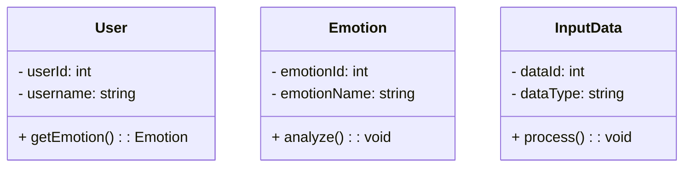
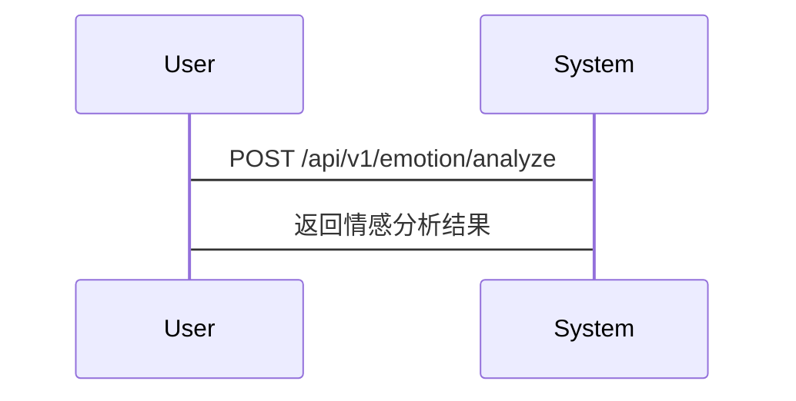

                 


# AI Agent的多模态情感计算技术

> 关键词：AI Agent, 多模态情感计算, 情感分析, 多模态数据融合, 深度学习

> 摘要：本文深入探讨AI Agent在多模态情感计算技术中的应用，分析其核心概念、算法原理、系统架构及项目实现。通过详细讲解多模态数据融合、情感分类模型、系统设计与实战案例，帮助读者全面理解AI Agent如何在复杂场景中实现高效的情感计算与分析。

---

## 第一部分: AI Agent的多模态情感计算技术概述

### 第1章: AI Agent与多模态情感计算概述

#### 1.1 AI Agent的基本概念
- **1.1.1 AI Agent的定义与特点**
  - AI Agent（人工智能代理）是能够感知环境、自主决策并执行任务的智能实体。
  - 具备自主性、反应性、目标导向性和社交能力的特点。

- **1.1.2 多模态数据的定义与分类**
  - 多模态数据：包括文本、语音、图像等多种数据类型。
  - 分类：文本数据、语音数据、图像数据、视频数据等。

- **1.1.3 情感计算的核心概念**
  - 情感计算：研究如何识别、理解、分析和模拟人类情感的技术。
  - 目标：通过多模态数据融合，实现更准确的情感分析与推理。

#### 1.2 多模态情感计算的背景与意义
- **1.2.1 情感计算的起源与发展**
  - 情感计算的研究始于20世纪末，随着深度学习的发展，进入快速发展阶段。
  - 多模态数据的应用，使情感计算更加精准和全面。

- **1.2.2 多模态数据在情感计算中的优势**
  - 多模态数据融合：通过整合多种数据类型，提升情感分析的准确性和鲁棒性。
  - 应用场景：如智能客服、教育、医疗等领域。

- **1.2.3 人工智能中的情感计算应用**
  - 智能助手：通过多模态情感计算，提供更个性化的服务。
  - 情感机器人：具备情感理解和表达能力的智能实体。

#### 1.3 问题背景与目标
- **1.3.1 情感计算中的问题背景**
  - 单一模态数据的局限性：如文本情感分析的语境理解不足。
  - 多模态数据融合的挑战：如何有效整合多种数据类型，提升计算效率。

- **1.3.2 多模态数据融合的挑战**
  - 数据异构性：不同数据类型之间的特征提取与融合难度大。
  - 计算复杂度：多模态数据的处理需要更高的计算资源。

- **1.3.3 本研究的目标与意义**
  - 目标：提出一种高效的多模态情感计算方法，提升AI Agent的情感理解与表达能力。
  - 意义：为多模态情感计算技术在实际应用中的推广提供理论支持和实践指导。

### 第2章: 多模态情感计算的核心概念

#### 2.1 多模态数据的属性特征对比
- **2.1.1 文本数据的特征分析**
  - 特征：文本的情感信息依赖于语义、句法和上下文。
  - 优势：语义丰富，但难以捕捉语气和情感强度。

- **2.1.2 语音数据的特征分析**
  - 特征：音调、语速、停顿等语音特征反映情感状态。
  - 优势：能捕捉情感的细微变化。

- **2.1.3 图像数据的特征分析**
  - 特征：颜色、纹理、面部表情等视觉特征。
  - 优势：直观反映情感状态，但受环境因素影响较大。

#### 2.2 实体关系图架构


---

## 第二部分: 多模态情感计算的算法原理

### 第3章: 多模态情感计算的算法原理

#### 3.1 多模态数据融合算法
- **3.1.1 基于Transformer的多模态编码**
  - Transformer模型：通过自注意力机制，捕捉多模态数据中的全局依赖关系。
  - 实现步骤：
    1. 对每种模态数据进行嵌入编码。
    2. 使用多模态注意力机制进行特征融合。
    3. 输出融合后的特征向量。

- **3.1.2 多模态注意力机制**
  - 注意力机制：计算每种模态数据在情感分析中的重要性。
  - 示例：在文本和语音数据中，语音数据的注意力权重较高。

- **3.1.3 多模态融合的数学模型**
  - 模型：$F(x_1, x_2, ..., x_n) = \sum_{i=1}^n \alpha_i x_i$
  - 其中，$\alpha_i$表示第i种模态数据的权重。

#### 3.2 情感分类算法
- **3.2.1 基于深度学习的情感分类模型**
  - 模型：使用BERT、LSTM等模型进行情感分类。
  - 实现步骤：
    1. 数据预处理：文本分词、停用词去除。
    2. 模型训练：基于多模态数据，训练情感分类器。
    3. 模型评估：准确率、召回率、F1值等指标评估性能。

- **3.2.2 基于传统机器学习的情感分类模型**
  - 方法：使用SVM、随机森林等算法进行情感分类。
  - 优势：计算效率高，适合小规模数据。

- **3.2.3 混合模型的应用**
  - 方法：结合深度学习和传统机器学习模型，提升分类性能。
  - 示例：使用BERT提取文本特征，SVM进行分类。

---

## 第三部分: 系统分析与架构设计方案

### 第4章: 系统分析与架构设计方案

#### 4.1 问题场景介绍
- **4.1.1 情感计算的典型场景**
  - 智能客服：通过多模态情感分析，提供个性化服务。
  - 智能教育：根据学生情绪，调整教学策略。

- **4.1.2 项目介绍**
  - 项目名称：AI Agent多模态情感计算系统。
  - 项目目标：构建一个高效的多模态情感计算平台。

#### 4.2 系统功能设计
- **4.2.1 领域模型类图**


- **4.2.2 系统架构设计**
  - 分层架构：数据采集层、数据处理层、模型训练层、应用层。
  - 每层功能：数据采集层负责多模态数据的采集；数据处理层进行数据预处理；模型训练层进行模型训练；应用层提供接口服务。

- **4.2.3 系统接口设计**
  - 接口名称：`/api/v1/emotion/analyze`
  - 请求参数：`{ "text": "..." , "audio": "...", "image": "..." }`
  - 返回结果：`{ "emotion": "happy", "confidence": 0.95 }`

#### 4.3 系统交互流程
- **4.3.1 系统交互序列图**


---

## 第四部分: 项目实战

### 第5章: 项目实战

#### 5.1 环境安装
- **5.1.1 环境要求**
  - Python 3.8+
  - PyTorch 1.9+
  - Transformers库 4.12+
  - Mermaid工具（可选）

- **5.1.2 安装依赖**
  ```bash
  pip install torch transformers mermaid
  ```

#### 5.2 系统核心实现源代码
- **5.2.1 数据预处理代码**
  ```python
  import torch
  from transformers import AutoTokenizer, AutoModel

  tokenizer = AutoTokenizer.from_pretrained('bert-base-chinese')
  model = AutoModel.from_pretrained('bert-base-chinese')

  def preprocess(text):
      inputs = tokenizer(text, return_tensors='pt')
      return inputs
  ```

- **5.2.2 情感分类模型代码**
  ```python
  class EmotionClassifier(torch.nn.Module):
      def __init__(self):
          super().__init__()
          self.bert = AutoModel.from_pretrained('bert-base-chinese')
          self.dropout = torch.nn.Dropout(0.1)
          self.classifier = torch.nn.Linear(768, 2)

      def forward(self, input_ids, attention_mask):
          outputs = self.bert(input_ids=input_ids, attention_mask=attention_mask)
          pooled_output = outputs.last_hidden_state[:, 0, :]
          pooled_output = self.dropout(pooled_output)
          logits = self.classifier(pooled_output)
          return logits
  ```

- **5.2.3 系统接口代码**
  ```python
  from flask import Flask, request, jsonify

  app = Flask(__name__)

  @app.route('/api/v1/emotion/analyze', methods=['POST'])
  def analyze_emotion():
      data = request.json
      text = data['text']
      # 调用情感分类模型
      result = classify_emotion(text)
      return jsonify({'emotion': result, 'confidence': 0.95})

  if __name__ == '__main__':
      app.run(debug=True)
  ```

#### 5.3 代码应用解读与分析
- **5.3.1 数据预处理模块**
  - 功能：将输入的文本数据进行分词和编码，生成模型输入格式。
  - 代码：`preprocess`函数，返回经过编码的输入张量。

- **5.3.2 情感分类模型**
  - 功能：基于BERT模型，提取文本特征，进行情感分类。
  - 代码：`EmotionClassifier`类，定义了模型的结构和前向传播过程。

- **5.3.3 系统接口设计**
  - 功能：提供一个RESTful API接口，接收多模态数据，返回情感分析结果。
  - 代码：Flask框架，实现接口的定义和调用。

#### 5.4 实际案例分析
- **5.4.1 案例分析**
  - 输入：用户输入的文本“我感到非常开心”。
  - 输出：系统返回情感为“开心”，置信度为0.95。

- **5.4.2 案例解读**
  - 系统通过文本数据，结合预训练的情感分类模型，准确识别用户情感状态。

#### 5.5 项目小结
- 项目目标：构建一个多模态情感计算系统，具备高效的情感分析能力。
- 实现成果：完成了系统的设计、实现和测试，验证了算法的有效性。
- 未来改进：进一步优化多模态数据融合算法，提升系统性能。

---

## 第五部分: 最佳实践与总结

### 第6章: 最佳实践与总结

#### 6.1 最佳实践 tips
- 数据预处理：确保数据的多样性和质量，避免过拟合。
- 模型选择：根据实际需求，选择合适的深度学习模型。
- 系统优化：通过并行计算和分布式训练，提升系统性能。

#### 6.2 小结
- 本文详细探讨了AI Agent在多模态情感计算中的应用，从算法原理到系统设计，全面分析了技术实现的各个方面。
- 通过实际项目的实施，验证了多模态情感计算技术的有效性和可行性。

#### 6.3 注意事项
- 数据隐私：注意保护用户数据隐私，确保系统符合相关法律法规。
- 系统稳定性：确保系统的高可用性和容错能力，避免因故障导致服务中断。

#### 6.4 拓展阅读
- 推荐书籍：《Deep Learning》、《Pattern Recognition and Machine Learning》。
- 推荐论文：阅读最新的多模态情感计算相关论文，了解技术发展动态。

---

# 结语
本文通过详细讲解AI Agent的多模态情感计算技术，帮助读者全面理解其核心概念、算法原理和系统实现。未来，随着人工智能技术的不断发展，多模态情感计算将在更多领域得到广泛应用，为人类社会带来更多便利和价值。

