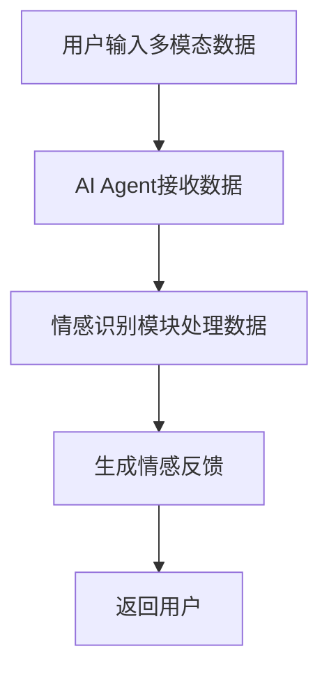
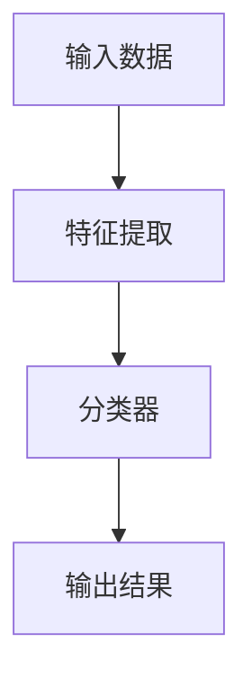
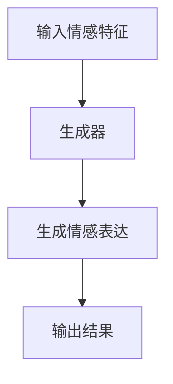
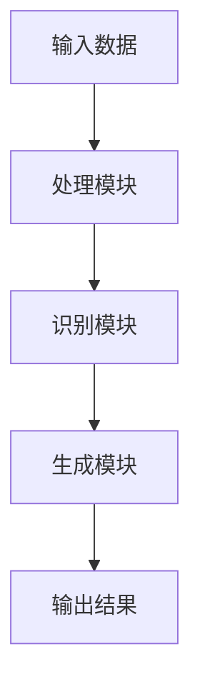
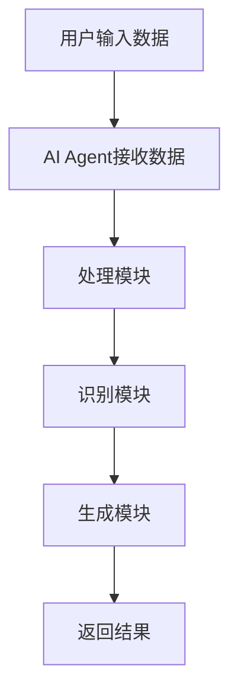

                 


# AI Agent的多模态情感识别与生成

## 关键词：
- AI Agent
- 多模态情感识别
- 生成模型
- 深度学习
- 自然语言处理

## 摘要：
AI Agent的多模态情感识别与生成是一项结合了人工智能、深度学习和自然语言处理的前沿技术。通过分析和生成多模态数据（如文本、语音、图像），AI Agent能够更准确地理解和模仿人类情感，从而提升人机交互的自然性和智能性。本文将详细探讨AI Agent在多模态情感识别与生成中的核心概念、算法原理、系统设计、实际应用以及未来发展方向。

---

## 第一部分: AI Agent的多模态情感识别与生成基础

### 第1章: AI Agent与多模态情感识别概述

#### 1.1 AI Agent的基本概念
- **AI Agent的定义**：AI Agent是一种智能体，能够感知环境、执行任务并做出决策。
- **AI Agent的特点**：
  - 智能性：能够理解、推理和学习。
  - 自主性：能够在没有外部干预的情况下运行。
  - 适应性：能够根据环境变化调整行为。

#### 1.2 情感计算的基本概念
- **情感计算的定义**：情感计算是研究如何识别、理解和模拟人类情感的计算科学。
- **情感计算的目标**：通过分析多模态数据，理解用户的情感状态，并生成相应的情感反馈。

#### 1.3 多模态数据的定义与特点
- **多模态数据**：指来自多种感官渠道的数据，如文本、语音、图像、视频等。
- **多模态数据的特点**：
  - 互补性：不同模态的数据可以相互补充，提供更全面的信息。
  - 复杂性：多模态数据的处理需要综合多种技术。

### 第2章: 情感识别的核心概念与原理

#### 2.1 情感识别的基本原理
- **情感分类**：将情感状态分为不同的类别，如快乐、悲伤、愤怒等。
- **情感识别的方法**：
  - 基于规则的方法：通过预定义规则匹配情感特征。
  - 基于机器学习的方法：使用训练数据训练模型，识别情感特征。

#### 2.2 多模态数据的融合与分析
- **多模态数据融合的方法**：
  - 竞争融合：对不同模态的数据进行竞争性分析，选择最优特征。
  - 融合融合：将不同模态的数据进行融合，生成综合情感特征。

#### 2.3 情感生成的基本原理
- **情感生成的目标**：根据输入的情感信息，生成相应的文本、语音或图像。
- **情感生成的方法**：
  - 基于模板的方法：使用预定义模板生成情感表达。
  - 基于生成模型的方法：使用深度学习模型生成多样化的情感表达。

### 第3章: 多模态情感识别与生成的核心概念联系

#### 3.1 多模态情感识别与生成的核心概念对比
- **情感识别与生成的对比**：
  - 情感识别：从输入数据中提取情感特征。
  - 情感生成：根据情感特征生成新的数据。

#### 3.2 多模态情感识别与生成的ER实体关系图
```mermaid
er
actor: 用户
agent: AI Agent
emotion_data: 多模态情感数据
emotion_recognition: 情感识别模块
emotion_generation: 情感生成模块
```

#### 3.3 多模态情感识别与生成的流程图


---

## 第二部分: 多模态情感识别与生成的算法原理

### 第4章: 多模态情感识别算法原理

#### 4.1 情感分类算法
- **基于深度学习的情感分类模型**：
  - 卷积神经网络（CNN）：用于文本情感分类。
  - 循环神经网络（RNN）：用于序列数据的情感分类。
  - Transformer模型：用于长文本的情感分类。

#### 4.2 情感分类的数学模型与公式
$$ P(y|x) = \frac{P(x|y)P(y)}{P(x)} $$

#### 4.3 情感分类的流程图


### 第5章: 情感生成算法原理

#### 5.1 基于生成模型的情感生成
- **生成对抗网络（GAN）**：通过生成器和判别器的对抗训练生成多样化的情感表达。
- **变体自编码器（VAE）**：通过编码和解码过程生成情感表达。

#### 5.2 情感生成的数学模型与公式
$$ G(z) = \sigma(Wz + b) $$

#### 5.3 情感生成的流程图


---

## 第三部分: 多模态情感识别与生成的系统设计

### 第6章: 系统架构设计

#### 6.1 系统功能设计
- **输入模块**：接收多模态数据。
- **处理模块**：对数据进行预处理和特征提取。
- **识别模块**：进行情感识别。
- **生成模块**：生成情感表达。
- **输出模块**：输出结果。

#### 6.2 系统架构图


### 第7章: 系统接口设计

#### 7.1 接口设计
- **输入接口**：接收多模态数据。
- **输出接口**：输出情感识别和生成的结果。

#### 7.2 系统交互流程图


---

## 第四部分: 多模态情感识别与生成的项目实战

### 第8章: 项目实战

#### 8.1 环境配置
- **Python**：3.8+
- **深度学习框架**：TensorFlow/PyTorch
- **其他依赖**：numpy, matplotlib

#### 8.2 核心实现代码
```python
import tensorflow as tf
from tensorflow.keras import layers

class EmotionRecognizer:
    def __init__(self):
        self.model = self.build_model()

    def build_model(self):
        model = tf.keras.Sequential()
        model.add(layers.Conv2D(32, (3,3), activation='relu', input_shape=(64,64,3)))
        model.add(layers.MaxPooling2D(pool_size=(2,2)))
        model.add(layers.Flatten())
        model.add(layers.Dense(128, activation='relu'))
        model.add(layers.Dense(1, activation='sigmoid'))
        model.compile(optimizer='adam', loss='binary_crossentropy', metrics=['accuracy'])
        return model

    def train(self, x_train, y_train, epochs=10):
        self.model.fit(x_train, y_train, epochs=epochs, batch_size=32)

    def predict(self, x_test):
        return self.model.predict(x_test)
```

#### 8.3 代码解读
- **模型构建**：使用卷积神经网络进行情感识别。
- **训练过程**：使用训练数据训练模型。
- **预测过程**：使用测试数据进行情感预测。

#### 8.4 案例分析
- **输入**：一张表情图片。
- **输出**：识别出的情感类别。

---

## 第五部分: 多模态情感识别与生成的高级应用

### 第9章: 高级应用与未来展望

#### 9.1 AI Agent的多模态情感识别与生成的高级应用
- **情感对话系统**：实现与用户的自然情感对话。
- **情感推荐系统**：根据用户情感推荐相关内容。

#### 9.2 未来研究方向
- **多模态数据的更高效融合方法**。
- **更智能的情感生成模型**。
- **多模态情感识别与生成的实时性优化**。

---

## 小结
通过本文的详细讲解，读者可以全面了解AI Agent的多模态情感识别与生成的核心概念、算法原理、系统设计、实际应用以及未来发展方向。希望本文能够为相关领域的研究者和开发者提供有价值的参考。

