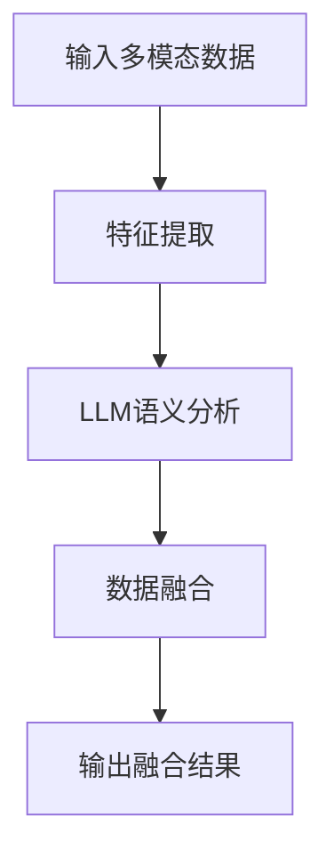
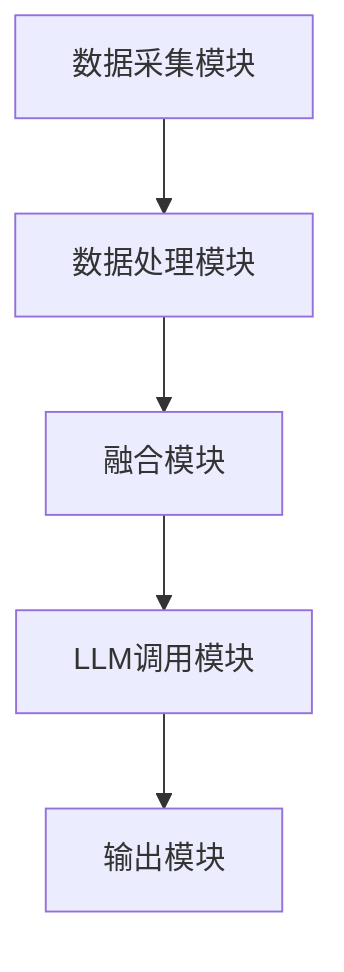

                 


# AI Agent的多模态理解：整合LLM与传感器数据

> 关键词：AI Agent, 多模态理解, 大语言模型, 传感器数据, 数据融合

> 摘要：本文深入探讨AI Agent在多模态理解中的应用，重点分析如何整合大语言模型（LLM）与传感器数据，通过系统化的数据处理、算法设计和实际案例，展示多模态理解的技术原理与实现方法。

---

## 第一部分：AI Agent与多模态理解基础

### 第1章：AI Agent与多模态理解概述

#### 1.1 AI Agent的基本概念

##### 1.1.1 AI Agent的定义与特点
- **定义**：AI Agent（智能体）是能够感知环境、自主决策并执行任务的实体。
- **特点**：
  - 自主性：无需外部干预，自主完成任务。
  - 反应性：能实时感知环境并做出反应。
  - 智能性：具备学习、推理和问题解决能力。

##### 1.1.2 多模态理解的定义与重要性
- **定义**：多模态理解指AI Agent能够处理和理解多种类型的数据，如文本、图像、语音、传感器数据等。
- **重要性**：
  - 提高AI Agent的环境适应能力。
  - 增强决策的准确性和鲁棒性。

##### 1.1.3 LLM与传感器数据的结合意义
- **意义**：通过结合LLM的强大语义理解能力与传感器数据的实时感知能力，AI Agent能够更全面地理解环境，做出更智能的决策。

---

### 第2章：多模态数据的整合方法

#### 2.1 多模态数据的预处理

##### 2.1.1 数据清洗与标准化
- **数据清洗**：去除噪声数据，确保数据的完整性和准确性。
- **标准化**：将不同模态的数据转换为统一的格式，便于后续处理。

##### 2.1.2 数据对齐与融合策略
- **数据对齐**：将不同模态的数据在时间、空间维度上对齐。
- **融合策略**：采用加权融合、注意力机制等方式，综合多种模态的信息。

##### 2.1.3 数据质量评估
- **评估指标**：包括数据的完整性、一致性、实时性等。

#### 2.2 多模态数据的融合模型

##### 2.2.1 模态间的关系分析
- **相关性分析**：分析不同模态数据之间的相关性，确定融合的方式。

##### 2.2.2 融合方法的选择与优化
- **选择**：根据任务需求选择合适的融合方法，如加权平均、多模态注意力网络等。
- **优化**：通过实验验证，优化融合模型的性能。

##### 2.2.3 基于LLM的多模态推理模型
- **模型结构**：将LLM与传感器数据进行融合，构建多模态推理模型。

---

## 第二部分：LLM在多模态理解中的应用

### 第3章：LLM的基本原理

#### 3.1 LLM的工作机制
- **机制**：通过大规模数据训练，LLM能够生成与上下文相关的文本，具备强大的语义理解能力。

#### 3.2 传感器数据的语义理解
- **特征提取**：从传感器数据中提取有意义的特征。
- **语义表达**：将传感器数据转换为可与LLM交互的语义表示。

#### 3.3 基于LLM的传感器数据解释
- **解释方法**：通过LLM生成传感器数据的语义描述，帮助AI Agent更好地理解环境。

---

### 第4章：多模态数据融合的算法原理

#### 4.1 多模态数据融合的数学模型

##### 4.1.1 模态间相关性的度量
- **度量方法**：使用相关系数（如Pearson相关系数）或信息论方法（如互信息）度量模态间的相关性。

##### 4.1.2 数据融合的加权模型
- **加权融合公式**：
  $$ y = \sum_{i=1}^{n} w_i x_i $$
  其中，$w_i$为第$i$个模态的权重，$x_i$为对应的输入数据。

##### 4.1.3 融合结果的评估指标
- **指标**：包括准确率、召回率、F1值等。

#### 4.2 基于LLM的多模态融合算法

##### 4.2.1 算法流程图


##### 4.2.2 算法实现步骤
1. 输入多模态数据。
2. 对每种模态数据进行特征提取。
3. 使用LLM对特征进行语义分析。
4. 根据模态间的相关性，加权融合特征。
5. 输出融合结果。

##### 4.2.3 算法优化与调优
- **超参数调优**：通过网格搜索或随机搜索优化权重分配。
- **模型优化**：使用深度学习方法优化融合模型的性能。

---

## 第三部分：系统架构与设计

### 第5章：系统功能设计

#### 5.1 系统模块划分

##### 5.1.1 模块划分
- 数据采集模块：负责采集多模态数据。
- 数据处理模块：对数据进行清洗、对齐和预处理。
- 融合模块：将不同模态的数据进行融合。
- LLM调用模块：调用大语言模型进行语义分析。
- 输出模块：输出融合结果。

##### 5.1.2 模块协作关系
- 数据采集模块与数据处理模块交互。
- 数据处理模块与融合模块交互。
- 融合模块与LLM调用模块交互。
- LLM调用模块与输出模块交互。

#### 5.2 系统架构图


---

## 第四部分：项目实战与案例分析

### 第6章：项目实战

#### 6.1 项目环境安装

##### 6.1.1 开发环境
- 操作系统：Linux/Windows/MacOS
- 编程语言：Python 3.8+

##### 6.1.2 依赖库安装
- Python库：numpy、pandas、transformers、matplotlib
- 安装命令：
  ```bash
  pip install numpy pandas transformers matplotlib
  ```

#### 6.2 核心代码实现

##### 6.2.1 数据融合模块的代码实现
```python
import numpy as np
from transformers import AutoTokenizer, AutoModelForSeq2SeqLM

def fuse_modalities(modalities, weights):
    return np.dot(modalities, weights)

# 示例权重
weights = np.array([0.5, 0.3, 0.2])
modalities = np.array([[0.8, 0.6, 0.7]])
print(fuse_modalities(modalities, weights))
```

##### 6.2.2 LLM调用模块的代码实现
```python
from transformers import AutoTokenizer, AutoModelForSeq2SeqLM

tokenizer = AutoTokenizer.from_pretrained('t5-base')
model = AutoModelForSeq2SeqLM.from_pretrained('t5-base')

def llm_inference(input_text):
    inputs = tokenizer.encode(input_text, return_tensors='np')
    outputs = model.generate(inputs, max_length=50)
    return tokenizer.decode(outputs[0], skip_special_tokens=True)

result = llm_inference("传感器数据显示设备状态异常，请分析原因。")
print(result)
```

##### 6.2.3 系统交互界面的代码实现
```python
import tkinter as tk

def on_button_click():
    input_text = input_entry.get()
    result = llm_inference(input_text)
    result_label.config(text=result)

root = tk.Tk()
root.title("多模态理解系统")
input_entry = tk.Entry(root)
input_entry.pack()
input_entry.focus()
button = tk.Button(root, text="分析", command=on_button_click)
button.pack()
result_label = tk.Label(root, text="")
result_label.pack()
root.mainloop()
```

#### 6.3 案例分析与结果展示

##### 6.3.1 实际案例的选择与分析
- 案例：基于传感器数据和文本描述，判断设备状态。

##### 6.3.2 系统运行结果的展示与解读
- 传感器数据：设备温度异常升高。
- LLM分析：设备可能存在硬件故障。

##### 6.3.3 案例中的问题与解决方案
- **问题**：传感器数据孤立，缺乏语义理解。
- **解决方案**：通过LLM对传感器数据进行语义分析，结合上下文做出更准确的判断。

---

## 第五部分：最佳实践与总结

### 第7章：总结与展望

#### 7.1 小结与回顾
- **核心内容总结**：本文详细介绍了AI Agent的多模态理解，重点探讨了如何整合LLM与传感器数据。
- **未来展望**：随着技术的发展，多模态理解将更加智能化，AI Agent的应用场景也将更加广泛。

#### 7.2 注意事项与建议
- **注意事项**：
  - 数据质量是关键，需确保数据的准确性和完整性。
  - 算法优化需结合实际场景，避免过度复杂化。
- **建议**：
  - 多模态数据融合需注重不同模态之间的互补性。
  - 在实际应用中，需结合具体场景选择合适的融合方法。

#### 7.3 拓展阅读
- 推荐阅读相关领域的最新论文和书籍，深入了解多模态理解的前沿技术。

---

通过以上结构，您可以系统地撰写一篇关于AI Agent多模态理解的高质量技术博客文章。希望对您有所帮助！

