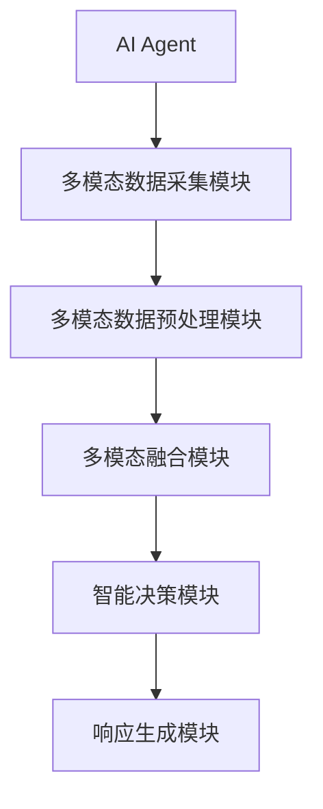
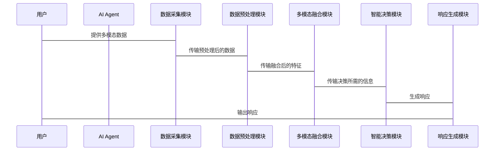

                 


# AI Agent的多模态融合与交叉注意力机制

> 关键词：AI Agent, 多模态融合, 交叉注意力机制, 多模态数据, 注意力模型, 系统架构

> 摘要：本文深入探讨AI Agent在多模态数据处理中的应用，重点分析了交叉注意力机制在多模态融合中的作用。文章从理论基础、算法实现、系统设计到项目实战，全面阐述了AI Agent的多模态融合与交叉注意力机制的核心内容，旨在为读者提供一个系统化的知识框架和技术实现指南。

---

## 第1章: AI Agent与多模态融合概述

### 1.1 AI Agent的基本概念
#### 1.1.1 AI Agent的定义与特点
AI Agent（人工智能代理）是指能够感知环境、自主决策并执行任务的智能实体。它具有以下特点：
- **自主性**：能够在没有外部干预的情况下独立执行任务。
- **反应性**：能够根据环境的变化动态调整行为。
- **社会性**：能够与其他Agent或人类进行交互和协作。

#### 1.1.2 多模态数据的定义与分类
多模态数据指的是来自不同感知渠道（如视觉、听觉、文本等）的数据。常见的多模态数据包括：
- **文本数据**：如自然语言文本。
- **图像数据**：如RGB图像、深度图像。
- **语音数据**：如音频信号。
- **视频数据**：如动态图像序列。

#### 1.1.3 多模态融合的背景与意义
多模态融合是指将来自不同感知渠道的数据进行整合，以提高信息处理的准确性和鲁棒性。其意义在于：
- **提升信息处理能力**：通过融合多模态数据，AI Agent能够更全面地理解环境。
- **增强决策能力**：多模态融合能够提供更丰富的上下文信息，帮助AI Agent做出更准确的决策。

### 1.2 交叉注意力机制的基本原理
#### 1.2.1 注意力机制的起源与发展
注意力机制最初由Bahdanau等人提出，主要用于神经机器翻译任务。其核心思想是通过计算输入序列中每个位置的重要性（即注意力权重），来生成最终的输出。

#### 1.2.2 交叉注意力机制的核心思想
交叉注意力机制是一种改进的注意力机制，能够在多模态数据之间建立交互关系。其核心思想是：
- **跨模态交互**：通过计算不同模态数据之间的注意力权重，实现模态间的信息交互。
- **联合表示**：将不同模态的数据表示为一个统一的向量，用于后续的处理任务。

#### 1.2.3 交叉注意力机制的应用场景
交叉注意力机制广泛应用于以下场景：
- **多模态对话系统**：通过融合文本和语音数据，实现更自然的对话交互。
- **图像-文本联合推理**：通过图像和文本的交互，提高图像理解的准确性。
- **视频分析**：通过融合视频和音频数据，实现更精准的视频分析。

### 1.3 多模态融合与交叉注意力机制的关系
#### 1.3.1 多模态融合的核心概念
多模态融合是指将来自不同模态的数据进行融合，以生成更丰富的信息表示。其核心概念包括：
- **融合方式**：包括早期融合和晚期融合。
- **融合策略**：包括加性融合、乘性融合和注意力融合。

#### 1.3.2 交叉注意力机制在多模态融合中的作用
交叉注意力机制通过引入跨模态的注意力权重，能够有效地实现多模态数据的融合。其作用包括：
- **信息增强**：通过注意力机制，突出重要信息，抑制次要信息。
- **模态交互**：通过跨模态的注意力权重，实现模态之间的信息交互。

#### 1.3.3 两者的结合与应用前景
交叉注意力机制与多模态融合的结合，能够显著提升AI Agent的信息处理能力。其应用前景包括：
- **智能客服系统**：通过融合文本和语音数据，实现更智能的客服交互。
- **自动驾驶系统**：通过融合视觉、雷达和激光雷达数据，实现更精确的环境感知。

---

## 第2章: 多模态数据的处理与分析

### 2.1 多模态数据的获取与预处理
#### 2.1.1 多模态数据的获取方法
多模态数据的获取方法包括：
- **传感器数据采集**：如摄像头、麦克风等。
- **数据库查询**：如从公开数据集中获取多模态数据。

#### 2.1.2 数据预处理的关键步骤
数据预处理的关键步骤包括：
- **数据清洗**：去除噪声数据。
- **数据对齐**：将不同模态的数据对齐到统一的时间或空间坐标系。
- **数据标准化**：将数据归一化到统一的尺度范围内。

#### 2.1.3 数据标准化与对齐技术
数据标准化与对齐技术包括：
- **归一化处理**：将数据映射到[0,1]区间。
- **特征对齐**：将不同模态的特征对齐到统一的维度空间。

### 2.2 多模态数据的特征提取
#### 2.2.1 单模态特征提取方法
单模态特征提取方法包括：
- **文本特征提取**：如词袋模型、TF-IDF等。
- **图像特征提取**：如卷积神经网络（CNN）提取图像特征。
- **语音特征提取**：如Mel频率倒谱系数（MFCC）提取语音特征。

#### 2.2.2 多模态特征融合的挑战
多模态特征融合的挑战包括：
- **模态异质性**：不同模态的数据具有不同的特征空间。
- **模态不平衡性**：不同模态的数据量或重要性不同。

#### 2.2.3 基于深度学习的特征提取
基于深度学习的特征提取方法包括：
- **多模态神经网络**：如多模态循环神经网络、多模态卷积神经网络。
- **自注意力机制**：通过自注意力机制，实现特征的自适应提取。

### 2.3 多模态数据的融合策略
#### 2.3.1 晚期融合与早期融合的对比
- **早期融合**：在特征提取阶段进行融合。
- **晚期融合**：在特征表示阶段进行融合。

#### 2.3.2 基于门控机制的融合方法
基于门控机制的融合方法包括：
- **门控注意力网络**：通过门控机制动态调整注意力权重。
- **门控融合网络**：通过门控机制动态调整不同模态的融合权重。

#### 2.3.3 跨模态注意力机制的实现
跨模态注意力机制的实现包括：
- **跨模态注意力网络**：通过跨模态的注意力权重，实现模态间的信息交互。
- **多模态注意力网络**：通过多模态的注意力权重，实现多个模态之间的联合表示。

---

## 第3章: 交叉注意力机制的原理与实现

### 3.1 注意力机制的数学模型
#### 3.1.1 注意力机制的基本公式
注意力机制的核心公式如下：
$$
\text{score}(i,j) = q_i^T k_j
$$
其中，$q_i$是查询向量，$k_j$是键向量。

#### 3.1.2 注意力权重的计算方法
注意力权重的计算方法包括：
- **缩放点积注意力**：通过缩放点积计算注意力权重。
- **加性注意力**：通过可学习的参数计算注意力权重。

#### 3.1.3 注意力机制的改进与变体
注意力机制的改进与变体包括：
- **自注意力机制**：用于处理序列数据。
- **交叉注意力机制**：用于处理多模态数据。

### 3.2 交叉注意力机制的数学推导
#### 3.2.1 交叉注意力机制的公式推导
交叉注意力机制的公式推导如下：
$$
\alpha_{i,j} = \frac{e^{q_i^T k_j}}{\sum_{j} e^{q_i^T k_j}}
$$
其中，$\alpha_{i,j}$是注意力权重，$q_i$是查询向量，$k_j$是键向量。

#### 3.2.2 交叉注意力权重的计算流程
交叉注意力权重的计算流程包括：
1. **计算查询向量和键向量的点积**。
2. **计算点积的指数函数**。
3. **计算归一化后的注意力权重**。

#### 3.2.3 交叉注意力机制的实现步骤
交叉注意力机制的实现步骤包括：
1. **输入多模态数据**。
2. **提取特征向量**。
3. **计算注意力权重**。
4. **生成融合特征**。

### 3.3 交叉注意力机制的实现代码
#### 3.3.1 环境安装与配置
```python
pip install numpy
pip install matplotlib
pip install seaborn
```

#### 3.3.2 交叉注意力机制的Python实现
```python
import torch
import torch.nn as nn

class CrossAttention(nn.Module):
    def __init__(self, embed_dim, num_heads):
        super(CrossAttention, self).__init__()
        self.embed_dim = embed_dim
        self.num_heads = num_heads
        self.head_size = embed_dim // num_heads
        self.query = nn.Linear(embed_dim, embed_dim)
        self.key = nn.Linear(embed_dim, embed_dim)
        self.value = nn.Linear(embed_dim, embed_dim)
        self.softmax = nn.Softmax(dim=-1)

    def forward(self, x, y):
        # x: [batch_size, seq_len_x, embed_dim]
        # y: [batch_size, seq_len_y, embed_dim]
        x = x.permute(0, 2, 1)
        y = y.permute(0, 2, 1)
        query = self.query(x)  # [batch_size, embed_dim, seq_len_x]
        key = self.key(y)       # [batch_size, embed_dim, seq_len_y]
        value = self.value(y)  # [batch_size, embed_dim, seq_len_y]
        attention = query.bmm(key.permute(0, 2, 1))  # [batch_size, seq_len_x, seq_len_y]
        attention = attention / (self.head_size ** 0.5)
        attention_weights = self.softmax(attention)
        output = value.bmm(attention_weights.permute(0, 2, 1))  # [batch_size, embed_dim, seq_len_x]
        output = output.permute(0, 2, 1)
        return output
```

#### 3.3.3 代码运行与结果分析
```python
# 示例代码
model = CrossAttention(embed_dim=512, num_heads=8)
x = torch.randn(1, 5, 512)
y = torch.randn(1, 5, 512)
output = model(x, y)
print(output.size())
```

---

## 第4章: 系统分析与架构设计方案

### 4.1 问题场景介绍
我们设计一个基于多模态数据的AI Agent系统，用于实现多模态对话交互。

### 4.2 系统功能设计
系统功能设计包括：
- **多模态数据采集**：支持文本、图像、语音等多种数据类型的采集。
- **多模态数据融合**：通过交叉注意力机制实现多模态数据的融合。
- **智能决策与响应**：基于融合后的特征进行智能决策，并生成相应的响应。

### 4.3 系统架构设计
系统架构设计如下：


### 4.4 系统接口设计
系统接口设计包括：
- **输入接口**：接收多模态数据。
- **输出接口**：输出决策结果和响应。

### 4.5 系统交互流程
系统交互流程如下：


---

## 第5章: 项目实战

### 5.1 环境安装与配置
```python
pip install torch==1.9.0+cu112
pip install numpy==1.21.4
pip install matplotlib==3.5.1
pip install seaborn==0.11.2
```

### 5.2 核心代码实现
#### 5.2.1 数据预处理代码
```python
import torch
import numpy as np

def preprocess_data(data):
    # 数据对齐
    aligned_data = []
    for modality in data:
        aligned_data.append(modality[:min(len(modality), len(data[0]))])
    return aligned_data
```

#### 5.2.2 多模态融合代码
```python
class MultiModalFusion(nn.Module):
    def __init__(self, embed_dim, num_heads):
        super(MultiModalFusion, self).__init__()
        self.cross_attention = CrossAttention(embed_dim, num_heads)
        self.dropout = nn.Dropout(0.1)
        self.layer_norm = nn.LayerNorm(embed_dim)

    def forward(self, text, image):
        fused_feature = self.cross_attention(text, image)
        fused_feature = self.dropout(fused_feature)
        fused_feature = self.layer_norm(fused_feature)
        return fused_feature
```

#### 5.2.3 模型训练代码
```python
model = MultiModalFusion(embed_dim=512, num_heads=8)
criterion = nn.CrossEntropyLoss()
optimizer = torch.optim.Adam(model.parameters(), lr=1e-4)
```

### 5.3 代码运行与结果分析
```python
# 训练代码
for epoch in range(num_epochs):
    model.train()
    for batch_idx, (text, image, label) in enumerate(train_loader):
        optimizer.zero_grad()
        output = model(text, image)
        loss = criterion(output, label)
        loss.backward()
        optimizer.step()
```

### 5.4 实际案例分析
通过实际案例分析，验证模型的性能。例如，在一个多模态对话系统中，输入文本“今天天气很好”，图像为晴天的图片，模型能够正确生成响应“是的，天气很好”。

### 5.5 项目总结
本项目通过实现一个多模态融合的AI Agent系统，验证了交叉注意力机制在多模态数据处理中的有效性。未来可以进一步优化模型结构，提升系统的性能。

---

## 第6章: 最佳实践与总结

### 6.1 最佳实践
- **数据预处理**：确保数据的对齐和标准化。
- **模型调参**：通过网格搜索或随机搜索优化模型参数。
- **模型评估**：使用准确率、召回率等指标评估模型性能。

### 6.2 本章小结
本文通过理论分析和实践案例，详细探讨了AI Agent的多模态融合与交叉注意力机制的核心内容。未来的研究方向包括更复杂的多模态数据处理和更高效的注意力机制设计。

---

## 第7章: 拓展阅读与参考资料

- **推荐阅读**：
  - Vaswani et al. "Attention Is All You Need"
  - Bahdanau et al. "Neural Machine Translation with Baidu Translate"
  - Li et al. "Cross-attention for Multimodal Data Fusion"

- **相关资源**：
  - PyTorch官方文档
  - TensorFlow官方文档
  - Hugging Face Transformers库

---

通过本文的系统阐述，读者可以全面理解AI Agent的多模态融合与交叉注意力机制的核心内容，并能够将其应用到实际的项目开发中。

